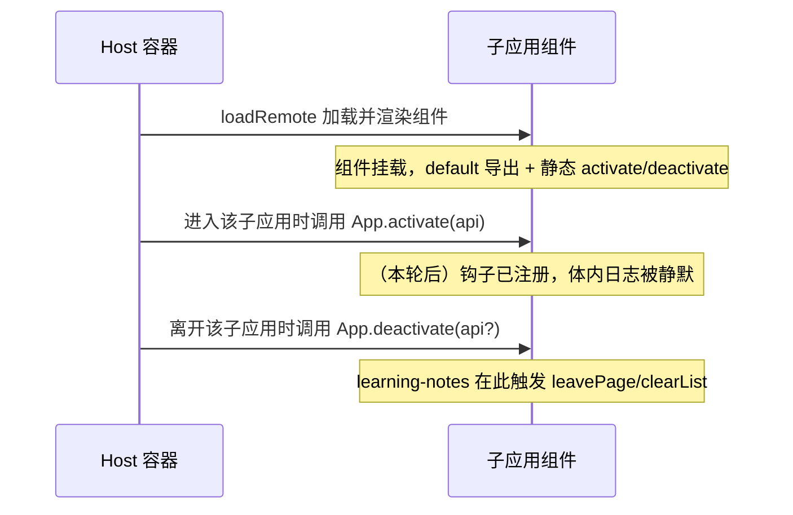

# 启用子应用生命周期钩子并静默调试日志

> **文档角色**：主文档。本篇仅记录「统一为各视图子应用注册 `activate`/`deactivate` 生命周期钩子并静默调试日志」这一项功能；与本域其它专题互不隶属。
>
> **延伸阅读**：本域索引见 [docs/app/README.md](./README.md)；项目总索引见 [docs/README.md](../README.md)。

## 1. 背景与目标

`dnhyxc-ai-plugins` 采用 Module Federation 插件化架构：Host 通过 `loadRemote` 动态加载各视图子应用（电子书想法、电子书划线、学习笔记、视频播放器等），并约定每个子应用在 default 导出的组件上挂载 `activate` / `deactivate` 两个**静态属性钩子**，由 Host 在「进入/离开该子应用」时回调，用于初始化与清理。

本轮改动前，多个视图子应用的这两个钩子处于**不一致**状态：

- 部分子应用（`ebook/ideas`、`video-player`、`learning-notes` 的 `activate`）整段被 `//` 注释，**未向 Host 注册钩子**，Host 无法感知其激活/失活时机。
- 部分子应用（`ebook/toolbar-test/book-info`）虽已注册钩子，但钩子体内仅 `console.log` 调试输出，参数命名为 `api` 却未使用，既会在生产环境产生噪音日志，也可能触发 lint 的「未使用参数」告警。

本轮改动的目标：

1. **统一注册**：把被注释的 `activate`/`deactivate` 赋值取消注释，使其真正挂载到组件，Host 可回调。
2. **静默调试**：将钩子体内的 `console.log` 改为注释，避免运行时噪声。
3. **未用参数约定**：将未被使用的 `api` 形参重命名为 `_api`，按社区约定表示「故意保留位置但不用」，消除未用告警。

> 该改动为**内部代码治理**，对终端用户无可见行为变化，因此不同步产品向姊妹文档（`project-guide.md` / `project-update-info.md`）。

## 2. 改动范围

本轮仅涉及 4 个视图子应用文件底部钩子赋值段（均位于组件 default 导出之前）：

- [src/views/ebook/ideas/index.tsx](../../src/views/ebook/ideas/index.tsx) — `IdeasListApp.activate` / `deactivate` 由注释态改为注册态
- [src/views/ebook/toolbar-test/book-info.tsx](../../src/views/ebook/toolbar-test/book-info.tsx) — `EbookTestBookInfoApp.activate` / `deactivate` 静默日志 + 参数重命名
- [src/views/learning-notes/index.tsx](../../src/views/learning-notes/index.tsx) — `LearningNotesApp.activate` 由注释态改为注册态（`deactivate` 已含 `leavePage` 清理，未改）
- [src/views/video-player/index.tsx](../../src/views/video-player/index.tsx) — `VideoPlayerApp.activate` / `deactivate` 由注释态改为注册态

未在本轮统一的历史遗留：[src/views/ebook/highlights/index.tsx](../../src/views/ebook/highlights/index.tsx) 的两个钩子仍保留 `console.log` 且参数为 `api`（见 §5「后续可做」）。

## 3. 实现思路

- **为何用「静态属性挂载」而非独立 `lifecycle.ts`**：项目内存在两种范式——其一是 `src/views/ebook/toolbar-test/lifecycle.ts` 导出独立 `activate`/`deactivate` 函数（但该导出在 `toolbar-test/index.ts` 中已被注释，未启用）；其二是组件静态属性 `App.activate = ...`。本轮遵循**当前 Host 实际消费的静态属性范式**，与既有大多数视图一致，避免引入两套并行的生命周期来源。
- **为何保留空钩子也要注册**：`activate`/`deactivate` 即便体内暂无实质逻辑，注册后 Host 的「进入/离开」调度链对全部子应用一致，便于后续在统一位置注入埋点、资源预热或状态清理，而无需再逐个打开注释。
- **为何用 `_api` 而非删除形参**：保留形参位置可让钩子签名与 Host 回调契约（传入 `HostBridgeProps['api']`）保持一致，未来需要使用 `api`（如读取 theme/locale/event）时无需再改签名；前缀 `_` 是「故意未用」的通行标记，兼顾 lint 静默。
- **`learning-notes` 的 `deactivate` 为何不动**：该钩子已实现真实的离开清理逻辑（`leavePage` 触发离页保存、`clearList` 丢弃列表缓存），属本轮之外的功能域（见 [docs/learning-notes/笔记自动保存与离页保存.md](../learning-notes/笔记自动保存与离页保存.md)），按「一功能一文档」不在此展开。

Host ↔ 子应用生命周期调用链（仅说明钩子被 Host 在何时回调）：



## 4. 关键实现（改动前 / 改动后对比 + 逐行注释）

### 4.1 `IdeasListApp.activate` / `deactivate`（`src/views/ebook/ideas/index.tsx`）

**对比范围**：组件 default 导出前，`IdeasListApp.activate` 与 `IdeasListApp.deactivate` 两个静态属性赋值（各从 LHS 赋值到 `};` 闭合）。

**改动前** · `src/views/ebook/ideas/index.tsx`（基线：`HEAD~1`，约 L267–L273）

```typescript
// 基线：整行被 // 注释，子应用未向 Host 注册 activate 钩子，Host 拿不到该方法
// IdeasListApp.activate = async (api: HostBridgeProps['api']) => {
// 钩子体内仅一条调试日志，输出传入的 api 以便联调；同样被注释，不会执行
// 	console.log('[ebook-ideas] activate', api);
// activate 赋值语句的闭合括号与分号（仍处注释态）
// };
// （空行：两个钩子之间的分隔，本身为空白，无源码内容）
// 基线：deactivate 同样整行被注释，子应用未注册失活钩子
// IdeasListApp.deactivate = () => {
// 钩子体内的调试日志，被注释
// 	console.log('[ebook-ideas] deactivate');
// deactivate 赋值闭合（注释态）
// };
```

**改动后** · `src/views/ebook/ideas/index.tsx`（当前源码，约 L267–L273）

```typescript
// 现取消整行注释，向 Host 注册 activate 钩子；激活时由 Host 回调
IdeasListApp.activate = async (_api: HostBridgeProps['api']) => {
// 原调试日志改为注释以静默；参数重命名为 _api 表示保留位置但不使用，消除未用告警
	// console.log('[ebook-ideas] activate', api);
// activate 箭头函数体闭合
};
// （空行：与 deactivate 之间的分隔）
// 现取消整行注释，向 Host 注册 deactivate 钩子
IdeasListApp.deactivate = () => {
// 原调试日志改为注释以静默
	// console.log('[ebook-ideas] deactivate');
// deactivate 箭头函数体闭合
};
```

**变更摘要**：`activate`/`deactivate` 由整段注释改为生效注册；体内 `console.log` 改为注释静默；`activate` 形参 `api` → `_api`。

### 4.2 `EbookTestBookInfoApp.activate` / `deactivate`（`src/views/ebook/toolbar-test/book-info.tsx`）

**对比范围**：组件 default 导出前，两个静态属性赋值（各从 LHS 到 `};`）。

**改动前** · `src/views/ebook/toolbar-test/book-info.tsx`（基线：`HEAD~1`，约 L48–L54）

```typescript
// 基线：activate 已注册（未注释），但体内仅调试日志，且参数名 api 未被使用
EbookTestBookInfoApp.activate = async (api: EbookTestBridgeProps['api']) => {
// 钩子体仅 console.log 调试输出，运行时会打印 api
	console.log('[ebook-test-book-info] activate', api);
// activate 箭头函数体闭合
};
// （空行）
// 基线：deactivate 已注册，体内仅调试日志
EbookTestBookInfoApp.deactivate = () => {
// 钩子体仅 console.log 调试输出
	console.log('[ebook-test-book-info] deactivate');
// deactivate 箭头函数体闭合
};
```

**改动后** · `src/views/ebook/toolbar-test/book-info.tsx`（当前源码，约 L48–L54）

```typescript
// activate 仍已注册；参数重命名为 _api 表示保留位置但不使用
EbookTestBookInfoApp.activate = async (_api: EbookTestBridgeProps['api']) => {
// 调试日志改为注释，运行时不再打印
	// console.log('[ebook-test-book-info] activate', api);
// activate 箭头函数体闭合
};
// （空行）
// deactivate 仍已注册；体内日志改为注释
EbookTestBookInfoApp.deactivate = () => {
// 调试日志改为注释
	// console.log('[ebook-test-book-info] deactivate');
// deactivate 箭头函数体闭合
};
```

**变更摘要**：`activate`/`deactivate` 注册态保持不变；体内 `console.log` 改为注释静默；`activate` 形参 `api` → `_api`。

### 4.3 `LearningNotesApp.activate`（`src/views/learning-notes/index.tsx`）

**对比范围**：组件 default 导出前，`LearningNotesApp.activate` 静态属性赋值（从 LHS 到 `};`）。`deactivate` 已含 `leavePage`/`clearList` 真实清理逻辑且本轮未改动，不在此成对展示（其实现见 [docs/learning-notes/笔记自动保存与离页保存.md](../learning-notes/笔记自动保存与离页保存.md)）。

**改动前** · `src/views/learning-notes/index.tsx`（基线：`HEAD~1`，约 L985–L987）

```typescript
// 基线：整行被注释，子应用未注册 activate 钩子
// LearningNotesApp.activate = async (api: HostBridgeProps['api']) => {
// 钩子体内调试日志，被注释
// 	console.log('[learning-notes] activate', api);
// activate 赋值闭合（注释态）
// };
```

**改动后** · `src/views/learning-notes/index.tsx`（当前源码，约 L985–L987）

```typescript
// 现取消整行注释，向 Host 注册 activate 钩子
LearningNotesApp.activate = async (_api: HostBridgeProps['api']) => {
// 调试日志改为注释静默；参数重命名为 _api 表示未用
	// console.log('[learning-notes] activate', api);
// activate 箭头函数体闭合
};
```

**变更摘要**：`activate` 由注释态改为注册态；体内日志静默；形参 `api` → `_api`。同文件 `deactivate`（约 L989–L994）保持原样，未在本轮改动。

### 4.4 `VideoPlayerApp.activate` / `deactivate`（`src/views/video-player/index.tsx`）

**对比范围**：组件 default 导出前，`VideoPlayerApp.activate` 与 `VideoPlayerApp.deactivate` 两个静态属性赋值（各从 LHS 到 `};`）。

**改动前** · `src/views/video-player/index.tsx`（基线：`HEAD~1`，约 L164–L170）

```typescript
// 基线：整行被注释，未注册 activate 钩子
// VideoPlayerApp.activate = async (api: HostBridgeProps['api']) => {
// 钩子体内调试日志，被注释
// 	console.log('[video-player] activate', api);
// activate 赋值闭合（注释态）
// };
// （空行）
// 基线：整行被注释，未注册 deactivate 钩子；签名带一个未用形参 api
// VideoPlayerApp.deactivate = (api: HostBridgeProps['api']) => {
// 钩子体内调试日志，被注释
// 	console.log('[video-player] deactivate', api);
// deactivate 赋值闭合（注释态）
// };
```

**改动后** · `src/views/video-player/index.tsx`（当前源码，约 L164–L170）

```typescript
// 现取消整行注释，向 Host 注册 activate 钩子
VideoPlayerApp.activate = async (_api: HostBridgeProps['api']) => {
// 调试日志改为注释静默；形参重命名为 _api 表示未用
	// console.log('[video-player] activate', api);
// activate 箭头函数体闭合
};
// （空行）
// 现取消整行注释，向 Host 注册 deactivate 钩子；形参重命名为 _api 表示未用
VideoPlayerApp.deactivate = (_api: HostBridgeProps['api']) => {
// 调试日志改为注释静默
	// console.log('[video-player] deactivate', api);
// deactivate 箭头函数体闭合
};
```

**变更摘要**：`activate`/`deactivate` 由注释态改为注册态；体内日志静默；两个钩子的形参 `api` → `_api`。

## 5. 行为变化与兼容性

- **用户可见变化**：无。本轮为内部代码治理，不引入新交互、不改变渲染输出。
- **运行时行为变化**：被注册的子应用在「进入/离开」时，Host 现在能回调到 `activate`/`deactivate`（此前部分子应用因整段注释而回调不到）。由于钩子体内暂无实质副作用（仅被注释的日志），该变化对功能无实际影响，仅为后续扩展打通调用链。
- **未改动路径的行为保证**：`learning-notes` 的 `deactivate`（`leavePage` + `clearList`）行为与基线完全一致；`ebook/highlights` 的两个钩子保持原状（仍带 `console.log`、参数为 `api`）。
- **后续可做**：将 `ebook/highlights` 的 `activate`/`deactivate` 一并静默并按需改 `_api`，使全部视图子应用钩子风格统一；如需在 `activate` 注入埋点或资源预热，可在统一注册后再行扩展。

## 6. 测试与回归建议

- 进入/离开各受影响子应用（想法列表、电子书 toolbar-test book-info、学习笔记、视频播放器），确认无报错、控制台不再输出 `[ebook-ideas] activate` 等调试日志。
- 学习笔记的离页保存/列表清理回归：确认 `deactivate` 触发的 `leavePage`/`clearList` 行为未受影响（该路径本轮未改）。
- lint/构建：确认四个文件无「未使用参数」类告警（`_api` 前缀应被忽略）。

## 7. 相关源码路径

| 说明 | 路径 |
| ---- | ---- |
| 想法列表子应用钩子段 | [src/views/ebook/ideas/index.tsx](../../src/views/ebook/ideas/index.tsx) |
| 电子书 toolbar-test book-info 钩子段 | [src/views/ebook/toolbar-test/book-info.tsx](../../src/views/ebook/toolbar-test/book-info.tsx) |
| 学习笔记子应用钩子段 | [src/views/learning-notes/index.tsx](../../src/views/learning-notes/index.tsx) |
| 视频播放器子应用钩子段 | [src/views/video-player/index.tsx](../../src/views/video-player/index.tsx) |
| 独立 lifecycle 范式（未启用，参考对照） | [src/views/ebook/toolbar-test/lifecycle.ts](../../src/views/ebook/toolbar-test/lifecycle.ts) |
| toolbar-test 导出（注释掉了 lifecycle 导出） | [src/views/ebook/toolbar-test/index.ts](../../src/views/ebook/toolbar-test/index.ts) |
| 历史遗留未静默的子应用钩子 | [src/views/ebook/highlights/index.tsx](../../src/views/ebook/highlights/index.tsx) |

---

（若与仓库最新源码不一致，以源码为准）
