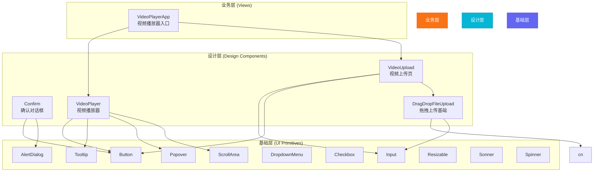
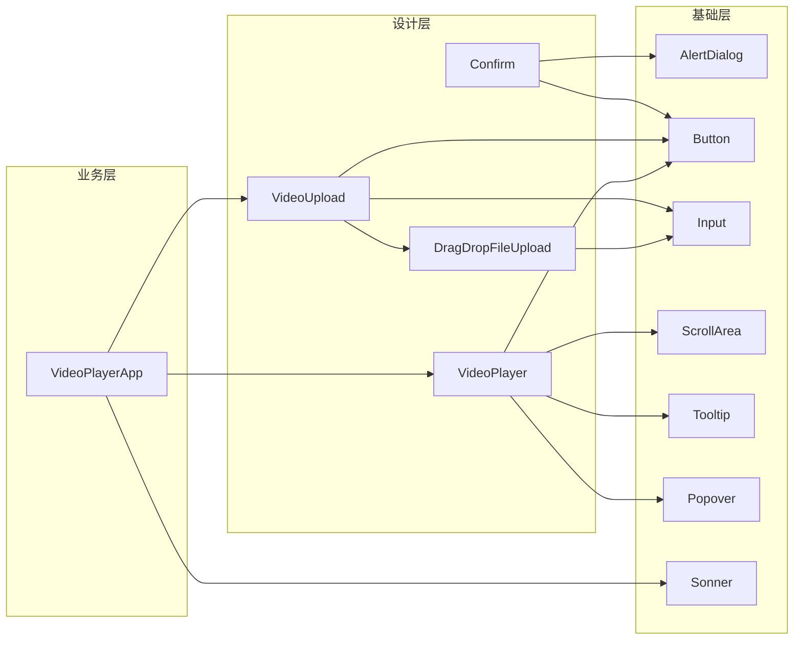
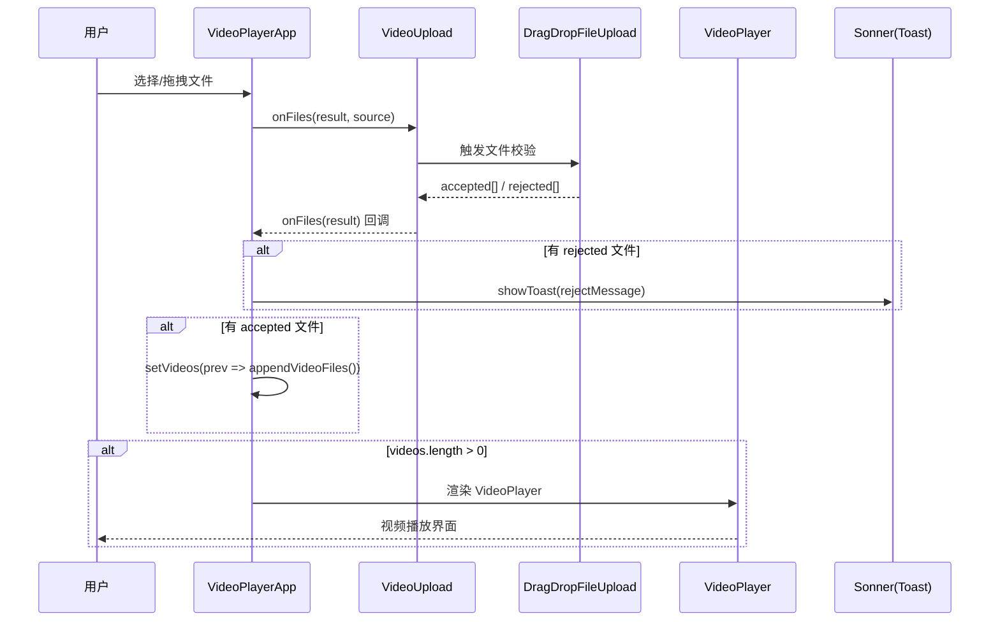
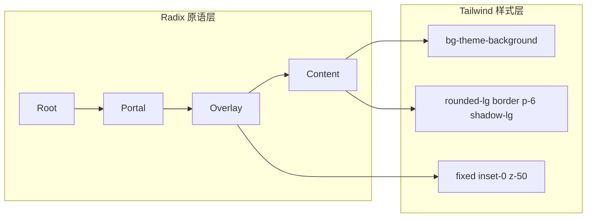
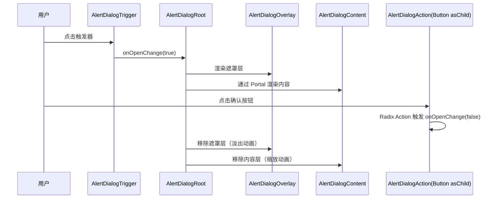

# 设计系统组件库实现文档

## 一、概述

本项目基于 **Radix UI 原语 + Tailwind CSS v4** 构建三层组件库体系，覆盖从基础交互到业务场景的完整 UI 需求。

### 技术栈

| 类别 | 技术 | 用途 |
|------|------|------|
| 原语层 | Radix UI (`radix-ui`) | 提供无样式、可访问的交互原语 |
| 样式层 | Tailwind CSS v4 + `@theme` | 原子化 CSS + 设计 Token 系统 |
| 变体层 | `class-variance-authority` (CVA) | 类型安全的组件变体管理 |
| 工具层 | `clsx` + `tailwind-merge` | 类名合并与冲突消解 |
| 图标层 | `lucide-react` | 统一风格的 SVG 图标 |
| 动效层 | `tw-animate-css` | 声明式 Tailwind 动画 |

### 三层架构



### 分层职责

| 层级 | 目录 | 职责 | 示例 |
|------|------|------|------|
| **基础层** | `src/components/ui/` | 无业务含义的通用 UI 原子，基于 Radix 原语封装 | Button、Input、ScrollArea |
| **设计层** | `src/components/design/` | 承载设计风格的复合组件，组合基础层原语 | Confirm、VideoUpload、DragDropFileUpload |
| **业务层** | `src/views/` | 面向具体业务场景的页面级组件 | VideoPlayerApp |

---

## 二、架构图

### 组件依赖关系



### 数据流图（VideoPlayerApp 为例）



---

## 三、核心组件实现

### 3.1 工具函数：`cn()` — 类名合并

**文件**：`src/lib/utils.ts`

这是整个设计系统的基石工具，负责安全地合并多个 class 名并处理 Tailwind 冲突。

```ts
import { type ClassValue, clsx } from 'clsx';
import { twMerge } from 'tailwind-merge';

/**
 * 类名合并工具函数
 *
 * 工作流程：
 * 1. clsx(inputs) — 条件拼接：过滤 falsy 值（false/undefined/null/空字符串），
 *    支持对象语法（{ 'bg-red': isError }）与数组嵌套
 * 2. twMerge(result) — 冲突消解：当多个 Tailwind 工具类产生冲突时
 *    （如同时出现 p-2 和 p-4），后者自动覆盖前者
 *
 * 使用场景：
 * - 组件内部：base + variant 拼接
 * - 外部调用：允许调用方通过 className 覆盖默认样式
 *
 * @example
 *   cn('btn', isActive && 'btn-active', className)
 */
export function cn(...inputs: ClassValue[]) {
    return twMerge(clsx(inputs));
}
```

**设计要点**：
- **不可替代**：每个组件的 `className` prop 都通过 `cn()` 合并，确保调用方能覆盖默认样式
- **性能**：`clsx` + `tailwind-merge` 组合执行效率高，适合高频调用
- **类型安全**：`ClassValue` 类型来自 `clsx`，支持字符串/数组/对象等多种输入

---

### 3.2 设计 Token：主题 CSS 变量

**文件**：`src/styles.css`

设计系统通过 CSS 自定义属性（Design Tokens）实现主题切换，所有组件样式均引用这些 Token。

```css
:root {
    /* === 核心设计 Token === */
    --radius: 0.625rem;              /* 圆角基准 */

    /* 语义化颜色 Token */
    --background: oklch(1 0 0);              /* 页面背景 */
    --foreground: oklch(0.145 0.02 264);     /* 前景文字 */
    --primary: oklch(0.21 0.034 264.665);    /* 主色调 */
    --primary-foreground: oklch(0.985 0.002 247.839); /* 主色上的文字 */
    --secondary: oklch(0.967 0.003 264.542); /* 次色调 */
    --destructive: oklch(0.577 0.245 27.325); /* 危险操作色 */
    --border: oklch(0.922 0.006 264.531);    /* 边框色 */
    --ring: oklch(0.708 0.022 261.325);      /* 焦点环色 */

    /* === 品牌扩展 Token === */
    --brand-accent: #14b8a6;                 /* Teal 品牌色 */
    --brand-accent-soft: color-mix(in oklch, var(--brand-accent) 55%, white);
    --brand-accent-light: color-mix(in oklch, var(--brand-accent) 75%, white);
    --brand-accent-dark: color-mix(in oklch, var(--brand-accent) 85%, black);

    /* === 主题别名（兼容旧组件类名） === */
    --theme-color: var(--primary);
    --theme-background: var(--background);
    --theme-border: var(--border);
    --theme-textcolor: var(--foreground);
}

.dark {
    /* 暗色模式覆盖同一套 Token，组件无需修改 */
    --background: oklch(0.145 0.02 264);
    --foreground: oklch(0.985 0.002 247.839);
    --primary: oklch(0.922 0.006 264.531);
    /* ... 其余 Token 同理覆盖 */
}

/* === Tailwind v4 @theme 映射 === */
@theme inline {
    --color-background: var(--background);
    --color-foreground: var(--foreground);
    --color-primary: var(--primary);
    --color-destructive: var(--destructive);
    --color-teal-500: var(--brand-accent);
    /* ... 将 CSS Token 映射为 Tailwind 可识别的颜色 */
}
```

**设计要点**：
- **OKLCH 色彩空间**：使用感知均匀的 OKLCH 而非 HEX，确保不同主题间的色彩感知一致
- **三层映射**：CSS 变量 → `@theme` 映射 → Tailwind 工具类 (`bg-theme`、`text-textcolor`)
- **`color-mix()` 动态派生**：从基准色动态派生不同明度的变体色
- **暗/亮模式对称**：`.dark` 选择器覆盖同一套 Token，组件代码零修改

---

### 3.3 基础 UI 组件

#### Button — 按钮

**文件**：`src/components/ui/button.tsx`

基于 **CVA (class-variance-authority)** 的变体管理模式，支持 6 种 variant × 7 种 size。

```tsx
import { Slot } from '@radix-ui/react-slot';
import { cva, type VariantProps } from 'class-variance-authority';
import type * as React from 'react';
import { cn } from '@/lib/utils';
import { Spinner } from './spinner';

/**
 * CVA 定义按钮变体
 *
 * variant 语义：
 * - default:     主操作（主题色背景）
 * - destructive: 危险操作（红色背景，用于删除等）
 * - outline:     次操作（描边样式）
 * - secondary:   辅助操作（浅色背景）
 * - ghost:       隐式操作（透明背景，hover 显背景）
 * - link:        链接样式
 * - loading:     加载态（自动显示 Spinner）
 *
 * size 语义：
 * - default/sm/lg: 标准尺寸
 * - icon/icon-sm/icon-lg: 图标按钮尺寸
 */
const buttonVariants = cva(
    'cursor-pointer text-textcolor inline-flex items-center justify-center gap-2 whitespace-nowrap ' +
    'rounded-md text-sm font-medium transition-all disabled:cursor-not-allowed disabled:opacity-50 ' +
    'outline-none focus-visible:border-ring focus-visible:ring-ring/50 focus-visible:ring-[3px]',
    {
        variants: {
            variant: {
                default: 'text-default bg-theme hover:bg-theme/80',
                destructive: 'bg-destructive text-white hover:bg-destructive/90',
                outline: 'border border-theme/20 text-theme shadow-xs hover:bg-theme/10',
                secondary: 'bg-theme/20 text-textcolor hover:bg-theme/30',
                ghost: 'hover:bg-theme/10',
                link: 'text-textcolor underline-offset-4 hover:text-teal-500',
                loading: 'bg-theme/30 hover:bg-theme/30',
            },
            size: {
                default: 'h-9 px-4 py-2',
                sm: 'h-8 rounded-md gap-1.5 px-3',
                lg: 'h-10 rounded-md px-6',
                icon: 'size-9',
                'icon-sm': 'size-8',
                'icon-lg': 'size-10',
            },
        },
        defaultVariants: {
            variant: 'default',
            size: 'default',
        },
    },
);

/**
 * Button 组件
 *
 * 特性：
 * 1. asChild 模式：使用 Radix Slot 将样式传递给子元素（用于 AlertDialog 中的 Action/Cancel）
 * 2. loading 变体：自动注入 Spinner 图标
 * 3. data-slot / data-variant / data-size 属性：便于 CSS 选择器定位
 *
 * @example
 *   <Button variant="destructive" size="sm" onClick={handleDelete}>
 *     删除
 *   </Button>
 */
function Button({
    className,
    variant = 'default',
    size = 'default',
    asChild = false,
    children,
    ...props
}: React.ComponentProps<'button'> & VariantProps<typeof buttonVariants> & { asChild?: boolean }) {
    // asChild 时用 Slot 代替原生 button，使样式/事件透传到子元素
    const Comp = asChild ? Slot : 'button';

    // loading 变体自动包裹 Spinner
    const content = variant === 'loading' ? (
        <>
            <Spinner className="text-textcolor size-4" />
            {children}
        </>
    ) : (
        children
    );

    return (
        <Comp
            data-slot="button"
            data-variant={variant}
            data-size={size}
            className={cn(buttonVariants({ variant, size, className }))}
            {...props}
        >
            {content}
        </Comp>
    );
}

export { Button, buttonVariants };
```

#### Input — 输入框

**文件**：`src/components/ui/input.tsx`

```tsx
import type * as React from 'react';
import { cn } from '@/lib/utils';

/**
 * Input 组件
 *
 * 特性：
 * 1. showCount + maxLength：可选显示「当前字数/上限」计数器
 * 2. data-slot="input"：便于 CSS 选择器定位
 * 3. 统一焦点环样式：focus-visible + ring
 * 4. 自动关闭自动大写/自动纠错/拼写检查（适合代码/搜索场景）
 */
function Input({
    className,
    type,
    showCount,
    maxLength,
    value,
    ...props
}: InputProps) {
    const shouldShowCount = Boolean(showCount) && maxLength != null && maxLength > 0;
    const charCount = getInputValueLength(value);

    const input = (
        <input
            type={type}
            data-slot="input"
            value={value}
            maxLength={maxLength}
            className={cn(
                'caret-textcolor file:text-textcolor placeholder:text-textcolor/60 ' +
                'border border-theme h-9 w-full min-w-0 rounded-md bg-transparent px-3 py-1 ' +
                'shadow-xs transition-[color,box-shadow] outline-none',
                'focus-visible:border-theme/50 focus-visible:ring-theme/30 focus-visible:ring-[3px]',
                'aria-invalid:ring-destructive/20 aria-invalid:border-destructive',
                shouldShowCount && 'pr-14',  // 预留计数器空间
                className,
            )}
            autoCapitalize="off"
            autoCorrect="off"
            spellCheck="false"
            {...props}
        />
    );

    if (!shouldShowCount) return input;

    // 带计数器的包装版本
    return (
        <div className="relative w-full">
            {input}
            <span className="pointer-events-none absolute top-1/2 right-3 -translate-y-1/2 text-xs tabular-nums text-textcolor/45">
                {charCount}/{maxLength}
            </span>
        </div>
    );
}
```

#### ScrollArea — 滚动区域

**文件**：`src/components/ui/scroll-area.tsx`

```tsx
import * as ScrollAreaPrimitive from '@radix-ui/react-scroll-area';
import * as React from 'react';
import { cn } from '@/lib/utils';

/**
 * ScrollArea 组件
 *
 * 基于 Radix UI ScrollArea 原语封装，关键修复：
 *
 * 1. **内联 display:table 问题**：Radix 在 Viewport 内用 `display: table` 包裹子节点，
 *    导致子元素无法按视口高度撑开，flex 垂直居中等布局失效。
 *    解决方案：用 `[&>div]:flex!` 等 Tailwind 任意选择器覆盖内联样式
 *
 * 2. **滚动条方向控制**：通过 `scrollbars` prop 支持 vertical / horizontal / both
 *
 * 3. **Tauri 拖拽区域**：`data-tauri-drag-region` 属性支持桌面窗口拖拽
 */
const ScrollArea = React.forwardRef<HTMLDivElement, ScrollAreaProps>(
    ({ className, children, viewportClassName, scrollbars = 'vertical', ...props }, ref) => {
        const showVertical = scrollbars === 'vertical' || scrollbars === 'both';
        const showHorizontal = scrollbars === 'horizontal' || scrollbars === 'both';

        return (
            <ScrollAreaPrimitive.Root
                data-slot="scroll-area"
                className={cn('relative min-w-0 overflow-hidden', className)}
                {...props}
            >
                <ScrollAreaPrimitive.Viewport
                    ref={ref}
                    data-slot="scroll-area-viewport"
                    className={cn(
                        'focus-visible:ring-ring/50 size-full max-w-full min-w-0 rounded-[inherit] outline-none',
                        // 覆盖 Radix 内联 display:table → 改为 flex 布局
                        '[&>div]:flex! [&>div]:min-h-full! [&>div]:min-w-full! [&>div]:flex-col!',
                        viewportClassName,
                    )}
                >
                    {children}
                </ScrollAreaPrimitive.Viewport>
                {showVertical && <ScrollBar />}
                {showHorizontal && <ScrollBar orientation="horizontal" />}
                <ScrollAreaPrimitive.Corner />
            </ScrollAreaPrimitive.Root>
        );
    },
);
```

#### Popover — 弹出层

**文件**：`src/components/ui/popover.tsx`

```tsx
import { Popover as PopoverPrimitive } from 'radix-ui';
import { cn } from '@/lib/utils';

/**
 * Popover 组件 — 基于 Radix Popover 原语
 *
 * 特性：
 * 1. 支持自定义挂载容器 (container)：MF 微前端 @scope 模式下，
 *    需要将 Portal 挂载到插件根节点而非 body，避免样式丢失
 * 2. 动画系统：基于 tw-animate-css 的 open/close 动画
 * 3. 主题 Token 驱动的背景/边框/阴影
 */
function PopoverContent({
    className,
    align = 'center',
    sideOffset = 4,
    container,
    ...props
}) {
    return (
        <PopoverPrimitive.Portal container={container ?? undefined}>
            <PopoverPrimitive.Content
                data-slot="popover-content"
                align={align}
                sideOffset={sideOffset}
                className={cn(
                    'bg-theme-background text-textcolor z-50 origin-(--radix-popover-content-transform-origin) ' +
                    'rounded-md border border-theme/10 p-4 shadow-md outline-none',
                    // 入场动画
                    'data-[state=open]:animate-in data-[state=closed]:animate-out ' +
                    'data-[state=closed]:fade-out-0 data-[state=open]:fade-in-0 ' +
                    'data-[state=closed]:zoom-out-95 data-[state=open]:zoom-in-95',
                    // 各方向滑入
                    'data-[side=bottom]:slide-in-from-top-2 ' +
                    'data-[side=left]:slide-in-from-right-2 ' +
                    'data-[side=right]:slide-in-from-left-2 ' +
                    'data-[side=top]:slide-in-from-bottom-2',
                    className,
                )}
                {...props}
            />
        </PopoverPrimitive.Portal>
    );
}
```

#### Tooltip — 工具提示

**文件**：`src/components/ui/tooltip.tsx`

```tsx
import { Tooltip as TooltipPrimitive } from 'radix-ui';
import * as React from 'react';
import { cn } from '@/lib/utils';

/**
 * Tooltip 组件
 *
 * 特性：
 * 1. 可选主题色外阴影 (shadow prop)：通过 color-mix 动态计算阴影色
 * 2. 关闭时立即隐藏 (data-[state=closed]:hidden)：避免触发器塌陷时闪到视口 (0,0)
 * 3. 自定义箭头：与内容同背景同色，保持视觉连贯
 */
function TooltipContent({
    className,
    sideOffset = 0,
    shadow = false,
    container,
    children,
    ...props
}) {
    return (
        <TooltipPrimitive.Portal container={container ?? undefined}>
            <TooltipPrimitive.Content
                data-slot="tooltip-content"
                sideOffset={sideOffset}
                className={cn(
                    'select-none text-textcolor z-50 w-fit origin-(--radix-tooltip-content-transform-origin) ' +
                    'rounded-md px-3 py-1.5 text-xs',
                    'bg-theme-background',
                    shadow && TOOLTIP_SHADOW_CLASS,
                    'animate-in fade-in-0 zoom-in-95',
                    // 关闭时不做位移动画，立即隐藏
                    'data-[state=closed]:hidden data-[state=closed]:animate-none',
                    className,
                )}
                {...props}
            >
                {children}
                <TooltipPrimitive.Arrow
                    className={cn(
                        'z-50 size-2.5 translate-y-[calc(-50%-2px)] rotate-45 rounded-[2px]',
                        'bg-theme-background fill-theme-background',
                        shadow && TOOLTIP_SHADOW_CLASS,
                    )}
                />
            </TooltipPrimitive.Content>
        </TooltipPrimitive.Portal>
    );
}
```

#### DropdownMenu — 下拉菜单

**文件**：`src/components/ui/dropdown-menu.tsx`

```tsx
import { DropdownMenu as DropdownMenuPrimitive } from 'radix-ui';
import { cn } from '@/lib/utils';

/**
 * DropdownMenu 组件 — 完整的下拉菜单系统
 *
 * 子组件：
 * - DropdownMenu / DropdownMenuTrigger / DropdownMenuContent  基础三件套
 * - DropdownMenuItem            菜单项（支持 destructive 变体）
 * - DropdownMenuCheckboxItem    可勾选菜单项
 * - DropdownMenuRadioItem       单选菜单项
 * - DropdownMenuLabel           标签（分组标题）
 * - DropdownMenuSeparator       分隔线
 * - DropdownMenuShortcut        快捷键提示
 * - DropdownMenuSub/SubTrigger/SubContent  子菜单
 */
function DropdownMenuItem({ className, inset, variant = 'default', ...props }) {
    return (
        <DropdownMenuPrimitive.Item
            data-slot="dropdown-menu-item"
            data-inset={inset}
            data-variant={variant}
            className={cn(
                'cursor-pointer relative flex items-center gap-2 rounded-sm px-2 py-1.5 text-sm ' +
                'outline-hidden select-none data-disabled:pointer-events-none data-disabled:opacity-50',
                // hover / 焦点态
                'focus:bg-theme/5 focus:text-textcolor',
                // destructive 变体（用于删除等危险操作）
                "data-[variant=destructive]:text-destructive " +
                "data-[variant=destructive]:focus:bg-destructive/10 " +
                "data-[variant=destructive]:focus:text-destructive",
                className,
            )}
            {...props}
        />
    );
}
```

#### Checkbox — 复选框

**文件**：`src/components/ui/checkbox.tsx`

```tsx
import { Checkbox as CheckboxPrimitive } from 'radix-ui';
import { cn } from '@/lib/utils';

/**
 * Checkbox 组件
 *
 * 基于 Radix Checkbox 原语，使用 data-[state=checked] 选择器实现选中态样式，
 * 而非依赖 CSS 伪类，与其他 Radix 组件保持一致。
 */
function Checkbox({ className, ...props }) {
    return (
        <CheckboxPrimitive.Root
            data-slot="checkbox"
            className={cn(
                'peer size-4 shrink-0 rounded-[4px] border border-input shadow-xs ' +
                'transition-shadow outline-none ' +
                'focus-visible:border-ring focus-visible:ring-[3px] focus-visible:ring-ring/50 ' +
                'disabled:cursor-not-allowed disabled:opacity-50 ' +
                // 选中态：主题色背景 + 主题色文字
                'data-[state=checked]:border-primary data-[state=checked]:bg-primary data-[state=checked]:text-primary-foreground ' +
                // 错误态
                'aria-invalid:border-destructive aria-invalid:ring-destructive/20',
                className,
            )}
            {...props}
        >
            <CheckboxPrimitive.Indicator className="grid place-content-center text-current transition-none">
                <CheckIcon className="size-3.5" />
            </CheckboxPrimitive.Indicator>
        </CheckboxPrimitive.Root>
    );
}
```

#### AlertDialog — 警告对话框

**文件**：`src/components/ui/alert-dialog.tsx`

**复合组件模式（Compound Component Pattern）** 的典型实现。将 Radix 的 10+ 个子原语封装成语义化的子组件，由调用方自由组合。

```tsx
import { AlertDialog as AlertDialogPrimitive } from 'radix-ui';
import { Button } from '@/components/ui/button';
import { cn } from '@/lib/utils';

/**
 * AlertDialog 组件族（Compound Component）
 *
 * 使用方式：
 * <AlertDialog>
 *   <AlertDialogTrigger>打开</AlertDialogTrigger>
 *   <AlertDialogContent>
 *     <AlertDialogHeader>
 *       <AlertDialogTitle>标题</AlertDialogTitle>
 *       <AlertDialogDescription>描述</AlertDialogDescription>
 *     </AlertDialogHeader>
 *     <AlertDialogFooter>
 *       <AlertDialogCancel>取消</AlertDialogCancel>
 *       <AlertDialogAction>确认</AlertDialogAction>
 *     </AlertDialogFooter>
 *   </AlertDialogContent>
 * </AlertDialog>
 *
 * 设计要点：
 * - AlertDialogAction / AlertDialogCancel 内部用 Button asChild 包裹，
 *   实现 Radix 语义 + Button 样式的无缝结合
 * - 支持 size="sm" 窄对话框（固定宽度 max-w-xs）
 * - AlertDialogMedia 支持图标/图片等富媒体头
 */

// 根组件：仅透传 Radix Root
function AlertDialog(props) {
    return <AlertDialogPrimitive.Root data-slot="alert-dialog" {...props} />;
}

// 触发器
function AlertDialogTrigger(props) {
    return <AlertDialogPrimitive.Trigger data-slot="alert-dialog-trigger" {...props} />;
}

// 遮罩层：固定全屏 + 动画
function AlertDialogOverlay({ className, ...props }) {
    return (
        <AlertDialogPrimitive.Overlay
            data-slot="alert-dialog-overlay"
            className={cn(
                'fixed inset-0 z-50 bg-black/50',
                'data-[state=closed]:animate-out data-[state=closed]:fade-out-0 ' +
                'data-[state=open]:animate-in data-[state=open]:fade-in-0',
                className,
            )}
            {...props}
        />
    );
}

// 内容层：居中 + 缩放动画 + 尺寸变体
function AlertDialogContent({ className, size = 'default', ...props }) {
    return (
        <AlertDialogPortal>
            <AlertDialogOverlay />
            <AlertDialogPrimitive.Content
                data-slot="alert-dialog-content"
                data-size={size}
                className={cn(
                    'fixed top-[50%] left-[50%] z-50 grid w-full ' +
                    'translate-x-[-50%] translate-y-[-50%] gap-4 ' +
                    'rounded-lg border bg-background p-6 shadow-lg duration-200',
                    // 尺寸变体
                    'data-[size=sm]:max-w-xs sm:data-[size=default]:sm:max-w-lg',
                    // 开合动画
                    'data-[state=closed]:zoom-out-95 data-[state=open]:zoom-in-95',
                    className,
                )}
                {...props}
            />
        </AlertDialogPortal>
    );
}

// Header：响应式居中/左对齐
function AlertDialogHeader({ className, ...props }) {
    return (
        <div
            data-slot="alert-dialog-header"
            className={cn(
                'grid grid-rows-[auto_1fr] place-items-center gap-1.5 text-center',
                'sm:group-data-[size=default]/alert-dialog-content:place-items-start',
                'sm:group-data-[size=default]/alert-dialog-content:text-left',
                className,
            )}
            {...props}
        />
    );
}

// Footer：移动端竖排，桌面端横排
function AlertDialogFooter({ className, ...props }) {
    return (
        <div
            data-slot="alert-dialog-footer"
            className={cn(
                'flex flex-col-reverse gap-2',
                'sm:flex-row sm:justify-end',
                className,
            )}
            {...props}
        />
    );
}

// Action：Button asChild 模式
function AlertDialogAction({ className, variant = 'default', ...props }) {
    return (
        <Button variant={variant} asChild>
            <AlertDialogPrimitive.Action
                data-slot="alert-dialog-action"
                className={cn(className)}
                {...props}
            />
        </Button>
    );
}

// Cancel：Button asChild 模式（默认 outline 变体）
function AlertDialogCancel({ className, variant = 'outline', ...props }) {
    return (
        <Button variant={variant} asChild>
            <AlertDialogPrimitive.Cancel
                data-slot="alert-dialog-cancel"
                className={cn(className)}
                {...props}
            />
        </Button>
    );
}
```

#### Resizable — 可调节尺寸面板

**文件**：`src/components/ui/resizable.tsx`

```tsx
import * as ResizablePrimitive from 'react-resizable-panels';
import { cn } from '@/lib/utils';

/**
 * ResizablePanelGroup — 可拖拽调节的面板组
 *
 * 基于 react-resizable-panels 库，提供：
 * - 水平 / 垂直方向的面板分栏
 * - 可拖拽的分隔条 (ResizableHandle)
 * - 可选的 grip 把手装饰
 *
 * @example
 *   <ResizablePanelGroup direction="horizontal">
 *     <ResizablePanel defaultSize={30}>
 *       <Sidebar />
 *     </ResizablePanel>
 *     <ResizableHandle />
 *     <ResizablePanel defaultSize={70}>
 *       <Content />
 *     </ResizablePanel>
 *   </ResizablePanelGroup>
 */
function ResizablePanelGroup({ className, ...props }) {
    return (
        <ResizablePrimitive.Group
            data-slot="resizable-panel-group"
            className={cn('flex h-full w-full aria-[orientation=vertical]:flex-col', className)}
            {...props}
        />
    );
}

function ResizableHandle({ withHandle, className, ...props }) {
    return (
        <ResizablePrimitive.Separator
            data-slot="resizable-handle"
            className={cn(
                'bg-theme/5 relative flex w-px items-center justify-center',
                // 垂直分隔线：w-px + 伪元素扩展点击区域
                'after:absolute after:inset-y-0 after:left-1/2 after:w-1 after:-translate-x-1/2',
                // 水平分隔线：h-px
                'aria-[orientation=horizontal]:h-px aria-[orientation=horizontal]:w-full',
                // 焦点环
                'focus-visible:ring-ring focus-visible:ring-1 focus-visible:outline-hidden',
                className,
            )}
            {...props}
        >
            {withHandle && (
                <div className="bg-theme/5 z-10 flex h-4 ml-px w-3 items-center justify-center rounded-xs border border-theme/10">
                    <GripVerticalIcon className="size-2.5" />
                </div>
            )}
        </ResizablePrimitive.Separator>
    );
}
```

#### Sonner — Toast 通知

**文件**：`src/components/ui/sonner.tsx`

```tsx
import { Toaster as Sonner, toast } from 'sonner';
import { cn } from '@/lib/utils';

/**
 * Sonner — Toast 通知系统
 *
 * 特性：
 * 1. 自定义 Toast 组件：通过 toast.custom 实现品牌化 Toast（图标 + 标题 + 描述）
 * 2. 6 种类型：success / error / warning / info / loading / start
 * 3. 6 种位置：top-left / top-right / bottom-left / bottom-right / top-center / bottom-center
 * 4. position 支持单条 toast 级别的精细控制
 * 5. loading 类型持续显示（不自动关闭）
 */
const Toast = ({ type, title, message, duration, position, offset }) => {
    const colors = {
        success: 'text-green-500',
        error: 'text-rose-500',
        warning: 'text-amber-500',
        info: 'text-gray-500',
        loading: 'text-gray-500',
    };

    // 使用 toast.custom 渲染自定义 JSX
    toast.custom(
        (toastId) => (
            <div className="group relative flex flex-col justify-center min-h-13 w-80 bg-theme-background/80 shadow-lg rounded-md py-2 pl-3 pr-9">
                {/* 关闭按钮 */}
                <button
                    onClick={() => toast.dismiss(toastId)}
                    className="absolute right-1 top-1 flex size-7 items-center justify-center rounded-md opacity-0 group-hover:opacity-100"
                >
                    <X className="size-4" />
                </button>
                {/* 主图标 + 标题 */}
                <div className="flex items-center">
                    <div className="w-6 flex justify-center items-center">
                        {type === 'success' && <CircleCheckIcon color="var(--color-green-500)" />}
                        {type === 'error' && <OctagonXIcon color="var(--color-rose-500)" />}
                        {type === 'warning' && <TriangleAlertIcon color="var(--color-amber-500)" />}
                        {type === 'info' && <InfoIcon color="var(--color-gray-500)" />}
                    </div>
                    <div className={`ml-2 text-md ${colors[type]}`}>{title}</div>
                </div>
                {message && <div className={`ml-8 ${colors[type]} text-sm mt-1`}>{message}</div>}
            </div>
        ),
        { duration },
    );
};
```

#### Spinner — 加载指示器

**文件**：`src/components/ui/spinner.tsx`

```tsx
import { Bubbles } from 'lucide-react';
import { cn } from '@/lib/utils';

/**
 * Spinner — 轻量旋转加载指示器
 *
 * 使用 lucide-react 的 Bubbles 图标 + animate-spin 实现。
 * 通过 role="status" 和 aria-label 提供无障碍支持。
 */
function Spinner({ className, ...props }: React.ComponentProps<'svg'>) {
    return (
        <Bubbles
            role="status"
            aria-label="Loading"
            className={cn('size-5 pl-px animate-spin text-default', className)}
            {...props}
        />
    );
}
```

---

### 3.4 设计层扩展组件

#### Confirm — 确认对话框

**文件**：`src/components/design/Confirm/index.tsx`

基于 AlertDialog 原语封装的业务级确认对话框，支持多按钮、回车确认、国际化等高级特性。

```tsx
import { AlertDialog as AlertDialogPrimitive } from 'radix-ui';
import type { ReactNode } from 'react';
import { useCallback, useEffect } from 'react';
import { Button, buttonVariants } from '@/components/ui/button';
import { useI18n } from '@/hooks';
import { cn } from '@/lib/utils';

/**
 * Confirm 组件 Props 接口
 *
 * 设计要点：
 * - closeOnConfirm: 异步确认场景下可设为 false，由调用方自行关闭
 * - confirmOnEnter: 回车确认，但排除 input/textarea 等输入元素，避免与编辑器冲突
 * - secondaryActionText / tertiaryActionText: 支持三按钮布局
 * - confirmVariant: 确认按钮样式覆盖（危险操作用 destructive）
 */
interface ConfirmProps {
    open: boolean;
    onOpenChange: (open: boolean) => void;
    title: string;
    description: ReactNode;
    descriptionClassName?: string;
    confirmText?: string;
    cancelText?: string;
    confirmVariant?: 'default' | 'destructive';
    closeOnConfirm?: boolean;
    confirmOnEnter?: boolean;
    onConfirm: () => void;
    secondaryActionText?: string;
    onSecondaryAction?: () => void | Promise<void>;
    tertiaryActionText?: string;
    onTertiaryAction?: () => void | Promise<void>;
    tertiaryVariant?: 'outline' | 'destructive';
    onCancel?: () => void;
    className?: string;
}

const Confirm = ({
    open,
    onOpenChange,
    title,
    description,
    descriptionClassName,
    confirmText,
    cancelText,
    confirmVariant = 'default',
    closeOnConfirm = true,
    confirmOnEnter = false,
    onConfirm,
    secondaryActionText,
    onSecondaryAction,
    tertiaryActionText,
    onTertiaryAction,
    tertiaryVariant = 'outline',
    onCancel,
    className,
}: ConfirmProps) => {
    const { t } = useI18n();
    const confirmLabel = confirmText ?? t('common.confirm');
    const cancelLabel = cancelText ?? t('common.cancel');

    // 确认操作：回调 + 可选自动关闭
    const handleConfirm = useCallback(() => {
        onConfirm();
        if (closeOnConfirm) onOpenChange(false);
    }, [onConfirm, closeOnConfirm, onOpenChange]);

    // 取消操作：回调 + 关闭
    const handleCancel = () => {
        onCancel?.();
        onOpenChange(false);
    };

    /**
     * 键盘事件监听：回车确认
     *
     * 关键逻辑：
     * 1. 仅在 confirmOnEnter=true 且对话框打开时生效
     * 2. 排除 input/textarea/select/contenteditable 等输入元素
     *    — 避免与富文本编辑器等场景的 Enter 键冲突
     * 3. 使用 capture 阶段监听（第三个参数为 true），优先于编辑器处理
     * 4. e.preventDefault() + e.stopPropagation() 阻断后续传播
     */
    useEffect(() => {
        if (!open || !confirmOnEnter) return;
        const onKeyDown = (e: KeyboardEvent) => {
            if (e.key !== 'Enter' || e.repeat) return;
            const el = e.target as HTMLElement | null;
            // 排除输入类元素
            if (el?.closest('input, textarea, select, [contenteditable="true"], [role="textbox"]')) {
                return;
            }
            e.preventDefault();
            e.stopPropagation();
            handleConfirm();
        };
        window.addEventListener('keydown', onKeyDown, true);
        return () => window.removeEventListener('keydown', onKeyDown, true);
    }, [open, confirmOnEnter, handleConfirm]);

    return (
        <AlertDialogPrimitive.Root open={open} onOpenChange={onOpenChange}>
            <AlertDialogPrimitive.Portal>
                {/* 遮罩层 */}
                <AlertDialogPrimitive.Overlay
                    className={cn(
                        'fixed inset-0 z-50 bg-theme-background/80',
                        'data-[state=open]:animate-in data-[state=closed]:animate-out',
                        'data-[state=closed]:fade-out-0 data-[state=open]:fade-in-0',
                    )}
                />
                {/* 内容层 */}
                <AlertDialogPrimitive.Content
                    className={cn(
                        'fixed top-[50%] left-[50%] z-50 grid w-full max-w-[calc(100%-2rem)]',
                        'translate-x-[-50%] translate-y-[-50%] gap-4 rounded-lg border border-theme/10',
                        'bg-theme-background p-6 shadow-lg duration-200 sm:max-w-lg',
                        'data-[state=open]:animate-in data-[state=closed]:animate-out',
                        'data-[state=closed]:zoom-out-95 data-[state=open]:zoom-in-95',
                        className,
                    )}
                >
                    {/* 标题 */}
                    <AlertDialogPrimitive.Title className="min-w-0 wrap-break-word text-lg font-semibold">
                        {title}
                    </AlertDialogPrimitive.Title>

                    {/* 描述 — 使用 asChild + div 包裹，避免默认 <p> 内嵌 <div> 导致非法 DOM */}
                    <AlertDialogPrimitive.Description asChild>
                        <div className={cn('text-textcolor text-md min-w-0 wrap-anywhere', descriptionClassName)}>
                            {description}
                        </div>
                    </AlertDialogPrimitive.Description>

                    {/* 按钮区：三按钮布局 */}
                    <div className="flex flex-col-reverse gap-2 sm:flex-row sm:justify-end mt-4">
                        {/* 取消按钮 */}
                        <AlertDialogPrimitive.Cancel
                            onClick={handleCancel}
                            className={cn(buttonVariants({ variant: 'outline' }))}
                        >
                            {cancelLabel}
                        </AlertDialogPrimitive.Cancel>

                        {/* 第二按钮（可选，如「另存为」） */}
                        {secondaryActionText && onSecondaryAction ? (
                            <Button type="button" variant="outline" onClick={() => void onSecondaryAction()}>
                                {secondaryActionText}
                            </Button>
                        ) : null}

                        {/* 第三按钮（可选） */}
                        {tertiaryActionText && onTertiaryAction ? (
                            <Button type="button" variant={tertiaryVariant} onClick={() => void onTertiaryAction()}>
                                {tertiaryActionText}
                            </Button>
                        ) : null}

                        {/* 确认按钮 */}
                        <AlertDialogPrimitive.Action
                            onClick={handleConfirm}
                            className={cn(buttonVariants({ variant: confirmVariant }))}
                        >
                            {confirmLabel}
                        </AlertDialogPrimitive.Action>
                    </div>
                </AlertDialogPrimitive.Content>
            </AlertDialogPrimitive.Portal>
        </AlertDialogPrimitive.Root>
    );
};

export default Confirm;
```

**实现原理**：
1. **Radix AlertDialog 原语**：使用 Root/Portal/Overlay/Content/Title/Description/Action/Cancel 子原语
2. **`asChild` 模式**：Description 用 `asChild` 包裹 div，避免 `<p>` 嵌套 `<div>` 的非法 DOM
3. **三按钮布局**：取消 → 第二 → 第三 → 确认，移动端竖排、桌面端横排
4. **键盘安全**：`useEffect` 注册 capture 阶段的 `keydown` 监听，精准排除输入元素

---

#### DragDropFileUpload — 拖拽文件上传

**文件**：`src/components/design/DragDropFileUpload/index.tsx`

**Headless Hook + forwardRef + useImperativeHandle** 模式的典型实现。分为 Hook（逻辑）和 Component（UI）两层。

```tsx
/**
 * 高性能拖拽/点击文件选择区
 *
 * 性能策略：
 * - 拖拽悬停态不写 React state，仅改容器 DOM 的 data-drag-active 属性，避免 dragover 重渲染
 * - dragenter/dragleave 深度计数，减少子节点间移动时的闪烁
 * - 文件列表单次线性扫描，校验逻辑 O(n)
 */

import { forwardRef, useCallback, useImperativeHandle, useMemo, useRef } from 'react';
import { Input } from '@/components/ui/input';
import { cn } from '@/lib/utils';

/** DOM 属性名：拖拽激活态标记 */
const DRAG_ATTR = 'data-drag-active';

/** 直接操作 DOM 设置拖拽激活态 — 避免 React 重渲染 */
function setZoneDragActive(zone: HTMLDivElement | null, active: boolean) {
    if (!zone) return;
    if (active) zone.setAttribute(DRAG_ATTR, '');
    else zone.removeAttribute(DRAG_ATTR);
}

/**
 * 轻量 accept 规则校验
 *
 * 支持三种格式：
 * - 通配符：*/* 接受所有
 * - MIME 前缀：video/* 接受所有视频
 * - 扩展名：.mp4 仅接受 .mp4
 * - 完整 MIME：video/mp4
 */
export function matchAcceptRule(file: File, accept: string | undefined): boolean {
    if (!accept?.trim()) return true;
    const rules = accept.split(',').map(s => s.trim()).filter(Boolean);
    for (const rule of rules) {
        const r = rule.toLowerCase();
        if (r === '*/*') return true;
        if (r.endsWith('/*')) {
            const prefix = r.slice(0, -1);
            if (file.type?.toLowerCase().startsWith(prefix)) return true;
        } else if (r.startsWith('.')) {
            if (file.name.toLowerCase().endsWith(r)) return true;
        } else if (file.type?.toLowerCase() === r) {
            return true;
        }
    }
    return false;
}

/**
 * Headless Hook — 封装所有拖拽/键盘/点击逻辑
 *
 * 返回值包含：
 * - zoneRef / inputRef: DOM 引用
 * - zoneHandlers: 事件处理器集合（onDragEnter/onDragLeave/onDrop/onClick 等）
 * - inputClassName / inputRest: 隐藏 input 的配置
 * - openFilePicker / resetInput: 命令式方法
 */
export function useDragDropFileUpload(options) {
    const zoneRef = useRef<HTMLDivElement>(null);
    const inputRef = useRef<HTMLInputElement>(null);
    const dragDepthRef = useRef(0);      // 嵌套子节点深度计数
    const pickerOpenRef = useRef(false);  // 原生对话框打开中标记
    const optsRef = useRef(options);      // 最新 options 的 ref 引用
    optsRef.current = options;

    // dragenter: 深度+1，首次进入时标记激活态
    const onDragEnter = useCallback((e: DragEvent) => {
        if (optsRef.current.disabled || pickerOpenRef.current) return;
        e.preventDefault();
        dragDepthRef.current += 1;
        if (dragDepthRef.current === 1) setZoneDragActive(zoneRef.current, true);
    }, []);

    // dragleave: 深度-1，归零时清除激活态
    const onDragLeave = useCallback((e: DragEvent) => {
        if (optsRef.current.disabled || pickerOpenRef.current) return;
        e.preventDefault();
        dragDepthRef.current -= 1;
        if (dragDepthRef.current <= 0) {
            dragDepthRef.current = 0;
            setZoneDragActive(zoneRef.current, false);
        }
    }, []);

    // dragover: 设置 dropEffect='copy' 图标反馈
    const onDragOver = useCallback((e: DragEvent) => {
        if (optsRef.current.disabled || pickerOpenRef.current) return;
        e.preventDefault();
        e.stopPropagation();
        try { e.dataTransfer.dropEffect = 'copy'; } catch { /* ignore */ }
    }, []);

    // drop: 处理文件
    const onDrop = useCallback((e: DragEvent) => {
        e.preventDefault();
        e.stopPropagation();
        dragDepthRef.current = 0;
        setZoneDragActive(zoneRef.current, false);
        if (optsRef.current.disabled || pickerOpenRef.current) return;
        const files = e.dataTransfer?.files;
        if (files?.length) emit(files, 'drop');
    }, [emit]);

    /**
     * 打开文件选择器
     *
     * 两种模式：
     * - 有 pickFiles（Tauri 原生对话框）：调用外部 API，返回 null 阻止后续
     * - 无 pickFiles：触发隐藏的 <input type="file"> 的 click
     */
    const openFilePicker = useCallback(() => {
        if (optsRef.current.disabled || pickerOpenRef.current) return;
        const pick = optsRef.current.pickFiles;
        if (pick) {
            pickerOpenRef.current = true;
            void pick().then(files => {
                if (files?.length) emit(files, 'input');
            }).finally(() => { pickerOpenRef.current = false; });
            return;
        }
        inputRef.current?.click();
    }, [emit]);

    // ... 其他处理逻辑

    return { zoneRef, inputRef, zoneHandlers, inputClassName, inputRest, openFilePicker, resetInput };
}

/**
 * DragDropFileUpload 组件
 *
 * 使用 forwardRef + useImperativeHandle 暴露命令式 API：
 * - ref.current.open(): 打开文件选择器
 * - ref.current.reset(): 重置 input
 * - ref.current.getInputElement(): 获取 input DOM
 * - ref.current.getZoneElement(): 获取 zone DOM
 */
export const DragDropFileUpload = forwardRef<DragDropFileUploadHandle, DragDropFileUploadProps>(
    function DragDropFileUpload({ className, zoneClassName, children, ...hookOptions }, ref) {
        const hook = useDragDropFileUpload(hookOptions);

        // 通过 useImperativeHandle 将内部方法暴露给父组件
        useImperativeHandle(ref, () => ({
            open: hook.openFilePicker,
            reset: hook.resetInput,
            getInputElement: () => hook.inputRef.current,
            getZoneElement: () => hook.zoneRef.current,
        }), [hook.openFilePicker, hook.resetInput, hook.inputRef, hook.zoneRef]);

        return (
            <div className={cn('relative min-h-0 min-w-0', className)}>
                {/* 可拖拽/点击区域 */}
                <div
                    ref={hook.zoneRef}
                    {...hook.zoneHandlers}
                    className={cn(
                        'relative cursor-pointer rounded-md border border-dashed outline-none transition-colors',
                        'data-drag-active:border-theme data-drag-active:bg-theme/10',
                        hookOptions.disabled && 'pointer-events-none cursor-not-allowed opacity-50',
                        zoneClassName,
                    )}
                >
                    {body}
                </div>
                {/* 隐藏的文件选择 input */}
                <Input {...hook.inputRest} ref={...} className={cn(hook.inputClassName)} />
            </div>
        );
    },
);
```

**实现原理**：
1. **Headless Hook 模式**：`useDragDropFileUpload` 封装所有逻辑，便于在不同 UI 场景复用
2. **DOM 属性驱动而非 React State**：`data-drag-active` 属性控制样式，避免 dragover 每帧触发 React 重渲染
3. **深度计数防闪烁**：`dragDepthRef` 跟踪 enter/leave 深度，子节点间移动不触发
4. **`optsRef` 最新引用**：避免 `useCallback` 依赖过多导致频繁重建

---

#### VideoUpload — 视频上传页

**文件**：`src/views/video-player/components/VideoUpload.tsx`

设计层的业务组件，以 DragDropFileUpload 为基础构建 Neon Cinema 风格的视频上传界面。

```tsx
/**
 * VideoUpload — Neon Cinema 风格视频上传页
 *
 * 视觉：深夜影院氛围，胶片条装饰、霓虹辉光
 * 布局：顶部标题栏 + 左右分屏（左：上传舞台 / 右：功能列表）
 * 结构：外层为普通 div 布局，DragDropFileUpload 仅包裹舞台区域
 */

import { forwardRef } from 'react';
import DragDropFileUpload from '@/components/design/DragDropFileUpload';
import { cn } from '@/lib/utils';

/** 系统对话框 + 拖拽校验共用的扩展名规则 */
export const VIDEO_ACCEPT = '.mp4,.webm,.mov,.mkv,.flv,.m4v,.ogg,.ogv';

/**
 * VideoUpload 组件
 *
 * 通过 forwardRef 将 ref 透传给 DragDropFileUpload，
 * 使父组件 VideoPlayerApp 可以通过 ref.current?.open() 编程式打开文件选择器。
 */
export const VideoUpload = forwardRef<VideoUploadHandle, VideoUploadProps>(
    function VideoUpload({ existingCount = 0, maxCount = LIMIT, className, ...rest }, ref) {
        const { t } = useI18n();
        const remain = Math.max(0, maxCount - existingCount);

        return (
            <div className={cn('relative flex h-full w-full min-h-0 flex-col p-4.5', className)}>
                {/* 顶部标题栏 */}
                <header className="flex items-center justify-between pb-3">
                    <div className="flex items-center gap-2.5">
                        <Film size={20} className="text-teal-500" />
                        <span className="text-sm font-semibold tracking-[0.2em]">
                            {t('videoPlayer.selectVideo')}
                        </span>
                    </div>
                    <div className="font-mono text-[11px]">
                        {t('videoPlayer.countRemaining', { count: remain })}
                    </div>
                </header>

                {/* 主体：左右分屏 */}
                <main className="flex min-h-0 flex-1 gap-4">
                    {/* 左侧：上传舞台 */}
                    <DragDropFileUpload
                        ref={ref}                    // ← ref 透传至底层
                        className="flex min-h-0 flex-1"
                        zoneClassName="rounded-md border border-theme/5 bg-theme/3"
                        accept={VIDEO_ACCEPT}        // 限制视频格式
                        acceptExtensionOnly          // 仅按扩展名校验
                        multiple                     // 多选
                        maxCount={remain}            // 剩余数量限制
                        disabled={remain <= 0}       // 满员禁用
                    >
                        {/* 自定义 children：上传舞台内容 */}
                        <div className="cursor-pointer group relative flex min-h-0 flex-1 flex-col items-center gap-5 p-6">
                            <div className="flex h-12 w-12 items-center justify-center rounded-xl bg-teal-500/10 text-teal-500">
                                <Upload size={26} />
                            </div>
                            <div className="inline-flex items-center gap-1.5 rounded-full border border-teal-500/10 bg-teal-500/10 px-3 py-1 text-[11px] text-teal-400">
                                <Sparkles size={11} />
                                {t('videoPlayer.selectVideo')}
                            </div>
                            <div className="text-xl font-bold tracking-tight text-textcolor/50">
                                {t('videoPlayer.dragOrClick')}
                            </div>
                            {/* 格式标签 */}
                            <div className="flex flex-wrap items-center justify-center gap-2">
                                {FORMATS.map(fmt => (
                                    <span key={fmt} className="rounded border border-teal-500/10 bg-teal-500/10 px-2 text-xs text-teal-500">
                                        {fmt}
                                    </span>
                                ))}
                            </div>
                        </div>
                    </DragDropFileUpload>

                    {/* 右侧：功能面板 */}
                    <aside className="flex w-60 flex-col overflow-hidden rounded-md border border-dashed border-theme/5 bg-theme/3">
                        <div className="mx-3 mt-2.5 flex items-center gap-2 border-b border-theme/5 pb-2.5">
                            <Zap size={16} className="text-teal-500" />
                            <span className="text-sm font-medium tracking-[0.15em] text-textcolor/60">
                                {t('videoPlayer.featuresTitle').toUpperCase()}
                            </span>
                        </div>
                        <div className="mx-1 flex flex-1 flex-col justify-between px-2 py-2">
                            {FEATURES.map(f => (
                                <div key={f.key} className="flex flex-1 items-center gap-3 rounded-lg">
                                    <span className="font-mono text-sm text-textcolor/35">{f.num}</span>
                                    <span className="flex h-7.5 w-7.5 items-center justify-center rounded-md bg-theme/5 text-teal-500">
                                        <f.icon size={14.5} />
                                    </span>
                                    <span className="text-sm text-textcolor/70">{t(f.key)}</span>
                                </div>
                            ))}
                        </div>
                    </aside>
                </main>
            </div>
        );
    },
);
```

---

#### VideoPlayerApp — 视频播放器入口

**文件**：`src/views/video-player/index.tsx`

业务层的入口组件，将 VideoUpload（空态）与 VideoPlayer（播放态）组合，管理视频列表状态。

```tsx
/**
 * VideoPlayerApp — 视频播放器插件入口
 *
 * 组合：VideoUpload（选文件）+ VideoPlayer（纯播放）
 * 列表状态在此维护，空态/播放态共用同一套高度链。
 *
 * 点选：优先 Host api.ui.pickLocalFiles（Tauri 原生对话框）；拖拽仍走 File。
 */

import { useCallback, useRef, useState } from 'react';
import {
    appendPickedVideos, appendVideoFiles, LIMIT, revokeVideoUrls,
    type VideoItem, VideoPlayer,
} from '@/components/design/VideoPlayer';
import { TooltipProvider } from '@/components/ui';
import { cn } from '@/lib/utils';
import VideoUpload, { type VideoUploadHandle, VIDEO_ACCEPT } from './components/VideoUpload';
import '@/styles.css';  // MF 嵌入时必须带上 Tailwind

/**
 * VideoPlayerApp Props
 *
 * api 由 Host 注入，包含：
 * - theme: 主题（light/dark）
 * - locale: 语言
 * - ui.showToast: Toast 提示
 * - ui.pickLocalFiles: 原生文件选择（Tauri 对话框）
 * - ui.setAppFullscreen: 宿主全屏控制
 */
const VideoPlayerApp = ({ api }: HostBridgeProps) => {
    useHostLocale(api);
    const { t } = useI18n();
    const [videos, setVideos] = useState<VideoItem[]>([]);
    const uploadRef = useRef<VideoUploadHandle>(null);

    // 文件处理回调：Toast 提示拒绝 + 更新列表
    const onFiles = useCallback((result: DragDropAcceptResult) => {
        if (result.rejected.length) {
            api.ui?.showToast({
                message: rejectToastMessage(result.rejected, t),
                type: 'error',
            });
        }
        if (!result.accepted.length) return;
        setVideos(prev => appendVideoFiles(result.accepted, prev));
    }, [api.ui, t]);

    /**
     * Host 原生文件选择
     * 优先使用 Tauri 对话框，返回 null 阻止 DragDrop 走 File 通道
     */
    const pickFiles = useCallback(async (): Promise<File[] | null> => {
        const pick = api.ui?.pickLocalFiles;
        if (!pick) return null;
        const remain = Math.max(0, LIMIT - videos.length);
        if (remain <= 0) return null;
        const picked = await pick({
            accept: VIDEO_ACCEPT,
            multiple: true,
            title: t('videoPlayer.selectVideo'),
        });
        if (!picked?.length) return null;
        setVideos(prev => appendPickedVideos(picked.slice(0, remain), prev));
        return null;
    }, [api.ui, t, videos.length]);

    // 清空：revoke 所有 blob URL + 重置列表
    const onClear = useCallback(() => {
        setVideos(prev => {
            revokeVideoUrls(prev);
            return [];
        });
    }, []);

    const hasVideos = videos.length > 0;

    return (
        <TooltipProvider delayDuration={200}>
            <div className="relative box-border h-full w-full select-none rounded-[5px]">
                {/* 上传区始终挂载：空态展示，有片后 sr-only 隐藏 */}
                <div
                    className={cn(
                        hasVideos ? 'sr-only' : 'relative flex h-full w-full justify-center',
                    )}
                    aria-hidden={hasVideos}
                >
                    <VideoUpload
                        ref={uploadRef}
                        existingCount={videos.length}
                        onFiles={onFiles}
                        pickFiles={api.ui?.pickLocalFiles ? pickFiles : undefined}
                    />
                </div>

                {/* 有视频时渲染播放器 */}
                {hasVideos ? (
                    <VideoPlayer
                        embedded
                        videos={videos}
                        hostUi={api.ui}
                        onAdd={() => uploadRef.current?.open()}   // ← 命令式 API
                        onClear={onClear}
                    />
                ) : null}
            </div>
        </TooltipProvider>
    );
};

// MF 生命周期钩子
VideoPlayerApp.activate = async (api) => { console.log('[video-player] activate', api); };
VideoPlayerApp.deactivate = (api) => { console.log('[video-player] deactivate', api); };

export default VideoPlayerApp;
```

---

## 四、核心实现原理

### 4.1 Radix UI 原语 + Tailwind CSS 样式

Radix UI 提供**无样式、可访问**的交互原语（如 `AlertDialog.Root` / `AlertDialog.Portal` / `AlertDialog.Overlay` / `AlertDialog.Content`），本项目通过以下模式将其与 Tailwind CSS 结合：



**关键设计**：
- `data-slot` 属性标记各子部件，便于 CSS 选择器与调试
- `data-state=open/closed` 选择器驱动入场/出场动画
- 品牌 Token 类名 (`bg-theme` / `text-textcolor` / `border-theme`) 在 `@theme` 中映射到 CSS 变量

### 4.2 `cn()` 工具函数 — 类名合并

```
输入: cn('btn', isActive && 'btn-active', userClassName)
  ↓
clsx: 条件拼接 → ['btn', 'btn-active', userClassName]
  ↓
twMerge: 冲突消解（如 p-2 + p-4 → 最终 p-4）
  ↓
输出: "btn btn-active p-4"
```

### 4.3 `forwardRef` + `useImperativeHandle` — 命令式 API

```mermaid
graph TD
    subgraph "子组件 (DragDropFileUpload)"
        A[forwardRef 包裹]
        B[useImperativeHandle]
        C[暴露 open/reset 方法]
    end
    subgraph "父组件 (VideoPlayerApp)"
        D[useRef 创建引用]
        E[ref.current?.open()]
    end
    D --> A
    A --> B
    B --> C
    E --> C
```

**使用场景**：
- VideoPlayerApp 通过 `uploadRef.current?.open()` 触发隐藏的文件选择对话框
- 方法调用链：父组件 → ref.current.open() → useImperativeHandle 暴露的 open → hook.openFilePicker → inputRef.current.click()

### 4.4 Compound Component 模式

AlertDialog 组件族采用 **Compound Component** 模式：

```
<AlertDialog>                          ← 根组件（Context 提供者）
  <AlertDialogTrigger>                 ← 触发器
  <AlertDialogContent>                 ← 内容容器（自动包含 Portal + Overlay）
    <AlertDialogHeader>                ← 头部（响应式对齐）
      <AlertDialogTitle>               ← 标题
      <AlertDialogDescription>         ← 描述
    </AlertDialogHeader>
    <AlertDialogFooter>                ← 底部按钮区
      <AlertDialogCancel>              ← 取消（Button asChild）
      <AlertDialogAction>              ← 确认（Button asChild）
    </AlertDialogFooter>
  </AlertDialogContent>
</AlertDialog>
```

**设计优势**：
- **灵活组合**：调用方可按需选择子组件，无需强制使用全部
- **样式独立**：每个子组件自带默认 Tailwind 样式，可通过 className 覆盖
- **asChild 模式**：`AlertDialogAction/AlertDialogCancel` 使用 `Button asChild` 包裹，将 Radix 语义与 Button 样式无缝结合，既保留 `onOpenChange` 状态管理，又获得统一的按钮视觉

**工作原理时序图**：



### 4.5 设计 Token（主题 CSS 变量）

设计系统通过 **CSS 自定义属性（Design Tokens）** 实现主题切换。组件不直接使用 HEX 颜色值，而是引用 Token：

```
组件类名                CSS 变量                  :root 默认值
─────────────────────────────────────────────────────────────────────
bg-theme-background  ←  --theme-background   ←  var(--background)  ←  oklch(1 0 0)
text-textcolor       ←  --theme-textcolor    ←  var(--foreground)  ←  oklch(0.145 0.02 264)
border-theme         ←  --theme-border      ←  var(--border)      ←  oklch(0.922 0.006 264.531)
bg-theme             ←  --theme-color       ←  var(--primary)     ←  oklch(0.21 0.034 264.665)
text-default         ←  --theme-default     ←  var(--primary-foreground)
bg-destructive       ←  (直接映射)          ←  var(--destructive) ←  oklch(0.577 0.245 27.325)
```

**三层映射架构**：

```mermaid
graph LR
    subgraph "第一层：CSS 原始变量"
        A[--background: oklch...]
        B[--foreground: oklch...]
        C[--brand-accent: #14b8a6]
    end
    subgraph "第二层：主题别名"
        D[--theme-background → var(--background)]
        E[--theme-textcolor → var(--foreground)]
        F[--brand-accent-soft → color-mix(...)]
    end
    subgraph "第三层：Tailwind @theme 映射"
        G[--color-background → var(--theme-background)]
        H[--color-textcolor → var(--theme-textcolor)]
        I[--color-teal-500 → var(--brand-accent)]
    end
    A --> D
    B --> E
    C --> F
    D --> G
    E --> H
    F --> I
```

**暗/亮模式切换**：
- 亮色模式：`:root` 下的 Token
- 暗色模式：`.dark` 选择器覆盖同一套 Token
- **组件代码零修改**：只要使用 Token 类名（`bg-theme-background`、`text-textcolor` 等），自动响应主题切换

### 4.6 `data-*` 属性与 Radix 状态选择器

Radix UI 组件在运行时会自动设置 `data-state`、`data-side` 等属性，组件通过这些属性实现**声明式动画**：

```
data-state="open"   →  animate-in fade-in-0 zoom-in-95
data-state="closed" →  animate-out fade-out-0 zoom-out-95
data-side="bottom"  →  slide-in-from-top-2
data-side="left"    →  slide-in-from-right-2
```

**与 `tw-animate-css` 配合**：
- `animate-in` / `animate-out`：由 tw-animate-css 提供的入场/出场动画
- `fade-in-0` / `fade-out-0`：透明度渐变
- `zoom-in-95` / `zoom-out-95`：缩放动画（95% → 100%）
- `slide-in-from-top-2`：从顶部滑入 2 单位

**组件示例**（PopoverContent）：

```tsx
className={cn(
    'z-50 rounded-md border p-4 shadow-md',
    // 状态选择器 — 自动根据 Radix 状态切换动画
    'data-[state=open]:animate-in data-[state=closed]:animate-out',
    'data-[state=closed]:fade-out-0 data-[state=open]:fade-in-0',
    'data-[state=closed]:zoom-out-95 data-[state=open]:zoom-in-95',
    // 方向选择器 — 不同 side 不同滑入方向
    'data-[side=bottom]:slide-in-from-top-2',
    'data-[side=left]:slide-in-from-right-2',
    'data-[side=right]:slide-in-from-left-2',
    'data-[side=top]:slide-in-from-bottom-2',
)}
```

**设计要点**：
- **零 JavaScript 动画代码**：完全通过 CSS 类名实现开合动画
- **与 Radix 状态机解耦**：Radix 负责状态管理，CSS 负责视觉反馈
- **可预测性**：声明式动画比命令式（JS 手写 setTimeout）更易维护

---

## 五、总结

### 设计模式总结

| 模式 | 应用组件 | 说明 |
|------|----------|------|
| **Radix 原语封装** | Button, Input, Checkbox, ScrollArea 等 | 无样式原语 + Tailwind 样式 |
| **CVA 变体管理** | Button | 类型安全的 variant × size 矩阵 |
| **Compound Component** | AlertDialog, DropdownMenu, Popover | 多子组件自由组合，asChild 透传 |
| **Headless Hook** | `useDragDropFileUpload` | 逻辑与 UI 分离，便于复用 |
| **forwardRef + useImperativeHandle** | DragDropFileUpload, VideoUpload | 暴露命令式 API |
| **DOM 属性驱动** | DragDropFileUpload 拖拽态 | `data-drag-active` 替代 React State |
| **CSS 变量主题** | 全局 | 三层映射：原始变量 → 主题别名 → @theme |
| **tw-animate-css** | Popover, Tooltip, AlertDialog | 声明式开合动画 |
| **Host Bridge** | VideoPlayerApp | 通过 API 注入与宿主环境交互 |

### 文件索引

| 文件 | 行数 | 所属层级 | 说明 |
|------|------|----------|------|
| `src/lib/utils.ts` | 6 | 工具层 | cn() 类名合并 |
| `src/styles.css` | 171 | 全局 | 设计 Token + @theme |
| `src/components/ui/button.tsx` | 76 | 基础层 | CVA 变体按钮 |
| `src/components/ui/input.tsx` | 64 | 基础层 | 带字数计数的输入框 |
| `src/components/ui/scroll-area.tsx` | 109 | 基础层 | Radix ScrollArea 封装 |
| `src/components/ui/popover.tsx` | 48 | 基础层 | Popover 弹出层 |
| `src/components/ui/tooltip.tsx` | 81 | 基础层 | Tooltip 工具提示 |
| `src/components/ui/dropdown-menu.tsx` | 255 | 基础层 | 完整下拉菜单族 |
| `src/components/ui/checkbox.tsx` | 30 | 基础层 | 复选框 |
| `src/components/ui/alert-dialog.tsx` | 192 | 基础层 | Compound AlertDialog 族 |
| `src/components/ui/resizable.tsx` | 52 | 基础层 | 可调节尺寸面板 |
| `src/components/ui/sonner.tsx` | 242 | 基础层 | Toast 通知 |
| `src/components/ui/spinner.tsx` | 16 | 基础层 | 加载指示器 |
| `src/components/design/Confirm/index.tsx` | 162 | 设计层 | 业务级确认对话框 |
| `src/components/design/DragDropFileUpload/index.tsx` | 554 | 设计层 | 拖拽上传（Headless Hook） |
| `src/views/video-player/components/VideoUpload.tsx` | 212 | 业务层 | Neon Cinema 视频上传 |
| `src/views/video-player/index.tsx` | 172 | 业务层 | 视频播放器入口 |