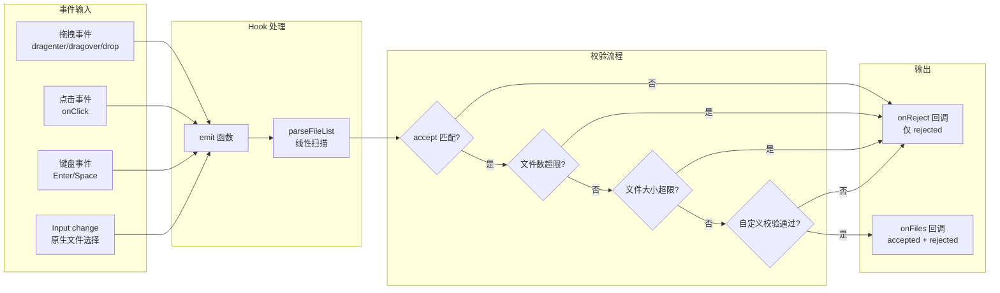
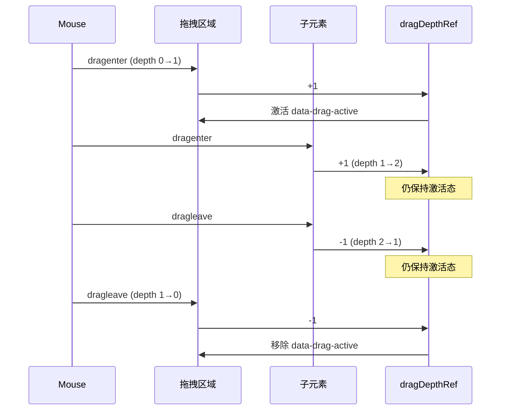
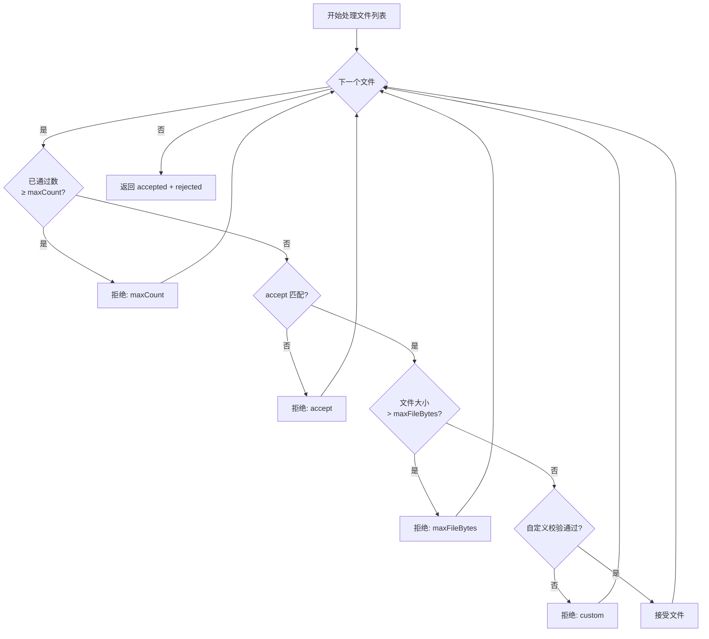
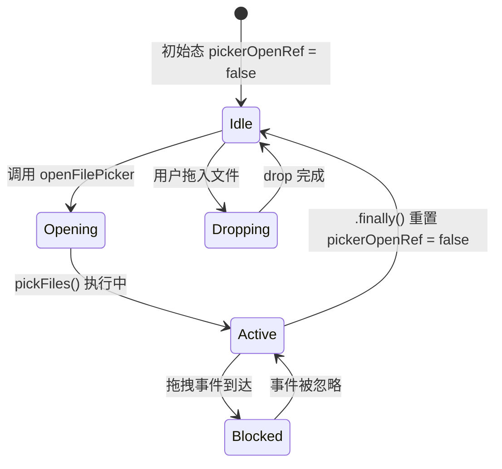

# 拖拽文件上传（DragDropFileUpload）实现文档

## 1. 概述

高性能拖拽/点击文件选择组件，基于 **headless hook + UI 组件** 双层架构。将交互逻辑（拖拽、键盘、文件校验）封装在 `useDragDropFileUpload` hook 中，UI 层 `DragDropFileUpload` 组件只负责渲染，便于在不同场景下灵活复用。

### 核心特性

| 特性 | 说明 |
|------|------|
| 双层架构 | Headless hook 与 UI 组件解耦，可单独使用 hook 自定义 UI |
| 高性能拖拽态 | 拖拽悬停通过 `data-drag-active` 属性切换样式，不触发 React 重渲染 |
| 防闪烁 | `dragDepthRef` 深度计数，解决子节点间移动时的 dragenter/dragleave 闪烁 |
| 多维度校验 | accept 规则（MIME / 扩展名 / 通配符）、文件数上限、单文件大小上限、自定义校验 |
| 自定义文件选择 | 支持 `pickFiles` 回调对接 Tauri 原生对话框等非标准文件选择场景 |
| 键盘无障碍 | Enter / Space 键触发文件选择，`role="button"` + `tabIndex` |
| 命令式 API | 通过 `useImperativeHandle` 暴露 `open` / `reset` / `getInputElement` / `getZoneElement` |
| 文件夹选择 | 支持 `webkitdirectory` 属性选择整个文件夹 |

### 文件结构

```
src/components/design/DragDropFileUpload/
└── index.tsx   # Hook + 组件完整实现（~554 行）
```

---

## 2. 架构设计

### 2.1 整体架构图

```mermaid
graph TD
    subgraph 外部调用层
        App[调用方组件]
    end

    subgraph DragDropFileUpload 组件层
        Direction TB
        Props[DragDropFileUploadProps<br/>accept / multiple / maxCount / maxFileBytes / validateFile / pickFiles / disabled / noClickToOpen]
        Render[渲染层<br/>zone 容器 + Input + children]
        Ref[forwardRef + useImperativeHandle<br/>open / reset / getInputElement / getZoneElement]
    end

    subgraph useDragDropFileUpload Hook 层
        Direction TB
        Refs[Ref 集合<br/>zoneRef / inputRef / dragDepthRef / pickerOpenRef / optsRef]
        Handlers[事件处理器<br/>onDragEnter / onDragLeave / onDragOver / onDrop / onClick / onKeyDown]
        Emit[emit 函数<br/>→ parseFileList → onFiles / onReject]
        Picker[openFilePicker<br/>→ 自定义 pickFiles 或 input.click]
    end

    subgraph 文件校验管线
        Direction TB
        Accept[accept 规则匹配<br/>matchAcceptRule / matchAcceptExtensionOnly]
        Count[maxCount 检查]
        Size[maxFileBytes 检查]
        Custom[validateFile 自定义校验]
    end

    subgraph UI 基础设施
        Input[Input 组件<br/>type=file / sr-only]
        Utils[cn 工具函数]
    end

    App --> Props
    Props --> Hook
    Hook --> Refs
    Hook --> Handlers
    Hook --> Emit
    Hook --> Picker
    Handlers --> Emit
    Emit --> Accept
    Accept --> Count
    Count --> Size
    Size --> Custom
    Custom --> Input
    Picker --> Input
    Render --> Input
    Render --> Props
```

### 2.2 组件数据流



---

## 3. 完整源码

> 源码路径：`src/components/design/DragDropFileUpload/index.tsx`

### 3.1 类型定义与工具函数

```tsx
/**
 * 高性能拖拽 / 点击文件选择区（基于 `@/components/ui/input` 的 `type="file"`）。
 *
 * 性能策略：
 * - 拖拽悬停态不写 React state，仅改容器 DOM 的 `data-drag-active`，避免 dragover 重渲染。
 * - dragenter/dragleave 深度计数，减少子节点间移动时的闪烁。
 * - 文件列表单次线性扫描；校验逻辑 O(n)。
 */

import {
	type ChangeEvent,
	type ComponentPropsWithRef,
	type DragEvent,
	forwardRef,
	type InputHTMLAttributes,
	type KeyboardEvent,
	type MutableRefObject,
	type ReactNode,
	type Ref,
	useCallback,
	useImperativeHandle,
	useMemo,
	useRef,
} from 'react';
import { Input } from '@/components/ui/input';
import { cn } from '@/lib/utils';

/** 文件来源：拖拽投递或原生 input 选择 */
export type DragDropFileSource = 'drop' | 'input';

/** 单文件校验失败原因（联合类型，便于上层精准处理） */
export type DragDropRejectReason =
	| { code: 'accept'; message?: string }           // accept 规则不匹配
	| { code: 'maxFileBytes'; maxBytes: number; message?: string }  // 单文件过大
	| { code: 'maxCount'; max: number; message?: string }           // 超出文件数上限
	| { code: 'custom'; message: string };           // 自定义校验拒绝

/** 被拒绝的文件及其原因 */
export interface DragDropRejectedFile {
	file: File;
	reason: DragDropRejectReason;
}

/** 文件校验结果：通过列表 + 拒绝列表 */
export interface DragDropAcceptResult {
	accepted: File[];
	rejected: DragDropRejectedFile[];
}

/** 自定义文件校验器：返回 null 表示通过，返回原因对象表示拒绝 */
export type DragDropFileValidator = (file: File) => DragDropRejectReason | null;

/** Hook 配置项（同时也是组件 props 的核心部分） */
export interface UseDragDropFileUploadOptions {
	/** 是否禁用文件选择 */
	disabled?: boolean;
	/** 原生 accept，如 `.json` 或 `image/*` */
	accept?: string;
	/**
	 * 为 true 时仅按扩展名规则校验（忽略 MIME）。
	 * 适用于 JSON / MD 等严格导入场景，防止 MIME 被伪装。
	 */
	acceptExtensionOnly?: boolean;
	/**
	 * 自定义打开文件选择（如 Tauri 原生对话框）。
	 * 返回 null 表示取消；设置后不再触发隐藏 input。
	 */
	pickFiles?: () => Promise<File[] | null>;
	/** 是否支持多文件选择 */
	multiple?: boolean;
	/** 表单字段名 */
	name?: string;
	/** 移动端 capture 属性（如 "user" 调用前置摄像头） */
	capture?: InputHTMLAttributes<HTMLInputElement>['capture'];
	/** 是否允许选择文件夹（webkitdirectory） */
	directory?: boolean;
	/** 单次最多接受文件数（默认不限制） */
	maxCount?: number;
	/** 单文件最大字节（默认不限制） */
	maxFileBytes?: number;
	/** 自定义校验，返回 null 表示通过 */
	validateFile?: DragDropFileValidator;
	/**
	 * 文件通过校验后回调。
	 * 建议用 useCallback 包裹，避免无谓重建。
	 */
	onFiles: (result: DragDropAcceptResult, source: DragDropFileSource) => void;
	/** 文件被拒绝时回调（可选） */
	onReject?: (
		rejected: DragDropRejectedFile[],
		source: DragDropFileSource,
	) => void;
	/** 为 true 时点击容器不打开文件选择（仍可拖拽与编程式 open） */
	noClickToOpen?: boolean;
}

/** data 属性名：标记当前拖拽激活态 */
const DRAG_ATTR = 'data-drag-active';

/**
 * 直接操作 DOM 属性切换拖拽激活态，完全绕过 React 渲染周期。
 * 这是性能优化的核心：dragover 事件触发频率极高（可达 60fps），
 * 如果用 setState 会导致频繁重渲染，而操作 data 属性是 O(1) DOM 操作。
 */
function setZoneDragActive(zone: HTMLDivElement | null, active: boolean) {
	if (!zone) return;
	if (active) zone.setAttribute(DRAG_ATTR, '');
	else zone.removeAttribute(DRAG_ATTR);
}

/**
 * accept 规则匹配（支持 MIME 类型 / 扩展名 / 通配符）。
 *
 * 规则解析优先级：
 * 1. `*/*` → 直接放行所有文件
 * 2. `image/*` → 通配符子类型匹配（prefix 为 "image/"）
 * 3. `.json` → 扩展名精确匹配
 * 4. `application/json` → MIME 类型精确匹配
 *
 * 所有比较均转为小写以保证大小写不敏感。
 */
export function matchAcceptRule(
	file: File,
	accept: string | undefined,
): boolean {
	if (!accept?.trim()) return true;
	const rules = accept
		.split(',')
		.map((s) => s.trim())
		.filter(Boolean);
	for (const rule of rules) {
		const r = rule.toLowerCase();
		if (r === '*/*') return true;
		if (r.endsWith('/*')) {
			// 通配符匹配：如 "image/*" → 检查 file.type 是否以 "image/" 开头
			const prefix = r.slice(0, -1);
			if (file.type?.toLowerCase().startsWith(prefix)) return true;
		} else if (r.startsWith('.')) {
			// 扩展名匹配：如 ".json" → 检查 file.name 是否以 ".json" 结尾
			if (file.name.toLowerCase().endsWith(r)) return true;
		} else if (file.type?.toLowerCase() === r) {
			// MIME 精确匹配
			return true;
		}
	}
	return false;
}

/**
 * 仅按 accept 中的扩展名规则校验。
 * 当 accept 包含扩展名规则时，只检查扩展名；
 * 如果没有扩展名规则，回退到 matchAcceptRule。
 */
export function matchAcceptExtensionOnly(
	file: File,
	accept: string | undefined,
): boolean {
	if (!accept?.trim()) return true;
	// 提取 accept 中以 "." 开头的扩展名规则
	const exts = accept
		.split(',')
		.map((s) => s.trim())
		.filter((s) => s.startsWith('.'));
	if (exts.length === 0) return matchAcceptRule(file, accept);
	const lower = file.name.toLowerCase();
	return exts.some((ext) => lower.endsWith(ext.toLowerCase()));
}

/** 根据 options 选择合适的 accept 匹配策略 */
function matchAcceptForOptions(
	file: File,
	accept: string | undefined,
	extensionOnly?: boolean,
): boolean {
	return extensionOnly
		? matchAcceptExtensionOnly(file, accept)
		: matchAcceptRule(file, accept);
}

/**
 * 兼容 FileList（原生 DOM 类型）和 File[]（数组）两种文件列表。
 * FileList.item(i) 和数组索引访问的统一封装。
 */
function getFileAt(list: FileList | readonly File[], i: number): File | null {
	if (typeof FileList !== 'undefined' && list instanceof FileList) {
		return list.item(i);
	}
	return list[i] ?? null;
}

/**
 * 文件列表线性扫描校验 —— 整个组件的核心校验管线。
 *
 * 对每个文件依次执行四步校验：
 * 1. 文件数上限检查（maxCount）
 * 2. accept 规则匹配
 * 3. 文件大小上限检查（maxFileBytes）
 * 4. 自定义校验器（validateFile）
 *
 * 每步不通过则归入 rejected 并附带原因，全部通过则归入 accepted。
 * 时间复杂度 O(n)，n 为文件数量。
 */
function parseFileList(
	list: FileList | readonly File[],
	options: {
		accept?: string;
		acceptExtensionOnly?: boolean;
		maxCount?: number;
		maxFileBytes?: number;
		validateFile?: DragDropFileValidator;
	},
): DragDropAcceptResult {
	const accepted: File[] = [];
	const rejected: DragDropRejectedFile[] = [];
	const maxCount = options.maxCount;
	const maxBytes = options.maxFileBytes;
	const len = list.length;
	let acceptedCount = 0;

	for (let i = 0; i < len; i++) {
		const file = getFileAt(list, i);
		if (!file) continue;

		// 步骤 1：文件数上限（已通过数量达上限后，剩余文件全部拒绝）
		if (maxCount !== undefined && acceptedCount >= maxCount) {
			rejected.push({
				file,
				reason: {
					code: 'maxCount',
					max: maxCount,
					message: `超过最多文件数 ${maxCount}`,
				},
			});
			continue;
		}

		// 步骤 2：accept 规则匹配
		if (
			!matchAcceptForOptions(file, options.accept, options.acceptExtensionOnly)
		) {
			rejected.push({
				file,
				reason: { code: 'accept', message: `类型不符合 accept：${file.name}` },
			});
			continue;
		}

		// 步骤 3：文件大小上限
		if (maxBytes !== undefined && file.size > maxBytes) {
			rejected.push({
				file,
				reason: {
					code: 'maxFileBytes',
					maxBytes: maxBytes,
					message: `文件过大：${file.name}`,
				},
			});
			continue;
		}

		// 步骤 4：自定义校验器
		const custom = options.validateFile?.(file) ?? null;
		if (custom) {
			rejected.push({ file, reason: custom });
			continue;
		}

		// 所有校验通过
		accepted.push(file);
		acceptedCount += 1;
	}

	return { accepted, rejected };
}
```

### 3.2 Hook：`useDragDropFileUpload`

```tsx
/** 拖拽区域事件处理器集合（供组件直接展开到 DOM 上） */
export type DragDropZoneHandlers = {
	onDragEnter: (e: DragEvent<HTMLDivElement>) => void;
	onDragLeave: (e: DragEvent<HTMLDivElement>) => void;
	onDragOver: (e: DragEvent<HTMLDivElement>) => void;
	onDrop: (e: DragEvent<HTMLDivElement>) => void;
	onClick: (e: React.MouseEvent<HTMLDivElement>) => void;
	onKeyDown: (e: KeyboardEvent<HTMLDivElement>) => void;
	role: 'button';
	tabIndex: number;
	'aria-disabled'?: boolean;
	'aria-label'?: string;
};

/** Hook 返回值 */
export interface UseDragDropFileUploadReturn {
	zoneRef: React.RefObject<HTMLDivElement | null>;   // 拖拽区域 ref
	inputRef: React.RefObject<HTMLInputElement | null>; // 隐藏 input ref
	zoneHandlers: DragDropZoneHandlers;                 // 事件处理器集合
	inputClassName: string;                              // input 样式（sr-only 隐藏）
	inputRest: Pick<
		InputHTMLAttributes<HTMLInputElement>,
		'type' | 'accept' | 'multiple' | 'disabled' | 'onChange' | 'name' | 'capture'
	> & { webkitdirectory?: boolean | '' };              // input 属性
	openFilePicker: () => void;                          // 打开文件选择器
	resetInput: () => void;                              // 重置 input
}

/**
 * Headless Hook：封装拖拽、键盘、点击逻辑与 DOM 拖拽态管理。
 *
 * 设计理念：
 * - 所有 handler 用 useCallback 包裹，optsRef 存储最新配置避免闭包陷阱
 * - pickerOpenRef 标记对话框打开状态，防止拖拽与对话框冲突
 * - dragDepthRef 深度计数防止 dragleave 闪烁
 */
export function useDragDropFileUpload(
	options: UseDragDropFileUploadOptions,
): UseDragDropFileUploadReturn {
	const { disabled, accept, multiple, name, capture, directory } = options;

	// ===== Ref 集合 =====
	const zoneRef = useRef<HTMLDivElement | null>(null);      // 拖拽区域 DOM
	const inputRef = useRef<HTMLInputElement | null>(null);    // 隐藏的 <input type="file">
	const dragDepthRef = useRef(0);                             // 拖拽深度计数器
	const pickerOpenRef = useRef(false);                        // 文件选择对话框是否打开中
	const optsRef = useRef(options);                            // 最新配置引用（避免闭包陷阱）
	optsRef.current = options;                                  // 每次渲染同步最新配置

	// ===== 核心 emit 函数：将文件列表送入校验管线 =====
	const emit = useCallback(
		(list: FileList | readonly File[], source: DragDropFileSource) => {
			if (optsRef.current.disabled) return;
			// 调用 parseFileList 执行校验
			const { accepted, rejected } = parseFileList(list, {
				accept: optsRef.current.accept,
				acceptExtensionOnly: optsRef.current.acceptExtensionOnly,
				maxCount: optsRef.current.maxCount,
				maxFileBytes: optsRef.current.maxFileBytes,
				validateFile: optsRef.current.validateFile,
			});
			// 有拒绝项时通知上层
			if (rejected.length) optsRef.current.onReject?.(rejected, source);
			// 无论是否有通过/拒绝，均触发 onFiles（全拒绝时上层也需要知道）
			if (accepted.length || rejected.length) {
				optsRef.current.onFiles({ accepted, rejected }, source);
			}
		},
		[],
	);

	// ===== 拖拽事件处理器 =====

	/**
	 * dragenter：进入区域时深度 +1
	 * 首次进入（depth 0→1）时激活拖拽态
	 */
	const onDragEnter = useCallback((e: DragEvent<HTMLDivElement>) => {
		if (optsRef.current.disabled || pickerOpenRef.current) return;
		e.preventDefault();
		e.stopPropagation();
		dragDepthRef.current += 1;
		if (dragDepthRef.current === 1) setZoneDragActive(zoneRef.current, true);
	}, []);

	/**
	 * dragleave：离开区域时深度 -1
	 * 深度归零时取消拖拽态
	 * 关键：当鼠标在区域内的子元素间移动时，浏览器会触发子元素的 dragenter/leave
	 * 导致深度短暂变为 0，深度计数有效解决此闪烁问题
	 */
	const onDragLeave = useCallback((e: DragEvent<HTMLDivElement>) => {
		if (optsRef.current.disabled || pickerOpenRef.current) return;
		e.preventDefault();
		e.stopPropagation();
		dragDepthRef.current -= 1;
		if (dragDepthRef.current <= 0) {
			dragDepthRef.current = 0;
			setZoneDragActive(zoneRef.current, false);
		}
	}, []);

	/**
	 * dragover：必须 preventDefault 才能触发 drop 事件
	 * 设置 dropEffect 为 'copy'，给用户视觉反馈（光标图标）
	 */
	const onDragOver = useCallback((e: DragEvent<HTMLDivElement>) => {
		if (optsRef.current.disabled || pickerOpenRef.current) return;
		e.preventDefault();
		e.stopPropagation();
		try {
			e.dataTransfer.dropEffect = 'copy';
		} catch {
			// 某些浏览器可能只读，忽略即可
		}
	}, []);

	/**
	 * drop：文件投递
	 * 重置深度计数器，调用 emit 处理文件列表
	 */
	const onDrop = useCallback(
		(e: DragEvent<HTMLDivElement>) => {
			e.preventDefault();
			e.stopPropagation();
			dragDepthRef.current = 0;
			setZoneDragActive(zoneRef.current, false);
			if (optsRef.current.disabled || pickerOpenRef.current) return;
			const files = e.dataTransfer?.files;
			if (files?.length) emit(files, 'drop');
		},
		[emit],
	);

	// ===== Input change 处理器 =====

	const onInputChange = useCallback(
		(e: ChangeEvent<HTMLInputElement>) => {
			const files = e.target.files;
			if (files?.length) emit(files, 'input');
			// 重置 input value，确保同一文件可重复选择
			e.target.value = '';
		},
		[emit],
	);

	// ===== 文件选择器打开 =====

	/**
	 * 打开文件选择器：
	 * - 如果有自定义 pickFiles，优先使用（如 Tauri 原生对话框）
	 * - 否则触发隐藏 input 的 click()
	 * 设置 pickerOpenRef 标记期间忽略拖拽事件
	 */
	const openFilePicker = useCallback(() => {
		if (optsRef.current.disabled || pickerOpenRef.current) return;
		const pick = optsRef.current.pickFiles;
		if (pick) {
			pickerOpenRef.current = true;
			dragDepthRef.current = 0;
			setZoneDragActive(zoneRef.current, false);
			void pick()
				.then((files) => {
					if (files?.length) emit(files, 'input');
				})
				.finally(() => {
					pickerOpenRef.current = false;
				});
			return;
		}
		inputRef.current?.click();
	}, [emit]);

	/** 重置 input：清空已选文件，使同一文件可以再次选择 */
	const resetInput = useCallback(() => {
		if (inputRef.current) inputRef.current.value = '';
	}, []);

	// ===== 点击处理 =====

	/**
	 * 点击打开文件选择器。
	 * 智能检测：如果点击目标是 zone 内的交互子元素（button/a/[role=button]），
	 * 且不是 zone 自身，则不触发文件选择（避免与子控件冲突）。
	 */
	const onZoneClick = useCallback(
		(e: React.MouseEvent<HTMLDivElement>) => {
			if (optsRef.current.disabled || optsRef.current.noClickToOpen) return;
			const target = e.target as HTMLElement | null;
			// closest 会向上查找最近匹配的祖先元素
			const interactive = target?.closest('button,a,[role="button"]');
			// zone 自身带 role=button；点击内部文案时 closest 会命中 zone，
			// 因此需要排除 "等于 currentTarget" 的情况
			if (interactive && interactive !== e.currentTarget) return;
			openFilePicker();
		},
		[openFilePicker],
	);

	// ===== 键盘处理 =====

	/**
	 * 无障碍键盘支持：Enter 和 Space 均可触发文件选择。
	 * 使用 preventDefault 阻止浏览器默认的 Enter 提交行为。
	 */
	const onZoneKeyDown = useCallback(
		(e: KeyboardEvent<HTMLDivElement>) => {
			if (optsRef.current.disabled || optsRef.current.noClickToOpen) return;
			if (e.key === 'Enter' || e.key === ' ') {
				e.preventDefault();
				openFilePicker();
			}
		},
		[openFilePicker],
	);

	// ===== 组装返回值 =====

	const zoneHandlers = useMemo<DragDropZoneHandlers>(
		() => ({
			onDragEnter,
			onDragLeave,
			onDragOver,
			onDrop,
			onClick: onZoneClick,
			onKeyDown: onZoneKeyDown,
			role: 'button',
			tabIndex: disabled ? -1 : 0,
			...(disabled ? { 'aria-disabled': true as const } : {}),
		}),
		[
			disabled,
			onDragEnter,
			onDragLeave,
			onDragOver,
			onDrop,
			onZoneClick,
			onZoneKeyDown,
		],
	);

	/** sr-only 样式类：隐藏 input 但保持可访问性 */
	const inputClassName =
		'sr-only pointer-events-none absolute m-0 size-0 min-h-0 min-w-0 overflow-hidden border-0 p-0 opacity-0';

	const inputRest = useMemo(
		() => ({
			type: 'file' as const,
			accept,
			multiple,
			disabled,
			onChange: onInputChange,
			name,
			capture,
			...(directory ? { webkitdirectory: true as const } : {}),
		}),
		[accept, multiple, disabled, name, capture, directory, onInputChange],
	);

	return {
		zoneRef,
		inputRef,
		zoneHandlers,
		inputClassName,
		inputRest,
		openFilePicker,
		resetInput,
	};
}
```

### 3.3 UI 组件：`DragDropFileUpload`

```tsx
/** 渲染上下文：传递给 children 函数 */
export type DragDropFileUploadRenderContext = {
	openFilePicker: () => void;
	disabled: boolean;
};

/** 组件 Props：继承 Hook 所有选项 + UI 相关配置 */
export interface DragDropFileUploadProps extends UseDragDropFileUploadOptions {
	className?: string;       // 最外层容器 class
	zoneClassName?: string;   // 拖拽区域 class
	children?: ReactNode | ((ctx: DragDropFileUploadRenderContext) => ReactNode);
	inputProps?: Omit<
		ComponentPropsWithRef<'input'>,
		'type' | 'onChange' | 'disabled' | 'accept' | 'multiple' | 'name' | 'capture'
	>;
	/** 无障碍标签 */
	ariaLabel?: string;
}

/** 命令式 API 句柄 */
export type DragDropFileUploadHandle = {
	open: () => void;
	reset: () => void;
	getInputElement: () => HTMLInputElement | null;
	getZoneElement: () => HTMLDivElement | null;
};

/** 默认子内容：拖拽提示文案 */
const defaultChildren = (ctx: DragDropFileUploadRenderContext) => (
	<div className="text-textcolor/70 flex flex-col items-center justify-center gap-1 py-8 text-sm">
		<span>拖拽文件到此处，或按 Enter / Space 选择</span>
		{ctx.disabled ? <span className="text-textcolor/40">已禁用</span> : null}
	</div>
);

/** 合并 ref 的辅助函数（同时支持 callback ref 和 MutableRefObject） */
function assignRef<T>(r: Ref<T> | undefined, node: T | null) {
	if (!r) return;
	if (typeof r === 'function') r(node);
	else (r as MutableRefObject<T | null>).current = node;
}

/**
 * DragDropFileUpload 组件 —— UI 层封装。
 *
 * 工作流程：
 * 1. 调用 useDragDropFileUpload hook 获取所有逻辑和 handler
 * 2. 通过 useImperativeHandle 暴露命令式 API
 * 3. 渲染 zone（拖拽区域） + 隐藏的 Input（type=file）
 * 4. zone 使用 data-drag-active 属性切换样式（Tailwind 变体）
 */
export const DragDropFileUpload = forwardRef<
	DragDropFileUploadHandle,
	DragDropFileUploadProps
>(function DragDropFileUpload(
	{
		className,
		zoneClassName,
		children,
		inputProps: extraInputProps,
		ariaLabel,
		...hookOptions
	},
	ref,
) {
	// 获取 hook 返回的所有逻辑
	const hook = useDragDropFileUpload(hookOptions);

	// 组装 zone handlers（注入 aria-label）
	const zoneHandlers = useMemo(() => {
		const h = { ...hook.zoneHandlers };
		if (ariaLabel) h['aria-label'] = ariaLabel;
		return h;
	}, [hook.zoneHandlers, ariaLabel]);

	// 通过 ref 暴露命令式 API
	useImperativeHandle(
		ref,
		() => ({
			open: hook.openFilePicker,
			reset: hook.resetInput,
			getInputElement: () => hook.inputRef.current,
			getZoneElement: () => hook.zoneRef.current,
		}),
		[hook.openFilePicker, hook.resetInput, hook.inputRef, hook.zoneRef],
	);

	// 渲染上下文
	const ctx = useMemo<DragDropFileUploadRenderContext>(
		() => ({
			openFilePicker: hook.openFilePicker,
			disabled: Boolean(hookOptions.disabled),
		}),
		[hook.openFilePicker, hookOptions.disabled],
	);

	// children 支持函数形式（render props）
	const body =
		typeof children === 'function'
			? children(ctx)
			: (children ?? defaultChildren(ctx));

	// 拆分额外 input props（提取 ref 和 className 以便单独处理）
	const {
		ref: extraRef,
		className: extraInputClassName,
		...extraRest
	} = extraInputProps ?? {};

	return (
		<div className={cn('relative min-h-0 min-w-0', className)}>
			{/* 拖拽区域：使用 data-drag-active 属性切换样式 */}
			<div
				ref={hook.zoneRef}
				{...zoneHandlers}
				className={cn(
					'relative cursor-pointer rounded-md border border-dashed outline-none transition-colors',
					'focus-visible:ring-[3px]',
					// data-drag-active 变体：拖拽激活时的样式
					'data-drag-active:border-theme data-drag-active:bg-theme/10',
					// 禁用态
					hookOptions.disabled &&
						'pointer-events-none cursor-not-allowed opacity-50',
					zoneClassName,
				)}
			>
				{body}
			</div>
			{/* 隐藏的原生 input：sr-only 对屏幕阅读器友好且视觉隐藏 */}
			<Input
				{...hook.inputRest}
				{...extraRest}
				ref={(node) => {
					// 合并 hook 内部 ref 和外部传入 ref
					assignRef(hook.inputRef, node);
					assignRef(extraRef, node);
				}}
				className={cn(hook.inputClassName, extraInputClassName)}
			/>
		</div>
	);
});

export default DragDropFileUpload;
```

---

## 4. 实现原理详解

### 4.1 性能策略：data-drag-active 属性

拖拽过程中 `dragover` 事件触发频率极高（可达每秒 60 次）。如果用 React `useState` 管理拖拽态，每次状态更新都会触发组件重渲染，造成性能浪费。

**解决方案**：直接操作 DOM 的 `data-drag-active` 属性，配合 Tailwind CSS 的 `data-[attribute]:` 变体实现样式切换。整个过程完全绕过 React 渲染周期，是纯 DOM 操作，时间复杂度 O(1)。

```mermaid
graph LR
    subgraph 传统方案（useState）
        A[dragover 事件] --> B[setState 调用]
        B --> C[React Reconciliation]
        C --> D[Virtual DOM diff]
        D --> E[真实 DOM 更新]
    end

    subgraph 本方案（data 属性）
        F[dragover 事件] --> G[setAttribute / removeAttribute]
        G --> H[CSS data-* 变体自动生效]
        H --> I[无 React 重渲染]
    end
```

### 4.2 dragenter/dragleave 深度计数防闪烁

浏览器在拖拽过程中，当鼠标在容器内的子元素间移动时，会交替触发子元素和父元素的 `dragenter`/`dragleave` 事件。直接用布尔开关会导致拖拽态频繁闪烁。

**解决方案**：使用 `dragDepthRef` 维护一个深度计数器：
- `dragenter` → 计数器 +1
- `dragleave` → 计数器 -1
- 只有当计数器从 0→1 时激活拖拽态，从 1→0 时取消



### 4.3 accept 规则匹配

`matchAcceptRule` 支持四种 accept 规则，按顺序匹配，命中即返回：

| 规则格式 | 示例 | 匹配逻辑 |
|----------|------|----------|
| `*/*` | `*/*` | 直接放行所有文件 |
| 通配符 | `image/*` | 检查 `file.type` 是否以 `image/` 开头 |
| 扩展名 | `.json` | 检查 `file.name` 是否以 `.json` 结尾 |
| MIME 精确 | `application/json` | 检查 `file.type` 是否完全相等 |

`matchAcceptExtensionOnly` 提供"仅扩展名"模式，从 accept 字符串中提取所有 `.ext` 规则，仅按扩展名校验。这在处理 JSON、MD 等结构化文件时尤为重要——防止用户通过修改 MIME 类型绕过校验。

### 4.4 parseFileList 线性扫描校验

文件校验管线采用单次线性扫描（O(n)），对每个文件依次执行四步校验：



### 4.5 pickerOpenRef 防止对话框冲突

当自定义 `pickFiles`（如 Tauri 原生文件对话框）打开时，拖拽事件仍可能触发。`pickerOpenRef` 在对话框打开期间标记为 `true`，所有事件处理器（dragenter/dragleave/dragover/drop）均会检查此标记并提前返回，避免对话框打开时的文件冲突。



### 4.6 键盘无障碍

组件通过以下设计满足 WCAG 无障碍标准：

| 属性 | 值 | 说明 |
|------|------|------|
| `role` | `button` | 告知屏幕阅读器该区域可点击 |
| `tabIndex` | `0` / `-1` | 启用键盘聚焦，禁用时设为 `-1` |
| `Enter` / `Space` | 触发 | 模拟按钮的键盘激活行为 |
| `aria-disabled` | `true` | 禁用时通知辅助技术 |
| `aria-label` | 可配置 | 自定义无障碍标签 |

### 4.7 useImperativeHandle 暴露方法

通过 `forwardRef` + `useImperativeHandle` 暴露四个命令式方法：

| 方法 | 说明 | 使用场景 |
|------|------|----------|
| `open()` | 打开文件选择器 | 外部按钮触发文件选择 |
| `reset()` | 重置 input 值 | 清空已选文件列表 |
| `getInputElement()` | 获取原生 input DOM | 底层操作（如触发原生校验） |
| `getZoneElement()` | 获取拖拽区域 DOM | 测量位置或绑定额外事件 |

---

## 5. 文件处理管线流程图

```mermaid
flowchart TD
    subgraph 事件来源
        A1[拖拽投递<br/>dataTransfer.files]
        A2[点击选择<br/>input.files]
        A3[自定义 pickFiles<br/>Promise File[]]
    end

    subgraph emit 入口
        B{emit<br/>parseFileList}
    end

    subgraph 校验管线
        direction LR
        C1[accept 规则] --> C2[maxCount] --> C3[maxFileBytes] --> C4[validateFile]
    end

    subgraph 结果分类
        D1[accepted 数组]
        D2[rejected 数组]
    end

    subgraph 回调输出
        E1[onFiles 回调<br/>accepted + rejected]
        E2[onReject 回调<br/>仅 rejected]
    end

    A1 --> B
    A2 --> B
    A3 --> B
    B --> C1
    C1 --> C2
    C2 --> C3
    C3 --> C4
    C4 --> D1
    C4 --> D2
    D1 --> E1
    D2 --> E1
    D2 --> E2
```

---

## 6. 使用示例

### 基础用法

```tsx
import { DragDropFileUpload } from '@/components/design';

function MyComponent() {
  return (
    <DragDropFileUpload
      accept=".json"
      maxCount={1}
      maxFileBytes={1024 * 1024}
      onFiles={({ accepted, rejected }, source) => {
        if (accepted.length) {
          console.log('文件已接受', accepted, '来源:', source);
        }
        if (rejected.length) {
          console.warn('文件被拒绝', rejected);
        }
      }}
    />
  );
}
```

### 命令式调用

```tsx
import { useRef } from 'react';
import { DragDropFileUpload, type DragDropFileUploadHandle } from '@/components/design';

function MyComponent() {
  const uploadRef = useRef<DragDropFileUploadHandle>(null);

  return (
    <>
      <button onClick={() => uploadRef.current?.open()}>
        选择文件
      </button>
      <DragDropFileUpload
        ref={uploadRef}
        accept="image/*"
        onFiles={({ accepted }) => { /* ... */ }}
      />
    </>
  );
}
```

### 自定义 UI（render props）

```tsx
<DragDropFileUpload
  accept=".zip,.rar"
  onFiles={({ accepted }) => { /* ... */ }}
>
  {({ openFilePicker, disabled }) => (
    <div className="flex items-center gap-4 p-6">
      <UploadIcon className="w-8 h-8" />
      <div>
        <p className="font-medium">上传压缩包</p>
        <p className="text-sm text-gray-500">或 <button onClick={openFilePicker}>点击选择</button></p>
      </div>
    </div>
  )}
</DragDropFileUpload>
```

### 自定义文件选择器（Tauri 集成）

```tsx
import { open } from '@tauri-apps/plugin-dialog';

<DragDropFileUpload
  accept=".json"
  pickFiles={async () => {
    const path = await open({ filters: [{ name: 'JSON', extensions: ['json'] }] });
    if (!path) return null;
    // 将路径转为 File 对象
    const file = new File([await readFile(path)], path.split('/').pop() || 'file');
    return [file];
  }}
  onFiles={({ accepted }) => { /* ... */ }}
/>
```

---

## 7. 关键设计决策总结

| 决策 | 原因 |
|------|------|
| data 属性替代 state | dragover 高频事件，避免 React 重渲染开销 |
| 深度计数防闪烁 | 浏览器 dragleave 在子元素切换时误触发，计数法最可靠 |
| optsRef 存储配置 | 避免 handler 闭包陷阱，始终读取最新配置 |
| emit 用 useCallback([]) | 配置通过 optsRef 读取，依赖数组为空即可 |
| pickerOpenRef 标记 | 自定义对话框打开期间屏蔽拖拽，避免文件冲突 |
| sr-only 隐藏 input | 保持无障碍性的同时实现视觉隐藏 |
| 线性扫描校验 O(n) | 四步校验合并在单次遍历中，效率最优 |
| acceptExtensionOnly | 防止 MIME 伪装，保护结构化文件导入安全 |