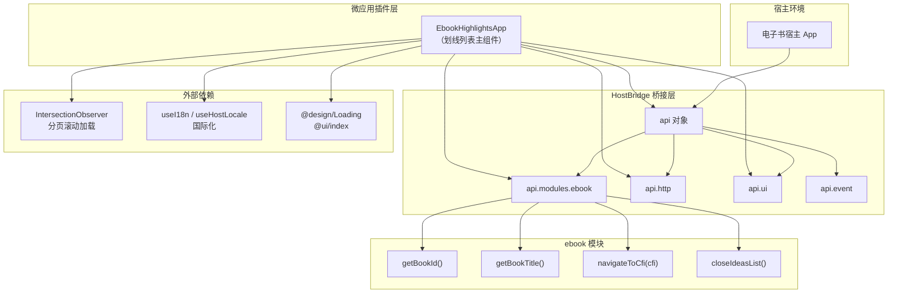
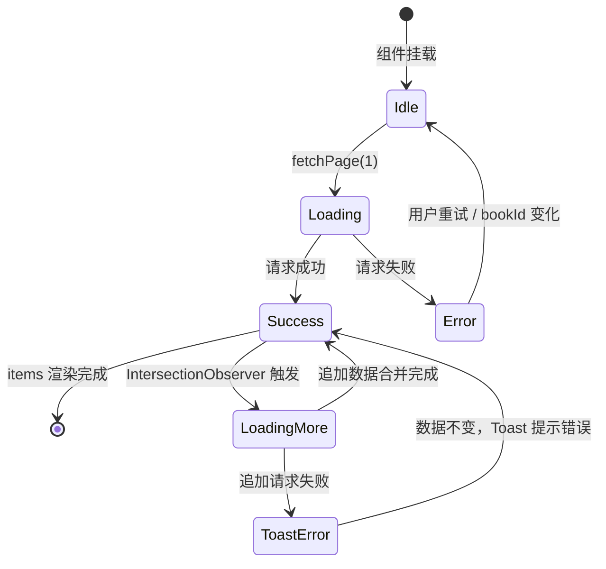

# 电子书划线列表（Highlights）实现文档

## 1. 概述

**电子书划线列表**（`EbookHighlightsApp`）是微应用插件体系中的一个功能模块，负责展示**当前用户在当前书籍中的全部划线（Highlight）数据**。

### 核心能力

| 能力 | 说明 |
|------|------|
| 三种划线样式展示 | 支持 `highlight`（荧光笔）、`underline`（下划线）、`wavy`（波浪线）三种样式，通过 `styleLabel` 映射为人类可读的国际化文本 |
| 分页滚动加载 | 基于 `IntersectionObserver` 实现哨兵（Sentinel）机制，滚动到底部自动加载下一页（每页 50 条） |
| CFI 跳转 | 点击任意划线项，通过 `HostBridge` 中的 `ebook.navigateToCfi()` 接口跳转至书籍对应位置 |
| 数据去重 | 追加加载时使用 `Set` 对划线 ID 去重，防止重复渲染 |
| 加载状态管理 | 区分首次加载（全屏 Loading）与追加加载（底部"加载中..."提示），以及"无更多数据"终止态 |

### 技术栈

- **React 18** 函数组件 + Hooks（`useState` / `useEffect` / `useCallback` / `useRef`）
- **TypeScript** 类型系统
- **Tailwind CSS** + 设计系统 Token（`text-textcolor` / `bg-theme` / `border-theme`）
- **Radix UI** 组件库（`ScrollArea` / `Button`）
- **IntersectionObserver API** 原生浏览器观察器

---

## 2. 架构设计

### 2.1 系统架构图



### 2.2 数据流与流程图

```mermaid
flowchart TD
    A[组件挂载] --> B{bookId 是否存在?}
    B -- 否 --> C[显示错误提示<br/>未绑定书籍]
    B -- 是 --> D[fetchPage 1<br/>首次加载]
    D --> E[api.http.get<br/>请求第 1 页]
    E --> F[unwrapPage<br/>解析分页数据]
    F --> G[setItems / setTotal<br/>更新状态]
    G --> H{列表渲染}

    H --> I{hasMore?}
    I -- 否 --> J[显示"无更多"]
    I -- 是 --> K[IntersectionObserver<br/>观察哨兵元素]
    K --> L{哨兵进入视口?}
    L -- 否 --> K
    L -- 是 --> M[fetchPage pageNo+1<br/>追加加载]
    M --> N[api.http.get]
    N --> O[去重合并<br/>Set 过滤重复 ID]
    O --> H

    subgraph 点击交互
        P[用户点击划线项] --> Q[onOpen row]
        Q --> R[ebook.navigateToCfi cfi]
        R --> S[ebook.closeIdeasList]
    end
```

### 2.3 组件内部状态流转图



---

## 3. 完整源码（带详细注释）

> 文件路径：`src/views/ebook/highlights/index.tsx`

```tsx
// ============================================================
// 第三方 / 设计系统组件导入
// ============================================================
import Loading from "@design/Loading";       // 全局 Loading 占位组件
import { Button, ScrollArea } from "@ui/index"; // 基础 UI 组件（Radix 封装）
import { useCallback, useEffect, useRef, useState } from "react"; // React Hooks
import { useHostLocale, useI18n } from "@/hooks"; // 自定义 Hooks：国际化 + 宿主语言同步
import type { Locale } from "@/i18n";        // 国际化类型定义
import { cn } from "@/lib/utils";              // className 合并工具（clsx + tailwind-merge）
import "@/styles.css";                        // 全局样式注入

// ============================================================
// 常量定义
// ============================================================

/** 每页加载的划线数量，默认 50 条 */
const PAGE_SIZE = 50;

// ============================================================
// 类型定义
// ============================================================

/**
 * 划线数据结构
 * 对应后端 API 返回的单条划线记录
 */
type Highlight = {
  id: string;           // 划线唯一标识
  userId: number;       // 所属用户 ID
  cfiRange: string;     // CFI（Canonical Fragment Identifier）范围，用于定位书籍位置
  quote: string;        // 划线文本内容
  style: "highlight" | "underline" | "wavy" | string; // 划线样式类型
  color: string;        // 划线颜色值
  createdAt?: string;   // 创建时间（ISO 格式）
  updatedAt?: string;   // 更新时间（ISO 格式）
};

/**
 * ebook 模块接口
 * 由宿主 App 通过 api.modules.ebook 注入
 * 提供书籍信息获取和页面跳转能力
 */
type EbookModules = {
  /** 获取当前书籍 ID */
  getBookId: () => string | null;
  /** 获取当前书籍标题 */
  getBookTitle: () => string | null;
  /** 跳转到指定 CFI 位置 */
  navigateToCfi: (cfi: string) => void | Promise<void>;
  /** 关闭想法列表面板（可选） */
  closeIdeasList?: () => void;
};

/**
 * HostBridge 宿主桥接属性
 * 定义微应用与宿主 App 之间的通信契约
 */
type HostBridgeProps = {
  api: {
    theme: "light" | "dark";       // 当前主题
    locale?: Locale;                // 当前语言
    event: {                        // 事件总线
      on: (event: string, handler: (data?: unknown) => void) => void;
      off: (event: string, handler: (data?: unknown) => void) => void;
      emit: (event: string, data?: unknown) => void;
    };
    http?: {                        // HTTP 请求客户端
      get: <T = unknown>(url: string) => Promise<T>;
    };
    ui?: {                          // UI 交互能力
      showToast: (options: { message: string; type?: "success" | "error" | "info" }) => void;
    };
    modules?: Readonly<Record<string, unknown>>; // 宿主注入的功能模块集合
  };
  plugin: { id: string; version: string; routePath: string }; // 插件元信息
  independent?: boolean;           // 是否独立运行模式
};

/**
 * 分页响应结构
 * 与后端 API /ebook/highlights/:bookId 的返回结构对齐
 */
type HighlightPage = {
  list: Highlight[];   // 当前页划线列表
  total: number;       // 全量划线总数
  pageNo: number;      // 当前页码（从 1 开始）
  pageSize: number;    // 每页大小
};

// ============================================================
// 工具函数
// ============================================================

/**
 * 解析 API 响应为统一的 HighlightPage 结构
 *
 * 处理逻辑：
 *   1. 兼容两种响应格式：直接返回分页对象 或 包裹在 { data: ... } 中
 *   2. 校验 list 字段为数组，否则返回空页
 *   3. 对 total / pageNo / pageSize 做 Number() 安全转换
 *
 * @param res 原始 API 响应
 * @returns 标准化后的分页结构
 */
function unwrapPage(res: unknown): HighlightPage {
  // 优先尝试从 res.data 中提取（兼容包裹型响应）
  const body =
    res && typeof res === "object" && "data" in res
      ? (res as { data: unknown }).data
      : res;

  // 校验 body 是否包含合法的 list 数组
  if (
    body &&
    typeof body === "object" &&
    Array.isArray((body as HighlightPage).list)
  ) {
    const page = body as HighlightPage;
    return {
      list: page.list,
      total: Number(page.total) || 0,          // NaN 回退为 0
      pageNo: Number(page.pageNo) || 1,        // NaN 回退为 1
      pageSize: Number(page.pageSize) || PAGE_SIZE, // NaN 回退为默认值
    };
  }

  // 兜底：返回空页
  return { list: [], total: 0, pageNo: 1, pageSize: PAGE_SIZE };
}

/**
 * 格式化 ISO 时间字符串为本地化显示
 *
 * @param iso ISO 格式时间字符串
 * @param locale 目标语言
 * @returns 格式化后的时间文本；无效时间返回原始字符串
 */
function formatTime(iso: string | undefined, locale: Locale): string {
  if (!iso) return "";
  const d = new Date(iso);
  if (Number.isNaN(d.getTime())) return iso; // 解析失败则返回原始值
  return d.toLocaleString(locale);
}

/**
 * 划线样式类型 → 国际化标签映射
 *
 * 将后端存储的英文样式标识符转换为用户可读的本地化文本：
 *   - "underline" → 下划线
 *   - "wavy"      → 波浪线
 *   - 其他        → 荧光笔（默认）
 *
 * @param style 划线样式标识符
 * @param t 国际化翻译函数
 * @returns 本地化样式标签文本
 */
function styleLabel(style: string, t: (key: string) => string): string {
  if (style === "underline") return t("highlightsList.style.underline");
  if (style === "wavy") return t("highlightsList.style.wavy");
  return t("highlightsList.style.highlight"); // 默认荧光笔
}

// ============================================================
// 主组件：EbookHighlightsApp
// ============================================================

/**
 * 全书划线列表组件
 *
 * 职责：
 *   1. 根据当前书籍 ID 分页加载全部划线数据
 *   2. 展示划线文本、样式类型、创建时间
 *   3. 支持点击跳转到书籍对应 CFI 位置
 *   4. 基于 IntersectionObserver 实现无限滚动分页
 *
 * 性能考量：
 *   - inflightRef 防止并发请求
 *   - Set 去重防止 ID 重复
 *   - useCallback 缓存 fetchPage 避免 Observer 频繁重建
 */
function EbookHighlightsApp({ api }: HostBridgeProps) {
  // ---------- Hooks ----------
  const { t, locale } = useI18n();       // 获取翻译函数和当前语言
  useHostLocale(api);                     // 同步宿主语言到 i18n 上下文

  // ---------- 模块引用 ----------
  const ebook = api.modules?.ebook as EbookModules | undefined;
  const bookId = ebook?.getBookId() ?? null;      // 当前书籍 ID
  const bookTitle = ebook?.getBookTitle() ?? null; // 当前书籍标题

  // ---------- 状态管理 ----------
  const [items, setItems] = useState<Highlight[]>([]);    // 划线列表数据
  const [pageNo, setPageNo] = useState(0);                 // 当前加载到的页码
  const [total, setTotal] = useState(0);                  // 划线总数
  const [loading, setLoading] = useState(false);           // 首次加载中
  const [loadingMore, setLoadingMore] = useState(false);  // 追加加载中
  const [error, setError] = useState<string | null>(null); // 错误信息

  // ---------- Ref ----------
  const viewportRef = useRef<HTMLDivElement>(null);  // 滚动容器（作为 IntersectionObserver 的 root）
  const sentinelRef = useRef<HTMLDivElement>(null);  // 哨兵元素（触发加载的观察目标）
  const inflightRef = useRef(false);                 // 请求锁：防止并发重复请求

  // ---------- 派生状态 ----------
  const hasMore = items.length < total; // 是否已加载全部数据

  // ============================================================
  // 分页数据加载核心函数
  // ============================================================

  /**
   * 加载指定页码的划线数据
   *
   * @param nextPage 目标页码（从 1 开始）
   * @param append   是否为追加模式
   *                 - false：首次加载，替换整个列表
   *                 - true：追加加载，合并到现有列表并去重
   *
   * 并发控制：
   *   通过 inflightRef 确保任意时刻只有一个请求在飞
   *
   * 错误处理：
   *   - 首次加载失败：显示全屏错误
   *   - 追加加载失败：Toast 提示，保留已有数据
   */
  const fetchPage = useCallback(
    async (nextPage: number, append: boolean) => {
      // 前置检查
      if (!bookId || !api.http || inflightRef.current) return;

      // 加锁：防止并发
      inflightRef.current = true;

      // 更新加载状态
      if (append) setLoadingMore(true);
      else {
        setLoading(true);
        setError(null);
      }

      try {
        // 发起 HTTP 请求
        const res = await api.http.get(
          `/ebook/highlights/${bookId}?pageNo=${nextPage}&pageSize=${PAGE_SIZE}`,
        );

        // 解析响应
        const page = unwrapPage(res);

        // 更新分页元数据
        setTotal(page.total);
        setPageNo(page.pageNo);

        // 更新列表数据
        setItems((prev) => {
          if (!append) return page.list; // 首次加载：直接替换

          // 追加加载：基于 ID 去重合并
          const seen = new Set(prev.map((h) => h.id));
          const extra = page.list.filter((h) => !seen.has(h.id));
          return [...prev, ...extra];
        });
      } catch (e) {
        const message = e instanceof Error ? e.message : String(e);

        if (!append) {
          // 首次加载失败：重置所有状态
          setError(message);
          setItems([]);
          setTotal(0);
          setPageNo(0);
        } else {
          // 追加加载失败：Toast 提示，不清除已有数据
          api.ui?.showToast({ message, type: "error" });
        }
      } finally {
        // 释放锁 + 清理加载状态
        inflightRef.current = false;
        setLoading(false);
        setLoadingMore(false);
      }
    },
    [api.http, api.ui, bookId], // 依赖项：缓存函数引用
  );

  // ============================================================
  // Effect 1: 组件挂载 / bookId 变化时的首次加载
  // ============================================================
  useEffect(() => {
    if (!bookId || !api.http) {
      // bookId 无效：清空数据并设置错误提示
      setItems([]);
      setTotal(0);
      setPageNo(0);
      setError(bookId ? null : t("highlightsList.unboundBook"));
      return;
    }
    // 触发首次加载
    void fetchPage(1, false);
  }, [api.http, bookId, fetchPage, t]);

  // ============================================================
  // Effect 2: IntersectionObserver 无限滚动
  // ============================================================
  useEffect(() => {
    const root = viewportRef.current;   // 滚动容器
    const target = sentinelRef.current; // 哨兵元素

    // 前置条件检查
    if (!root || !target || !hasMore || loading || loadingMore) return;

    // 创建观察器
    const io = new IntersectionObserver(
      (entries) => {
        // entries[0] 为哨兵元素的观察结果
        if (!entries[0]?.isIntersecting) return;
        // 哨兵进入视口 → 加载下一页
        void fetchPage(pageNo + 1, true);
      },
      {
        root,             // 以滚动容器为观察根
        rootMargin: "120px 0px", // 提前 120px 触发（预加载优化）
        threshold: 0,     // 0% 可见即触发
      },
    );

    // 开始观察
    io.observe(target);

    // 清理函数：组件卸载或依赖变化时断开观察
    return () => io.disconnect();
  }, [fetchPage, hasMore, loading, loadingMore, pageNo, items.length]);

  // ============================================================
  // 事件处理
  // ============================================================

  /**
   * 点击划线项的处理
   *
   * 流程：
   *   1. 提取并校验 CFI
   *   2. 通过 ebook 模块跳转到对应位置
   *   3. 尝试关闭想法列表面板（如果存在）
   */
  const onOpen = (row: Highlight) => {
    const cfi = row.cfiRange?.trim();
    if (cfi) void ebook?.navigateToCfi(cfi);
    ebook?.closeIdeasList?.();
  };

  // ============================================================
  // 渲染
  // ============================================================
  return (
    // 根容器：全屏高度 + 纵向弹性布局
    <div className="text-textcolor flex h-full min-h-0 flex-col text-sm">
      {/* ---------- 头部信息栏：书籍标题 + 加载进度 ---------- */}
      {bookTitle && !loading ? (
        <div className="text-textcolor/55 border-theme/10 mb-1 shrink-0 border-b px-3.5 pb-2.5 text-xs">
          {bookTitle}
          {total > 0 ? (
            <span className="text-textcolor/40 ml-2">
              {t("common.loadedCount", {
                loaded: items.length,
                total,
              })}
            </span>
          ) : null}
        </div>
      ) : null}

      {/* ---------- 主内容区：Loading 或列表 ---------- */}
      {loading ? (
        // 首次加载中：全屏 Loading
        <Loading className="h-full" />
      ) : (
        <ScrollArea
          ref={viewportRef}
          className="box-border flex min-h-0 flex-1 flex-col px-1.5"
        >
          {/* 错误态 */}
          {error ? (
            <p className="text-textcolor px-2 py-2">{error}</p>
          ) : items.length === 0 ? (
            // 空态
            <p className="text-textcolor/55 px-2 py-4 text-center">
              {t("highlightsList.empty")}
            </p>
          ) : (
            // 列表渲染
            <div className="flex min-h-0 w-full flex-1 flex-col gap-1">
              {items.map((row) => (
                <div key={row.id}>
                  <Button
                    type="button"
                    variant="ghost"
                    onClick={() => onOpen(row)}
                    className={cn(
                      "h-auto w-full flex-col items-stretch gap-0 rounded-md px-2 py-2 text-left font-normal whitespace-normal",
                      "hover:bg-theme/10",
                    )}
                  >
                    {/* 划线文本（最多 3 行截断） */}
                    <p className="mb-1.5 flex items-start gap-1 text-justify text-sm text-textcolor line-clamp-3">
                      {row.quote?.trim() || t("highlightsList.noQuote")}
                    </p>

                    {/* 元信息行：样式类型 · 创建时间 */}
                    <p className="text-textcolor/50 text-left text-xs">
                      {[
                        styleLabel(row.style, t),
                        formatTime(row.createdAt, locale),
                      ]
                        .filter(Boolean)
                        .join(" · ")}
                    </p>
                  </Button>
                </div>
              ))}

              {/* 哨兵元素：IntersectionObserver 观察目标 */}
              <div ref={sentinelRef} className="h-1 w-full" aria-hidden />

              {/* 追加加载中提示 */}
              {loadingMore ? (
                <p className="text-textcolor/45 pb-3 text-center text-xs">
                  {t("common.loadingMore")}
                </p>
              ) : null}

              {/* 无更多数据提示 */}
              {!hasMore && items.length > 0 ? (
                <p className="text-textcolor/35 pb-3 text-center text-xs">
                  {t("common.noMore")}
                </p>
              ) : null}
            </div>
          )}
        </ScrollArea>
      )}
    </div>
  );
}

// ============================================================
// 生命周期钩子（宿主 App 调用）
// ============================================================

/** 微应用激活时回调 */
EbookHighlightsApp.activate = async (api: HostBridgeProps["api"]) => {
  console.log("[ebook-highlights] activate", api);
};

/** 微应用停用时回调 */
EbookHighlightsApp.deactivate = () => {
  console.log("[ebook-highlights] deactivate");
};

// ============================================================
// 默认导出
// ============================================================
export default EbookHighlightsApp;
```

---

## 4. 实现原理详解

### 4.1 IntersectionObserver 分页加载

#### 核心机制

传统无限滚动方案依赖 `scroll` 事件监听 `scrollTop` / `scrollHeight` / `clientHeight` 三元组计算，存在以下缺陷：
- 高频触发，需手动节流（throttle）
- 计算逻辑与浏览器兼容性耦合

`IntersectionObserver` 采用**声明式**观察模型：

```
┌─────────────────────────────────────┐
│  ScrollArea (viewportRef)           │  ← root（观察根）
│  ┌───────────────────────────────┐  │
│  │  划线项 1                     │  │
│  │  划线项 2                     │  │
│  │  ...                          │  │
│  │  划线项 N                     │  │
│  │                               │  │
│  │  ┌─────────────────────────┐  │  │
│  │  │  哨兵元素 (sentinelRef) │  │  │  ← target（观察目标）
│  │  └─────────────────────────┘  │  │
│  │  ↑ rootMargin: 120px          │  │  ← 提前 120px 触发
│  └───────────────────────────────┘  │
└─────────────────────────────────────┘
```

#### 关键配置说明

| 参数 | 值 | 说明 |
|------|----|------|
| `root` | `viewportRef.current` | 滚动容器作为观察根，而非默认 viewport |
| `rootMargin` | `"120px 0px"` | 底部扩展 120px，哨兵距离底部 120px 时即触发，实现**预加载** |
| `threshold` | `0` | 0% 可见即触发，哨兵一进入可视区域就开始加载 |

#### 防抖与并发控制

```
时间线：
  t0: 页面渲染完成，hasMore=true，创建 IO
  t1: 用户滚动，哨兵进入视口
  t2: IO 触发回调 → fetchPage(pageNo+1, true)
  t3: fetchPage 内部 inflightRef=true，开始请求
  t4: 若此时哨兵仍在视口内（loadingMore=true），因 hasMore/loadingMore 依赖变化
      → Effect 重新执行，但 loadingMore 为 true → 跳过（return）
  t5: 请求返回，inflightRef=false，loadingMore=false
  t6: 用户继续滚动 → 哨兵再次进入视口 → 触发下一页
```

### 4.2 去重合并（Set 方案）

#### 问题场景

分页 API 在某些边界情况下可能返回重复数据：
- 并发请求同一页码
- 后端分页数据在两次请求间有新增/删除，导致数据重叠

#### 解决方案

```tsx
// 1. 从已有列表提取全部 ID，构建 O(1) 查询集合
const seen = new Set(prev.map((h) => h.id));

// 2. 过滤新数据中已存在的项
const extra = page.list.filter((h) => !seen.has(h.id));

// 3. 合并：保留已有数据 + 追加去重后的新数据
return [...prev, ...extra];
```

**复杂度分析**：
- 构建 Set：O(n)，n = prev.length
- 过滤新数据：O(m)，m = page.list.length
- 总体：O(n + m)

#### 与"追加全部"方案对比

| 方案 | 时间复杂度 | 结果 |
|------|-----------|------|
| 直接 `[...prev, ...page.list]` | O(n+m) | ⚠️ 可能出现重复 ID |
| `Set` 去重合并（当前方案） | O(n+m) | ✅ 保证唯一性 |

### 4.3 styleLabel 样式类型映射

#### 设计思路

后端存储的划线样式为英文标识符（`highlight` / `underline` / `wavy`），前端需要：
1. **解耦**：将样式标识与显示文本分离
2. **可扩展**：新增样式类型只需添加一个 if 分支
3. **兜底**：未知类型默认映射为"荧光笔"

```
后端存储                  前端显示（中文环境）
─────────                ──────────────────
"underline"     →        "下划线"
"wavy"          →        "波浪线"
"highlight"     →        "荧光笔"
"unknown_type"  →        "荧光笔"（兜底）
```

#### 国际化支持

通过 `t()` 函数从 i18n 资源中获取对应语言的文本：
- `highlightsList.style.underline`
- `highlightsList.style.wavy`
- `highlightsList.style.highlight`

### 4.4 HostBridge CFI 跳转导航

#### CFI（Canonical Fragment Identifier）

CFI 是 EPUB 规范中的定位标识符，用于精确定位书籍中的文本位置。典型格式：
```
epubcfi(/6/12[chapter1]!/4[paragraph3]/2[span1])
```

#### 跳转流程

```
用户点击划线项
    │
    ▼
onOpen(row) 提取 cfiRange
    │
    ▼
cfi.trim() 清理空白
    │
    ▼
ebook?.navigateToCfi(cfi)
    │
    ├── 宿主 App 接收跳转指令
    ├── 解析 CFI 定位到书籍对应位置
    ├── 渲染引擎滚动/缩放至目标文本
    └── 高亮目标区域
    │
    ▼
ebook?.closeIdeasList?.()
    │
    └── 关闭想法列表面板（如果存在）
```

#### 宿主解耦

组件通过 `api.modules.ebook` 获取能力，而非直接依赖宿主实现：
- 组件**不关心**宿主 App 如何实现 `navigateToCfi`
- 组件只定义**契约**（函数签名 + 语义）
- 宿主侧可自由选择实现方式（EPUB.js / Readium / 自研引擎）

---

## 5. 与想法列表（Ideas）的对比说明

`EbookHighlightsApp` 与 `IdeasListApp` 是同属 `src/views/ebook/` 下的平行模块，共享大量基础设施但服务于不同业务场景。

### 5.1 架构共性

| 维度 | 实现方式 |
|------|---------|
| 组件模式 | 函数组件 + Hooks |
| 分页加载 | IntersectionObserver + 哨兵机制 |
| 去重策略 | `Set` 按 ID 去重 |
| 状态管理 | `useState` + `useRef`（inflight 锁） |
| 国际化 | `useI18n` + `useHostLocale` |
| UI 组件 | `ScrollArea` + `Button` + `Loading` |
| 宿主桥接 | `api.modules.ebook` 统一接口 |
| 生命周期 | `activate` / `deactivate` 静态方法 |

### 5.2 关键差异

| 对比维度 | Highlights（划线列表） | Ideas（想法列表） |
|----------|----------------------|-------------------|
| **数据模型** | `Highlight` 类型：`quote` / `style` / `color` | `Thought` 类型：`content` / `username` / `avatar` / `isPublic` |
| **API 路径** | `/ebook/highlights/:bookId` | `/ebook/thoughts/:bookId?publicOnly=true` |
| **HTTP 方法** | 仅 `GET`（只读展示） | `GET` / `POST` / `PUT` / `DELETE`（完整 CRUD） |
| **展示重点** | 划线原文（`quote`）+ 样式标签 | 用户想法（`content`）+ 引用原文（`quote`） |
| **特有能力** | `styleLabel()` 样式类型映射 | `openThought()` 详情面板、`Quote` 图标 |
| **头部信息** | 书籍标题 + 加载计数 | 书籍标题 + 加载计数（一致） |
| **空态文案** | `highlightsList.empty` | `ideasList.empty` |
| **未绑定书籍** | `highlightsList.unboundBook` | `ideasList.unboundBook` |
| **点击行为** | 仅 `navigateToCfi` 跳转 | `navigateToCfi` + `openThought` 打开详情 |
| **时间格式化** | `createdAt` | `createdAt`（一致） |

### 5.3 UI 呈现差异

```
Highlights 列表项：
┌─────────────────────────────────────┐
│  划线文本内容（line-clamp-3）        │  ← quote 字段
│                                     │
│  荧光笔 · 2024/1/15 14:30:00        │  ← styleLabel + formatTime
└─────────────────────────────────────┘

Ideas 列表项：
┌─────────────────────────────────────┐
│  「引用原文」（line-clamp-2）        │  ← quote 字段 + Quote 图标
│                                     │
│  用户想法内容（line-clamp-3）        │  ← content 字段
│                                     │
│  张三 · 2024/1/15 14:30             │  ← username + formatTime
└─────────────────────────────────────┘
```

### 5.4 设计模式总结

两者遵循**同构异构**设计理念：
- **同构**：共享分页加载、去重合并、国际化、宿主桥接等基础设施
- **异构**：数据模型、API 路径、展示内容、交互行为各自独立

这种设计使得：
- 新增类似列表（如书签列表、笔记列表）可**低成本复用**基础框架
- 各模块独立迭代，互不干扰
- 统一的用户体验（加载状态、错误处理、空态展示）