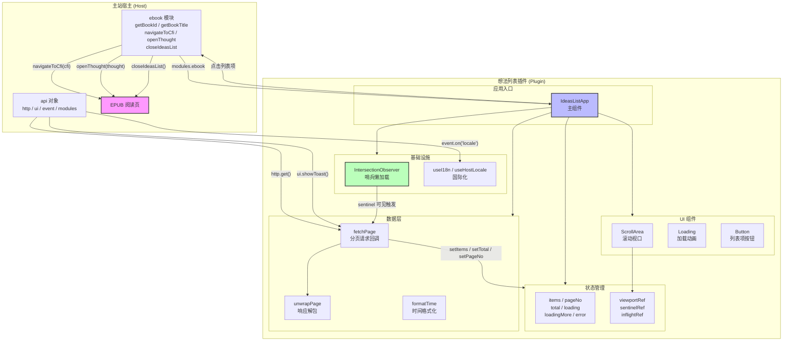
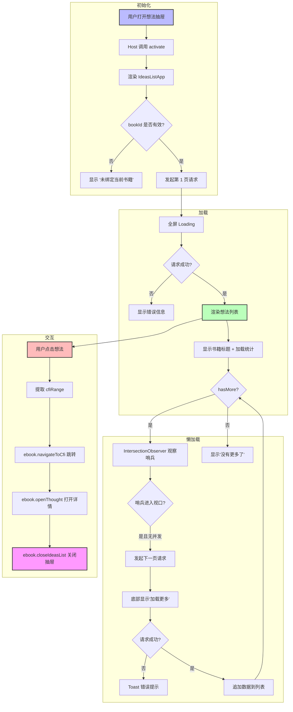
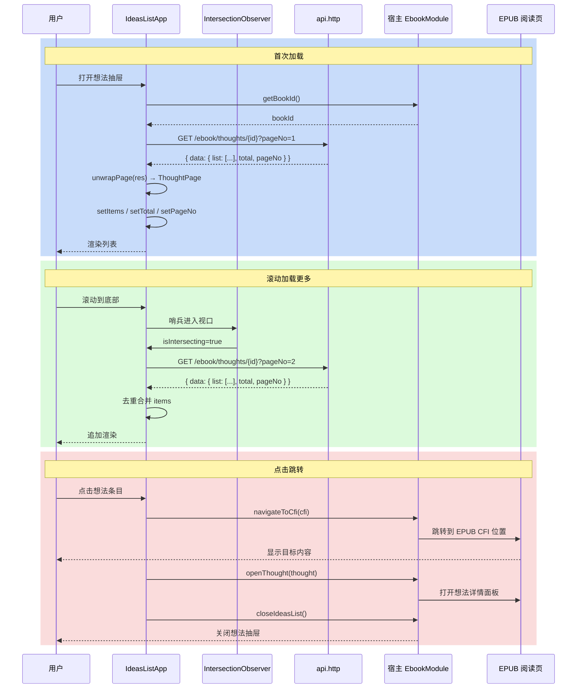

# EPUB 想法列表 (Ideas List) 实现文档

## 1. 概述

EPUB 想法列表是电子书阅读页的**想法（Thought）抽屉面板**，作为微前端插件（Module Federation）嵌入主站运行。核心特性包括：

- **分页滚动加载**：基于 `IntersectionObserver` + 哨兵元素（sentinel）实现无限滚动，每页 50 条
- **点击跳转 CFI**：点击列表项调用 `ebook.navigateToCfi(cfiRange)` 跳转至 EPUB 对应位置
- **Host 模块通信**：通过 `api.modules.ebook` 与宿主阅读页模块通信，支持 `navigateToCfi` / `openThought` / `closeIdeasList`
- **防重复请求**：`inflightRef` useRef 标记位防止并发触发相同分页请求
- **统一响应解析**：`unwrapPage` 工具函数兼容 `{ data: {...} }` 和直接返回体两种 API 格式
- **国际化**：跟随 Host 语言环境，支持中文/英文
- **生命周期钩子**：`activate` / `deactivate` 静态方法供主站在挂载/卸载时调用

## 2. 架构设计

### 2.1 整体架构图 (Mermaid)



### 2.2 模块职责说明

| 模块 | 职责 | 文件位置 |
|------|------|----------|
| `IdeasListApp` | 主组件，管理状态、协调数据流、渲染 UI | `src/views/ebook/ideas/index.tsx` |
| `unwrapPage` | 统一 API 响应解包，兼容嵌套/扁平两种格式 | 同文件 |
| `fetchPage` | 核心分页请求逻辑，含防重入、错误处理、去重 | 同文件 |
| `IntersectionObserver` | 监听哨兵元素可见性，触发下一页加载 | 同文件 |
| `useHostLocale` | 跟随 Host locale 变化，订阅 `event('locale')` | `src/hooks/useHostLocale.ts` |
| `useI18n` | 插件内部 i18n，基于 `useSyncExternalStore` | `src/hooks/i18n.ts` |

## 3. 完整源码

文件路径：`src/views/ebook/ideas/index.tsx`

```tsx
// ============================================================================
// 电子书想法列表（IdeasListApp）完整源码
// ============================================================================

// --- 设计系统组件 ---
import Loading from "@design/Loading";       // 加载中动画组件
import { Button, ScrollArea } from "@ui/index"; // 按钮 + 滚动区域组件

// --- React Hooks ---
import { useCallback, useEffect, useRef, useState } from "react";

// --- 国际化 ---
import { useHostLocale, useI18n } from "@/hooks"; // Host 语言跟随 + 内部 i18n
import type { Locale } from "@/i18n";             // 语言类型定义

// --- 工具函数 ---
import { cn } from "@/lib/utils";  // className 合并工具（clsx + tailwind-merge）

// --- 样式 ---
import "@/styles.css";           // 全局设计系统样式

// --- 图标 ---
import { Quote } from "lucide-react"; // 引号图标，用于展示想法摘录

// ============================================================================
// 常量定义
// ============================================================================

// 每页加载的想法数量
const PAGE_SIZE = 50;

// ============================================================================
// 类型定义
// ============================================================================

/**
 * Thought（想法）数据模型
 * 对应后端 /ebook/thoughts/{bookId} 接口返回的想法条目
 */
type Thought = {
	id: string;               // 想法唯一 ID
	userId: number | string;  // 作者用户 ID
	cfiRange: string;          // EPUB CFI 范围（用于精确定位跳转）
	quote: string;            // 摘录原文（从书中选中的文本）
	content: string;           // 想法正文（用户撰写的内容）
	username?: string;        // 作者用户名
	avatar?: string;          // 作者头像 URL
	createdAt?: string;       // 创建时间（ISO 字符串）
	updatedAt?: string;       // 更新时间（ISO 字符串）
	isPublic?: boolean;       // 是否公开
};

/**
 * Ebook 模块接口
 * 由主站宿主通过 api.modules.ebook 注入，
 * 提供与阅读页交互的能力
 */
type EbookModules = {
	/** 获取当前书籍 ID */
	getBookId: () => string | null;
	/** 获取当前书籍标题 */
	getBookTitle: () => string | null;
	/** 跳转到 EPUB 中指定 CFI 位置 */
	navigateToCfi: (cfi: string) => void | Promise<void>;
	/** 打开指定想法的详情视图 */
	openThought: (thought: Thought) => void;
	/** 关闭想法列表抽屉（可选） */
	closeIdeasList?: () => void;
};

/**
 * HostBridge 属性类型
 * 定义插件从主站宿主接收的完整 API 契约
 */
type HostBridgeProps = {
	api: {
		theme: "light" | "dark";  // 当前主题
		locale?: Locale;          // 当前语言
		navigate?: (to: string) => void; // 路由跳转（可选）
		event: {                  // 事件总线
			on: (event: string, handler: (data?: unknown) => void) => void;
			off: (event: string, handler: (data?: unknown) => void) => void;
			emit: (event: string, data?: unknown) => void;
		};
		http?: {                  // HTTP 客户端（可选，独立预览时可能没有）
			get: <T = unknown>(url: string) => Promise<T>;
			post: <T = unknown>(url: string, body?: unknown) => Promise<T>;
			put: <T = unknown>(url: string, body?: unknown) => Promise<T>;
			delete: <T = unknown>(url: string) => Promise<T>;
		};
		ui?: {                    // UI 能力（可选）
			showToast: (options: {
				message: string;
				type?: "success" | "error" | "info";
			}) => void;
		};
		modules?: Readonly<Record<string, unknown>>; // 宿主注入的业务模块
	};
	plugin: { id: string; version: string; routePath: string };
	independent?: boolean;
};

/**
 * 分页响应数据模型
 * 对应后端返回的分页结构
 */
type ThoughtPage = {
	list: Thought[];   // 当前页想法列表
	total: number;     // 总数
	pageNo: number;    // 当前页码（从 1 开始）
	pageSize: number;  // 每页大小
};

// ============================================================================
// 工具函数
// ============================================================================

/**
 * 统一响应解包
 *
 * 兼容两种后端响应格式：
 *   1. { data: { list, total, pageNo, pageSize } }  —— 嵌套在 data 字段内
 *   2. { list, total, pageNo, pageSize }            —— 直接返回分页结构
 *
 * 同时提供默认值兜底，防止后端字段缺失导致渲染异常。
 *
 * @param res  原始 API 响应
 * @returns    标准化后的分页数据
 */
function unwrapPage(res: unknown): ThoughtPage {
	// 第一步：如果响应有 data 字段，取 data 作为业务体；否则直接使用响应体
	const body =
		res && typeof res === "object" && "data" in res
			? (res as { data: unknown }).data
			: res;

	// 第二步：校验业务体是否为合法的分页结构
	if (
		body &&
		typeof body === "object" &&
		Array.isArray((body as ThoughtPage).list) // 核心判定：list 字段为数组
	) {
		const page = body as ThoughtPage;
		return {
			list: page.list,
			total: Number(page.total) || 0,           // NaN 兜底
			pageNo: Number(page.pageNo) || 1,         // NaN 兜底，默认第 1 页
			pageSize: Number(page.pageSize) || PAGE_SIZE, // NaN 兜底，使用常量
		};
	}

	// 第三步：校验不通过，返回空分页
	return { list: [], total: 0, pageNo: 1, pageSize: PAGE_SIZE };
}

/**
 * 时间格式化
 *
 * 将 ISO 时间字符串转为当前语言环境下的可读格式。
 * 无效日期（如 "invalid-date"）回退显示原始字符串。
 *
 * @param iso    ISO 时间字符串
 * @param locale 当前语言环境
 * @returns      格式化后的时间字符串
 */
function formatTime(iso: string | undefined, locale: Locale): string {
	if (!iso) return "";
	const d = new Date(iso);
	if (Number.isNaN(d.getTime())) return iso; // 无效日期，返回原始值
	return d.toLocaleString(locale);
}

// ============================================================================
// 主组件：IdeasListApp
// ============================================================================

/**
 * 想法列表应用组件
 *
 * 渲染 EPUB 阅读页的想法抽屉列表，核心功能：
 *   - 首次加载第 1 页想法
 *   - 滚动到底部时通过 IntersectionObserver 自动加载下一页
 *   - 点击列表项跳转到 EPUB 对应 CFI 位置
 *   - 通过 HostBridge 与宿主阅读页模块通信
 */
function IdeasListApp({ api }: HostBridgeProps) {
	// --- 国际化 ---
	const { t, locale } = useI18n();       // 翻译函数 + 当前语言
	useHostLocale(api);                      // 跟随 Host locale 变化

	// --- 从宿主 modules 获取 ebook 模块 ---
	const ebook = api.modules?.ebook as EbookModules | undefined;
	const bookId = ebook?.getBookId() ?? null;
	const bookTitle = ebook?.getBookTitle() ?? null;

	// --- 状态管理 ---
	const [items, setItems] = useState<Thought[]>([]);     // 已加载的想法列表
	const [pageNo, setPageNo] = useState(0);                // 当前页码（0 表示未加载）
	const [total, setTotal] = useState(0);                  // 想法总数
	const [loading, setLoading] = useState(false);          // 首次加载中
	const [loadingMore, setLoadingMore] = useState(false);  // 加载更多中
	const [error, setError] = useState<string | null>(null); // 错误信息

	// --- Ref ---
	const viewportRef = useRef<HTMLDivElement>(null);   // 滚动视口 DOM 引用
	const sentinelRef = useRef<HTMLDivElement>(null);   // 哨兵元素 DOM 引用
	const inflightRef = useRef(false);                  // 请求锁，防止重复请求

	// --- 派生状态 ---
	const hasMore = items.length < total; // 是否已加载完全部数据

	// ============================================================================
	// 核心：fetchPage —— 分页请求
	// ============================================================================

	/**
	 * 分页请求函数
	 *
	 * @param nextPage  目标页码
	 * @param append    是否追加模式（true = 加载更多，false = 首次加载/刷新）
	 *
	 * 防重入机制：
	 *   inflightRef 在请求发起时置为 true，在 finally 中置为 false，
	 *   确保同一时刻只有一个请求在飞。
	 *
	 * 追加模式 vs 首次加载的区别：
	 *   - 首次加载（append=false）：显示全屏 Loading，错误时重置全部状态
	 *   - 追加模式（append=true）：显示底部"加载更多"，错误时 Toast 提示
	 */
	const fetchPage = useCallback(
		async (nextPage: number, append: boolean) => {
			// 前置校验：bookId 存在、HTTP 客户端可用、无并发请求
			if (!bookId || !api.http || inflightRef.current) return;

			// 加锁：标记请求进行中
			inflightRef.current = true;

			// 根据模式设置加载状态
			if (append) {
				setLoadingMore(true);
			} else {
				setLoading(true);
				setError(null); // 清空之前的错误
			}

			try {
				// 发起 GET 请求
				// publicOnly=true 只获取公开想法
				const res = await api.http.get(
					`/ebook/thoughts/${bookId}?pageNo=${nextPage}&pageSize=${PAGE_SIZE}&publicOnly=true`,
				);

				// 解包响应
				const page = unwrapPage(res);

				// 更新分页元信息
				setTotal(page.total);
				setPageNo(page.pageNo);

				// 更新列表数据（去重合并）
				setItems((prev) => {
					if (!append) return page.list; // 首次加载：直接替换
					// 追加模式：基于 ID 去重后合并
					const seen = new Set(prev.map((t) => t.id));
					const extra = page.list.filter((t) => !seen.has(t.id));
					return [...prev, ...extra];
				});
			} catch (e) {
				const message = e instanceof Error ? e.message : String(e);
				if (!append) {
					// 首次加载失败：重置全部状态
					setError(message);
					setItems([]);
					setTotal(0);
					setPageNo(0);
				} else {
					// 追加加载失败：Toast 提示，保留已有数据
					api.ui?.showToast({ message, type: "error" });
				}
			} finally {
				// 解锁：清除请求锁和加载状态
				inflightRef.current = false;
				setLoading(false);
				setLoadingMore(false);
			}
		},
		[api.http, api.ui, bookId], // useCallback 依赖项
	);

	// ============================================================================
	// 副作用：首次加载 + bookId 变化监听
	// ============================================================================

	/**
	 * 监听 bookId 变化：
	 *   - bookId 有效 + HTTP 可用 → 加载第 1 页
	 *   - bookId 无效 → 清空列表，显示"未绑定"错误
	 *
	 * 典型场景：用户在阅读页切换书籍，bookId 变化触发重新加载。
	 */
	useEffect(() => {
		if (!bookId || !api.http) {
			setItems([]);
			setTotal(0);
			setPageNo(0);
			setError(bookId ? null : t("ideasList.unboundBook"));
			return;
		}
		void fetchPage(1, false); // 加载第 1 页
	}, [api.http, bookId, fetchPage, t]);

	// ============================================================================
	// 副作用：IntersectionObserver 懒加载
	// ============================================================================

	/**
	 * 监听哨兵元素可见性，实现滚动到底部自动加载下一页。
	 *
	 * 工作原理：
	 *   1. 当 hasMore 为 true 且不在加载中时，创建 IntersectionObserver
	 *   2. 观察 sentinelRef 指向的哨兵元素（位于列表底部）
	 *   3. 哨兵进入视口（rootMargin: 120px 提前量）时触发 fetchPage
	 *   4. 组件卸载或依赖变化时 disconnect 旧 observer
	 *
	 * rootMargin: "120px 0px" 表示哨兵距离视口底部 120px 时就触发，
	 * 让加载过程在用户看到底部之前就完成，体验更流畅。
	 */
	useEffect(() => {
		const root = viewportRef.current;
		const target = sentinelRef.current;
		// 前置条件检查
		if (!root || !target || !hasMore || loading || loadingMore) return;

		// 创建观察者
		const io = new IntersectionObserver(
			(entries) => {
				// entries[0] 是哨兵元素的可见性记录
				if (!entries[0]?.isIntersecting) return;
				// 触发加载下一页
				void fetchPage(pageNo + 1, true);
			},
			{ root, rootMargin: "120px 0px", threshold: 0 },
		);

		// 开始观察
		io.observe(target);

		// 清理函数：断开连接
		return () => io.disconnect();
	}, [fetchPage, hasMore, loading, loadingMore, pageNo, items.length]);

	// ============================================================================
	// 交互处理
	// ============================================================================

	/**
	 * 点击想法条目：跳转 + 打开详情 + 关闭列表
	 *
	 * 三步操作：
	 *   1. navigateToCfi(cfi)：跳转到 EPUB 对应位置
	 *   2. openThought(thought)：在阅读页打开想法详情面板
	 *   3. closeIdeasList()：关闭想法列表抽屉（可选）
	 */
	const onOpen = (thought: Thought) => {
		const cfi = thought.cfiRange?.trim();
		// 有 CFI 则跳转
		if (cfi) void ebook?.navigateToCfi(cfi);
		// 打开想法详情
		ebook?.openThought(thought);
		// 关闭列表抽屉
		ebook?.closeIdeasList?.();
	};

	// ============================================================================
	// 渲染
	// ============================================================================

	return (
		// 根容器：flex 纵向布局，填满父容器
		<div className="text-textcolor flex h-full min-h-0 flex-col text-sm">

			// --- 书籍标题栏（首次加载完成后显示） ---
			{bookTitle && !loading ? (
				<div className="text-textcolor/55 border-theme/10 mb-1 shrink-0 border-b px-3.5 pb-2.5 text-xs">
					{bookTitle}
					// 已加载数量统计
					{total > 0 ? (
						<span className="text-textcolor/40 ml-2">
							{t("common.loadedCount", {
								loaded: items.length,
								total,
							})}
						</span>
					) : null}
				</div>
			) : null}

			// --- 主内容区 ---
			{loading ? (
				// 首次加载中：全屏 Loading
				<Loading className="h-full" />
			) : (
				// 加载完成：滚动区域
				<ScrollArea
					ref={viewportRef}
					className="box-border flex min-h-0 flex-1 flex-col px-1.5"
				>
					// 错误状态
					{error ? (
						<p className="text-destructive px-2 py-2">{error}</p>
					) : items.length === 0 ? (
						// 空状态
						<p className="text-textcolor/55 px-2 py-4 text-center">
							{t("ideasList.empty")}
						</p>
					) : (
						// 想法列表
						<div className="flex min-h-0 w-full flex-1 flex-col gap-1">
							{items.map((thought) => (
								<div key={thought.id}>
									<Button
										type="button"
										variant="ghost"
										onClick={() => onOpen(thought)}
										className={cn(
											// 布局：横向铺满 + 纵向自适应
											"h-auto w-full flex-col items-stretch gap-0 rounded-md px-2 py-2 text-left font-normal whitespace-normal",
											// 悬浮态
											"hover:bg-theme/10",
										)}
									>
										// 摘录原文（最多 2 行）
										{thought.quote ? (
											<p className="flex items-start gap-1 text-textcolor/65 mb-1.5 line-clamp-2 text-justify text-sm">
												<Quote />「{thought.quote}」
											</p>
										) : null}
										// 想法正文（最多 3 行）
										<p className="text-textcolor line-clamp-3 text-justify leading-snug">
											{thought.content || t("ideasList.noBody")}
										</p>
										// 元信息：用户名 + 时间
										<p className="text-textcolor/50 mt-1.5 text-left text-xs">
											{[thought.username, formatTime(thought.createdAt, locale)]
												.filter(Boolean)
												.join(" · ")}
										</p>
									</Button>
								</div>
							))}

							// 哨兵元素：IntersectionObserver 观察目标
							{/* h-1 高度 4px，不可见，仅作为滚动触发点 */}
							<div ref={sentinelRef} className="h-1 w-full" aria-hidden />

							// 加载更多指示器
							{loadingMore ? (
								<p className="text-textcolor/45 pb-3 text-center text-xs">
									{t("common.loadingMore")}
								</p>
							) : null}

							// 已加载全部提示
							{!hasMore && items.length > 0 ? (
								<p className="text-textcolor/35 pb-3 text-center text-xs">
									{t("common.noMore")}
								</p>
							) : null}
						</div>
					)}
				</ScrollArea>
			)}
		</div>
	);
}

// ============================================================================
// 生命周期钩子
// ============================================================================

/**
 * activate：插件被主站激活时调用
 * 典型场景：用户打开想法列表抽屉，主站调用 activate 传入最新 API
 */
IdeasListApp.activate = async (api: HostBridgeProps["api"]) => {
	console.log("[ebook-ideas] activate", api);
};

/**
 * deactivate：插件被主站停用时调用
 * 典型场景：用户关闭想法列表抽屉，主站调用 deactivate 清理资源
 */
IdeasListApp.deactivate = () => {
	console.log("[ebook-ideas] deactivate");
};

// ============================================================================
// 默认导出
// ============================================================================

export default IdeasListApp;
```

## 4. 实现原理详解

### 4.1 IntersectionObserver 分页加载（哨兵元素机制）

```
┌─────────────────────────────────────┐
│  ScrollArea (viewportRef)            │  ← IntersectionObserver 的 root
│  ┌───────────────────────────────┐  │
│  │ 想法卡片 1                    │  │
│  │ 想法卡片 2                    │  │
│  │ ...                           │  │
│  │ 想法卡片 N                    │  │
│  │ ┌───────────────────────────┐ │  │
│  │ │ 哨兵元素 (sentinelRef)    │ │  │  ← 被观察的 target
│  │ │ h-1 (4px) · aria-hidden   │ │  │
│  │ └───────────────────────────┘ │  │
│  └───────────────────────────────┘  │
└─────────────────────────────────────┘
         ↑ rootMargin: 120px
         提前 120px 触发加载
```

**核心流程**：
1. 列表底部放置一个不可见的 `<div>` 作为哨兵
2. 使用 `IntersectionObserver` 监听哨兵相对于滚动容器的可见性
3. 当哨兵进入视口（含 120px 提前量）时，自动请求下一页数据
4. 新数据追加后哨兵位置下移，继续等待下一次触发

**优势**：
- 相比 scroll 事件监听，IO 由浏览器异步调度，性能更优
- 精确的可见性判断，不会因快速滚动跳过加载
- `rootMargin: "120px"` 提供预加载缓冲，避免用户看到"加载中"

### 4.2 inflightRef 防重复请求

```typescript
const inflightRef = useRef(false);

async function fetchPage(nextPage, append) {
    if (!bookId || !api.http || inflightRef.current) return; // ① 前置拦截
    inflightRef.current = true;                              // ② 上锁
    try {
        // ... 发起请求
    } finally {
        inflightRef.current = false;                        // ③ 解锁
    }
}
```

**为什么用 useRef 而不是 useState？**
- `useRef` 的 `.current` 变更不触发组件重渲染
- 避免因 state 更新引发的 useEffect 重新执行
- 在闭包中始终能读取到最新值

**典型竞态场景**：
- IO 回调触发 + 用户快速滚动 → 两次 fetchPage 调用
- 第一次调用设置 `inflightRef = true`，第二次调用被拦截
- 第一次请求完成后 `finally` 解锁，第二次请求才能执行

### 4.3 unwrapPage 统一响应解析

```
后端响应格式 A:               后端响应格式 B:
{                             {
  code: 0,                      list: [...],
  data: {                       total: 100,
    list: [...],                pageNo: 1,
    total: 100,                 pageSize: 50
    pageNo: 1,
    pageSize: 50
  }
}
    ↓ unwrapPage ↓
          ↓
    统一 ThoughtPage 结构
    { list, total, pageNo, pageSize }
```

**三层防御**：
1. **解包**：检测 `data` 字段存在则取其值
2. **校验**：检查 `list` 是否为数组（核心判据）
3. **兜底**：数值字段 `Number(x) || defaultValue` 防止 NaN 污染

### 4.4 HostBridge 模块化通信

```
┌───────────────────────┐
│   主站宿主 (Host)      │
│                       │
│  api.modules = {      │
│    ebook: {           │
│      getBookId,      │
│      getBookTitle,   │
│      navigateToCfi,  │
│      openThought,    │
│      closeIdeasList  │
│    }                  │
│  }                    │
└──────────┬────────────┘
           │ 注入 modules
           ▼
┌───────────────────────┐
│   IdeasListApp 插件    │
│                       │
│  const ebook =        │
│    api.modules?.ebook │
│    as EbookModules    │
│                       │
│  ebook?.navigateToCfi │──→ EPUB 阅读页跳转
│  ebook?.openThought   │──→ 打开想法详情
│  ebook?.closeIdeasList│──→ 关闭抽屉
└───────────────────────┘
```

**通信设计原则**：
- **按需获取**：从 `api.modules` 动态取值，不硬编码依赖
- **可选链防御**：所有调用都使用 `?.` 可选链，插件可独立预览
- **类型安全**：`EbookModules` 接口定义契约，两边对齐

### 4.5 activate / deactivate 生命周期钩子

```
用户打开抽屉                  用户关闭抽屉
     │                            │
     ▼                            ▼
  Host 调用                    Host 调用
  IdeasListApp.activate()      IdeasListApp.deactivate()
     │                            │
     ▼                            ▼
  插件初始化：                 插件清理：
  - 读取最新 api               - 释放资源
  - 准备 UI                    - 取消事件订阅
```

**设计意图**：
- 宿主负责生命周期管理，插件只需实现钩子
- 与 React 组件的 `mount/unmount` 解耦，宿主可以决定复用或销毁
- 便于在同一个 DOM 容器中切换不同插件视图

## 5. 用户交互流程 (Mermaid 流程图)



## 6. 数据流时序图 (Mermaid)



## 7. 关键设计决策总结

| 决策 | 选择 | 理由 |
|------|------|------|
| 懒加载方案 | IntersectionObserver | 比 scroll 事件更高效，浏览器原生 API，精确判断可见性 |
| 防重入 | useRef 布尔标记 | 不触发重渲染，闭包中始终可读，实现简单可靠 |
| 响应解包 | unwrapPage 函数 | 兼容两种后端格式，集中处理，便于维护 |
| 状态管理 | useState | 列表状态简单，无需引入 MobX/Zustand 等额外依赖 |
| 国际化 | useI18n + useHostLocale | 同时支持独立预览模式和 Host 嵌入模式 |
| 模块通信 | api.modules 动态获取 | 解耦插件与宿主，支持独立预览 |
| 生命周期 | 静态 activate/deactivate | 由宿主控制，与 React 渲染周期解耦 |
| 错误处理 | 分级策略 | 首次加载错误显示全屏，追加错误用 Toast 不打扰用户 |