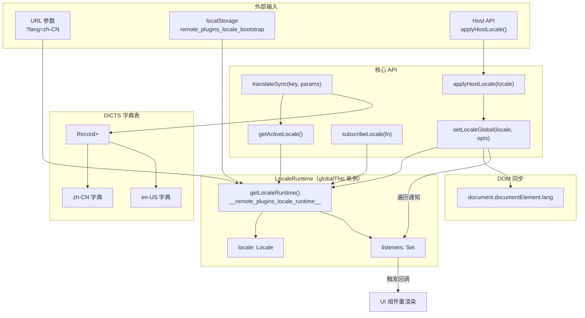
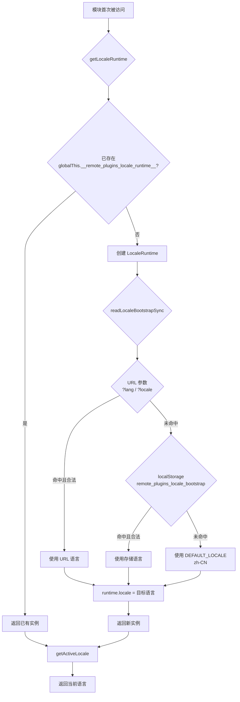
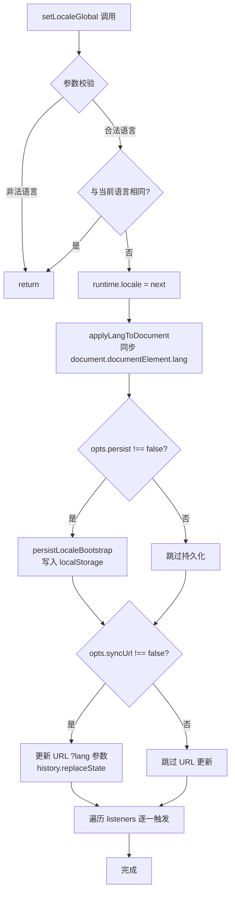
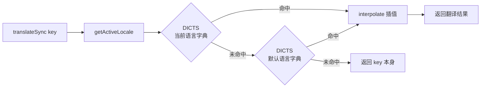

# 国际化（i18n）系统实现文档

## 1. 概述

本项目实现了一套**轻量、零依赖**的国际化系统，专为微前端（Micro-Frontends）场景设计。

### 核心特性

| 特性 | 说明 |
|------|------|
| 支持语言 | `zh-CN`（简体中文）、`en-US`（英语） |
| 与 Host 隔离 | 通过独立的 `localStorage` Key（`remote_plugins_locale_bootstrap`）避免与 Host 主应用在同页渲染时发生冲突 |
| 三种语言来源 | URL 参数 `?lang=zh-CN` → `localStorage` → `DEFAULT_LOCALE`（`zh-CN`），按优先级依次回退 |
| 发布-订阅模式 | `subscribeLocale` 允许任意模块监听语言变更并即时响应 |
| 参数插值 | 支持 `{key}` 模板语法，通过 `interpolate` 函数运行时替换 |
| 插件模式 | `applyHostLocale` 用于跟随 Host 主应用的语言，不写 URL / localStorage |
| DOM 同步 | 自动将 `document.documentElement.lang` 设为当前语言，便于 CSS `:lang()` 选择器和辅助技术识别 |

### 适用场景

- **独立预览模式**：作为独立应用运行时，通过 URL 参数或 localStorage 独立管理语言
- **插件嵌入模式**：被 Host 主应用以 Module Federation 方式加载时，通过 `applyHostLocale` 跟随 Host 的语言设置

---

## 2. 架构图



---

## 3. 完整源码

### 3.1 类型定义 — `src/i18n/types.ts`

```typescript
// 支持的语言类型字面量联合
export type Locale = 'zh-CN' | 'en-US';

// 默认语言：中文
export const DEFAULT_LOCALE: Locale = 'zh-CN';

// 支持的语言列表，用于遍历和校验
export const SUPPORTED_LOCALES: Locale[] = ['zh-CN', 'en-US'];

// 类型守卫：判断任意值是否为合法 Locale
export function isLocale(v: unknown): v is Locale {
	return v === 'zh-CN' || v === 'en-US';
}
```

### 3.2 核心实现 — `src/i18n/index.ts`

```typescript
import enUS from './locales/en-US';
import zhCN from './locales/zh-CN';
import {
	DEFAULT_LOCALE,
	isLocale,
	type Locale,
	SUPPORTED_LOCALES,
} from './types';

// 重新导出类型和常量，便于外部使用
export type { Locale };
export { DEFAULT_LOCALE, isLocale, SUPPORTED_LOCALES };

// 语言字典表：将 Locale 映射到对应的 key-value 翻译字典
export const DICTS: Record<Locale, Record<string, string>> = {
	'zh-CN': zhCN,
	'en-US': enUS,
};

/**
 * 与 Host 隔离的 localStorage Key
 * 避免 MF 同页时 Host 主应用写 dnhyxc_locale_bootstrap 造成冲突
 */
export const LOCALE_BOOTSTRAP_STORAGE_KEY = 'remote_plugins_locale_bootstrap';

// globalThis 上的运行时单例 Key
const LOCALE_RUNTIME_KEY = '__remote_plugins_locale_runtime__';

/**
 * 运行时单例结构
 * - locale: 当前激活的语言
 * - listeners: 语言变更监听器集合
 */
type LocaleRuntime = {
	locale: Locale;
	listeners: Set<() => void>;
};

/**
 * 获取 LocaleRuntime 单例
 * 首次调用时从 bootstrap 存储中读取初始语言，之后始终复用同一实例
 */
function getLocaleRuntime(): LocaleRuntime {
	const g = globalThis as typeof globalThis & {
		[LOCALE_RUNTIME_KEY]?: LocaleRuntime;
	};
	if (!g[LOCALE_RUNTIME_KEY]) {
		g[LOCALE_RUNTIME_KEY] = {
			// 三级优先级：URL 参数 → localStorage → DEFAULT_LOCALE
			locale: readLocaleBootstrapSync() ?? DEFAULT_LOCALE,
			listeners: new Set(),
		};
	}
	return g[LOCALE_RUNTIME_KEY];
}

/**
 * 同步读取 bootstrap 语言设置
 * 优先级：URL ?lang / ?locale > localStorage > null
 */
function readLocaleBootstrapSync(): Locale | null {
	if (typeof window === 'undefined') return null;
	try {
		// 1. 优先从 URL 参数读取
		const params = new URLSearchParams(window.location.search);
		const fromUrl = params.get('lang') || params.get('locale');
		if (isLocale(fromUrl)) return fromUrl;
		// 2. 回退到 localStorage
		const b = localStorage.getItem(LOCALE_BOOTSTRAP_STORAGE_KEY);
		return isLocale(b) ? b : null;
	} catch {
		return null;
	}
}

/**
 * 将当前语言持久化到 localStorage（独立 Key，与 Host 隔离）
 */
function persistLocaleBootstrap(locale: Locale) {
	try {
		localStorage.setItem(LOCALE_BOOTSTRAP_STORAGE_KEY, locale);
	} catch {
		/* 忽略：隐私模式/配额不足等异常 */
	}
}

/**
 * 同步 document.documentElement.lang
 * 便于 CSS :lang() 选择器和屏幕阅读器等辅助技术识别
 */
function applyLangToDocument(locale: Locale) {
	try {
		document.documentElement.lang = locale;
	} catch {
		/* 忽略 */
	}
}

/**
 * 字符串模板插值
 * 将 {key} 替换为 params 中对应的值
 * @example
 *   interpolate('你好 {name}，剩余 {count} 条', { name: '张三', count: 5 })
 *   // => '你好 张三，剩余 5 条'
 */
function interpolate(
	template: string,
	params?: Record<string, unknown>,
): string {
	if (!params) return template;
	return template.replace(/\{(\w+)\}/g, (full, k) => {
		const v = params[k];
		return v == null ? full : String(v);
	});
}

/**
 * 获取当前激活的语言
 * 若运行时语言不在支持列表中（如被意外篡改），回退到 DEFAULT_LOCALE
 */
export function getActiveLocale(): Locale {
	const runtime = getLocaleRuntime();
	if (SUPPORTED_LOCALES.includes(runtime.locale)) return runtime.locale;
	return DEFAULT_LOCALE;
}

/**
 * 翻译函数（同步版本）
 * 查找顺序：当前语言字典 → 默认语言字典 → 原始 key
 */
export function translateSync(
	key: string,
	params?: Record<string, unknown>,
): string {
	const locale = getActiveLocale();
	const dict = DICTS[locale] ?? DICTS[DEFAULT_LOCALE];
	// 三级回退：当前语言 → 默认语言 → 返回 key 本身
	const raw = dict[key] ?? DICTS[DEFAULT_LOCALE][key] ?? key;
	return interpolate(raw, params);
}

/**
 * 订阅语言变更
 * 返回取消订阅函数
 */
export function subscribeLocale(listener: () => void) {
	const { listeners } = getLocaleRuntime();
	listeners.add(listener);
	return () => {
		listeners.delete(listener);
	};
}

/**
 * 获取当前语言快照（不触发初始化以外的副作用）
 */
export function getLocaleSnapshot(): Locale {
	return getLocaleRuntime().locale;
}

/**
 * setLocaleGlobal 选项
 * - syncUrl: 是否同步写入 URL 参数（独立预览时开启，插件模式关闭）
 * - persist: 是否持久化到 localStorage（独立预览时开启，插件模式关闭）
 */
export type SetLocaleOptions = {
	/** 独立预览写 URL；插件跟随 Host 时关掉 */
	syncUrl?: boolean;
	/** 独立预览持久化；插件跟随 Host 时关掉 */
	persist?: boolean;
};

/**
 * 全局设置语言
 * @param next 目标语言
 * @param opts 行为选项
 *
 * 执行顺序：
 * 1. 校验合法性 → 2. 更新 runtime → 3. 同步 DOM → 4. 持久化 → 5. 更新 URL → 6. 通知监听者
 */
export function setLocaleGlobal(next: Locale, opts?: SetLocaleOptions): void {
	if (!SUPPORTED_LOCALES.includes(next)) return;
	const runtime = getLocaleRuntime();
	if (next === runtime.locale) return; // 无变化则跳过
	runtime.locale = next;
	applyLangToDocument(next);
	// 默认持久化，除非显式关闭
	if (opts?.persist !== false) persistLocaleBootstrap(next);
	// 默认同步 URL，除非显式关闭
	if (opts?.syncUrl !== false && typeof window !== 'undefined') {
		try {
			const u = new URL(window.location.href);
			u.searchParams.set('lang', next);
			window.history.replaceState(null, '', u.toString());
		} catch {
			/* 忽略 */
		}
	}
	// 通知所有监听者
	for (const l of runtime.listeners) l();
}

/**
 * 插件模式：跟随 Host 主应用的语言
 * 不写 URL、不写 localStorage，只更新 runtime + 通知监听者
 */
export function applyHostLocale(locale: Locale): void {
	setLocaleGlobal(locale, { syncUrl: false, persist: false });
}
```

### 3.3 语言字典（前 50 行示意） — `src/i18n/locales/zh-CN.ts`

```typescript
/** micro（原 remote-plugins）文案（中文） */
const zhCN: Record<string, string> = {
	'common.confirm': '确认',
	'common.cancel': '取消',
	'common.untitledNote': '无标题笔记',
	'common.emptyContent': '暂无内容',
	'common.requestFailed': '请求失败',
	'common.loading': '加载中…',
	'common.loadingMore': '加载更多…',
	'common.noMore': '没有更多了',
	'common.allLoaded': '已加载全部',
	'common.loadedCount': '已加载 {loaded} 条/共 {total} 条',
	'common.toggleLanguage': '切换语言',
	'common.connectingHost': '连接 Host…',

	'layout.brand': 'dnhyxc-ai-plugins',
	'layout.home': '首页',
	'layout.learningNotes': '学习笔记',
	'layout.ideasList': 'EPUB 想法列表',
	'layout.ebookHighlights': '全书划线',
	'layout.ebookTestBookInfo': '书信息测试',
	'layout.previewHint': '独立预览 · :9008',

	'home.title': '插件独立预览',
	'home.desc':
		'路径与主站业务路由对齐，便于本地看页面；嵌入 Host 仍走 MF loadRemote。',
	'home.learningNotes.title': '学习笔记',
	'home.learningNotes.desc': 'expose ./LearningNotes · registry learningNotes',
	// ... 更多 key 详见完整文件
};

export default zhCN;
```

---

## 4. 实现原理

### 4.1 globalThis 单例模式

```
┌─────────────────────────────────────────────┐
│              globalThis                      │
│  ┌─────────────────────────────────────┐    │
│  │ __remote_plugins_locale_runtime__   │    │
│  │  ┌─────────────────────────────┐   │    │
│  │  │ locale: 'zh-CN'            │   │    │
│  │  │ listeners: Set<Function>   │   │    │
│  │  └─────────────────────────────┘   │    │
│  └─────────────────────────────────────┘    │
└─────────────────────────────────────────────┘
```

- `LOCALE_RUNTIME_KEY = '__remote_plugins_locale_runtime__'` 挂载在 `globalThis` 上
- `getLocaleRuntime()` 首次调用时创建，后续调用始终返回同一引用
- 这确保了同一 JS 运行时内（即使跨模块）语言状态完全一致

### 4.2 与 Host 隔离的存储 Key

| 存储场景 | Key | 说明 |
|---------|-----|------|
| 本插件语言 bootstrap | `remote_plugins_locale_bootstrap` | 独立命名空间，避免与 Host 的 `dnhyxc_locale_bootstrap` 冲突 |
| 运行时状态 | `__remote_plugins_locale_runtime__` | 挂载在 globalThis 上，Host 无法触及 |

这意味着即使 Host 主应用和本插件在同一页面运行，两者的语言设置也互不干扰。

### 4.3 三级优先级读取

```
URL 参数 (?lang=zh-CN)
    ↓ 命中
立即使用该语言
    ↓ 未命中
localStorage (remote_plugins_locale_bootstrap)
    ↓ 命中
使用存储的语言
    ↓ 未命中
DEFAULT_LOCALE ('zh-CN')
```

### 4.4 发布-订阅模式

```typescript
// 订阅
const unsubscribe = subscribeLocale(() => {
    // 语言变更时触发，组件可在此重新渲染
    console.log('语言已切换为:', getActiveLocale());
});

// 取消订阅
unsubscribe();
```

- `listeners` 使用 `Set<() => void>`，确保同一监听器不会被重复调用
- `setLocaleGlobal` 在更新语言后遍历 `listeners` 逐一调用
- 典型用法是 React 组件在 `useEffect` 中订阅，在 cleanup 中取消

### 4.5 参数插值

`interpolate` 使用正则 `/\{(\w+)\}/g` 匹配模板中的所有 `{key}` 占位符：

```typescript
interpolate('已加载 {loaded} 条/共 {total} 条', { loaded: 42, total: 100 });
// => '已加载 42 条/共 100 条'

interpolate('当前书籍：{id}', { id: 'book-001' });
// => '当前书籍：book-001'
```

- 当 `params` 为 `undefined` 或 `null` 时直接返回原始模板
- 当某个 key 在 `params` 中找不到时，保留原始占位符（`{key}`）
- 使用 `String(v)` 自动处理数字、布尔值等类型转换

### 4.6 applyHostLocale 插件模式

当插件被 Host 主应用以 Module Federation 方式加载时：

```typescript
// Host 主应用中
applyHostLocale('en-US');
// 等价于 setLocaleGlobal('en-US', { syncUrl: false, persist: false })
```

此模式下：
- ✅ 更新 `runtime.locale`
- ✅ 同步 `document.documentElement.lang`
- ✅ 通知所有 `listeners`
- ❌ 不写入 `localStorage`（避免覆盖独立预览时的设置）
- ❌ 不修改 URL（避免污染 Host 的路由）

### 4.7 document.documentElement.lang 同步

每次 `setLocaleGlobal` 都会调用 `applyLangToDocument`：

```typescript
document.documentElement.lang = 'zh-CN';
```

这使得：
- CSS `:lang(zh-CN)` 选择器可以生效
- 屏幕阅读器等辅助技术能正确识别页面语言
- 浏览器的自动翻译功能可以正确匹配

---

## 5. 初始化流程图



## 6. 语言切换流程图



## 7. translateSync 查找链路



## 8. 典型使用示例

### React 组件中使用

```typescript
import { translateSync, subscribeLocale, getActiveLocale } from '@/i18n';
import { useEffect, useState } from 'react';

function MyComponent() {
    const [locale, setLocale] = useState(getActiveLocale());

    useEffect(() => {
        const unsub = subscribeLocale(() => setLocale(getActiveLocale()));
        return unsub;
    }, []);

    return (
        <div>
            <h1>{translateSync('home.title')}</h1>
            <p>{translateSync('common.loadedCount', { loaded: 42, total: 100 })}</p>
            <span>Current: {locale}</span>
        </div>
    );
}
```

### 独立预览模式切换语言

```typescript
import { setLocaleGlobal } from '@/i18n';

// 切换到英文（会写 URL + localStorage）
setLocaleGlobal('en-US');

// 切换到中文
setLocaleGlobal('zh-CN');
```

### 插件嵌入模式

```typescript
import { applyHostLocale } from '@/i18n';

// 从 Host 接收语言并同步
applyHostLocale('en-US');
```