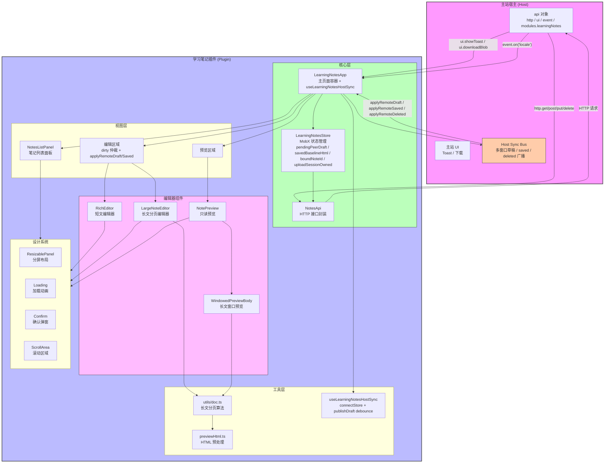
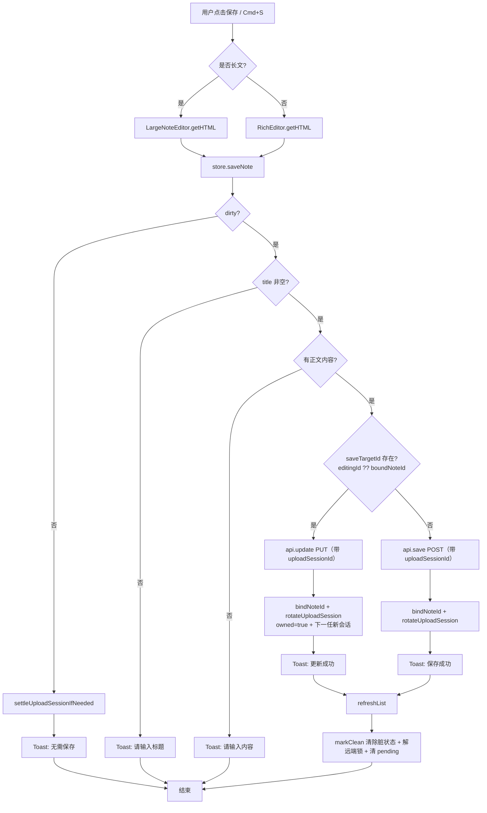
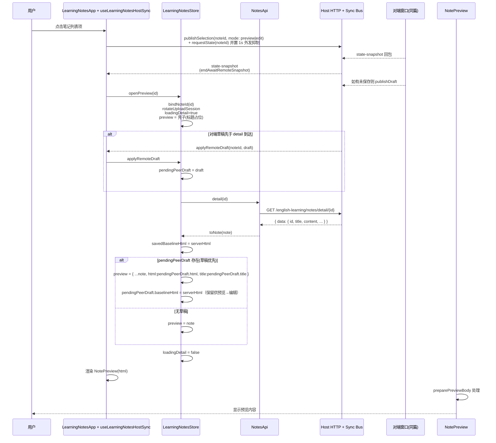
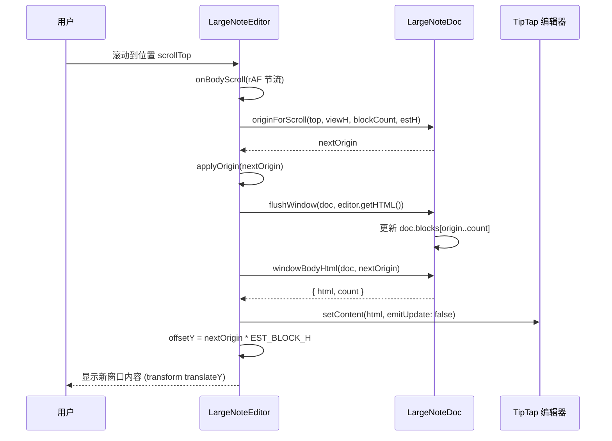

# 学习笔记 (Learning Notes) 实现文档

> 延伸阅读：
> - 图片上传与孤儿回收的会话级实现见 [笔记图片上传会话](./learning-notes/笔记图片上传会话.md)。
> - 切笔记/离页三层自动保存与 keepalive 兜底见 [笔记自动保存与离页保存](./learning-notes/笔记自动保存与离页保存.md)。
> - Host 多窗口同一笔记草稿同步、脏标记仲裁、上传会话 adopt/rotate 见 [跨窗草稿同步与脏标记仲裁](./learning-notes/跨窗草稿同步与脏标记仲裁.md)。

## 1. 概述

学习笔记是一个功能完整的笔记 CRUD 管理系统，作为微前端插件（Module Federation）嵌入主站运行。核心特性包括：

- **完整 CRUD**：笔记的创建、列表查看、编辑、预览、删除、导出
- **MobX 状态管理**：基于 `makeAutoObservable` 的响应式单例 Store
- **RichEditor 富文本编辑**：基于 TipTap 的二次封装，支持标题/格式/图片/链接/表格等
- **三种视图模式**：笔记列表、编辑视图、预览视图
- **长文分页保存**：`LargeNoteEditor` 实现滚动窗口式长文编辑，避免大数据量 DOM 渲染卡顿
- **图片上传会话**：编辑器粘贴 / 拖放 / 选图走 `uploadSessionId` 生命周期，保存时认领、切笔记 / 关页时回收，避免 COS 孤儿图（详见 [笔记图片上传会话](./learning-notes/笔记图片上传会话.md)）
- **Host 多窗口草稿同步**：主站可弹出多窗口（主窗 + Popout）同时编辑同一笔记；草稿通过 `api.modules.learningNotes` Host 通道 debounce 广播，脏标记经 TipTap 规范化 + 远端锁三段仲裁不闪灭；上传会话跨窗 `adopt/rotate`，`owned` 状态防止 B 窗离开误删 A 窗 pending；`pendingPeerDraft + savedBaselineHtml` 保护预览态对端草稿不被 detail 接口覆盖（详见 [跨窗草稿同步与脏标记仲裁](./learning-notes/跨窗草稿同步与脏标记仲裁.md)）
- **DOCX 导出**：服务端生成 Word 文档，通过 Host `downloadBlob` API 落盘
- **分屏布局**：`ResizablePanel` 可拖拽调整列表/编辑器宽度
- **HostBridge 通信**：通过 `api.http` / `api.ui` / `api.event` / `api.modules` 与主站宿主通信
- **国际化**：跟随 Host 语言环境，支持中文/英文

## 2. 架构设计

### 2.1 整体架构图 (Mermaid)



### 2.2 核心流程图 — 笔记保存流程



### 2.3 时序图 — 打开笔记预览



### 2.4 时序图 — 长文滚动窗口切换



## 3. 核心实现

### 3.1 主页面 `LearningNotesApp`

**文件路径**：`src/views/learning-notes/index.tsx`

```tsx
// ==================== 导入区域 ====================
import Loading from "@design/Loading";           // 全局加载动画组件
import { NotePreview } from "@design/NotePreview"; // 笔记只读预览组件
import {
	Btn,                                          // 工具栏按钮组件
	type Editor,                                   // TipTap Editor 类型
	getDocTitleText,                              // 从 TipTap 文档提取标题文本
	RichEditor,                                   // 富文本编辑器组件
	richEditorLocaleOf,                           // 根据语言获取编辑器 locale
} from "@design/RichEditor";
import {
	Eye,                                         // 眼睛图标（预览）
	FileDown,                                    // 文件下载图标（导出）
	FilePenLine,                                 // 新文件图标（新建）
	NotebookText,                                // 笔记本图标（列表开关）
	Save,                                        // 保存图标
	SquarePen,                                   // 方形笔图标（编辑）
	Trash2,                                      // 垃圾桶图标（删除）
} from "lucide-react";
import { observer } from "mobx-react";          // MobX observer HOC，实现响应式渲染
import { useCallback, useEffect, useMemo, useRef, useState } from "react";
import Confirm from "@/components/design/Confirm"; // 确认对话框组件
import {                                         // 可拖拽分屏布局组件
	ResizableHandle,
	ResizablePanel,
	ResizablePanelGroup,
} from "@/components/ui/resizable";
import { useHostLocale, useI18n } from "@/hooks"; // 国际化 hooks
import type { Locale } from "@/i18n";             // Locale 类型
import { cn } from "@/lib/utils";                   // className 合并工具
import useStore from "@/store";                   // 获取全局 Store 的 hook
import type { HostHttp } from "./api";            // Host HTTP 接口类型
import { LargeNoteEditor, type LargeNoteSaveApi } from "./components/Editor"; // 长文编辑器
import { NotesListPanel } from "./components/NotesListPanel"; // 笔记列表面板
import { WindowedPreviewBody } from "./components/PreviewBody"; // 长文窗口预览
import { isLargeNoteHtml } from "./utils";       // 判断是否为长文 HTML
import "@/styles.css";                           // 全局样式

// ==================== HostBridge 类型定义 ====================
// 定义插件与主站之间的通信接口
type HostBridgeProps = {
	api: {
		theme: "light" | "dark";                     // 主题：亮色/暗色
		locale?: Locale;                            // 语言设置
		event?: {                                    // 事件总线
			on: (event: string, handler: (data?: unknown) => void) => void;  // 监听事件
			off: (event: string, handler: (data?: unknown) => void) => void;  // 取消监听
			emit: (event: string, data?: unknown) => void;                   // 触发事件
		};
		http?: HostHttp;                             // HTTP 请求接口（由主站提供）
		ui?: {                                       // UI 交互接口
			showToast: (options: {                   // 显示 Toast 提示
				message: string;
				type?: "success" | "error" | "info";
			}) => void;
			downloadBlob?: (options: {               // 下载二进制文件
				fileName: string;
				data: ArrayBuffer | Uint8Array;
				mimeType?: string;
			}) => Promise<{
				ok: boolean;
				hostToasted: boolean;
				message?: string;
			}>;
		};
	};
	plugin: { id: string; version: string; routePath: string }; // 插件元信息
	independent?: boolean;                         // 是否独立运行（非插件模式）
};

// ==================== 主应用组件 ====================
function LearningNotesApp({ api }: HostBridgeProps) {
	// 从全局 Store 获取学习笔记 Store 实例
	const { learningNotesStore: store } = useStore();
	// 获取国际化翻译函数和当前语言
	const { t, locale } = useI18n();
	// 跟随 Host 的语言设置
	useHostLocale(api);

	// ==================== Refs 定义 ====================
	const editorRef = useRef<Editor | null>(null);           // 短文编辑器 TipTap 实例引用
	const pagedSaveRef = useRef<LargeNoteSaveApi | null>(null); // 长文编辑器保存 API 引用
	const savingRef = useRef(false);                          // 保存中状态（避免重复提交）
	const previewRef = useRef(store.preview);                 // 预览状态引用（供键盘事件判断）
	const baselineHtmlRef = useRef("");                       // 基线 HTML（脏状态检测）

	// ==================== 本地状态 ====================
	const [readyKey, setReadyKey] = useState<string | null>(null);  // 编辑器就绪 key
	const [mountEditor, setMountEditor] = useState(false);          // 是否挂载编辑器
	const [dirty, setDirty] = useState(false);                     // 内容是否已修改（脏状态）

	// ==================== 同步 Refs ====================
	// 每次渲染同步最新值到 ref，供事件回调中使用
	savingRef.current = store.saving;
	previewRef.current = store.preview;

	// ==================== Toast 工具函数 ====================
	const toast = useCallback(
		(message: string, type: "success" | "error" | "info" = "info") => {
			// 调用主站 UI 的 showToast 方法显示提示
			api.ui?.showToast({ message, type });
		},
		[api.ui],
	);

	// ==================== 获取当前编辑器 HTML ====================
	// 兼容长文和短文两种编辑器模式
	const currentHtml = useCallback(() => {
		// 优先从长文编辑器获取
		const paged = pagedSaveRef.current;
		if (paged) return paged.getHTML();
		// 否则从短文编辑器获取
		const editor = editorRef.current;
		if (!editor || editor.isDestroyed) return "";
		return editor.getHTML();
	}, []);

	// ==================== 脏状态管理 ====================
	// 将当前内容标记为干净（与基线一致）
	const markClean = useCallback(() => {
		baselineHtmlRef.current = currentHtml();  // 更新基线
		dirtyRef.current = false;                 // 同步 ref（新增）
		setDirty(false);
	}, [currentHtml]);

	// 同步脏状态（比较当前 HTML 与基线 HTML）
	// ⚠ 新增 dirtyRef + dirty→clean 时 settleUploadSessionIfNeeded：见
	//   docs/learning-notes/笔记图片上传会话.md §4.16
	const syncDirty = useCallback(() => {
		const html = currentHtml();
		const nextDirty = html !== baselineHtmlRef.current;
		const wasDirty = dirtyRef.current;
		dirtyRef.current = nextDirty;
		setDirty(nextDirty);
		// 仅在「有改动 → 回到基线」（如上传又删）时结算 pending
		if (wasDirty && !nextDirty) {
			void store.settleUploadSessionIfNeeded(html);
		}
	}, [currentHtml, store]);

	// ==================== 绑定 Store 依赖 ====================
	// 将主站 HTTP、Toast、翻译函数注入到 Store 中
	useEffect(() => {
		store.bind(api.http, toast, t, api.ui?.downloadBlob);
	}, [api.http, api.ui?.downloadBlob, store, toast, t]);

	// ==================== pagehide 兜底 discard（新增） ====================
	// 仅在编辑态 + 有 uploadSessionId 时绑 pagehide：刷新 / 关页时 keepalive DELETE。
	// 详见 docs/learning-notes/笔记图片上传会话.md §4.16
	useEffect(() => {
		if (store.preview) return;
		const sid = store.uploadSessionId;
		if (!sid) return;
		const onPageHide = () => store.flushUploadSessionOnPageHide(sid);
		window.addEventListener('pagehide', onPageHide);
		return () => window.removeEventListener('pagehide', onPageHide);
	}, [store.preview, store.uploadSessionId, store]);

	// ==================== 聚焦标题输入框 ====================
	// 保存失败时（如标题为空），自动滚动到顶部并聚焦标题
	const focusTitle = useCallback(() => {
		const editor = editorRef.current;
		if (!editor || editor.isDestroyed) return;
		// 获取编辑器根元素
		const root = editor.view.dom.closest(".rich-editor");
		if (!root) return;
		// 滚动到顶部
		const vp = root.querySelector(
			'[data-slot="scroll-area-viewport"]',
		) as HTMLElement | null;
		if (vp) vp.scrollTop = 0;
		// 聚焦标题输入框
		const input = root.querySelector(
			".rich-editor-note-title input",
		) as HTMLInputElement | null;
		input?.focus();
	}, []);

	// ==================== 保存笔记 ====================
	const onSave = useCallback(async () => {
		// 长文编辑器保存路径
		const paged = pagedSaveRef.current;
		if (paged) {
			const title = paged.getTitle();       // 获取标题
			const ok = await store.saveNote({
				title,
				text: paged.getText(),              // 获取纯文本
				html: paged.getHTML(),              // 获取完整 HTML
				dirty,
			});
			if (ok) markClean();                   // 保存成功 → 清除脏状态
			else if (dirty && !title.trim()) focusTitle(); // 标题为空 → 聚焦标题
			return;
		}
		// 短文编辑器保存路径
		const editor = editorRef.current;
		if (!editor || editor.isDestroyed) return;
		const title = getDocTitleText(editor.state.doc).trim(); // 从 TipTap 文档中提取标题
		const ok = await store.saveNote({
			title,
			text: editor.getText({ blockSeparator: "\n\n" }).trim(), // 获取纯文本
			html: editor.getHTML(),                                 // 获取完整 HTML
			dirty,
		});
		if (ok) markClean();
		else if (dirty && !title) focusTitle();
	}, [focusTitle, markClean, store, dirty, t]);

	// ==================== 全局快捷键：Cmd+S / Ctrl+S 保存 ====================
	useEffect(() => {
		const onKeyDown = (e: KeyboardEvent) => {
			// 非保存快捷键 → 忽略
			if (!(e.metaKey || e.ctrlKey) || e.key.toLowerCase() !== "s") return;
			// 预览模式下不处理保存
			if (previewRef.current) return;
			e.preventDefault();
			// 保存中 → 避免重复提交
			if (savingRef.current) return;
			void onSave();
		};
		window.addEventListener("keydown", onKeyDown);
		return () => window.removeEventListener("keydown", onKeyDown);
	}, [onSave]);

	// ==================== 工具栏：列表开关按钮 ====================
	const listToggleBtn = useCallback(
		() => (
			<Btn
				title={
					store.listOpen
						? t("learningNotes.closeList")  // "关闭列表"
						: t("learningNotes.openList")   // "打开列表"
				}
				onClick={() => store.toggleListOpen()}
			>
				<NotebookText size={15} />
			</Btn>
		),
		[store, store.listOpen, t],
	);

	// ==================== 编辑器工具栏扩展按钮 ====================
	const toolbarExtra = useMemo(
		() => (
			<>
				{/* 新建按钮 */}
				<Btn title={t("learningNotes.new")} onClick={() => store.openNew()}>
					<FilePenLine size={15} />
				</Btn>
				{/* 保存按钮（带脏状态指示点） */}
				<Btn
					title={
						store.saving
							? t("learningNotes.saving")          // "保存中..."
							: store.editingId
								? t("learningNotes.update")      // "更新"
								: t("learningNotes.save")        // "保存"
					}
					onClick={() => void onSave()}
					disabled={store.saving}
					className="relative"
				>
					<Save size={15} />
					{dirty ? (
						// 橙色圆点表示有未保存修改
						<span
							className="pointer-events-none absolute right-0 top-0 size-2 rounded-full bg-orange-500"
							aria-hidden
						/>
					) : null}
				</Btn>
				{/* 预览按钮（仅在编辑已有笔记时显示） */}
				{store.editingId ? (
					<Btn
						title={t("learningNotes.preview")}
						onClick={() => {
							const id = store.editingId;
							if (id) void store.openPreview(id);
						}}
					>
						<Eye size={15} />
					</Btn>
				) : null}
				{listToggleBtn()}
			</>
		),
		[dirty, listToggleBtn, onSave, store, store.editingId, store.saving, t],
	);

	// ==================== 预览页工具栏扩展按钮 ====================
	const previewOwned = store.preview?.isOwned !== false; // 当前用户是否为笔记所有者
	const previewHeaderExtra = useMemo(
		() => (
			<>
				{/* 新建按钮 */}
				<Btn title={t("learningNotes.new")} onClick={() => store.openNew()}>
					<FilePenLine size={15} />
				</Btn>
				{/* 仅所有者可看到：编辑、删除、导出按钮 */}
				{previewOwned ? (
					<>
						{/* 编辑按钮 */}
						<Btn
							title={t("learningNotes.edit")}
							disabled={store.loadingDetail}
							onClick={() => {
								if (store.preview) store.openEdit(store.preview);
							}}
						>
							<SquarePen size={15} />
						</Btn>
						{/* 删除按钮 */}
						<Btn
							title={t("learningNotes.delete")}
							onClick={() => {
								if (store.preview) store.requestDelete(store.preview.id);
							}}
						>
							<Trash2 size={15} />
						</Btn>
						{/* 导出 DOCX 按钮 */}
						<Btn
							title={
								store.exportingDocx
									? t("learningNotes.exportingDocx")
									: t("learningNotes.exportDocx")
							}
							disabled={store.exportingDocx || store.loadingDetail}
							onClick={() => void store.exportPreviewDocx()}
						>
							<FileDown size={15} />
						</Btn>
					</>
				) : null}
				{listToggleBtn()}
			</>
		),
		[
			listToggleBtn,
			previewOwned,
			store,
			store.exportingDocx,
			store.loadingDetail,
			store.preview,
			t,
		],
	);

	// ==================== 编辑器语言与就绪状态 ====================
	const editorLocale = useMemo(() => richEditorLocaleOf(locale), [locale]); // 根据当前语言获取编辑器 locale
	const editorKey = `${store.editorSeed}:${locale}`; // 编辑器 key：seed 变化 → 重建编辑器
	const editorReady = readyKey === editorKey; // 当前编辑器是否已就绪
	const useLarge = isLargeNoteHtml(store.editorInitial); // 判断是否使用长文编辑器

	// ==================== 编辑器挂载控制 ====================
	// 先显示 Loading，下一帧再挂载编辑器，避免长文解析时连遮罩都刷不出来
	useEffect(() => {
		if (store.preview) {
			setMountEditor(false); // 预览模式不挂载编辑器
			return;
		}
		setMountEditor(false);
		pagedSaveRef.current = null;
		// 使用 requestAnimationFrame 延迟一帧挂载
		const id = requestAnimationFrame(() => setMountEditor(true));
		return () => cancelAnimationFrame(id);
	}, [editorKey, store.preview]);

	// ==================== 渲染主界面 ====================
	return (
		<div
			className={cn(
				"bg-theme/5 text-textcolor flex h-full min-h-0 min-w-0 flex-col text-sm rounded-md",
			)}
		>
			{/* 删除确认对话框 */}
			<Confirm
				open={store.confirmOpen}
				onOpenChange={(open) => store.setConfirmOpen(open)}
				title={t("learningNotes.deleteConfirmTitle")}
				description={t("learningNotes.deleteConfirmDesc")}
				onConfirm={() => void store.confirmDelete()}
			/>
			{/* 公开/取消公开确认对话框 */}
			<Confirm
				open={store.visibilityConfirmOpen}
				onOpenChange={(open) => store.setVisibilityConfirmOpen(open)}
				title={
					store.pendingVisibility?.isPublic
						? t("learningNotes.publicConfirmTitle")
						: t("learningNotes.privateConfirmTitle")
				}
				description={
					store.pendingVisibility?.isPublic
						? t("learningNotes.publicConfirmDesc")
						: t("learningNotes.privateConfirmDesc")
				}
				onConfirm={() => void store.confirmVisibility()}
			/>
			{/* 可拖拽分屏布局容器 */}
			<ResizablePanelGroup
				id="learning-notes-split"
				orientation="horizontal"
				className="h-full min-h-0 min-w-0 flex-1"
			>
				{/* 左侧笔记列表面板（仅在 listOpen 时渲染） */}
				{store.listOpen ? (
					<>
						<ResizablePanel
							id="learning-notes-list"
							defaultSize={35}    // 默认占 35% 宽度
							minSize={0}
							className="min-h-0 min-w-0"
						>
							<NotesListPanel locale={locale} />
						</ResizablePanel>
						{/* 可拖拽分隔条 */}
						<ResizableHandle withHandle className="w-0 -translate-x-px" />
					</>
				) : null}
				{/* 右侧编辑/预览区域 */}
				<ResizablePanel
					id="learning-notes-editor"
					defaultSize={store.listOpen ? 65 : 100}  // 列表开时占 65%，否则占 100%
					minSize={0}
					className="min-h-0 min-w-0 overflow-hidden"
				>
					<div className="border-theme/10 relative flex h-full min-h-0 min-w-0 flex-col overflow-hidden">
						{/* 编辑模式 */}
						{!store.preview ? (
							<>
								{mountEditor ? (
									// 长文编辑器
									useLarge && typeof store.editorInitial === "string" ? (
										<LargeNoteEditor
											key={editorKey}
											defaultContent={store.editorInitial}
											placeholder={t("learningNotes.placeholder")}
											locale={editorLocale}
											onReady={(e, save) => {
												editorRef.current = e;          // 保存 TipTap 编辑器实例
												pagedSaveRef.current = save;    // 保存长文保存 API
												baselineHtmlRef.current = save.getHTML(); // 设置初始基线
												setDirty(false);
												setReadyKey(editorKey);
											}}
											onChange={syncDirty}
											className="flex h-full min-h-0 flex-1 flex-col overflow-hidden"
											editorClassName="min-h-[6rem]"
											toolbarExtra={toolbarExtra}
										/>
									) : (
										// 短文编辑器
										<RichEditor
											key={editorKey}
											defaultContent={store.editorInitial}
											autofocus="end"
											placeholder={t("learningNotes.placeholder")}
											locale={editorLocale}
											showCharCount={false}
											onCreate={(e) => {
												editorRef.current = e;          // 保存编辑器实例
												pagedSaveRef.current = null;    // 清除长文引用
												baselineHtmlRef.current = e.getHTML(); // 设置初始基线
												setDirty(false);
												setReadyKey(editorKey);
											}}
											onChange={syncDirty}
											className="flex h-full min-h-0 flex-1 flex-col overflow-hidden"
											editorClassName="min-h-[6rem]"
											toolbarExtra={toolbarExtra}
										/>
									)
								) : null}
								{/* 编辑器未就绪时显示 Loading 遮罩 */}
								{!editorReady ? (
									<div className="rounded-md absolute inset-0 z-10 flex items-center justify-center">
										<Loading />
									</div>
								) : null}
							</>
						) : (
							// 预览模式
							<div className="relative flex h-full min-h-0 flex-1 flex-col overflow-hidden contain-[layout_paint]">
								{/* 长文使用窗口化预览组件，短文直接渲染 */}
								{isLargeNoteHtml(store.preview.html) ? (
									<NotePreview
										title={store.preview.title}
										headerExtra={previewHeaderExtra}
										loading={store.loadingDetail}
									>
										<WindowedPreviewBody
											key={store.preview.id}
											html={store.preview.html}
										/>
									</NotePreview>
								) : (
									<NotePreview
										title={store.preview.title}
										html={store.preview.html}
										headerExtra={previewHeaderExtra}
										loading={store.loadingDetail}
									/>
								)}
								{/* 加载详情时显示 Loading 遮罩 */}
								{store.loadingDetail ? (
									<div className="w-full h-full absolute inset-0 z-10 flex items-center justify-center">
										<Loading />
									</div>
								) : null}
							</div>
						)}
					</div>
				</ResizablePanel>
			</ResizablePanelGroup>
		</div>
	);
}

// ==================== 插件生命周期方法 ====================
// 插件被激活时的回调
LearningNotesApp.activate = async (api: HostBridgeProps["api"]) => {
	console.log("[learning-notes] activate", api);
};

// 插件被停用时的回调
LearningNotesApp.deactivate = () => {
	console.log("[learning-notes] deactivate");
};

// 导出为 observer 包裹的组件，实现 MobX 响应式
export default observer(LearningNotesApp);
```

### 3.2 状态管理 Store

**文件路径**：`src/store/learningNotes.ts`

```typescript
// ==================== 导入区域 ====================
import { EMPTY_NOTE_DOC } from '@design/RichEditor';  // 空笔记文档 HTML
import { makeAutoObservable, runInAction } from 'mobx'; // MobX 响应式工具
import { translateSync } from '@/i18n';                 // 同步翻译函数
import {
	createNotesApi,                                    // 创建笔记 API 实例
	type HostHttp,                                     // Host HTTP 接口类型
	NOTES_PAGE_SIZE,                                   // 列表每页条数
	type Note,                                          // 笔记领域模型类型
	type NotesApi,                                      // 笔记 API 接口类型
} from '@/views/learning-notes/api';
import { hasNoteBodyContent } from '@/views/learning-notes/utils/doc'; // 检测正文内容

// ==================== 类型定义 ====================
type ToastFn = (message: string, type?: 'success' | 'error' | 'info') => void; // Toast 函数类型
type TFn = (key: string, params?: Record<string, unknown>) => string;          // 翻译函数类型

// Host 下载二进制文件函数类型
type HostDownloadBlob = (options: {
	fileName: string;
	data: ArrayBuffer | Uint8Array;
	mimeType?: string;
}) => Promise<{ ok: boolean; hostToasted: boolean; message?: string }>;

// DOCX MIME 类型常量
const DOCX_MIME =
	'application/vnd.openxmlformats-officedocument.wordprocessingml.document';

/** Host `http.*` 失败时 fetch 层已 Toast；仅本地 Error（如导出校验）再提示 */
function toastUnlessHostHttp(toast: ToastFn, e: unknown, t: TFn) {
	if (e instanceof Error)
		toast(e.message || t('common.requestFailed'), 'error');
}

/**
 * 学习笔记域 Store（对齐主站 MobX 单例模式）。
 * HTTP 由页面 bind(http, toast, t) 注入，列表分页与编辑态集中在此。
 */
class LearningNotesStore {
	// ==================== 私有依赖 ====================
	private api: NotesApi | null = null;          // 笔记 API 实例（通过 bind 注入）
	private toast: ToastFn = () => { };            // Toast 提示函数
	private t: TFn = translateSync;                // 翻译函数
	private downloadBlob: HostDownloadBlob | null = null; // 文件下载函数

	// ==================== 列表状态 ====================
	list: Note[] = [];                             // 笔记列表数据（分页累积）
	total = 0;                                     // 笔记总数
	pageNo = 1;                                    // 当前页码
	pageSize = NOTES_PAGE_SIZE;                    // 每页条数（默认 20）
	loading = false;                               // 首次加载中
	loadingMore = false;                           // 加载更多中
	refreshing = false;                            // 刷新中（已有数据时）

	// ==================== 视图状态 ====================
	listOpen = false;                              // 列表是否打开
	preview: Note | null = null;                   // 当前预览的笔记
	loadingDetail = false;                         // 加载笔记详情中
	editingId: string | null = null;               // 当前编辑的笔记 ID
	editorSeed = 0;                                // 编辑器种子值（变化时重建编辑器）
	editorInitial: string | typeof EMPTY_NOTE_DOC = EMPTY_NOTE_DOC; // 编辑器初始内容
	saving = false;                                // 保存中

	// ==================== 确认弹窗状态 ====================
	confirmOpen = false;                           // 删除确认弹窗打开
	pendingDeleteId: string | null = null;         // 待删除的笔记 ID
	visibilityConfirmOpen = false;                 // 公开/取消公开确认弹窗
	pendingVisibility: { id: string; isPublic: boolean } | null = null; // 待处理的可见性设置
	exportingDocx = false;                         // 导出 DOCX 中

	// ==================== 构造函数 ====================
	constructor() {
		// 使用 makeAutoObservable 自动将所有属性转为响应式
		// autoBind: true 自动绑定 this 上下文
		makeAutoObservable(this, {}, { autoBind: true });
	}

	// ==================== 绑定依赖 ====================
	bind(
		http: HostHttp | undefined,
		toast: ToastFn,
		t?: TFn,
		downloadBlob?: HostDownloadBlob,
	) {
		this.api = http ? createNotesApi(http) : null;  // 根据 http 创建 API 实例
		this.toast = toast;
		this.downloadBlob = downloadBlob ?? null;
		if (t) this.t = t;
	}

	// ==================== 计算属性 ====================
	// 是否还有更多数据可以加载
	get hasMore(): boolean {
		return this.list.length < this.total;
	}

	// 是否有激活的笔记（预览或编辑中）
	get hasActive(): boolean {
		return !!(this.preview?.id ?? this.editingId);
	}

	// ==================== 列表操作 ====================
	// 清空列表数据
	clearList() {
		this.list = [];
		this.total = 0;
		this.pageNo = 1;
		this.loading = false;
		this.loadingMore = false;
		this.refreshing = false;
	}

	// 设置列表开关
	setListOpen(open: boolean) {
		this.listOpen = open;
		if (open) {
			void this.refreshList();  // 打开时刷新列表
		} else {
			this.clearList();        // 关闭时清空列表
		}
	}

	// 切换列表开关
	toggleListOpen() {
		this.setListOpen(!this.listOpen);
	}

	// 设置删除确认弹窗
	setConfirmOpen(open: boolean) {
		this.confirmOpen = open;
		if (!open) this.pendingDeleteId = null;  // 关闭时清除待删 ID
	}

	// 设置可见性确认弹窗
	setVisibilityConfirmOpen(open: boolean) {
		this.visibilityConfirmOpen = open;
		if (!open) this.pendingVisibility = null;
	}

	// 设置详情加载状态
	setLoadingDetail(loading: boolean) {
		this.loadingDetail = loading;
	}

	// ==================== 分页加载 ====================
	async fetchPage(page: number, append: boolean): Promise<void> {
		if (!this.api) {
			this.toast(this.t('learningNotes.toast.httpDeniedSync'), 'error');
			return;
		}
		if (this.loading || this.refreshing) return;

		// 根据场景设置不同的 loading 状态
		if (append) {
			if (this.loadingMore || !this.hasMore) return;
			this.loadingMore = true;        // 加载更多
		} else if (this.list.length > 0) {
			this.refreshing = true;          // 刷新（已有数据）
		} else {
			this.loading = true;             // 首次加载
		}

		try {
			const data = await this.api.list(page, this.pageSize);
			runInAction(() => {
				// 关闭列表后丢弃迟到回包，避免清空后又被写回
				if (!this.listOpen) return;
				this.total = data.total;
				this.pageNo = page;
				if (append) {
					// 追加模式：去重合并
					const seen = new Set(this.list.map((n) => n.id));
					this.list = [
						...this.list,
						...data.list.filter((n) => !seen.has(n.id)),
					];
				} else {
					// 替换模式：直接覆盖
					this.list = data.list;
				}
			});
		} catch {
			// Host http 已 Toast
		} finally {
			runInAction(() => {
				this.loading = false;
				this.loadingMore = false;
				this.refreshing = false;
			});
		}
	}

	// 刷新列表（从第 1 页重新加载）
	async refreshList(): Promise<void> {
		if (!this.listOpen) return;
		await this.fetchPage(1, false);
	}

	// 加载更多（下一页）
	async loadMore(): Promise<void> {
		if (!this.hasMore || this.loading || this.refreshing || this.loadingMore)
			return;
		await this.fetchPage(this.pageNo + 1, true);
	}

	// ==================== 笔记操作 ====================
	// 新建笔记（清空预览和编辑状态，重置编辑器）
	openNew() {
		this.preview = null;
		this.editingId = null;
		this.editorInitial = EMPTY_NOTE_DOC;
		this.editorSeed += 1;  // seed 递增 → 编辑器重建
	}

	// 打开笔记预览
	async openPreview(id: string): Promise<void> {
		if (!this.api) return;
		// 从列表中查找已有数据
		const listHit = this.list.find((n) => n.id === id);
		// 立刻进入预览壳：卸掉编辑器，避免双实例并存
		runInAction(() => {
			this.loadingDetail = true;
			this.preview = {
				id,
				title: listHit?.title ?? this.preview?.title ?? '',
				html: this.preview?.id === id ? this.preview.html : '',
				at: listHit?.at ?? this.preview?.at ?? Date.now(),
				author:
					listHit?.author ??
					(this.preview?.id === id ? this.preview.author : ''),
				isPublic:
					listHit?.isPublic ??
					(this.preview?.id === id ? this.preview.isPublic : false),
				isOwned:
					listHit?.isOwned ??
					(this.preview?.id === id ? this.preview.isOwned : true),
			};
		});
		try {
			const note = await this.api.detail(id);
			runInAction(() => {
				// 慢网下用户可能已点开另一篇
				if (this.preview?.id === id) this.preview = note;
			});
		} catch {
			// Host http 已 Toast
			runInAction(() => {
				if (this.preview?.id === id && !this.preview.html) {
					this.preview = null;  // 加载失败且无内容 → 关闭预览
				}
			});
		} finally {
			runInAction(() => {
				this.loadingDetail = false;
			});
		}
	}

	// 从预览态进入编辑态
	openEdit(note: Note) {
		this.preview = null;                  // 退出预览
		this.editingId = note.id;             // 设置编辑 ID
		this.editorInitial = note.html || EMPTY_NOTE_DOC; // 设置编辑器初始内容
		this.editorSeed += 1;                 // 重建编辑器
	}

	// 根据 ID 直接进入编辑（先拉取详情）
	async openEditById(id: string): Promise<void> {
		if (!this.api) return;
		try {
			const note = await this.api.detail(id);
			runInAction(() => {
				this.openEdit(note);
			});
		} catch {
			// Host http 已 Toast
		}
	}

	// ==================== 保存笔记 ====================
	async saveNote(input: {
		title: string;
		html: string;
		text: string;
		dirty: boolean;
	}): Promise<boolean> {
		// 未修改 → 不保存
		if (!input.dirty) {
			this.toast(this.t('learningNotes.toast.noSave'), 'info');
			return false;
		}
		// 标题为空 → 不保存
		if (!input.title.trim()) {
			this.toast(this.t('learningNotes.toast.needTitle'), 'info');
			return false;
		}
		// 正文为空（纯文字空且无图片等媒体）→ 不保存
		if (!hasNoteBodyContent(input.html, input.text)) {
			this.toast(this.t('learningNotes.toast.needContent'), 'info');
			return false;
		}
		if (!this.api) {
			this.toast(this.t('learningNotes.toast.httpDeniedSave'), 'error');
			return false;
		}

		this.saving = true;
		try {
			const payload = {
				title: input.title.trim() || this.t('common.untitledNote'),
				html: input.html,
			};
			if (this.editingId) {
				// 更新已有笔记
				const updated = await this.api.update(this.editingId, payload);
				runInAction(() => {
					this.editingId = updated.id;
				});
				this.toast(this.t('learningNotes.toast.updated'), 'success');
			} else {
				// 创建新笔记
				const { id } = await this.api.save(payload);
				runInAction(() => {
					this.editingId = id;
				});
				this.toast(this.t('learningNotes.toast.saved'), 'success');
			}
			await this.refreshList();  // 刷新列表
			return true;
		} catch {
			// Host http 已 Toast
			return false;
		} finally {
			runInAction(() => {
				this.saving = false;
			});
		}
	}

	// ==================== 删除操作 ====================
	requestDelete(id: string) {
		this.pendingDeleteId = id;
		this.confirmOpen = true;
	}

	// ==================== 可见性操作 ====================
	requestVisibility(id: string, isPublic: boolean) {
		this.pendingVisibility = { id, isPublic };
		this.visibilityConfirmOpen = true;
	}

	// 确认修改可见性
	async confirmVisibility(): Promise<void> {
		const pending = this.pendingVisibility;
		if (!this.api || !pending) return;
		try {
			const updated = await this.api.setVisibility(
				pending.id,
				pending.isPublic,
			);
			runInAction(() => {
				// 更新列表中对应笔记的可见性
				this.list = this.list.map((n) =>
					n.id === updated.id
						? { ...n, isPublic: updated.isPublic, isOwned: true }
						: n,
				);
				// 如果正在预览该笔记，同步更新
				if (this.preview?.id === updated.id) {
					this.preview = {
						...this.preview,
						isPublic: updated.isPublic,
						isOwned: true,
					};
				}
				this.pendingVisibility = null;
				this.visibilityConfirmOpen = false;
			});
			this.toast(
				this.t(
					pending.isPublic
						? 'learningNotes.toast.madePublic'
						: 'learningNotes.toast.madePrivate',
				),
				'success',
			);
		} catch {
			// Host http 已 Toast
			runInAction(() => {
				this.pendingVisibility = null;
				this.visibilityConfirmOpen = false;
			});
		}
	}

	// ==================== DOCX 导出 ====================
	async exportPreviewDocx(): Promise<void> {
		const note = this.preview;
		if (!note?.id) {
			this.toast(this.t('learningNotes.toast.exportEmpty'), 'info');
			return;
		}
		if (!this.api) {
			this.toast(this.t('learningNotes.toast.httpDeniedExport'), 'error');
			return;
		}
		if (!this.downloadBlob) {
			this.toast(this.t('learningNotes.toast.exportNoDownload'), 'error');
			return;
		}
		if (this.exportingDocx) return;
		this.exportingDocx = true;
		try {
			// 从服务端获取 DOCX 二进制
			const buf = await this.api.exportDocx(note.id);
			// 清理文件名（去除非法字符）
			const safe =
				note.title
					.replace(/[\\/:*?"<>|]+/g, '_')
					.trim()
					.slice(0, 60) || 'learning-note';
			// 调用 Host 下载 API 保存文件
			const result = await this.downloadBlob({
				fileName: `${safe}-${Date.now()}.docx`,
				data: buf,
				mimeType: DOCX_MIME,
			});
			if (!result.ok) {
				if (!result.hostToasted) {
					this.toast(
						result.message || this.t('learningNotes.toast.exportFail'),
						'error',
					);
				}
				return;
			}
			if (!result.hostToasted) {
				this.toast(this.t('learningNotes.toast.exportOk'), 'success');
			}
		} catch (e) {
			toastUnlessHostHttp(this.toast, e, this.t);
		} finally {
			runInAction(() => {
				this.exportingDocx = false;
			});
		}
	}

	// ==================== 确认删除 ====================
	async confirmDelete(): Promise<void> {
		const id = this.pendingDeleteId;
		if (!this.api || !id) return;
		try {
			await this.api.remove(id);
			runInAction(() => {
				if (this.preview?.id === id) this.preview = null;
				if (this.editingId === id) {
					this.editingId = null;
					this.editorInitial = EMPTY_NOTE_DOC;
					this.editorSeed += 1;
				}
				this.pendingDeleteId = null;
			});
			this.toast(this.t('learningNotes.toast.deleted'), 'success');
			await this.refreshList();
		} catch {
			// Host http 已 Toast
			runInAction(() => {
				this.pendingDeleteId = null;
			});
		}
	}
}

// 导出单例 Store 实例
export default new LearningNotesStore();
```

### 3.3 API 接口层

**文件路径**：`src/views/learning-notes/api.ts`

```typescript
/** 学习笔记：经 HostBridge 调用主站 `/english-learning/notes/*` */

import { translateSync } from '@/i18n';  // 同步翻译函数

// ==================== Host HTTP 接口定义 ====================
// 由主站宿主实现，插件通过此接口发起 HTTP 请求
export type HostHttp = {
	get: <T = unknown>(url: string) => Promise<T>;     // GET 请求
	post: <T = unknown>(url: string, body?: unknown) => Promise<T>;  // POST 请求
	put: <T = unknown>(url: string, body?: unknown) => Promise<T>;  // PUT 请求
	delete: <T = unknown>(url: string) => Promise<T>;  // DELETE 请求
};

// API 基础路径
const BASE = '/english-learning/notes';

/** 列表默认每页条数 */
export const NOTES_PAGE_SIZE = 20;

// ==================== 数据模型类型定义 ====================

// 数据库原始记录类型
export type NoteRecord = {
	id: string;
	title: string | null;
	content: string;        // HTML 内容
	userId?: number;
	author?: string;        // 作者用户名
	isPublic?: boolean;     // 是否公开
	isOwned?: boolean;      // 当前用户是否为作者
	createdAt?: string;
	updatedAt?: string;
};

// 列表项类型（不含 content 字段，减少列表数据量）
export type NoteListItem = Omit<NoteRecord, 'content'>;

// 前端领域模型（Store 内部使用）
export type Note = {
	id: string;
	title: string;
	html: string;
	at: number;             // 更新时间戳（毫秒）
	author: string;
	isPublic: boolean;
	isOwned: boolean;
};

// 列表分页返回
export type NoteListPage = {
	list: Note[];
	total: number;
	pageNo: number;
	pageSize: number;
};

// ==================== 工具函数 ====================

/** 解包后端响应数据（支持 { data: T } 包装或直接返回 T） */
function unwrapData<T>(res: unknown): T {
	if (res && typeof res === 'object' && 'data' in res) {
		return (res as { data: T }).data;
	}
	return res as T;
}

/** 将后端记录转换为前端领域模型 */
function toNote(row: NoteListItem | NoteRecord): Note {
	// 提取 HTML 内容（列表项可能没有 content 字段）
	const html =
		'content' in row && typeof row.content === 'string' ? row.content : '';
	// 解析时间戳
	const atRaw = row.updatedAt ?? row.createdAt;
	const at = atRaw ? new Date(atRaw).getTime() : Date.now();
	return {
		id: row.id,
		title: (row.title ?? '').trim() || translateSync('common.untitledNote'),
		html,
		at: Number.isFinite(at) ? at : Date.now(),
		author: (row.author ?? '').trim() || String(row.userId ?? ''),
		isPublic: Boolean(row.isPublic),
		isOwned: row.isOwned !== false,  // 缺省按本人
	};
}

// ==================== API 工厂函数 ====================
// 根据 HostHttp 创建笔记 API 实例
export function createNotesApi(http: HostHttp) {
	return {
		// 获取笔记列表（分页）
		async list(pageNo = 1, pageSize = NOTES_PAGE_SIZE): Promise<NoteListPage> {
			const res = await http.get(
				`${BASE}/list?pageNo=${pageNo}&pageSize=${pageSize}`,
			);
			const page = unwrapData<{ list: NoteListItem[]; total: number }>(res);
			const rows = Array.isArray(page?.list) ? page.list : [];
			return {
				list: rows.map(toNote),
				total: typeof page?.total === 'number' ? page.total : rows.length,
				pageNo,
				pageSize,
			};
		},

		// 获取单篇笔记详情
		async detail(id: string): Promise<Note> {
			const res = await http.get(`${BASE}/detail/${id}`);
			return toNote(unwrapData<NoteRecord>(res));
		},

		// 导出笔记为 DOCX（服务端生成）
		async exportDocx(id: string): Promise<ArrayBuffer> {
			const res = await http.get(`${BASE}/export-docx/${id}`);
			const data = unwrapData<unknown>(res);
			if (data instanceof ArrayBuffer) return data;
			if (ArrayBuffer.isView(data)) {
				// TypedArray → ArrayBuffer
				const v = data as ArrayBufferView;
				return v.buffer.slice(
					v.byteOffset,
					v.byteOffset + v.byteLength,
				) as ArrayBuffer;
			}
			throw new Error(translateSync('learningNotes.toast.exportInvalid'));
		},

		// 创建新笔记
		async save(input: {
			title: string;
			html: string;
		}): Promise<{ id: string }> {
			const res = await http.post(`${BASE}/save`, {
				title: input.title.trim() || null,
				content: input.html,
			});
			return unwrapData<{ id: string }>(res);
		},

		// 更新已有笔记
		async update(
			id: string,
			input: { title: string; html: string },
		): Promise<Note> {
			const res = await http.put(`${BASE}/update/${id}`, {
				id,
				title: input.title.trim() || null,
				content: input.html,
			});
			return toNote(unwrapData<NoteRecord>(res));
		},

		// 删除笔记
		async remove(id: string): Promise<void> {
			await http.delete(`${BASE}/delete/${id}`);
		},

		// 设置笔记可见性（公开/私密）
		async setVisibility(id: string, isPublic: boolean): Promise<Note> {
			const res = await http.put(`${BASE}/visibility/${id}`, { isPublic });
			return toNote(unwrapData<NoteListItem>(res));
		},
	};
}

// NotesApi 类型（从工厂函数推导）
export type NotesApi = ReturnType<typeof createNotesApi>;
```

### 3.4 Store 根容器

**文件路径**：`src/store/index.ts`

```typescript
// ==================== 导入 ====================
import { createContext, useContext } from 'react';  // React Context
import LearningNotesStore from './learningNotes';    // 学习笔记 Store

// ==================== 根 Store ====================
// 集中管理所有业务域的 Store 实例
class RootStore {
	learningNotesStore = LearningNotesStore;  // 学习笔记 Store 单例
}

// ==================== 创建 Store 实例与 Context ====================
const store = new RootStore();       // 全局唯一的 Store 实例
const Context = createContext(store); // React Context，供组件跨层级访问

// ==================== 自定义 Hook ====================
// 在任意组件中调用 useStore() 即可获取根 Store
export default function useStore() {
	return useContext(Context);
}

// 重新导出 LearningNotesStore 类型，供外部使用
export { LearningNotesStore };
```

### 3.5 长文编辑器 `LargeNoteEditor`

**文件路径**：`src/views/learning-notes/components/Editor.tsx`

```tsx
// ==================== 导入 ====================
import {
	type Editor,        // TipTap Editor 类型
	NoteTitleField,     // 笔记标题输入字段组件
	RichEditor,         // 富文本编辑器组件
	type RichEditorLocale, // 编辑器语言类型
	type RichEditorProps,  // 编辑器 props 类型
} from '@design/RichEditor';
import {
	type ReactNode,
	type UIEvent,
	useCallback,
	useLayoutEffect,
	useRef,
	useState,
} from 'react';
import { cn } from '@/lib/utils';
import {
	createLargeNoteDoc,    // 创建长文文档对象
	EST_BLOCK_H,           // 块高估算值
	flushWindow,           // 写回当前窗口变更
	type LargeNoteDoc,     // 长文文档类型
	ORIGIN_HYSTERESIS,     // origin 变化滞后阈值
	originForScroll,       // 根据滚动位置计算窗口 origin
	stitchFullHtml,        // 拼接完整 HTML
	stitchFullText,        // 拼接完整纯文本
	WINDOW_SIZE,           // 窗口大小
	windowBodyHtml,        // 获取窗口内 HTML
} from '../utils';

// ==================== 类型定义 ====================

// 长文保存 API 接口
export type LargeNoteSaveApi = {
	getHTML: () => string;   // 获取完整 HTML
	getText: () => string;   // 获取完整纯文本
	getTitle: () => string;  // 获取标题
};

// 组件 Props
type Props = {
	defaultContent: string;                                    // 初始 HTML 内容
	locale: Partial<RichEditorLocale>;                        // 编辑器语言
	placeholder?: string;                                      // 占位符
	toolbarExtra?: RichEditorProps['toolbarExtra'];           // 工具栏扩展
	className?: string;                                        // 容器 className
	editorClassName?: string;                                  // 编辑器 className
	onReady: (editor: Editor, save: LargeNoteSaveApi) => void; // 就绪回调
	onChange?: () => void;                                     // 变更回调
};

// ==================== 启动函数 ====================
// 初始化长文文档，定位到最后一个窗口（模拟「光标在文末」行为）
function bootLargeNote(defaultContent: string) {
	const created = createLargeNoteDoc(defaultContent);
	const maxOrigin = Math.max(0, created.doc.blocks.length - WINDOW_SIZE);
	if (maxOrigin > 0) {
		// 如果内容超过一窗，直接定位到最后一窗
		const { html, count } = windowBodyHtml(created.doc, maxOrigin);
		created.doc.origin = maxOrigin;
		created.doc.count = count;
		created.editorHtml = html;
	}
	return created;
}

// 滚动编辑器视口到文末
function scrollViewportToEnd(editor: Editor) {
	const vp = editor.view.dom.closest(
		'[data-slot="scroll-area-viewport"]',
	) as HTMLElement | null;
	if (vp) vp.scrollTop = vp.scrollHeight;
	if (!editor.isDestroyed) editor.commands.focus('end');
}

/**
 * 长笔记连续滚动编辑器。
 * 核心思想：将超长 HTML 按顶层标签切分成 blocks，
 * 只渲染 WINDOW_SIZE 个块到 TipTap 中，通过 transform translateY 模拟完整滚动。
 */
export function LargeNoteEditor({
	defaultContent,
	locale,
	placeholder,
	toolbarExtra,
	className,
	editorClassName,
	onReady,
	onChange,
}: Props) {
	// ==================== Refs ====================
	const boot = useRef(bootLargeNote(defaultContent)); // 启动快照
	const docRef = useRef<LargeNoteDoc>(boot.current.doc); // 长文文档对象
	const editorRef = useRef<Editor | null>(null);       // TipTap 编辑器实例
	const titleWrapRef = useRef<HTMLDivElement | null>(null); // 标题容器引用
	const titleHRef = useRef(0);                          // 标题高度
	const [title, setTitle] = useState(boot.current.title); // 标题文本
	const titleRef = useRef(title);                       // 标题 ref（供 saveApi 使用）
	titleRef.current = title;
	const originRef = useRef(boot.current.doc.origin);     // 当前窗口起点
	const shiftingRef = useRef(false);                     // 窗口切换进行中
	const scrollRafRef = useRef(0);                        // 滚动 rAF ID
	const onReadyRef = useRef(onReady);
	onReadyRef.current = onReady;
	const onChangeRef = useRef(onChange);
	onChangeRef.current = onChange;

	// ==================== 状态 ====================
	const [blockCount, setBlockCount] = useState(boot.current.doc.blocks.length);
	const [offsetY, setOffsetY] = useState(boot.current.doc.origin * EST_BLOCK_H);
	// 块数不足一窗时不使用窗口化（避免大图笔记文末巨空白）
	const windowed = blockCount > WINDOW_SIZE;
	const bodyH = Math.max(blockCount, 1) * EST_BLOCK_H; // 计算完整文档高度

	// ==================== 监听标题高度变化 ====================
	useLayoutEffect(() => {
		const el = titleWrapRef.current;
		if (!el) return;
		const sync = () => {
			titleHRef.current = el.offsetHeight;
		};
		sync();
		const ro = new ResizeObserver(sync);
		ro.observe(el);
		return () => ro.disconnect();
	}, []);

	// ==================== 保存 API ====================
	// 提供完整文档的 html/text/title 获取能力
	const saveApi = useCallback((): LargeNoteSaveApi => {
		return {
			getHTML: () => {
				const e = editorRef.current;
				const html = e && !e.isDestroyed ? e.getHTML() : '';
				return stitchFullHtml(docRef.current, titleRef.current, html);
			},
			getText: () => {
				const e = editorRef.current;
				const html = e && !e.isDestroyed ? e.getHTML() : '';
				return stitchFullText(docRef.current, titleRef.current, html);
			},
			getTitle: () => titleRef.current.trim(),
		};
	}, []);

	// ==================== 聚焦正文 ====================
	const focusBody = useCallback(() => {
		editorRef.current?.commands.focus('start');
	}, []);

	// ==================== 标题变更处理 ====================
	const onTitleChange = useCallback((next: string) => {
		titleRef.current = next;
		setTitle(next);
		onChangeRef.current?.();  // 触发脏状态检测
	}, []);

	// ==================== 窗口切换核心逻辑 ====================
	const applyOrigin = useCallback((editor: Editor, nextOrigin: number) => {
		const doc = docRef.current;
		if (shiftingRef.current) return;  // 正在切换 → 忽略
		if (nextOrigin === originRef.current) return; // 起点未变 → 忽略

		const maxOrigin = Math.max(0, doc.blocks.length - WINDOW_SIZE);
		// 检测是否为边界跳转（跳至首/末）
		const snapEdge =
			(nextOrigin === 0 && originRef.current !== 0) ||
			(nextOrigin === maxOrigin && originRef.current !== maxOrigin);
		// 未到边界且变化小于滞后阈值 → 忽略（减少抖动）
		if (
			!snapEdge &&
			Math.abs(nextOrigin - originRef.current) < ORIGIN_HYSTERESIS
		) {
			return;
		}

		shiftingRef.current = true;
		try {
			// 1. 将当前编辑器内容写回 doc
			flushWindow(doc, editor.getHTML());
			// 2. 从 doc 中提取新窗口内容
			const { html, count } = windowBodyHtml(doc, nextOrigin);
			// 3. 更新编辑器内容（不触发 onChange）
			const ok = editor.commands.setContent(html, { emitUpdate: false });
			if (ok === false) return;
			// 4. 更新 doc 状态
			doc.origin = nextOrigin;
			doc.count = count;
			originRef.current = nextOrigin;
			setOffsetY(nextOrigin * EST_BLOCK_H);
			setBlockCount(doc.blocks.length);
		} finally {
			requestAnimationFrame(() => {
				shiftingRef.current = false;
			});
		}
	}, []);

	// ==================== 滚动事件处理 ====================
	const onBodyScroll = useCallback(
		(e: UIEvent<HTMLDivElement>) => {
			const editor = editorRef.current;
			if (!editor || editor.isDestroyed || shiftingRef.current) return;
			const vp = e.currentTarget;
			const titleH =
				titleHRef.current || titleWrapRef.current?.offsetHeight || 0;
			const top = Math.max(0, vp.scrollTop - titleH);
			const viewH = vp.clientHeight || 600;
			if (scrollRafRef.current) return;  // 已有 rAF 在排队
			scrollRafRef.current = requestAnimationFrame(() => {
				scrollRafRef.current = 0;
				if (shiftingRef.current) return;
				// 根据滚动位置计算应该显示的窗口起点
				const next = originForScroll(
					top,
					viewH,
					docRef.current.blocks.length,
					EST_BLOCK_H,
				);
				applyOrigin(editor, next);
			});
		},
		[applyOrigin],
	);

	// ==================== 渲染正文（带窗口化偏移） ====================
	const renderBody = useCallback(
		(editorContent: ReactNode) => (
			<div className="relative w-full">
				{/* 标题区域：自然文档流，紧贴正文 */}
				<div ref={titleWrapRef} className="relative z-1">
					<NoteTitleField
						value={title}
						onChange={onTitleChange}
						onContinue={focusBody}
					/>
				</div>
				{/* 窗口化正文区域 */}
				{windowed ? (
					// 长文模式：用绝对定位 + transform 模拟完整滚动
					<div className="relative w-full" style={{ height: bodyH }}>
						<div
							className="absolute top-0 right-0 left-0"
							style={{ transform: `translateY(${offsetY}px)` }}
						>
							{editorContent}
						</div>
					</div>
				) : (
					// 短文模式：正常文档流
					<div className="relative w-full">{editorContent}</div>
				)}
			</div>
		),
		[bodyH, focusBody, offsetY, onTitleChange, title, windowed],
	);

	// ==================== 渲染组件 ====================
	return (
		<div className={cn('flex h-full min-h-0 min-w-0 flex-col', className)}>
			<RichEditor
				defaultContent={boot.current.editorHtml}  // 初始只渲染第一窗
				showTitle={false}                          // 不使用内置标题（自定义 NoteTitleField）
				autofocus={false}
				placeholder={placeholder}
				locale={locale}
				showCharCount={false}
				showBubbleMenu={false}
				onBodyScroll={onBodyScroll}                // 接管滚动事件
				renderBody={renderBody}                    // 自定义正文渲染
				onChange={() => onChangeRef.current?.()}
				onCreate={(e) => {
					editorRef.current = e;
					docRef.current.origin = originRef.current;
					onReadyRef.current(e, saveApi());
					// 布局完成后滚到底部并聚焦文末
					requestAnimationFrame(() => {
						scrollViewportToEnd(e);
						requestAnimationFrame(() => scrollViewportToEnd(e));
					});
				}}
				className="flex min-h-0 flex-1 flex-col overflow-hidden"
				editorClassName={editorClassName}
				toolbarExtra={toolbarExtra}
			/>
		</div>
	);
}
```

### 3.6 笔记列表面板 `NotesListPanel`

**文件路径**：`src/views/learning-notes/components/NotesListPanel.tsx`

```tsx
import Loading from '@design/Loading';           // 加载组件
import { Btn } from '@design/RichEditor';         // 按钮组件
import {
	ChevronDown,    // 向下箭头（滚动到底部）
	ChevronUp,      // 向上箭头（滚动到顶部）
	Globe,          // 地球图标（公开/私密切换）
	ListRestart,    // 刷新图标
	LocateFixed,    // 定位图标（滚动到当前项）
	SquarePen,      // 编辑图标
	Trash2,         // 删除图标
} from 'lucide-react';
import { observer } from 'mobx-react';            // MobX 响应式
import { useCallback, useEffect, useRef, useState } from 'react';
import { ScrollArea } from '@/components/ui/scroll-area'; // 滚动区域
import { useI18n } from '@/hooks';                // 国际化
import { cn } from '@/lib/utils';                   // className 合并
import useStore from '@/store';                    // 全局 Store

const SCROLL_EDGE_PX = 16;  // 滚动边缘判定阈值（像素）

// 滚动模式类型：底部 → 顶部 → 当前项 → 底部 循环
type NoteScrollMode = 'bottom' | 'top' | 'current';

/**
 * 笔记列表独立 observer：滚动 / loadMore / scrollEdge 只重渲左侧，
 * 避免牵动右侧 TipTap/大 HTML 预览（长文时滚动卡顿主因）。
 */
export const NotesListPanel = observer(function NotesListPanel({
	locale,
}: {
	locale: string;
}) {
	const { learningNotesStore: store } = useStore();
	const { t } = useI18n();
	const scrollViewportRef = useRef<HTMLDivElement>(null);  // 滚动视口引用
	const activeItemRef = useRef<HTMLDivElement>(null);      // 当前激活项引用
	const scrollRafRef = useRef(0);                           // 滚动 rAF ID
	const [scrollMode, setScrollMode] = useState<NoteScrollMode>('bottom'); // 当前滚动目标模式
	const [scrollEdge, setScrollEdge] = useState<'top' | 'bottom' | null>(null); // 当前滚动边缘

	// 同步滚动边缘状态，检测是否需要加载更多
	const syncScrollEdge = useCallback(() => {
		const el = scrollViewportRef.current;
		if (!el) return;
		const { scrollTop, scrollHeight, clientHeight } = el;
		let edge: 'top' | 'bottom' | null = null;
		if (scrollTop <= SCROLL_EDGE_PX) edge = 'top';
		else if (scrollTop + clientHeight >= scrollHeight - SCROLL_EDGE_PX)
			edge = 'bottom';
		setScrollEdge((prev) => (prev === edge ? prev : edge));
		// 接近底部 3 倍边缘阈值时自动加载更多
		if (scrollTop + clientHeight >= scrollHeight - SCROLL_EDGE_PX * 3) {
			void store.loadMore();
		}
	}, [store]);

	// 视口滚动事件处理
	const onViewportScroll = useCallback(() => {
		if (scrollRafRef.current) return;
		scrollRafRef.current = requestAnimationFrame(() => {
			scrollRafRef.current = 0;
			syncScrollEdge();
		});
	}, [syncScrollEdge]);

	// 初始化滚动边缘检测
	useEffect(() => {
		setScrollMode('bottom');
		syncScrollEdge();
		return () => {
			if (scrollRafRef.current) cancelAnimationFrame(scrollRafRef.current);
		};
	}, [syncScrollEdge]);

	// 有激活项时，滚动模式回到底部
	useEffect(() => {
		if (!store.hasActive && scrollMode === 'current') {
			setScrollMode('bottom');
		}
	}, [store.hasActive, scrollMode]);

	// 浮动滚动按钮点击处理
	const onScrollFabClick = useCallback(() => {
		const vp = scrollViewportRef.current;
		if (!vp) return;
		const { scrollTop, scrollHeight, clientHeight } = vp;
		const atTop = scrollTop <= SCROLL_EDGE_PX;
		const atBottom = scrollTop + clientHeight >= scrollHeight - SCROLL_EDGE_PX;
		let mode = scrollMode;
		// 到达目标位置后切换到下一模式
		if (mode === 'bottom' && atBottom) mode = 'top';
		else if (mode === 'top' && atTop) mode = 'bottom';

		if (mode === 'bottom') {
			vp.scrollTo({ top: vp.scrollHeight, behavior: 'auto' });
		} else if (mode === 'top') {
			vp.scrollTo({ top: 0, behavior: 'auto' });
		} else {
			// current 模式：滚动到当前激活项
			activeItemRef.current?.scrollIntoView({
				block: 'center',
				behavior: 'auto',
			});
		}

		// 更新按钮显示的下一模式
		if (mode === 'bottom') setScrollMode('top');
		else if (mode === 'top')
			setScrollMode(store.hasActive ? 'current' : 'bottom');
		else setScrollMode('bottom');
	}, [scrollMode, store.hasActive]);

	// 根据当前位置计算按钮显示的模式
	const displayMode: NoteScrollMode =
		scrollMode === 'bottom' && scrollEdge === 'bottom'
			? 'top'
			: scrollMode === 'top' && scrollEdge === 'top'
				? 'bottom'
				: scrollMode;

	// 滚动按钮的 tooltip 文本
	const scrollTitle =
		displayMode === 'bottom'
			? t('learningNotes.scrollBottom')
			: displayMode === 'top'
				? t('learningNotes.scrollTop')
				: t('learningNotes.scrollCurrent');

	const activeId = store.preview?.id ?? store.editingId;  // 当前激活的笔记 ID

	return (
		<aside className="border-r mb-3 border-theme/10 flex h-full min-h-0 min-w-0 flex-col overflow-hidden contain-[layout_paint]">
			{/* 顶部标题栏 */}
			<div className="flex h-10 shrink-0 items-center justify-between border-b border-theme/10 pl-3.5 pr-1.5 font-medium tracking-wide">
				<div className="text-textcolor/85 truncate">
					{t('learningNotes.listTitle')}
					{/* 已加载数/总数 */}
					<span className="ml-3 text-xs text-textcolor/60">
						{t('common.loadedCount', {
							loaded: store.list.length,
							total: store.total,
						})}
					</span>
				</div>
				{/* 操作按钮组 */}
				<div className="flex shrink-0 items-center">
					{store.list.length <= 10 ? null : (
						<Btn title={scrollTitle} onClick={onScrollFabClick}>
							{displayMode === 'bottom' ? (
								<ChevronDown size={18} />
							) : displayMode === 'top' ? (
								<ChevronUp size={18} />
							) : (
								<LocateFixed size={15} />
							)}
						</Btn>
					)}
					{/* 刷新按钮 */}
					<Btn
						title={t('learningNotes.refresh')}
						disabled={store.loading || store.refreshing || store.loadingMore}
						onClick={() => void store.refreshList()}
					>
						<ListRestart size={15} />
					</Btn>
				</div>
			</div>
			{/* 笔记列表滚动区域 */}
			<ScrollArea
				ref={scrollViewportRef}
				className="min-h-0 flex-1 p-3 pl-[13px]"
				onScroll={onViewportScroll}
			>
				{store.loading || store.refreshing ? (
					<div className="w-full h-full flex min-h-full flex-1 flex-col items-center justify-center text-center text-sm text-textcolor/60">
						<Loading className="flex-1" />
					</div>
				) : (
					<div className="@container flex flex-1 flex-col gap-3">
						{store.list.length === 0 ? (
							<div className="flex-1 text-textcolor/45 px-1 flex items-start pt-7 justify-center text-center text-sm">
								{t('learningNotes.empty')}
							</div>
						) : null}
						{/* 笔记卡片网格 */}
						<div className="grid grid-cols-[repeat(auto-fill,minmax(min(100%,15rem),1fr))] gap-3">
							{store.list.map((n) => {
								const active = activeId === n.id;
								const owned = n.isOwned !== false;
								return (
									<div
										key={n.id}
										ref={active ? activeItemRef : undefined}
										className={cn(
											'hover:bg-theme/10 bg-theme/5 group relative min-w-0 rounded-md px-3 py-2.5 text-left contain-[layout_paint]',
											active && 'bg-theme/15',
										)}
									>
										{/* 卡片主内容（点击打开预览） */}
										<button
											type="button"
											className="w-full cursor-pointer text-left"
											onClick={() => void store.openPreview(n.id)}
										>
											<div
												className={cn(
													'text-textcolor flex min-w-0 items-center gap-1.5',
													owned && 'pr-0 group-hover:pr-22',
												)}
											>
												{/* 公开徽章 */}
												{n.isPublic ? (
													<span
														className={cn(
															'shrink-0 rounded px-1.5 py-1 text-xs font-medium leading-none',
															owned
																? 'bg-teal-500/15 text-teal-500'
																: 'bg-sky-500/15 text-sky-500',
														)}
													>
														{t('learningNotes.publicBadge')}
													</span>
												) : null}
												<span className="truncate text-base font-semibold">
													{n.title}
												</span>
											</div>
											{/* 作者和时间 */}
											<div className="text-textcolor/45 mt-1.5 flex min-w-0 w-full items-center gap-1 text-xs">
												{n.author ? (
													<>
														<span className="min-w-0 truncate" title={n.author}>
															{n.author}
														</span>
														<span className="shrink-0" aria-hidden>
															·
														</span>
														<span className="shrink-0 whitespace-nowrap">
															{t('learningNotes.updatedAt', {
																time: new Date(n.at).toLocaleString(locale),
															})}
														</span>
													</>
												) : (
													<span className="truncate">
														{t('learningNotes.updatedAt', {
															time: new Date(n.at).toLocaleString(locale),
														})}
													</span>
												)}
											</div>
										</button>
										{/* 悬停操作按钮（仅所有者可见） */}
										{owned ? (
											<div className="absolute top-2 right-2 flex items-center gap-0.5 opacity-0 group-hover:opacity-100">
												{/* 公开/私密切换 */}
												<button
													type="button"
													title={
														n.isPublic
															? t('learningNotes.makePrivate')
															: t('learningNotes.makePublic')
													}
													className={cn(
														'w-7 h-7 flex cursor-pointer items-center justify-center rounded-md p-1',
														n.isPublic
															? 'text-teal-500 hover:bg-teal-500/10'
															: 'text-textcolor/80 hover:text-teal-500 hover:bg-teal-500/10',
													)}
													onClick={(e) => {
														e.stopPropagation();
														store.requestVisibility(n.id, !n.isPublic);
													}}
												>
													<Globe size={15} />
												</button>
												{/* 编辑按钮 */}
												<button
													type="button"
													title={t('learningNotes.edit')}
													className="w-7 h-7 text-textcolor/80 hover:text-teal-500 hover:bg-teal-500/10 flex cursor-pointer items-center justify-center rounded-md p-1"
													onClick={(e) => {
														e.stopPropagation();
														void store.openEditById(n.id);
													}}
												>
													<SquarePen size={15} />
												</button>
												{/* 删除按钮 */}
												<button
													type="button"
													title={t('learningNotes.delete')}
													className="w-7 h-7 text-textcolor/80 hover:text-destructive hover:bg-destructive/10 flex cursor-pointer items-center justify-center rounded-md p-1"
													onClick={(e) => {
														e.stopPropagation();
														store.requestDelete(n.id);
													}}
												>
													<Trash2 size={15} />
												</button>
											</div>
										) : null}
									</div>
								);
							})}
						</div>
						{/* 加载更多提示 */}
						{store.loadingMore ? (
							<p className="text-textcolor/45 py-2 text-center text-xs">
								{t('common.loading')}
							</p>
						) : null}
						{/* 没有更多数据提示 */}
						{!store.loading &&
						!store.refreshing &&
						!store.loadingMore &&
						store.list.length > 0 &&
						!store.hasMore ? (
							<p className="text-textcolor/35 py-2 text-center text-xs">
								{t('common.noMore')}
							</p>
						) : null}
					</div>
				)}
			</ScrollArea>
		</aside>
	);
});
```

### 3.7 长文分页工具函数 `utils/doc.ts`

**文件路径**：`src/views/learning-notes/utils/doc.ts`

```typescript
import {
	splitPreviewBlocks,       // 按顶层标签切分 HTML 块
	stripNoteTitleHtml,      // 去除笔记标题 HTML 节点
} from '@/components/design/NotePreview/previewHtml';

/** 超过该块数启用长文滚动窗口 */
export const LARGE_MIN_BLOCKS = 80;
/** 编辑器内正文块数（窗口大小） */
export const WINDOW_SIZE = 100;
/** origin 变化至少这么多块才换窗，减少抖动 */
export const ORIGIN_HYSTERESIS = 24;
/** 块高估算（px） */
export const EST_BLOCK_H = 44;

// 匹配笔记标题 div 的正则
const TITLE_RE =
	/<div\b[^>]*\bdata-type=["']note-title["'][^>]*>[\s\S]*?<\/div>/i;

// 长文文档数据结构
export type LargeNoteDoc = {
	blocks: string[];   // 切分后的 HTML 块数组
	origin: number;     // 当前窗口起点（块索引）
	count: number;      // 当前窗口块数
};

/** 从完整 HTML 中提取标题 HTML */
export function extractTitleHtml(html: string): string {
	return html.match(TITLE_RE)?.[0] ?? '';
}

/** 从完整 HTML 中提取标题纯文本 */
export function extractTitleText(html: string): string {
	const node = extractTitleHtml(html);
	if (!node) return '';
	// 优先从 data-value 属性取
	const fromAttr = node.match(/data-value=["']([^"']*)["']/i)?.[1];
	if (fromAttr != null) return fromAttr.trim();
	// 否则去除所有 HTML 标签
	return node.replace(/<[^>]+>/g, '').trim();
}

/**
 * 是否有可保存的正文：纯文字，或仅图片等媒体（getText 不含 img）。
 * title 节点不算正文。
 */
export function hasNoteBodyContent(html: string, text = ''): boolean {
	if (text.trim()) return true;  // 有文字内容
	const body = stripNoteTitleHtml(html);
	if (/<(img|video|audio|iframe|embed)\b/i.test(body)) return true; // 有媒体
	return (
		body
			.replace(/<[^>]+>/g, '')    // 去标签
			.replace(/&nbsp;/gi, ' ')   // 去 &nbsp;
			.trim().length > 0         // 剩余文本非空
	);
}

/** 将标题文本包装为 HTML 节点 */
export function titleToHtml(title: string): string {
	const safe = title
		.replace(/&/g, '&amp;')
		.replace(/"/g, '&quot;')
		.replace(/</g, '&lt;')
		.replace(/>/g, '&gt;');
	return `<div data-type="note-title" data-value="${safe}">${safe}</div>`;
}

/** 判断是否为长文 HTML（用于决定使用哪种编辑器） */
export function isLargeNoteHtml(content: unknown): content is string {
	if (typeof content !== 'string' || !content) return false;
	const body = stripNoteTitleHtml(content);
	if (content.length >= 80_000) return true;  // 长度超 80KB 直接判定为长文
	return splitPreviewBlocks(body).length >= LARGE_MIN_BLOCKS; // 或块数超阈值
}

/** 创建长文文档对象（切分 HTML 为 blocks） */
export function createLargeNoteDoc(html: string): {
	doc: LargeNoteDoc;
	title: string;
	editorHtml: string;
} {
	const title = extractTitleText(html);       // 提取标题
	const body = stripNoteTitleHtml(html);      // 去标题的正文 HTML
	const parts = splitPreviewBlocks(body);     // 按顶层标签切分
	const blocks = parts.length ? parts : ['<p></p>']; // 至少一块
	const count = Math.min(WINDOW_SIZE, blocks.length); // 窗口大小限制
	const doc: LargeNoteDoc = { blocks, origin: 0, count };
	return {
		doc,
		title,
		editorHtml: blocks.slice(0, count).join('') || '<p></p>', // 只返回首窗内容
	};
}

/** 判断块数组是否有效为空（防止空覆盖） */
function isEffectivelyEmptyBody(blocks: string[]): boolean {
	if (blocks.length === 0) return true;
	if (blocks.length > 3) return false;
	return blocks.every((b) => /^<p\b[^>]*>\s*<\/p>$/i.test(b));
}

/** 写回当前窗口的编辑器内容到 doc.blocks */
export function flushWindow(doc: LargeNoteDoc, editorHtml: string): boolean {
	const bodyBlocks = splitPreviewBlocks(stripNoteTitleHtml(editorHtml));
	if (isEffectivelyEmptyBody(bodyBlocks) && doc.count > 3) return false; // 拒绝空覆盖
	const next = bodyBlocks.length ? bodyBlocks : ['<p></p>'];
	doc.blocks.splice(doc.origin, doc.count, ...next); // 替换窗口范围内的 blocks
	doc.count = next.length;
	return true;
}

/** 获取指定窗口的 HTML 内容 */
export function windowBodyHtml(
	doc: LargeNoteDoc,
	origin: number,
): {
	html: string;
	count: number;
} {
	const count = Math.min(WINDOW_SIZE, Math.max(0, doc.blocks.length - origin));
	const html =
		count > 0 ? doc.blocks.slice(origin, origin + count).join('') : '<p></p>';
	return { html, count: count > 0 ? count : 1 };
}

/** 由滚动位置计算窗口 origin（居中可视区） */
export function originForScroll(
	scrollTop: number,
	viewH: number,
	blockCount: number,
	estH: number,
): number {
	const center = scrollTop + viewH / 2;              // 计算可视区中心位置
	const centerIdx = Math.max(
		0,
		Math.min(blockCount - 1, Math.floor(center / estH)), // 中心对应的块索引
	);
	const maxOrigin = Math.max(0, blockCount - WINDOW_SIZE);
	return Math.max(
		0,
		Math.min(maxOrigin, centerIdx - Math.floor(WINDOW_SIZE / 2)), // 以中心为基准的窗口起点
	);
}

/** 将当前窗口的编辑器内容与标题拼接为完整 HTML */
export function stitchFullHtml(
	doc: LargeNoteDoc,
	title: string,
	editorHtml: string,
): string {
	flushWindow(doc, editorHtml);  // 先写回当前窗口
	return `${titleToHtml(title)}${doc.blocks.join('')}`; // 标题 + 全部 blocks
}

/** 将当前窗口的编辑器内容与标题拼接为完整纯文本 */
export function stitchFullText(
	doc: LargeNoteDoc,
	title: string,
	editorHtml: string,
): string {
	flushWindow(doc, editorHtml);
	const full = `${titleToHtml(title)}${doc.blocks.join('')}`;
	return full
		.replace(/<br\s*\/?>/gi, '\n')     // <br> → 换行
		.replace(/<\/p>/gi, '\n\n')        // </p> → 双换行
		.replace(/<[^>]+>/g, '')           // 去所有标签
		.replace(/\n{3,}/g, '\n\n')        // 多余空行压缩
		.trim();
}
```

### 3.8 长文窗口预览 `WindowedPreviewBody`

**文件路径**：`src/views/learning-notes/components/PreviewBody.tsx`

```tsx
import {
	type UIEvent,
	useCallback,
	useEffect,
	useMemo,
	useRef,
	useState,
} from 'react';
import {
	decoratePreviewHtml,      // 预览 HTML 装饰（图懒加载+样式）
	preserveEmptyParagraphs,  // 空段落补 <br>
} from '@/components/design/NotePreview/previewHtml';
import { ScrollArea } from '@/components/ui/scroll-area';
import { cn } from '@/lib/utils';
import {
	createLargeNoteDoc,       // 创建长文文档
	EST_BLOCK_H,              // 块高估算
	type LargeNoteDoc,        // 长文文档类型
	ORIGIN_HYSTERESIS,        // origin 变化滞后阈值
	originForScroll,          // 根据滚动位置计算窗口
	WINDOW_SIZE,              // 窗口大小
	windowBodyHtml,           // 获取窗口 HTML
} from '../utils';

type Props = {
	html: string;
	className?: string;
};

/**
 * 长文只读预览：与 LargeNoteEditor 同一套滚动窗口算法，
 * 避免全文 DOM 拖垮左侧列表滚动。
 */
export function WindowedPreviewBody({ html, className }: Props) {
	// 初始化长文文档
	const boot = useMemo(() => createLargeNoteDoc(html), [html]);
	const docRef = useRef<LargeNoteDoc>(boot.doc);
	const originRef = useRef(0);
	const shiftingRef = useRef(false);
	const scrollRafRef = useRef(0);

	// 响应式状态
	const [origin, setOrigin] = useState(0);
	const [offsetY, setOffsetY] = useState(0);
	const blockCount = boot.doc.blocks.length;
	const bodyH = Math.max(blockCount, 1) * EST_BLOCK_H; // 完整文档高度
	const windowed = blockCount > WINDOW_SIZE;           // 是否需要窗口化

	// 同步最新 doc 引用
	docRef.current = boot.doc;

	// 当前窗口的 HTML（含预览装饰）
	const windowHtml = useMemo(() => {
		const { html: slice } = windowBodyHtml(boot.doc, origin);
		return decoratePreviewHtml(preserveEmptyParagraphs(slice), {
			flushLeadingImg: origin === 0,  // 仅文档首窗口允许首图去顶距
		});
	}, [boot.doc, origin]);

	// 切换窗口起点
	const applyOrigin = useCallback((nextOrigin: number) => {
		const doc = docRef.current;
		if (shiftingRef.current) return;
		if (nextOrigin === originRef.current) return;

		const maxOrigin = Math.max(0, doc.blocks.length - WINDOW_SIZE);
		const snapEdge =
			(nextOrigin === 0 && originRef.current !== 0) ||
			(nextOrigin === maxOrigin && originRef.current !== maxOrigin);
		// 变化小于滞后阈值 → 忽略
		if (
			!snapEdge &&
			Math.abs(nextOrigin - originRef.current) < ORIGIN_HYSTERESIS
		) {
			return;
		}

		shiftingRef.current = true;
		originRef.current = nextOrigin;
		doc.origin = nextOrigin;
		doc.count = Math.min(
			WINDOW_SIZE,
			Math.max(0, doc.blocks.length - nextOrigin),
		);
		setOrigin(nextOrigin);
		setOffsetY(nextOrigin * EST_BLOCK_H);
		requestAnimationFrame(() => {
			shiftingRef.current = false;
		});
	}, []);

	// 滚动事件处理
	const onScroll = useCallback(
		(e: UIEvent<HTMLDivElement>) => {
			if (shiftingRef.current) return;
			const vp = e.currentTarget;
			const top = Math.max(0, vp.scrollTop);
			const viewH = vp.clientHeight || 600;
			if (scrollRafRef.current) return;
			scrollRafRef.current = requestAnimationFrame(() => {
				scrollRafRef.current = 0;
				if (shiftingRef.current) return;
				applyOrigin(
					originForScroll(
						top,
						viewH,
						docRef.current.blocks.length,
						EST_BLOCK_H,
					),
				);
			});
		},
		[applyOrigin],
	);

	// 清理 rAF
	useEffect(
		() => () => {
			if (scrollRafRef.current) cancelAnimationFrame(scrollRafRef.current);
		},
		[],
	);

	return (
		<ScrollArea
			className={cn(
				'rich-editor-body note-preview-static text-textcolor min-h-0 flex-1',
				className,
			)}
			onScroll={windowed ? onScroll : undefined}
		>
			{windowed ? (
				// 长文模式：绝对定位 + transform
				<div className="relative w-full" style={{ height: bodyH }}>
					<div
						className="tiptap note-preview-tiptap ProseMirror absolute top-0 right-0 left-0"
						style={{ transform: `translateY(${offsetY}px)` }}
						dangerouslySetInnerHTML={{ __html: windowHtml }}
					/>
				</div>
			) : (
				// 短文模式：正常渲染
				<div
					className="tiptap note-preview-tiptap ProseMirror relative w-full"
					dangerouslySetInnerHTML={{ __html: windowHtml }}
				/>
			)}
		</ScrollArea>
	);
}
```

### 3.9 设计系统组件

#### 3.9.1 可拖拽分屏 `ResizablePanel`

**文件路径**：`src/components/ui/resizable.tsx`

```tsx
import { GripVerticalIcon } from 'lucide-react';
import * as ResizablePrimitive from 'react-resizable-panels';
import { cn } from '@/lib/utils';

// 分屏容器（横向/纵向布局）
function ResizablePanelGroup({
	className,
	...props
}: ResizablePrimitive.GroupProps) {
	return (
		<ResizablePrimitive.Group
			data-slot="resizable-panel-group"
			className={cn(
				'flex h-full w-full aria-[orientation=vertical]:flex-col',
				className,
			)}
			{...props}
		/>
	);
}

// 分屏面板（可拖拽调整大小的区域）
function ResizablePanel({ ...props }: ResizablePrimitive.PanelProps) {
	return <ResizablePrimitive.Panel data-slot="resizable-panel" {...props} />;
}

// 分隔条（可拖拽的分割线）
function ResizableHandle({
	withHandle,
	className,
	...props
}: ResizablePrimitive.SeparatorProps & {
	withHandle?: boolean;
}) {
	return (
		<ResizablePrimitive.Separator
			data-slot="resizable-handle"
			className={cn(
				'bg-theme/5 focus-visible:ring-ring relative flex w-px items-center justify-center',
				className,
			)}
			{...props}
		>
			{withHandle && (
				<div className="bg-theme/5 z-10 flex h-4 ml-px w-3 items-center justify-center rounded-xs border border-theme/10">
					<GripVerticalIcon className="size-2.5" />
				</div>
			)}
		</ResizablePrimitive.Separator>
	);
}

export { ResizableHandle, ResizablePanel, ResizablePanelGroup };
```

#### 3.9.2 确认对话框 `Confirm`

**文件路径**：`src/components/design/Confirm/index.tsx`

```tsx
import { AlertDialog as AlertDialogPrimitive } from 'radix-ui';
import type { ReactNode } from 'react';
import { useCallback, useEffect } from 'react';
import { Button, buttonVariants } from '@/components/ui/button';
import { useI18n } from '@/hooks';
import { cn } from '@/lib/utils';

// Props 接口
interface ConfirmProps {
	open: boolean;                                          // 弹窗是否打开
	onOpenChange: (open: boolean) => void;                  // 开关回调
	title: string;                                          // 弹窗标题
	description: ReactNode;                                 // 弹窗描述
	descriptionClassName?: string;                          // 描述区 className
	confirmText?: string;                                   // 确认按钮文本
	cancelText?: string;                                    // 取消按钮文本
	confirmVariant?: 'default' | 'destructive';             // 确认按钮样式
	closeOnConfirm?: boolean;                               // 点击确认后是否关闭
	confirmOnEnter?: boolean;                               // 回车是否触发确认
	onConfirm: () => void;                                  // 确认回调
	secondaryActionText?: string;                           // 可选第三钮
	onSecondaryAction?: () => void | Promise<void>;
	tertiaryActionText?: string;                            // 可选第四钮
	onTertiaryAction?: () => void | Promise<void>;
	tertiaryVariant?: 'outline' | 'destructive';
	onCancel?: () => void;                                  // 取消回调
	className?: string;
}

const Confirm = ({
	open,
	onOpenChange,
	title,
	description,
	descriptionClassName,
	confirmText,
	cancelText,
	confirmVariant = 'default',
	closeOnConfirm = true,
	confirmOnEnter = false,
	onConfirm,
	secondaryActionText,
	onSecondaryAction,
	tertiaryActionText,
	onTertiaryAction,
	tertiaryVariant = 'outline',
	onCancel,
	className,
}: ConfirmProps) => {
	const { t } = useI18n();
	const confirmLabel = confirmText ?? t('common.confirm');
	const cancelLabel = cancelText ?? t('common.cancel');

	const handleConfirm = useCallback(() => {
		onConfirm();
		if (closeOnConfirm) {
			onOpenChange(false);
		}
	}, [onConfirm, closeOnConfirm, onOpenChange]);

	const handleCancel = () => {
		onCancel?.();
		onOpenChange(false);
	};

	// 回车触发确认（排除输入框内回车）
	useEffect(() => {
		if (!open || !confirmOnEnter) return;
		const onKeyDown = (e: KeyboardEvent) => {
			if (e.key !== 'Enter' || e.repeat) return;
			const el = e.target as HTMLElement | null;
			if (
				el?.closest(
					'input, textarea, select, [contenteditable="true"], [role="textbox"]',
				)
			) {
				return;
			}
			e.preventDefault();
			e.stopPropagation();
			handleConfirm();
		};
		window.addEventListener('keydown', onKeyDown, true);
		return () => window.removeEventListener('keydown', onKeyDown, true);
	}, [open, confirmOnEnter, handleConfirm]);

	return (
		<AlertDialogPrimitive.Root open={open} onOpenChange={onOpenChange}>
			<AlertDialogPrimitive.Portal>
				{/* 遮罩层 */}
				<AlertDialogPrimitive.Overlay
					className={cn(
						'data-[state=open]:animate-in data-[state=closed]:fade-out-0 data-[state=open]:fade-in-0 fixed inset-0 z-50 bg-theme-background/80',
					)}
				/>
				{/* 对话框内容 */}
				<AlertDialogPrimitive.Content
					className={cn(
						'bg-theme-background data-[state=open]:animate-in data-[state=closed]:fade-out-0 data-[state=open]:fade-in-0 data-[state=closed]:zoom-out-95 data-[state=open]:zoom-in-95 fixed top-[50%] left-[50%] z-50 grid w-full min-w-0 max-w-[calc(100%-2rem)] translate-x-[-50%] translate-y-[-50%] gap-4 rounded-lg border border-theme/10 p-6 shadow-lg duration-200 sm:max-w-lg',
						className,
					)}
				>
					<AlertDialogPrimitive.Title className="min-w-0 wrap-break-word text-lg font-semibold">
						{title}
					</AlertDialogPrimitive.Title>
					<AlertDialogPrimitive.Description asChild>
						<div
							className={cn(
								'text-textcolor text-md min-w-0 wrap-anywhere',
								descriptionClassName,
							)}
						>
							{description}
						</div>
					</AlertDialogPrimitive.Description>
					{/* 按钮区 */}
					<div className="flex flex-col-reverse gap-2 sm:flex-row sm:justify-end mt-4">
						<AlertDialogPrimitive.Cancel
							onClick={handleCancel}
							className={cn(buttonVariants({ variant: 'outline' }))}
						>
							{cancelLabel}
						</AlertDialogPrimitive.Cancel>
						{secondaryActionText && onSecondaryAction ? (
							<Button variant="outline" onClick={() => void onSecondaryAction()}>
								{secondaryActionText}
							</Button>
						) : null}
						{tertiaryActionText && onTertiaryAction ? (
							<Button variant={tertiaryVariant} onClick={() => void onTertiaryAction()}>
								{tertiaryActionText}
							</Button>
						) : null}
						<AlertDialogPrimitive.Action
							onClick={handleConfirm}
							className={cn(buttonVariants({ variant: confirmVariant }))}
						>
							{confirmLabel}
						</AlertDialogPrimitive.Action>
					</div>
				</AlertDialogPrimitive.Content>
			</AlertDialogPrimitive.Portal>
		</AlertDialogPrimitive.Root>
	);
};

export default Confirm;
```

## 4. 实现原理

### 4.1 MobX `makeAutoObservable` 响应式状态

学习笔记 Store 使用 MobX 的 `makeAutoObservable` 实现响应式状态管理：

```typescript
class LearningNotesStore {
	constructor() {
		// 自动将所有属性转为 observable，所有方法转为 action
		// autoBind: true 自动绑定 this 上下文，避免回调中 this 丢失
		makeAutoObservable(this, {}, { autoBind: true });
	}
}
```

**核心机制**：
- `makeAutoObservable` 递归遍历类的属性和方法
- 所有**属性**（`list`, `preview`, `saving` 等）自动成为 `observable`
- 所有**方法**（`saveNote`, `openPreview` 等）自动成为 `action`
- `get` 属性（`hasMore`, `hasActive`）自动成为 `computed`
- 组件通过 `observer()` HOC 包裹，实现数据变更 → 自动重渲染

**与主站对齐**：学习笔记 Store 采用与主站相同的 MobX 单例模式，通过 `RootStore` 统一管理，便于跨组件共享状态。

### 4.2 HostBridge HTTP API 调用链

插件本身不直接发起 HTTP 请求，而是通过主站提供的 `api.http` 接口间接调用：

```
LearningNotesApp                     Host (主站)
     │                                   │
     ├─ store.bind(api.http, ...)        │
     │   └─ createNotesApi(http)         │
     │       └─ 返回 NotesApi 实例       │
     │                                   │
     ├─ api.list(page, size)             │
     │   └─ http.get('/english-learning/notes/list?...')
     │       └─ Host 拦截处理（鉴权、Toast、错误处理）
     │           └─ 主站后端 API
     │               └─ 返回数据
     │                                   │
     ├─ Store.toast(msg, type)           │
     │   └─ api.ui?.showToast(...)       │
     │       └─ Host 统一 Toast 渲染
```

**设计优势**：
- **统一鉴权**：所有请求经过主站，自动携带用户 Token
- **统一错误处理**：Host 层已对 HTTP 错误做 Toast 提示
- **插件独立性**：同一套代码可在 Web / Tauri2 等多种 Host 环境运行
- **TypeScript 安全**：`HostHttp` 接口保证类型安全

### 4.3 笔记生命周期

```
[新建] → [编辑] → [保存] → [预览] → [导出/删除]
  │        │        │        │         │
  │        │        │        │         └─ 确认弹窗 → api.remove → 列表刷新
  │        │        │        └─ NotePreview → 只读渲染
  │        │        └─ api.save / api.update → 列表刷新
  │        └─ RichEditor / LargeNoteEditor 实时编辑
  └─ openNew() 清空状态，重置编辑器 seed
```

**状态转换**：
1. **新建**：`openNew()` 清除 `preview`/`editingId`，重置 `editorInitial`，`editorSeed++` 触发编辑器重建
2. **编辑**：`openEdit(note)` 设置 `editingId`，加载 `note.html` 到编辑器
3. **保存**：`saveNote()` → 校验 → `api.save`/`api.update` → `refreshList()`
4. **预览**：`openPreview(id)` 设置 `preview`，加载详情 HTML
5. **导出**：`exportPreviewDocx()` → `api.exportDocx()` → `downloadBlob()`
6. **删除**：`requestDelete()` → 确认弹窗 → `confirmDelete()` → `api.remove()`

### 4.4 长文分页策略

**判断标准**（`isLargeNoteHtml`）：
- HTML 总长度 ≥ 80KB → 长文
- 正文块数（按顶层标签切分）≥ 80 → 长文

**核心算法**（`LargeNoteEditor`）：

```
┌──────────────────────────────────────────────────────┐
│  完整文档（blocks 数组）                               │
│  [block0][block1]...[blockN]                        │
│                                                      │
│  只渲染当前窗口（WINDOW_SIZE=100 个 block）            │
│  ┌────────────────────────────────────┐              │
│  │  可见窗口（origin=50, count=100）   │              │
│  │  [block50]...[block149]            │              │
│  └────────────────────────────────────┘              │
│                                                      │
│  高度撑满：bodyH = totalBlocks * EST_BLOCK_H          │
│  视觉滚动：transform translateY(offsetY)              │
└──────────────────────────────────────────────────────┘
```

**窗口切换流程**：
1. 用户滚动 → `onBodyScroll` 被触发
2. `requestAnimationFrame` 节流 → `originForScroll()` 计算新 origin
3. `applyOrigin()` 执行窗口切换：
   - `flushWindow()`：将编辑器当前内容写回 `doc.blocks`
   - `windowBodyHtml()`：从 `doc.blocks` 提取新窗口内容
   - `editor.commands.setContent()`：更新编辑器（`emitUpdate: false` 避免触发 onChange）
   - 更新 `offsetY` → `translateY` 模拟滚动位置
4. `ORIGIN_HYSTERESIS=24`：变化不足 24 块时不切换，避免抖动

**保存时获取完整内容**：
- `stitchFullHtml()`：先 `flushWindow` 写回当前窗口，再拼接标题 + 全部 blocks
- `stitchFullText()`：同上，再做 HTML→文本转换

### 4.5 脏状态检测与保存

```
用户输入 → editor.onChange → syncDirty()
                                │
                                └─ currentHtml() !== baselineHtmlRef.current
                                    （比较当前 HTML 与初始基线）
                                │
                                └─ setDirty(true)
                                
保存时：
  onSave() → store.saveNote({ dirty, ... })
                │
                ├─ dirty=false → Toast "无需保存" → return
                ├─ title 空 → Toast "请输入标题" → return
                ├─ 正文空 → Toast "请输入内容" → return
                └─ api.save/update → Toast "保存成功" → markClean()
```

**Cmd+S / Ctrl+S 快捷键**：
- 全局 `keydown` 监听
- 预览模式下不触发
- 保存中时忽略（`savingRef`）

### 4.6 分屏面板 `ResizablePanel` 布局

```
┌─────────────────────────────────────────────────────────────┐
│                    ResizablePanelGroup                       │
│                    (orientation="horizontal")                │
│  ┌──────────────────┬──────────────────────────────────────┐│
│  │  ResizablePanel  │  ResizableHandle  │  ResizablePanel  ││
│  │  (notes-list)    │  (拖拽分隔条)      │  (editor/preview)││
│  │  defaultSize=35  │  withHandle       │  defaultSize=65  ││
│  │  minSize=0       │                  │  minSize=0       ││
│  │                  │                  │                   ││
│  │  NotesListPanel  │                  │  RichEditor       ││
│  │  / 卡片网格      │                  │  / LargeNoteEditor││
│  │                  │                  │  / NotePreview   ││
│  └──────────────────┴──────────────────────────────────────┘│
└─────────────────────────────────────────────────────────────┘
```

**关键实现**：
- 基于 `react-resizable-panels` 库
- `listOpen` 状态控制列表面板的显示/隐藏
- `defaultSize` 动态计算：列表开时 65%/35%，列表关时 100%
- 拖拽分隔条支持手柄可视化
- `minSize=0` 允许完全收起某面板

## 5. 使用示例

### 5.1 在 Host 中集成（Module Federation）

```tsx
// Host 应用中动态加载学习笔记插件
import { lazy, Suspense } from 'react';

// 通过 Module Federation 异步加载
const LearningNotesApp = lazy(() => import('dnhyxc-ai-plugins/LearningNotesApp'));

function HostApp() {
  // 构造 HostBridge API
  const hostApi = {
    theme: 'light',
    locale: 'zh-CN',
    event: {
      on: (event, handler) => { /* 订阅主站事件 */ },
      off: (event, handler) => { /* 取消订阅 */ },
      emit: (event, data) => { /* 触发事件 */ },
    },
    http: {
      get: async <T>(url: string) => {
        // 主站统一的 HTTP 请求（含鉴权、错误处理）
        const res = await fetch(`/api${url}`, {
          headers: { 'Authorization': `Bearer ${token}` },
        });
        if (!res.ok) throw new Error('请求失败');
        return res.json();
      },
      post: async <T>(url: string, body?: unknown) => { ... },
      put: async <T>(url: string, body?: unknown) => { ... },
      delete: async <T>(url: string) => { ... },
    },
    ui: {
      showToast: ({ message, type }) => {
        // 主站统一的 Toast 组件
        toast[type](message);
      },
      downloadBlob: async ({ fileName, data, mimeType }) => {
        // Tauri / Web 跨平台文件下载
        const blob = new Blob([data], { type: mimeType });
        // ... 保存逻辑
        return { ok: true, hostToasted: false };
      },
    },
  };

  const pluginMeta = {
    id: 'learning-notes',
    version: '1.0.0',
    routePath: '/notes',
  };

  return (
    <Suspense fallback={<div>加载中...</div>}>
      <LearningNotesApp api={hostApi} plugin={pluginMeta} />
    </Suspense>
  );
}
```

### 5.2 独立预览模式（开发调试）

```tsx
// 本地独立预览（不依赖主站 Host）
import LearningNotesApp from '@/views/learning-notes';

// 独立模式下可以 mock Host API
const mockApi = {
  theme: 'light' as const,
  http: {
    get: async <T>(url: string) => mockData[url] as T,
    post: async <T>(url: string, body?: unknown) => { ... },
    put: async <T>(url: string, body?: unknown) => { ... },
    delete: async <T>(url: string) => { ... },
  },
  ui: {
    showToast: ({ message, type }) => console.log(`[${type}]`, message),
    downloadBlob: async ({ fileName, data }) => {
      // 浏览器直接下载
      const blob = new Blob([data]);
      const a = document.createElement('a');
      a.href = URL.createObjectURL(blob);
      a.download = fileName;
      a.click();
      return { ok: true, hostToasted: true };
    },
  },
};

<LearningNotesApp api={mockApi} plugin={{ id: 'dev', version: '0.0.0', routePath: '/dev' }} independent />
```

### 5.3 程序化操作 Store

```typescript
// 在其他组件/模块中访问学习笔记 Store
import useStore from '@/store';

function SomeComponent() {
  const { learningNotesStore } = useStore();

  // 响应式读取（在 observer 组件中自动追踪）
  const notes = learningNotesStore.list;
  const isLoading = learningNotesStore.loading;

  // 调用方法
  learningNotesStore.openNew();
  learningNotesStore.openPreview('note-123');
  learningNotesStore.toggleListOpen();
}
```

### 5.4 扩展工具栏

```tsx
// 自定义工具栏按钮（通过 toolbarExtra 传入）
const customToolbar = (editor: Editor) => (
  <>
    <Btn
      title="AI 润色"
      onClick={() => {
        const text = editor.getText();
        // 调用 AI 接口润色...
      }}
    >
      <Sparkles size={15} />
    </Btn>
  </>
);

<RichEditor
  // ... 其他 props
  toolbarExtra={customToolbar}
/>
```