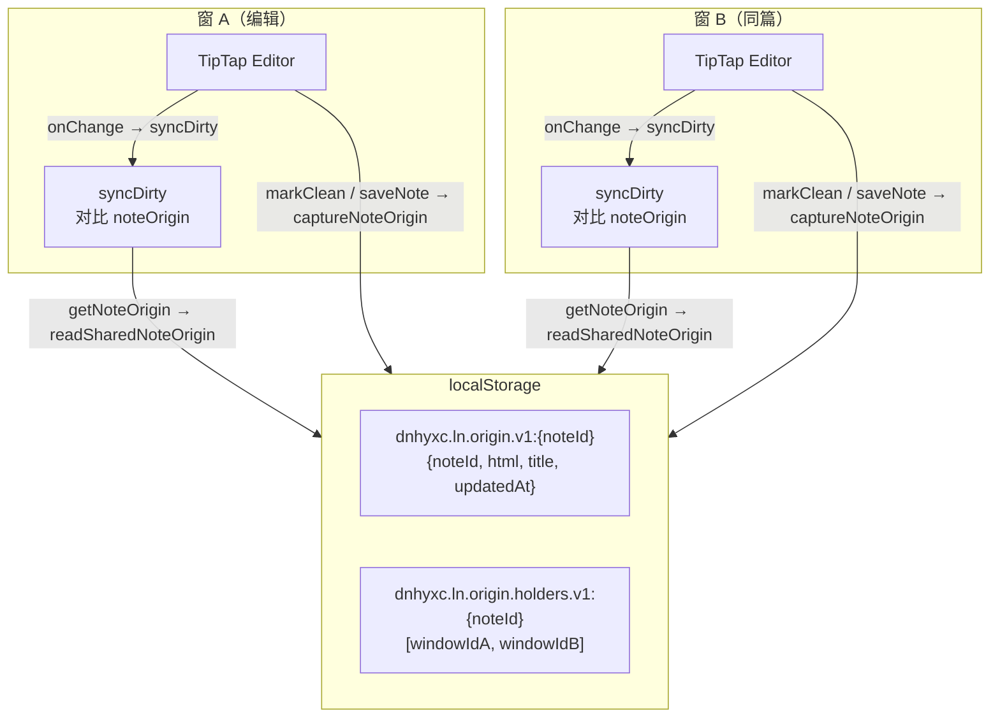
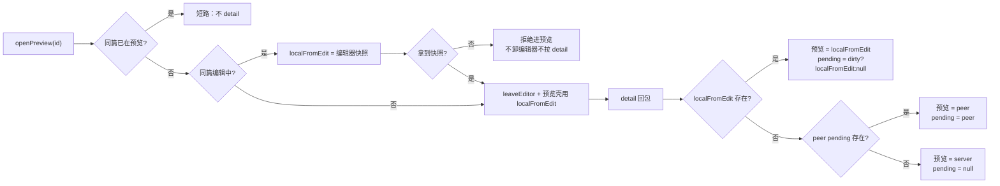

# 共享原始基线与防覆盖

> 延伸阅读：
> - 初始版跨窗同步（connectStore 绑定模式）见 [跨窗草稿同步与脏标记仲裁](./跨窗草稿同步与脏标记仲裁.md)。
> - subscribe 分发重构 + leaveSnap 离页快照 + epoch 守卫见 [跨窗同步重构与离页快照](./跨窗同步重构与离页快照.md)。

## 1. 背景与目标

上一轮重构（subscribe 分发 + leaveSnap + epoch 守卫）解决了跨窗同步的基础架构问题，但实际使用中暴露了三个新问题：

1. **各窗 TipTap 基线漂移**：每个窗口独立维护 `baselineHtmlRef`，TipTap 序列化在不同窗口/实例间存在微小差异（尾部空段、属性顺序等），导致 A 窗判干净但 B 窗判脏，脏标记不一致。
2. **openPreview 覆盖未保存稿**：从编辑态点预览时，detail 回包的服务端旧正文会覆盖本地未保存草稿；同篇重复点预览也会被 detail 重新覆盖。
3. **leavePage Host http 失败丢稿**：SPA 路由离开时 `leavePage` 调 `saveNote` 走 Host http，若 Host http 不可用（如 env 常无 API domain），脏稿直接丢失。

本轮目标：

- **共享原始基线 (noteOrigin)**：通过 localStorage 存储一份跨窗统一的「原始基线」，所有窗口的脏判断都对比这份基线，避免漂移。
- **引用计数 (holders)**：`acquireNoteOriginSession` / `releaseNoteOriginSession` 记录哪些窗口正在使用某篇基线，最后一个窗口离开时才清理 localStorage。
- **openPreview / openEdit 防覆盖**：同篇短路、`localFromEdit` 快照优先于服务端正文、detail 回包三级合并（localFromEdit > peer > server）。
- **leavePage keepalive 兜底**：Host http 失败时回退 `saveNoteKeepalive`，并显式广播 saved 给对端。
- **独立窗口按钮**：工具栏新增 `AppWindow` 按钮，调用 Host `openPopoutWindow` 弹出独立窗口。

## 2. 改动范围

| 类型 | 路径 | 说明 |
|------|------|------|
| 新增 | `src/store/noteOrigin.ts` | localStorage 共享原始基线：acquire/release holders、read/write/ensure/remove 基线 |
| 改动 | `src/store/learningNotes.ts` | noteOrigin / localWindowId / heldOriginNoteId 字段 + 12 个方法；openPreview/openEdit 防覆盖重写；leavePage keepalive 兜底；saveNote/deleteNote 联动 captureNoteOrigin/clearNoteOrigin |
| 改动 | `src/views/learning-notes/index.tsx` | applyEditorReadyDirty/syncDirty/registerRemoteDraftApplier/registerRemoteSavedApplier 改用共享基线；markClean 写基线；editorMatchesTarget 放宽；pagehide 释放 holder；popoutBtn 按钮 |
| 改动 | `src/hooks/useNoteHostSync.ts` | bindLocalWindowId 注入；releaseHeldOriginSession 关窗释放；Host 模块新增 openPopoutWindow |
| 改动 | `src/i18n/locales/zh-CN.ts` / `en-US.ts` | `learningNotes.popout` 键（"独立打开" / "Open in window"） |

---

## 3. 核心思路

### 3.1 共享原始基线架构



- **写入时机**：保存成功 (`saveNote`)、清脏 (`markClean`)、编辑器 ready 且内容与打开稿一致 (`applyEditorReadyDirty` open-is-clean 分支)、收到对端 dirty:false (`registerRemoteDraftApplier` clean 分支)、收到对端 saved (`registerRemoteSavedApplier`)。
- **抢占时机**：编辑器首次 ready 时 `ensureNoteOrigin`——仅当 localStorage 尚无基线时才写入（首窗 TipTap 规范化稿抢占），他窗沿用已有那份。
- **读取时机**：`syncDirty`（每次 onChange）、`applyEditorReadyDirty`（编辑器 remount 后仲裁）、`registerRemoteDraftApplier`（对端草稿到达时判脏）。
- **清理时机**：最后一个窗口 release 时 `removeNoteOriginSession`；删除笔记时 `clearNoteOrigin`。

### 3.2 防覆盖三级优先级



### 3.3 leavePage keepalive 兜底

```
leavePage()
  ├─ takeEditorSnapshot（live 编辑器 → leaveSnap fallback）
  ├─ 有脏 + 有内容/标题？
  │   ├─ saveNote（走 Host http）
  │   │   ├─ 成功 → captureNoteOrigin + sync.saved + sync.listChanged
  │   │   └─ 失败 → saveNoteKeepalive（fetch keepalive）
  │   │              └─ notifyPeerSavedAfterKeepalive（captureNoteOrigin + sync.saved + sync.listChanged）
  │   └─ 无脏 → flushNoteOnPageHide（settle/discard 上传会话）
  └─ resetEditorSession（release holder + 清选中）
```

---

## 4. 关键代码对比与注释

### 4.1 `noteOrigin.ts`（纯新增文件）

**改动后** · `src/store/noteOrigin.ts`（新增文件，完整文件）

```typescript
/**
 * 按 noteId 共享的「原始基线」正文（主窗 / 子窗通用）。
 * 脏判断只对比这份基线，避免各窗 TipTap 本地基线漂移导致变更错乱。
 *
 * 生命周期：
 * - 某窗打开/编辑/预览某篇 → acquire（holders +1）
 * - 编辑中保存 / 清脏 → capture 更新基线，不 release
 * - 某窗切走该篇 → release（holders -1）
 * - 所有窗都 release 后 → 才 removeSharedNoteOrigin
 * - 删除笔记 → removeNoteOriginSession（基线 + holders 一并清）
 *
 * windowId 与 Host learningNotesSyncBus 一致（各 WebView 独立 sessionStorage）。
 */
// sessionStorage 键名：与 Host getLearningNotesWindowId 共用
export const LN_WINDOW_ID_KEY = "dnhyxc_ln_window_id";

// 基线快照类型
export type NoteOriginSnapshot = {
	// 笔记 id
	noteId: string;
	// 干净正文 HTML
	html: string;
	// 干净标题
	title: string;
	// 更新时间戳
	updatedAt: number;
};

// localStorage 键前缀
export const NOTE_ORIGIN_STORAGE_PREFIX = "dnhyxc.ln.origin.v1:";
// holders 引用计数键前缀
export const NOTE_ORIGIN_HOLDERS_PREFIX = "dnhyxc.ln.origin.holders.v1:";

// 构造基线存储键
function originKey(noteId: string): string {
	return `${NOTE_ORIGIN_STORAGE_PREFIX}${noteId}`;
}

// 构造 holders 存储键
function holdersKey(noteId: string): string {
	return `${NOTE_ORIGIN_HOLDERS_PREFIX}${noteId}`;
}

/** 本 WebView 的 windowId（与 Host getLearningNotesWindowId 同 key） */
export function getLocalNoteOriginWindowId(): string {
	// SSR 环境 fallback
	if (typeof sessionStorage === "undefined") return "ssr";
	// 先尝试读取已有 id
	let id = sessionStorage.getItem(LN_WINDOW_ID_KEY);
	if (!id) {
		// 生成新 id：优先 crypto.randomUUID
		id =
			typeof crypto !== "undefined" && "randomUUID" in crypto
				? crypto.randomUUID()
				: `w-${Date.now()}-${Math.random().toString(36).slice(2)}`;
		// 写入 sessionStorage
		sessionStorage.setItem(LN_WINDOW_ID_KEY, id);
	}
	return id;
}

// 读取 holders 数组
function readHolders(noteId: string): string[] {
	// 无 noteId 或无 localStorage → 空数组
	if (!noteId || typeof localStorage === "undefined") return [];
	try {
		const raw = localStorage.getItem(holdersKey(noteId));
		if (!raw) return [];
		// JSON 解析
		const parsed = JSON.parse(raw) as unknown;
		// 非数组 → 空数组
		if (!Array.isArray(parsed)) return [];
		// 过滤掉非字符串/空串
		return parsed.filter(
			(x): x is string => typeof x === "string" && x.length > 0,
		);
	} catch {
		return [];
	}
}

// 写入 holders 数组
function writeHolders(noteId: string, windowIds: string[]): void {
	if (!noteId || typeof localStorage === "undefined") return;
	try {
		// 空数组 → 删键
		if (windowIds.length === 0) {
			localStorage.removeItem(holdersKey(noteId));
		} else {
			// 非空 → 序列化写入
			localStorage.setItem(holdersKey(noteId), JSON.stringify(windowIds));
		}
	} catch (e) {
		console.warn("[learningNotes] note origin holders write failed", e);
	}
}

/** 本窗开始编辑/预览该篇：登记 holder，不碰基线正文 */
export function acquireNoteOriginSession(noteId: string, windowId: string): void {
	if (!noteId || !windowId || typeof localStorage === "undefined") return;
	// 去重后加入
	const ids = new Set(readHolders(noteId));
	ids.add(windowId);
	writeHolders(noteId, [...ids]);
}

/**
 * 本窗离开该篇：移除 holder。
 * @returns true 表示已无其他窗持有 → 可清除 shared origin
 */
export function releaseNoteOriginSession(
	noteId: string,
	windowId: string,
): boolean {
	if (!noteId || !windowId || typeof localStorage === "undefined")
		return false;
	// 从 holders 中移除本窗
	const ids = new Set(readHolders(noteId));
	// delete 返回 false 表示本窗不在 holders 中
	if (!ids.delete(windowId)) return ids.size === 0;
	// 写回剩余 holders
	writeHolders(noteId, [...ids]);
	// 返回是否已无其他窗持有
	return ids.size === 0;
}

// 读取共享基线
export function readSharedNoteOrigin(
	noteId: string,
): NoteOriginSnapshot | null {
	if (!noteId || typeof localStorage === "undefined") return null;
	try {
		const raw = localStorage.getItem(originKey(noteId));
		if (!raw) return null;
		// JSON 解析
		const parsed = JSON.parse(raw) as NoteOriginSnapshot;
		// 校验字段
		if (
			!parsed ||
			parsed.noteId !== noteId ||
			typeof parsed.html !== "string"
		) {
			return null;
		}
		return parsed;
	} catch {
		return null;
	}
}

/** 覆盖写入共享基线（保存成功 / 清脏时） */
export function writeSharedNoteOrigin(
	noteId: string,
	html: string,
	title: string,
): NoteOriginSnapshot | null {
	if (!noteId || typeof localStorage === "undefined") return null;
	// 构造快照
	const snap: NoteOriginSnapshot = {
		noteId,
		html,
		title,
		updatedAt: Date.now(),
	};
	try {
		// 覆盖写入 localStorage
		localStorage.setItem(originKey(noteId), JSON.stringify(snap));
	} catch (e) {
		console.warn("[learningNotes] note origin write failed", e);
	}
	return snap;
}

/** 仅当尚无共享基线时写入（首窗 TipTap 规范化抢占，他窗沿用） */
export function ensureSharedNoteOrigin(
	noteId: string,
	html: string,
	title: string,
): NoteOriginSnapshot | null {
	// 先读已有基线
	const existing = readSharedNoteOrigin(noteId);
	// 已有 → 直接返回
	if (existing) return existing;
	// 无 → 写入新的
	return writeSharedNoteOrigin(noteId, html, title);
}

// 移除共享基线
export function removeSharedNoteOrigin(noteId: string): void {
	if (!noteId || typeof localStorage === "undefined") return;
	try {
		localStorage.removeItem(originKey(noteId));
	} catch {
		/* ignore */
	}
}

/** 删除笔记：基线与 holders 一并移除 */
export function removeNoteOriginSession(noteId: string): void {
	// 移除基线
	removeSharedNoteOrigin(noteId);
	// 移除 holders
	if (!noteId || typeof localStorage === "undefined") return;
	try {
		localStorage.removeItem(holdersKey(noteId));
	} catch {
		/* ignore */
	}
}
```

**变更摘要**：纯新增文件。localStorage 存储共享原始基线 + holders 引用计数。acquire/release 管理生命周期，write/ensure/read 管理基线内容，remove 管理清理。

---

### 4.2 Store 新增 noteOrigin / localWindowId / heldOriginNoteId 字段

**改动前** · `src/store/learningNotes.ts`（基线，约 L97–L98）

```typescript
	// 当前篇服务端干净正文（预览合并对端草稿后仍保留）
	private savedBaselineHtml: string | null = null;
```

**改动后** · `src/store/learningNotes.ts`（当前，约 L97–L111）

```typescript
	// 当前篇服务端干净正文（预览合并对端草稿后仍保留）
	private savedBaselineHtml: string | null = null;
	/**
	 * 当前篇共享原始基线（主/子窗同一份，存 localStorage）。
	 * 脏判断只对比它，避免各窗本地 TipTap 基线漂移。
	 */
	private noteOrigin: NoteOriginSnapshot | null = null;
	/** 与 Host learningNotesSyncBus 一致的本窗 windowId */
	private localWindowId: string | null = null;
	/** 本窗已通过 acquire 登记的 noteId（切篇/离页时 release） */
	private heldOriginNoteId: string | null = null;
```

**变更摘要**：Store 新增 3 个私有字段：`noteOrigin`（内存缓存 + localStorage 权威源）、`localWindowId`（本窗唯一标识）、`heldOriginNoteId`（当前已 acquire 的笔记 id）。

---

### 4.3 Store 基线管理方法群（bindLocalWindowId / getNoteOrigin / captureNoteOrigin / ensureNoteOrigin / isDirtyAgainstOrigin / clearNoteOrigin）

**改动后** · `src/store/learningNotes.ts`（当前，约 L174–L310，摘录核心方法）

```typescript
	/** 由 useNoteHostSync 注入，与 Host getWindowId() 一致 */
	bindLocalWindowId(windowId: string | null | undefined): void {
		this.localWindowId = windowId?.trim() || null;
	}

	/**
	 * 读取共享原始基线。优先 localStorage（主/子窗写入的权威源），
	 * 避免内存缓存挡住对端刚写入的基线。
	 */
	getNoteOrigin(noteId: string | null | undefined): NoteOriginSnapshot | null {
		// 无 noteId → null
		if (!noteId) return null;
		// 优先读 localStorage（跨窗权威源）
		const shared = readSharedNoteOrigin(noteId);
		if (shared) {
			// 同步更新内存缓存
			this.noteOrigin = shared;
			return shared;
		}
		// localStorage 无 → 回落内存缓存（须 noteId 匹配）
		return this.noteOrigin?.noteId === noteId ? this.noteOrigin : null;
	}

	/**
	 * 覆盖写入共享原始基线（保存成功 / 明确以服务端为准时）。
	 * 主子窗经 localStorage 共用同一份。
	 */
	captureNoteOrigin(noteId: string, html: string, title: string): void {
		if (!noteId) return;
		// 写 localStorage + 更新内存缓存 + 更新 savedBaselineHtml
		const snap = writeSharedNoteOrigin(noteId, html, title);
		if (snap) {
			this.noteOrigin = snap;
			this.savedBaselineHtml = html;
		}
	}

	/**
	 * 尚无共享基线时写入（首窗编辑器 ready 后 TipTap 规范化稿抢占）。
	 * 他窗打开同篇时沿用已有基线，不再各自重建。
	 */
	ensureNoteOrigin(
		noteId: string,
		html: string,
		title: string,
	): NoteOriginSnapshot | null {
		if (!noteId) return null;
		// 仅当 localStorage 尚无基线时才写入
		const snap = ensureSharedNoteOrigin(noteId, html, title);
		if (snap) {
			this.noteOrigin = snap;
			// savedBaselineHtml 尚未设置时补上
			if (!this.savedBaselineHtml) this.savedBaselineHtml = snap.html;
		}
		return snap;
	}

	/** 相对共享原始基线是否脏（标题或正文任一不同） */
	isDirtyAgainstOrigin(
		noteId: string | null | undefined,
		html: string,
		title?: string,
	): boolean {
		// 读基线
		const origin = this.getNoteOrigin(noteId);
		if (!origin) return false;
		// 正文不同 → 脏
		if (html !== origin.html) return true;
		// 标题不同 → 脏
		if (title !== undefined && title.trim() !== origin.title.trim())
			return true;
		return false;
	}

	// 清除共享基线（删除笔记时调用）
	clearNoteOrigin(noteId: string | null | undefined): void {
		if (!noteId) return;
		// 清 localStorage + holders
		removeNoteOriginSession(noteId);
		// 清内存缓存
		if (this.noteOrigin?.noteId === noteId) this.noteOrigin = null;
		if (this.heldOriginNoteId === noteId) this.heldOriginNoteId = null;
	}

	// 获取本窗 windowId（优先注入的，fallback 到 sessionStorage）
	private originWindowId(): string {
		return this.localWindowId ?? getLocalNoteOriginWindowId();
	}

	// 获取当前会话笔记 id（编辑 > 预览 > 绑定）
	private sessionNoteId(): string | null {
		return this.editingId ?? this.preview?.id ?? this.boundNoteId;
	}

	// acquire 共享基线会话
	private acquireOriginSession(noteId: string | null | undefined): void {
		const windowId = this.originWindowId();
		if (!noteId) return;
		// 同篇已 acquire → 跳过
		if (this.heldOriginNoteId === noteId) return;
		// 切到新篇 → 先 release 旧篇
		if (this.heldOriginNoteId && this.heldOriginNoteId !== noteId) {
			this.releaseOriginSession(this.heldOriginNoteId);
		}
		// 登记新篇 holder
		acquireNoteOriginSession(noteId, windowId);
		this.heldOriginNoteId = noteId;
	}

	/**
	 * 本窗离开该篇；仅当所有窗都 release 后才清 localStorage 基线。
	 * 本窗内存 noteOrigin 总是清掉，避免切走后仍误用。
	 */
	private releaseOriginSession(noteId: string | null | undefined): void {
		if (!noteId) return;
		const windowId = this.originWindowId();
		// 从 holders 移除本窗，返回是否最后一个
		const lastHolder = releaseNoteOriginSession(noteId, windowId);
		// 清内存
		if (this.heldOriginNoteId === noteId) this.heldOriginNoteId = null;
		if (this.noteOrigin?.noteId === noteId) this.noteOrigin = null;
		// 最后一个 → 清 localStorage
		if (lastHolder) removeNoteOriginSession(noteId);
	}

	// 切篇辅助：旧篇 != 新篇 → release 旧篇
	private releaseOriginSessionIfLeaving(
		prevId: string | null | undefined,
		nextId: string | null | undefined,
	): void {
		if (!prevId || prevId === nextId) return;
		this.releaseOriginSession(prevId);
	}

	/** 刷新/关页：释放 holder，避免泄漏导致基线永不清 */
	releaseHeldOriginSession(): void {
		const id = this.heldOriginNoteId ?? this.sessionNoteId();
		if (id) this.releaseOriginSession(id);
	}
```

**变更摘要**：12 个新方法构成共享基线管理群。`bindLocalWindowId` 注入 windowId；`getNoteOrigin` 优先读 localStorage；`captureNoteOrigin` 覆盖写入；`ensureNoteOrigin` 仅首窗抢占；`acquire/releaseOriginSession` 管理引用计数；`releaseHeldOriginSession` 刷新/关页释放。

---

### 4.4 `resetEditorSession` 增加 releaseHeldOriginSession

**改动前** · `src/store/learningNotes.ts`（基线，约 L342）

```typescript
	resetEditorSession(): void {
		this.preview = null;
		this.editingId = null;
```

**改动后** · `src/store/learningNotes.ts`（当前，约 L342–L344）

```typescript
	resetEditorSession(): void {
		// 先释放共享基线 holder
		this.releaseHeldOriginSession();
		this.preview = null;
		this.editingId = null;
```

**变更摘要**：`resetEditorSession` 首行调 `releaseHeldOriginSession`，确保离页时释放 holder，避免 localStorage 泄漏导致基线永不清。

---

### 4.5 `leavePage` 重写：Host http 失败时 keepalive 兜底

**改动前** · `src/store/learningNotes.ts`（基线，约 L359–L362）

```typescript
	async leavePage(): Promise<void> {
		// 先保存（用 leaveSnap，此时编辑器可能已卸载）
		await this.flushLeaveSnap();
		// 再清选中态
		this.resetEditorSession();
	}
```

**改动后** · `src/store/learningNotes.ts`（当前，约 L362–L398）

```typescript
	/**
	 * 离页：先保存脏稿，再清选中（顺序不能反，否则 saveTargetId 丢失会误新建）。
	 * SPA 切路由时 Host 仍在，必须走 Host http；keepalive 仅作刷新/关页兜底，
	 * 且插件 env 常无 API domain，keepalive 可能空操作。
	 */
	async leavePage(): Promise<void> {
		// 子树/reader 可能已卸：take 失败时直接用 leaveSnap（须在 reset 前）
		const snap =
			this.takeEditorSnapshot() ??
			(this.leaveSnap?.dirty ? this.leaveSnap : null);
		// 有脏稿 + 非预览 + 有内容或标题 → 保存
		if (
			snap?.dirty &&
			!this.preview &&
			(hasNoteBodyContent(snap.html, snap.text) || snap.title.trim())
		) {
			// 走 Host http
			const ok = await this.saveNote(
				{
					title: snap.title,
					html: snap.html,
					text: snap.text,
					dirty: true,
				},
				{ silent: true, auto: true },
			);
			// Host http 失败 → keepalive 兜底
			if (!ok) {
				const noteId = this.saveTargetId;
				const title = snap.title.trim() || this.t("common.untitledNote");
				// keepalive save
				saveNoteKeepalive({
					id: noteId,
					title,
					html: snap.html,
					uploadSessionId: this.uploadSessionId,
				});
				// keepalive 成功后显式广播 saved（不走 saveNote，须手动通知对端）
				this.notifyPeerSavedAfterKeepalive(noteId, snap.html, title);
			}
		} else if (!this.preview) {
			// 无脏稿：结算/丢弃上传会话
			this.flushNoteOnPageHide();
		}
		// 清选中态（含 releaseHeldOriginSession）
		this.resetEditorSession();
	}
```

**变更摘要**：从简单 `flushLeaveSnap + resetEditorSession` 升级为三段式：1）take snapshot（live 编辑器优先，leaveSnap fallback）；2）有脏→saveNote（Host http），失败→keepalive + `notifyPeerSavedAfterKeepalive`；3）无脏→`flushNoteOnPageHide`（settle/discard 上传会话）+ reset。

---

### 4.6 `notifyPeerSavedAfterKeepalive`（新增方法）

**改动后** · `src/store/learningNotes.ts`（当前，约 L467–L478）

```typescript
	/** keepalive 保存后通知对端清脏（刷新/关页不走 saveNote，须显式广播 saved） */
	private notifyPeerSavedAfterKeepalive(
		noteId: string | null,
		html: string,
		title: string,
	): void {
		// 无 noteId → 不通知
		if (!noteId) return;
		// 标题 fallback
		const savedTitle = title.trim() || this.t("common.untitledNote");
		// 更新共享基线
		this.captureNoteOrigin(noteId, html, savedTitle);
		// 广播 saved 给对端
		this.syncPublish?.saved?.({
			noteId,
			html,
			title: savedTitle,
		});
		// 广播 listChanged 给对端
		this.syncPublish?.listChanged?.("pagehide-save");
	}
```

**变更摘要**：keepalive 保存成功后无法走 `saveNote` 的常规广播路径，须手动调 `captureNoteOrigin` + `sync.saved` + `sync.listChanged`。

---

### 4.7 `flushNoteOnPageHide` 联动 keepalive 广播 + 放宽内容检查

**改动前** · `src/store/learningNotes.ts`（基线，约 L467–L485）

```typescript
	flushNoteOnPageHide(): void {
		if (this.preview) return;
		const snap = this.takeEditorSnapshot();
		const sid = this.uploadSessionId;
		const owned = this.uploadSessionOwned;
		if (snap?.dirty && hasNoteBodyContent(snap.html, snap.text)) {
			saveNoteKeepalive({
				id: this.saveTargetId,
				title: snap.title.trim() || this.t('common.untitledNote'),
				html: snap.html,
				uploadSessionId: sid,
			});
			this.uploadSessionId = null;
			this.uploadSessionOwned = true;
			return;
		}
```

**改动后** · `src/store/learningNotes.ts`（当前，约 L485–L510）

```typescript
	flushNoteOnPageHide(): void {
		if (this.preview) return;
		const snap = this.takeEditorSnapshot();
		const sid = this.uploadSessionId;
		const owned = this.uploadSessionOwned;
		// 放宽：有标题也算有内容（标题-only 笔记也要保存）
		if (
			snap?.dirty &&
			(hasNoteBodyContent(snap.html, snap.text) || snap.title.trim())
		) {
			const noteId = this.saveTargetId;
			const title = snap.title.trim() || this.t("common.untitledNote");
			saveNoteKeepalive({
				id: noteId,
				title,
				html: snap.html,
				uploadSessionId: sid,
			});
			// keepalive 后显式广播 saved 给对端
			this.notifyPeerSavedAfterKeepalive(noteId, snap.html, title);
			// 避免 leavePage / pagehide 重复 keepalive
			if (this.leaveSnap?.noteId === (this.editingId ?? this.boundNoteId)) {
				this.leaveSnap = { ...this.leaveSnap, dirty: false };
			}
			this.uploadSessionId = null;
			this.uploadSessionOwned = true;
			return;
		}
```

**变更摘要**：1）内容检查从 `hasNoteBodyContent` 放宽为 `hasNoteBodyContent || title.trim()`；2）keepalive 后调 `notifyPeerSavedAfterKeepalive`；3）leaveSnap 标记为 dirty:false 防止重复 keepalive。

---

### 4.8 `applyRemoteDraft` 预览态 loadingDetail 守卫

**改动前** · `src/store/learningNotes.ts`（基线，约 L663–L680）

```typescript
		if (this.preview?.id === noteId) {
			const baseline =
				this.savedBaselineHtml ?? this.pendingPeerDraft?.baselineHtml;
			if (draft.dirty === false) {
				this.pendingPeerDraft = null;
				if (draft.html.trim()) this.savedBaselineHtml = draft.html;
			} else {
				this.pendingPeerDraft = {
					noteId,
					html: draft.html,
					title: draft.title,
					uploadSessionId: draft.uploadSessionId,
					dirty: draft.dirty ?? true,
					baselineHtml: baseline,
				};
			}
			this.preview = { ...this.preview, html: draft.html, title: draft.title };
			return;
		}
```

**改动后** · `src/store/learningNotes.ts`（当前，约 L663–L685）

```typescript
		if (this.preview?.id === noteId) {
			const baseline =
				this.savedBaselineHtml ?? this.pendingPeerDraft?.baselineHtml;
			// openPreview 合并本窗编辑稿期间：只记 pending，勿用对端旧快照盖预览正文
			if (this.loadingDetail) {
				// loadingDetail 期间：只更新 pending，不动 preview.html
				if (draft.dirty === false) {
					this.pendingPeerDraft = null;
					if (draft.html.trim()) this.savedBaselineHtml = draft.html;
				} else {
					this.pendingPeerDraft = {
						noteId,
						html: draft.html,
						title: draft.title,
						uploadSessionId: draft.uploadSessionId,
						dirty: draft.dirty ?? true,
						baselineHtml: baseline,
					};
				}
				return;
			}
			// 非 loadingDetail：正常更新预览
			if (draft.dirty === false) {
				this.pendingPeerDraft = null;
				if (draft.html.trim()) this.savedBaselineHtml = draft.html;
			} else {
				this.pendingPeerDraft = {
					noteId,
					html: draft.html,
					title: draft.title,
					uploadSessionId: draft.uploadSessionId,
					dirty: draft.dirty ?? true,
					baselineHtml: baseline,
				};
			}
			this.preview = { ...this.preview, html: draft.html, title: draft.title };
			return;
		}
```

**变更摘要**：预览态收到对端草稿时，若 `loadingDetail` 为 true（detail 正在拉取），只记 pending 不动 preview.html，避免对端旧快照覆盖本窗刚写入预览壳的编辑快照。

---

### 4.9 `applyRemoteSaved` 增加 captureNoteOrigin

**改动前** · `src/store/learningNotes.ts`（基线，约 L722–L724）

```typescript
		if (payload.html.trim()) {
			this.savedBaselineHtml = payload.html;
		}
```

**改动后** · `src/store/learningNotes.ts`（当前，约 L722–L725）

```typescript
		if (payload.html.trim()) {
			this.savedBaselineHtml = payload.html;
			// 收到对端 saved → 更新共享基线
			this.captureNoteOrigin(noteId, payload.html, payload.title || "");
		}
```

**变更摘要**：对端保存成功后，本窗也更新共享基线，确保两侧脏判断基线一致。

---

### 4.10 `openNew` / `openPreview` / `openEdit` / `openEditById` 防覆盖重写

**改动前** · `src/store/learningNotes.ts`（基线，`openPreview` 约 L783–L838）

```typescript
	async openPreview(id: string): Promise<void> {
		if (!this.api) return;
		await this.leaveEditor();
		const listHit = this.list.find((n) => n.id === id);
		runInAction(() => {
			this.bindNoteId(id);
			if (this.editingId !== id) {
				this.editingId = null;
				this.editorInitial = EMPTY_NOTE_DOC;
				this.editorSeed += 1;
			}
			this.loadingDetail = true;
			// ...（壳子初始化略）
		});
		try {
			const note = await this.api.detail(id);
			runInAction(() => {
				if (this.preview?.id !== id) return;
				const peer = ...;
				const serverHtml = note.html || '';
				this.savedBaselineHtml = serverHtml;
				this.bindNoteId(id);
				this.preview = peer ? { ...note, html: peer.html, title: peer.title.trim() || note.title } : note;
				// ...（pending 处理略）
			});
		}
	}
```

**改动后** · `src/store/learningNotes.ts`（当前，`openPreview` 约 L783–L870）

```typescript
	async openPreview(id: string): Promise<void> {
		if (!this.api) return;
		// 已在预览同篇：勿再 detail，避免覆盖当前预览（含未保存稿）
		if (this.preview?.id === id && !this.loadingDetail) return;

		const prevId = this.sessionNoteId();
		// 同篇编辑中：优先编辑器快照，其次离页缓存
		const editingSame = this.editingId === id && !this.preview;
		const localFromEdit = editingSame
			? (this.takeEditorSnapshot() ??
				(this.leaveSnap?.noteId === id ? this.leaveSnap : null))
			: null;
		// 读不到本地稿就别卸编辑器 + 拉 detail，否则未保存正文会直接丢
		if (editingSame && !localFromEdit) return;

		await this.leaveEditor();
		this.releaseOriginSessionIfLeaving(prevId, id);
		const listHit = this.list.find((n) => n.id === id);
		runInAction(() => {
			this.bindNoteId(id);
			// 进预览一律卸编辑态
			this.editingId = null;
			this.editorInitial = EMPTY_NOTE_DOC;
			this.editorSeed += 1;
			this.loadingDetail = true;
			this.savedBaselineHtml = null;
			if (this.pendingPeerDraft?.noteId !== id) {
				this.pendingPeerDraft = null;
			}
			// 预览壳：优先用 localFromEdit 的标题和正文
			this.preview = {
				id,
				title: localFromEdit?.title.trim() || listHit?.title || this.preview?.title || "",
				html: localFromEdit?.html || (this.preview?.id === id ? this.preview.html : ""),
				at: listHit?.at ?? this.preview?.at ?? Date.now(),
				author: listHit?.author ?? (this.preview?.id === id ? this.preview.author : ""),
				isPublic: listHit?.isPublic ?? (this.preview?.id === id ? this.preview.isPublic : false),
			};
		});
		try {
			const note = await this.api.detail(id);
			runInAction(() => {
				if (this.preview?.id !== id) return;
				const peer = this.pendingPeerDraft?.noteId === id ? this.pendingPeerDraft : null;
				const serverHtml = note.html || "";
				this.savedBaselineHtml = serverHtml;
				// 读共享基线（不拿服务端原始串抢占）
				this.getNoteOrigin(id);
				this.bindNoteId(id);
				// 三级优先级：localFromEdit > peer > server
				if (localFromEdit) {
					const title = localFromEdit.title.trim() || note.title;
					this.preview = { ...note, html: localFromEdit.html, title };
					const stillDirty = this.leaveSnap?.noteId === id ? this.leaveSnap.dirty : localFromEdit.dirty;
					if (stillDirty) {
						this.pendingPeerDraft = { noteId: id, html: localFromEdit.html, title: localFromEdit.title, dirty: true, baselineHtml: serverHtml };
					} else {
						this.pendingPeerDraft = null;
					}
					return;
				}
				if (peer) {
					this.preview = { ...note, html: peer.html, title: peer.title.trim() || note.title };
					if (peer.dirty !== false) {
						this.pendingPeerDraft = { ...peer, baselineHtml: serverHtml };
					} else {
						this.pendingPeerDraft = null;
					}
					return;
				}
				this.preview = note;
				this.pendingPeerDraft = null;
			});
		} catch {
			// ...（Host http 已 Toast）
		} finally {
			runInAction(() => {
				this.loadingDetail = false;
				// acquire 共享基线会话
				if (this.preview?.id === id) this.acquireOriginSession(id);
			});
		}
	}

	async openEdit(note: Note) {
		// 已在编辑同篇：勿 remount
		if (this.editingId === note.id && !this.preview) return;
		const prevId = this.sessionNoteId();
		await this.leaveEditor();
		this.releaseOriginSessionIfLeaving(prevId, note.id);
		// ...（编辑态设置略）
		const sharedOrigin = this.getNoteOrigin(note.id);
		// 基线候选：有 peer → peer.baselineHtml ?? sharedOrigin ?? saved ?? server；无 peer → server ?? sharedOrigin ?? saved
		const baselineHtml = peer
			? (peer.baselineHtml ?? sharedOrigin?.html ?? this.savedBaselineHtml ?? serverHtml)
			: (serverHtml || sharedOrigin?.html || this.savedBaselineHtml || "");
		// ...（hasUnsaved 判断 + microtask 套草稿略）
		this.acquireOriginSession(note.id);
	}

	async openEditById(id: string): Promise<void> {
		if (!this.api) return;
		// 已在编辑同篇：勿 detail 重挂
		if (this.editingId === id && !this.preview) return;
		// 预览同篇已有正文：直接进编辑，避免 detail 旧稿覆盖
		if (this.preview?.id === id && this.preview.html) {
			await this.openEdit(this.preview);
			return;
		}
		// ...（detail + openEdit 略）
	}

	async openNew() {
		const prevId = this.sessionNoteId();
		await this.leaveEditor();
		this.releaseOriginSessionIfLeaving(prevId, null);
		// ...（新建态设置略）
	}
```

**变更摘要**：四个打开方法全面防覆盖重写。`openPreview` 新增同篇短路 + `localFromEdit` 快照 + 三级合并 + `acquireOriginSession`；`openEdit` / `openEditById` 新增同篇短路 + `getNoteOrigin` 基线 + `acquireOriginSession`；`openNew` 新增 `releaseOriginSessionIfLeaving`。

---

### 4.11 `saveNote` 联动 captureNoteOrigin

**改动前** · `src/store/learningNotes.ts`（基线，约 L759–L767）

```typescript
			if (savedId) {
				this.leaveSnap = {
					noteId: savedId,
					title: savedTitle,
					html: savedHtml,
					text: this.leaveSnap?.text ?? '',
					dirty: false,
				};
				sync?.saved?.({
					noteId: savedId,
					html: savedHtml,
					title: savedTitle,
				});
				sync?.listChanged?.(noteId ? 'update' : 'save');
			}
```

**改动后** · `src/store/learningNotes.ts`（当前，约 L1054–L1066）

```typescript
			if (savedId) {
				this.leaveSnap = {
					noteId: savedId,
					title: savedTitle,
					html: savedHtml,
					text: this.leaveSnap?.text ?? "",
					dirty: false,
				};
				// 保存成功 → 更新共享基线
				this.captureNoteOrigin(savedId, savedHtml, savedTitle);
				sync?.saved?.({
					noteId: savedId,
					html: savedHtml,
					title: savedTitle,
				});
				sync?.listChanged?.(noteId ? "update" : "save");
			}
```

**变更摘要**：保存成功后调 `captureNoteOrigin` 更新共享基线，与 `sync.saved` 广播同步。

---

### 4.12 `deleteNote` 联动 clearNoteOrigin

**改动后** · `src/store/learningNotes.ts`（当前，约 L1255–L1258）

```typescript
				// 清 boundNoteId
				if (this.boundNoteId === id) this.boundNoteId = null;
				// 清 pendingDeleteId
				this.pendingDeleteId = null;
				// 清共享基线 + holders
				this.clearNoteOrigin(id);
```

**变更摘要**：删除笔记时调 `clearNoteOrigin`，清理 localStorage 中的基线和 holders。

---

### 4.13 视图层：`markClean` 增加 captureNoteOrigin

**改动后** · `src/views/learning-notes/index.tsx`（当前，约 L157–L163）

```typescript
		cancelScheduledLearningNotesDraftPublish();
		const noteId = store.editingId;
		if (!noteId) return;
		// 干净态写入共享原始基线，主/子窗脏判断共用
		const draftTitle =
			pagedSaveRef.current?.getTitle?.() ??
			(editorRef.current && !editorRef.current.isDestroyed
				? getDocTitleText(editorRef.current.state.doc).trim()
				: '');
		// 保存成功 → 更新共享基线
		store.captureNoteOrigin(noteId, html, draftTitle);
```

**变更摘要**：`markClean`（保存成功后调用）新增 `store.captureNoteOrigin`，将干净稿写入共享基线。

---

### 4.14 视图层：`applyEditorReadyDirty` 改用共享基线

**改动前** · `src/views/learning-notes/index.tsx`（基线，约 L189–L222）

```typescript
	const applyEditorReadyDirty = useCallback(
		(html: string) => {
			const forceClean = pendingRemoteCleanRef.current;
			pendingRemoteCleanRef.current = false;
			if (forceClean) {
				// ...（forceClean 分支略）
				alignCleanBaseline(html);
				// ...
				return;
			}
			const openBase = openBaselineRef.current;
			const tipTapBase = baselineHtmlRef.current || openBase;
			const pending = pendingRemoteDirtyRef.current;
			pendingRemoteDirtyRef.current = false;
			const shouldDirty = ...;
			// ...（shouldDirty 分支略）
			// 首次挂载干净：用 TipTap 序列化结果作基线
			alignCleanBaseline(html);
			dirtyRef.current = false;
			setDirty(false);
		},
		[alignCleanBaseline],
	);
```

**改动后** · `src/views/learning-notes/index.tsx`（当前，约 L197–L257）

```typescript
	const applyEditorReadyDirty = useCallback(
		(html: string) => {
			// 当前编辑 id
			const noteId = store.editingId;
			// 编辑器标题
			const title =
				editorRef.current && !editorRef.current.isDestroyed
					? getDocTitleText(editorRef.current.state.doc).trim()
					: '';
			// 首窗 TipTap 规范化抢占共享基线；他窗沿用已有那一份
			if (noteId) {
				store.ensureNoteOrigin(noteId, html, title);
			}
			// 读取共享基线
			const origin = noteId ? store.getNoteOrigin(noteId) : null;
			const sharedBase = origin?.html ?? '';

			const forceClean = pendingRemoteCleanRef.current;
			pendingRemoteCleanRef.current = false;
			if (forceClean) {
				// ...（forceClean 分支：用 sharedBase || html 对齐基线）
				alignCleanBaseline(sharedBase || html);
				// ...
				return;
			}
			const openBase = openBaselineRef.current;
			const pending = pendingRemoteDirtyRef.current;
			pendingRemoteDirtyRef.current = false;
			// 打开即为干净稿：对齐打开稿并刷新共享基线，避免 LS 陈旧 origin 误点亮
			if (
				noteId &&
				!remoteDirtyLockRef.current &&
				!pending &&
				openBase &&
				editorHtmlEquals(html, openBase)
			) {
				// 更新共享基线为当前稿
				store.captureNoteOrigin(noteId, html, title);
				alignCleanBaseline(html);
				dirtyRef.current = false;
				setDirty(false);
				return;
			}
			// 基线优先级：共享基线 > TipTap 基线 > 打开基线
			const tipTapBase = sharedBase || baselineHtmlRef.current || openBase;
			const shouldDirty = ...;
			// ...（shouldDirty 分支略）
			// 干净：本地基线对齐共享原始基线
			alignCleanBaseline(sharedBase || html);
			dirtyRef.current = false;
			setDirty(false);
		},
		[alignCleanBaseline, store],
	);
```

**变更摘要**：1）onReady 时 `ensureNoteOrigin` 抢占共享基线；2）所有基线候选从 `baselineHtmlRef || openBase` → `sharedBase || baselineHtmlRef || openBase`；3）新增「打开即为干净稿」分支，`captureNoteOrigin` 刷新共享基线。

---

### 4.15 视图层：`syncDirty` 改用共享基线

**改动前** · `src/views/learning-notes/index.tsx`（基线，约 L307–L320）

```typescript
	const syncDirty = useCallback(() => {
		if (applyingRemoteRef.current) return;
		const html = currentHtml();
		const baseline = baselineHtmlRef.current || openBaselineRef.current;
		const nextDirty = !editorHtmlEquals(html, baseline);
		// ...
	}, [alignCleanBaseline, api, currentHtml, editorMatchesTarget, readDraft, store]);
```

**改动后** · `src/views/learning-notes/index.tsx`（当前，约 L345–L380）

```typescript
	const syncDirty = useCallback(() => {
		if (applyingRemoteRef.current) return;
		const html = currentHtml();
		const noteId = store.editingId;
		const openBase = openBaselineRef.current;
		// 读取共享基线
		const origin = noteId ? store.getNoteOrigin(noteId) : null;
		// 与打开稿一致则视为干净，避免 LS 陈旧 origin 误点亮
		const nextDirty =
			!remoteDirtyLockRef.current &&
			openBase &&
			editorHtmlEquals(html, openBase)
				? false
				: !editorHtmlEquals(
						html,
						origin?.html ||
							baselineHtmlRef.current ||
							openBase,
					);
		// ...
		// 变干净时：若与打开稿一致但与共享基线不同 → 更新共享基线
		if (
			noteId &&
			openBase &&
			editorHtmlEquals(html, openBase) &&
			origin &&
			!editorHtmlEquals(html, origin.html)
		) {
			const title = ...;
			store.captureNoteOrigin(noteId, html, title);
		}
		// ...
	}, [alignCleanBaseline, api, currentHtml, editorMatchesTarget, readDraft, store]);
```

**变更摘要**：1）基线从 `baselineHtmlRef || openBase` → `origin?.html || baselineHtmlRef || openBase`；2）新增「与打开稿一致 = 干净」短路（避免 LS 陈旧 origin 误点亮）；3）变干净时 `captureNoteOrigin` 更新共享基线。

---

### 4.16 视图层：`editorMatchesTarget` 放宽 epoch 检查

**改动前** · `src/views/learning-notes/index.tsx`（基线，约 L291–L296）

```typescript
	const editorMatchesTarget = useCallback(() => {
		if (editorReadyEpochRef.current !== editorEpochRef.current) return false;
		const targetId = store.editingId ?? store.boundNoteId;
		return editorBoundNoteIdRef.current === targetId;
	}, [store]);
```

**改动后** · `src/views/learning-notes/index.tsx`（当前，约 L291–L299）

```typescript
	const editorMatchesTarget = useCallback(() => {
		// 只比绑定 id：epoch 未对齐时 bound 已被清空，再卡 epoch 会导致快照读空，
		// 进而 openPreview/detail 用服务端旧稿盖掉未保存正文
		const targetId = store.editingId ?? store.boundNoteId;
		return (
			editorBoundNoteIdRef.current != null &&
			editorBoundNoteIdRef.current === targetId
		);
	}, [store]);
```

**变更摘要**：移除 epoch 检查（`editorReadyEpochRef !== editorEpochRef`）。epoch 守卫过于严格，切篇空隙会阻止读快照，导致 `openPreview` 拿不到 `localFromEdit`，进而 detail 旧稿覆盖未保存正文。改为只比 `boundNoteId`。

---

### 4.17 视图层：`registerEditorSnapshot` 简化守卫

**改动前** · `src/views/learning-notes/index.tsx`（基线，约 L419–L421）

```typescript
		store.registerEditorSnapshot(() => {
			if (store.preview) return null;
			if (!editorMatchesTarget()) return null;
			// ...（快照读取略）
		});
		return () => store.registerEditorSnapshot(null);
	}, [editorMatchesTarget, store.preview]);
```

**改动后** · `src/views/learning-notes/index.tsx`（当前，约 L466–L470）

```typescript
		store.registerEditorSnapshot(() => {
			if (store.preview) return null;
			const noteId = store.editingId ?? store.boundNoteId;
			// 新建笔记 editingId/bound 均为 null，与 editorBound 一致时仍可读
			if (editorBoundNoteIdRef.current !== noteId) return null;
			// ...（快照读取略）
		});
		return () => store.registerEditorSnapshot(null);
	}, [store]);
```

**变更摘要**：守卫从 `editorMatchesTarget()` → `editorBoundNoteIdRef.current !== noteId`。新建笔记时 `editingId` 和 `boundNoteId` 均为 null，与 `editorBoundNoteIdRef`（也为 null）一致时仍可读快照。

---

### 4.18 视图层：`registerRemoteDraftApplier` / `registerRemoteSavedApplier` 改用共享基线 + captureNoteOrigin

**改动后** · `src/views/learning-notes/index.tsx`（当前，约 L505–L630，摘录关键改动）

```typescript
	// registerRemoteDraftApplier 内：
	// 读取共享基线
	const origin = store.getNoteOrigin(noteId);
	const sharedBase = origin?.html || tipTapBase;
	// 对端 dirty 判断改用共享基线
	const nextDirty =
		draft.dirty === false
			? false
			: !editorHtmlEquals(draft.html, sharedBase);
	// ...（分支略）
	// clean 分支：captureNoteOrigin 更新共享基线
	if (cleanHtml.trim()) {
		store.captureNoteOrigin(noteId, cleanHtml, draft.title || origin?.title || '');
	}

	// registerRemoteSavedApplier 内：
	// 三个分支都调 captureNoteOrigin
	// 已挂载分支
	store.captureNoteOrigin(noteId, cleanHtml, payload.title || '');
	// 有 html 但编辑器不可用分支
	store.captureNoteOrigin(noteId, html, payload.title || '');
	// 兜底分支
	store.captureNoteOrigin(noteId, cleanHtml, payload.title || '');
```

**变更摘要**：1）`registerRemoteDraftApplier` 的脏判断基线从 `tipTapBase` → `origin?.html || tipTapBase`；clean 分支新增 `captureNoteOrigin`；2）`registerRemoteSavedApplier` 三个分支都新增 `captureNoteOrigin`。

---

### 4.19 视图层：`pagehide` 效应释放 holder + 移除 preview 守卫

**改动前** · `src/views/learning-notes/index.tsx`（基线，约 L530–L535）

```typescript
	useEffect(() => {
		if (store.preview) return;
		const onPageHide = () => store.flushNoteOnPageHide();
		window.addEventListener('pagehide', onPageHide);
		return () => window.removeEventListener('pagehide', onPageHide);
	}, [store.preview]);
```

**改动后** · `src/views/learning-notes/index.tsx`（当前，约 L619–L626）

```typescript
	useEffect(() => {
		const onPageHide = () => {
			store.flushNoteOnPageHide();
			// 释放共享基线 holder
			store.releaseHeldOriginSession();
		};
		window.addEventListener('pagehide', onPageHide);
		return () => window.removeEventListener('pagehide', onPageHide);
	}, [store]);
```

**变更摘要**：1）移除 `if (store.preview) return` 守卫——预览态也需要释放 holder；2）新增 `store.releaseHeldOriginSession()`；3）依赖从 `[store.preview]` → `[store]`。

---

### 4.20 视图层：独立窗口按钮（popoutBtn）

**改动后** · `src/views/learning-notes/index.tsx`（当前，约 L700–L714）

```typescript
	// 独立窗口按钮
	const popoutBtn = useCallback(() => {
		// 取 Host learningNotes 模块
		const mod = api.modules?.learningNotes;
		// 未实现 openPopoutWindow 或已是 Popout 窗口 → 不显示
		if (!mod?.openPopoutWindow || mod.isPopoutWindow()) return null;
		return (
			<Btn
				// 按钮提示文本
				title={t('learningNotes.popout')}
				// 点击调用 Host 弹出独立窗口
				onClick={() => void mod.openPopoutWindow?.()}
			>
				{/* AppWindow 图标 */}
				<AppWindow size={15} />
			</Btn>
		);
	}, [api.modules?.learningNotes, t]);
```

**变更摘要**：新增 `popoutBtn` callback，在工具栏渲染 `AppWindow` 图标按钮，调用 Host `openPopoutWindow` 弹出独立窗口。已在 Popout 窗口内时不显示。

---

### 4.21 Hook：`bindLocalWindowId` + `releaseHeldOriginSession` + `openPopoutWindow` 类型

**改动后** · `src/hooks/useNoteHostSync.ts`（当前，约 L30–L34 / L256–L288）

```typescript
type LearningNotesHostModule = {
	getWindowId(): string;
	isPopoutWindow(): boolean;
	// 新增：弹出独立窗口
	openPopoutWindow?(): Promise<void>;
	// ...（其余略）
};

// 在 saveLearningNotesOnWindowClose 内：
	// 关窗前释放共享基线 holder
	store.releaseHeldOriginSession();

// 在 useLearningNotesHostSync effect1 内：
	// 注入 windowId 给 Store
	store.bindLocalWindowId(localWindowId);
```

**变更摘要**：Host 模块类型新增 `openPopoutWindow?`；Hook 注入 `bindLocalWindowId`；关窗保存函数新增 `releaseHeldOriginSession`。

---

### 4.22 i18n：`learningNotes.popout` 键

**改动后** · `src/i18n/locales/zh-CN.ts`（当前，约 L60）

```typescript
	// 独立打开按钮文案
	'learningNotes.popout': '独立打开',
```

**改动后** · `src/i18n/locales/en-US.ts`（当前，约 L61）

```typescript
	// 独立打开按钮文案（英文）
	'learningNotes.popout': 'Open in window',
```

**变更摘要**：新增 i18n 键 `learningNotes.popout`，中英文双语。

---

## 5. 兼容性与影响

| 维度 | 说明 |
|------|------|
| 向后兼容 | Host 未实现 `modules.learningNotes` 时，`noteOrigin` localStorage 仍可用（单窗内 baseline 统一）；`openPopoutWindow` 未实现时按钮不显示 |
| 破坏性 | 无；Store 原有对外 API 签名未变 |
| localStorage | 新增两个键前缀：`dnhyxc.ln.origin.v1:` 和 `dnhyxc.ln.origin.holders.v1:` |
| sessionStorage | 新增键 `dnhyxc_ln_window_id`（与 Host 共用） |
| openPreview | 同篇短路、`localFromEdit` 快照优先，不再用 detail 旧稿覆盖未保存内容 |
| leavePage | Host http 失败时 keepalive 兜底 + 显式广播 saved |
| epoch 守卫 | 放宽为只比 `boundNoteId`，移除 epoch 检查（切篇空隙仍能读快照） |

## 6. 风险与回归清单

- [ ] 两窗同篇编辑：A 窗保存 → B 窗脏标熄灭 + 共享基线更新（localStorage）
- [ ] A 窗清脏（dirty→clean）→ 共享基线 `captureNoteOrigin` 更新 → B 窗 `syncDirty` 对比新基线判干净
- [ ] 编辑→预览同篇：预览显示编辑器快照而非 detail 旧稿；detail 回包不覆盖
- [ ] 同篇重复点预览：短路，不再 detail
- [ ] `openEditById` 预览态已有正文：直接进编辑，不拉 detail
- [ ] SPA 路由离开 + Host http 不可用：keepalive 兜底保存 + 广播 saved
- [ ] 刷新/关页：`pagehide` 释放 holder；最后一个窗口离开时清 localStorage 基线
- [ ] 删除笔记：`clearNoteOrigin` 清基线 + holders
- [ ] 新建笔记（editingId/boundNoteId 均为 null）：`registerEditorSnapshot` 仍可读快照
- [ ] 独立窗口按钮：主窗显示、Popout 窗口内不显示
- [ ] 首窗编辑器 ready：`ensureNoteOrigin` 抢占共享基线；二窗打开同篇：沿用已有基线不重建

---

## 7. 相关源码路径

| 说明 | 路径 |
|------|------|
| 共享原始基线（新增） | `src/store/noteOrigin.ts` |
| LearningNotesStore（noteOrigin 字段 + 方法群 + 防覆盖重写） | `src/store/learningNotes.ts` |
| 视图主容器（共享基线联动 + popoutBtn） | `src/views/learning-notes/index.tsx` |
| Host 同步 Hook（bindLocalWindowId + releaseHeldOriginSession） | `src/hooks/useNoteHostSync.ts` |
| i18n 键 | `src/i18n/locales/zh-CN.ts` / `src/i18n/locales/en-US.ts` |
| 前序专题（subscribe 重构 + leaveSnap） | `docs/learning-notes/跨窗同步重构与离页快照.md` |
| 前序专题（初始版 connectStore） | `docs/learning-notes/跨窗草稿同步与脏标记仲裁.md` |

---

（若与仓库最新源码不一致，以源码为准）
