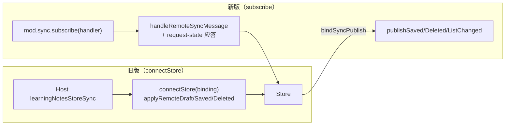
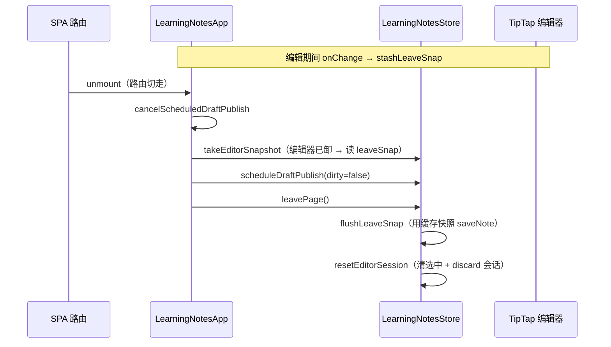

# 跨窗同步重构与离页快照

> 延伸阅读：初始版跨窗同步架构（connectStore 绑定模式）见 [跨窗草稿同步与脏标记仲裁](./跨窗草稿同步与脏标记仲裁.md)。

## 1. 背景与目标

初始版跨窗同步（见 [跨窗草稿同步与脏标记仲裁](./跨窗草稿同步与脏标记仲裁.md)）采用 `connectStore` 绑定模式：插件侧暴露一组回调（`applyRemoteDraft` / `applyRemoteSaved` / `applyRemoteDeleted` / `refreshList`），由 Host 侧 `learningNotesStoreSync` 统一分发。随着实际使用暴露了三类问题：

1. **SPA 路由离开丢稿**：React 路由切走时编辑器先卸载，`takeEditorSnapshot` 读空，原有 `autoSaveIfDirty` 无稿可存。
2. **切篇空隙脏读**：editingId 已变但旧编辑器尚未 onReady，`readDraft` / `registerEditorSnapshot` 用旧标题读新 id，导致广播错位、保存到错误笔记。
3. **保存/删除事件依赖 Host HTTP 包装**：Host 需拦截 HTTP 响应才能广播 saved/deleted；插件侧 Store 成功后无法自发通知对端，架构耦合度高。

本轮重构目标：

- **Hook 迁移到 `src/hooks/`**：从 `views/learning-notes/useLearningNotesHostSync.ts` 移至 `src/hooks/useNoteHostSync.ts`，成为可复用的通用 Hook。
- **subscribe 分发替代 connectStore**：插件侧直接订阅 sync bus，自行处理入站消息（`handleRemoteSyncMessage`），并响应 `request-state` 主动推送本地快照（`publishLocalStateSnapshot`），不再依赖 Host 中间层。
- **Store 自发广播**：`bindSyncPublish` 让 Store 在 save/delete/visibility 成功后自行调 `publishSaved` / `publishDeleted` / `publishListChanged`。
- **离页快照**：`leaveSnap` 缓存 + `stashLeaveSnap` / `flushLeaveSnap` / `leavePage` / `resetEditorSession`，SPA 路由离开时用缓存快照自动保存。
- **编辑器 epoch 守卫**：`editorEpochRef` + `editorReadyEpochRef` + `editorBoundNoteIdRef` 三重 ref，切篇时立刻作废旧编辑器句柄，onReady 后才允许读快照。
- **防抖草稿代际取消**：`draftPublishGen` 代际计数 + `cancelScheduledLearningNotesDraftPublish`，保存成功 / 离页时作废未发出的 dirty:true 防抖。

## 2. 改动范围

| 类型 | 路径 | 说明 |
|------|------|------|
| 删除 | `src/views/learning-notes/useLearningNotesHostSync.ts` | 旧版 Hook（connectStore 绑定模式） |
| 新增 | `src/hooks/useNoteHostSync.ts` | 重构后 Hook（subscribe 分发 + 离页保存 + 代际取消） |
| 改动 | `src/store/learningNotes.ts` | syncPublish / leaveSnap / stashLeaveSnap / flushLeaveSnap / leavePage / resetEditorSession；saveNote/delete 主动广播 |
| 改动 | `src/views/learning-notes/index.tsx` | 编辑器 epoch 守卫、SPA unmount 离页、markClean 广播 dirty:false、syncDirty 缓存快照、re-entry 刷新列表 |

---

## 3. 核心思路

### 3.1 subscribe 分发替代 connectStore



- **入站**：插件直接订阅 sync bus，`handleRemoteSyncMessage` 按 `msg.type` 分发到 `store.applyRemoteDraft/Saved/Deleted/refreshListFromSync`。
- **出站**：Store 通过 `bindSyncPublish` 拿到 `publishSaved/Deleted/ListChanged` 三个回调，在 save/delete/visibility 成功后自行调用。
- **state-snapshot 应答**：收到 `request-state` 时调用 `publishLocalStateSnapshot`，把当前编辑器快照/预览推给对端。

### 3.2 离页快照机制



`syncDirty` 每次 onChange 都调 `store.stashLeaveSnap()`，保证路由离开时即使编辑器已卸载也能拿到最新快照。`leavePage` 先 `flushLeaveSnap`（保存脏稿），再 `resetEditorSession`（清选中态），顺序不能反——否则 `saveTargetId` 丢失会误走新建。

### 3.3 编辑器 epoch 守卫

- `editorEpochRef`：每次 `preview.id` 或 `editorSeed` 变化时 +1（reaction 触发）。
- `editorReadyEpochRef`：onReady/onCreate 时写为当前 `editorEpochRef`。
- `editorBoundNoteIdRef`：onReady/onCreate 时写为当前 `editingId`。
- `editorMatchesTarget()`：`editorReadyEpochRef === editorEpochRef && editorBoundNoteIdRef === saveTargetId`。
- 所有读快照入口（`readDraft`、`registerEditorSnapshot`、`onSave`）都经 `editorMatchesTarget()` 守卫，切篇空隙返回 null / 拒绝保存。

### 3.4 防抖草稿代际取消

- `draftPublishGen`：每次调度 +1，过期 timer 回调比对代际后丢弃。
- `cancelScheduledLearningNotesDraftPublish()`：保存成功 / 离页时调用，作废未发出的 dirty:true 防抖，避免保存后仍推脏稿给对端。

---

## 4. 关键代码对比与注释

### 4.1 Hook 文件迁移与架构重构（纯新增文件）

旧版 `useLearningNotesHostSync.ts` 已删除。新版 `useNoteHostSync.ts` 为纯新增文件，以下贴改动后完整实现。

**改动后** · `src/hooks/useNoteHostSync.ts`（新增文件，约 L1–L413，摘录关键符号）

```typescript
// 引入 React useEffect：本 Hook 的唯一 React API
import { useEffect } from 'react';
// 引入 Store 类型：约束 store 参数与内部访问
import type LearningNotesStore from '@/store/learningNotes';
// 引入正文内容判断工具：关窗保存时判断是否有实质内容
import { hasNoteBodyContent } from '@/views/learning-notes/utils/doc';

/** 与 Host learningNotesSyncBus 消息形状对齐（插件侧消费） */
type SyncMessage = {
	// 消息类型：list-changed / deleted / saved / draft / state-snapshot / request-state / selection
	type: string;
	// 发送方窗口 id：用于回声过滤
	windowId?: string;
	// 笔记 id：消息针对哪一篇
	noteId?: string;
	// 扁平化字段：saved/draft 直接用顶层 html/text/title，不再强制嵌套 draft 对象
	html?: string;
	text?: string;
	title?: string;
	revision?: number;
	uploadSessionId?: string | null;
	// 脏标记：对端声明的脏状态
	dirty?: boolean;
	// 当前选中模式：edit / preview / null
	mode?: 'edit' | 'preview' | null;
	// list-changed 的原因
	reason?: string;
	// saved 事件的服务端更新时间
	updatedAt?: string;
	// state-snapshot 携带的嵌套草稿体（request-state 回包用）
	draft?: {
		html: string;
		text: string;
		title: string;
		revision: number;
		dirty?: boolean;
		uploadSessionId?: string | null;
	};
	// state-snapshot 携带的预览体
	preview?: { html: string; title: string };
};

// Host learningNotes 模块类型：窗口管理 + sync 发布订阅
type LearningNotesHostModule = {
	// 获取本窗唯一 id
	getWindowId(): string;
	// 是否为 Popout 独立窗口
	isPopoutWindow(): boolean;
	// Host 路由打开某笔记时，把目标 id 一次性塞给子插件
	consumeInitialNoteId(): string | null;
	// 注册关窗前回调：Popout 关闭前给插件一次保存机会
	registerBeforeClose?(fn: () => void | Promise<void>): () => void;
	// 同步子总线：发布订阅
	sync: {
		// 发布当前选中的笔记 + 模式
		publishSelection(payload: {
			noteId: string | null;
			mode: 'edit' | 'preview' | null;
		}): void;
		// 发布未保存草稿
		publishDraft(payload: {
			noteId: string;
			html: string;
			text: string;
			title: string;
			revision: number;
			uploadSessionId?: string | null;
			dirty?: boolean;
		}): void;
		// 发布已保存事件（新增：插件侧 Store 成功后自行调）
		publishSaved?(payload: {
			noteId: string;
			html: string;
			title: string;
			updatedAt?: string;
		}): void;
		// 发布删除事件（新增）
		publishDeleted?(noteId: string): void;
		// 发布列表变化事件（新增：新建/删除/可见性切换后通知对端刷新列表）
		publishListChanged?(reason?: string): void;
		// 请求对端把它的当前草稿回一份
		requestState(noteId: string): void;
		// 发布本地状态快照（新增：应答 request-state）
		publishStateSnapshot?(payload: {
			noteId: string;
			draft?: {
				html: string;
				text: string;
				title: string;
				revision: number;
				dirty?: boolean;
				uploadSessionId?: string | null;
			};
			preview?: { html: string; title: string };
		}): void;
		// 订阅所有同步消息
		subscribe(handler: (msg: SyncMessage) => void): () => void;
	};
};

// 宿主 api 对象上与本功能相关的字段类型
type HostApi = {
	// 宿主事件总线
	event?: {
		on: (event: string, handler: (data?: unknown) => void) => void;
		off: (event: string, handler: (data?: unknown) => void) => void;
	};
	// 宿主模块表，可选地挂载 learningNotes 模块
	modules?: { learningNotes?: LearningNotesHostModule };
};

// 导出 HostApi 类型给 index.tsx 合并使用
export type { HostApi };

// 草稿读取器函数类型：由视图层实现，广播时调用
export type LearningNotesDraftReader = () => {
	noteId: string;
	html: string;
	text: string;
	title: string;
} | null;

// 草稿广播 debounce 毫秒
const DRAFT_DEBOUNCE_MS = 180;
// 打开笔记后暂时抑制向外发草稿的毫秒数
const SUPPRESS_DRAFT_AFTER_OPEN_MS = 1000;

// 模块级变量：当前抑制截止的时间戳
let suppressDraftUntil = 0;

// 从 api 中安全取 learningNotes 模块
function getHostModule(api: HostApi): LearningNotesHostModule | undefined {
	return api.modules?.learningNotes;
}

// 读取当前编辑 id 的辅助函数
function getEditingId(store: typeof LearningNotesStore): string | null {
	return store.editingId;
}

// 读取当前预览 id 的辅助函数
function getPreviewId(store: typeof LearningNotesStore): string | null {
	return store.preview?.id ?? null;
}

/**
 * 远端同步消息分发（原 Host learningNotesStoreSync.handleRemoteMessage）。
 * 行为保持不变：回声过滤 → 按 type 调 store.applyRemote* / refreshList。
 */
function handleRemoteSyncMessage(
	msg: SyncMessage,
	store: typeof LearningNotesStore,
	localWindowId: string,
) {
	// 回声过滤：忽略自己发的消息
	if (msg.windowId === localWindowId) return;

	// 按 type 分发
	switch (msg.type) {
		// 列表变化：对端新建/删除/可见性切换后通知本窗刷新列表
		case 'list-changed':
			void store.refreshListFromSync();
			break;
		// 删除：对端删除了某笔记
		case 'deleted':
			if (msg.noteId) {
				store.applyRemoteDeleted(msg.noteId);
				void store.refreshListFromSync();
			}
			break;
		// 保存：对端保存了某笔记
		case 'saved':
			// 仅当本窗正在预览或编辑同篇且有正文时才应用
			if (
				msg.noteId &&
				(getPreviewId(store) === msg.noteId ||
					(Boolean(msg.html?.trim()) && getEditingId(store) === msg.noteId))
			) {
				store.applyRemoteSaved(msg.noteId, {
					html: msg.html ?? '',
					title: msg.title ?? '',
				});
			}
			// 无论是否同篇都刷新列表
			void store.refreshListFromSync();
			break;
		// 草稿：对端正在编辑未保存
		case 'draft':
			// 仅当本窗正在编辑或预览同篇时才应用
			if (
				msg.noteId &&
				(getEditingId(store) === msg.noteId ||
					getPreviewId(store) === msg.noteId)
			) {
				store.applyRemoteDraft(msg.noteId, {
					html: msg.html ?? '',
					title: msg.title ?? '',
					uploadSessionId: msg.uploadSessionId,
					dirty: msg.dirty,
				});
			}
			break;
		// 状态快照：对端应答 requestState
		case 'state-snapshot':
			// 非同篇则跳过
			if (
				!msg.noteId ||
				(getEditingId(store) !== msg.noteId &&
					getPreviewId(store) !== msg.noteId)
			) {
				break;
			}
			// 有草稿体 → 应用草稿
			if (msg.draft?.html.trim()) {
				store.applyRemoteDraft(msg.noteId, {
					html: msg.draft.html,
					title: msg.draft.title,
					uploadSessionId: msg.draft.uploadSessionId,
					dirty: msg.draft.dirty,
				});
			} else if (msg.preview?.html.trim()) {
				// 无草稿但有预览 → 用预览体应用
				store.applyRemoteDraft(msg.noteId, {
					html: msg.preview.html,
					title: msg.preview.title,
				});
			}
			break;
		// 未知类型：忽略
		default:
			break;
	}
}

/** 本窗正在看 noteId 时，把未保存草稿/预览推给对端 */
function publishLocalStateSnapshot(
	mod: LearningNotesHostModule,
	store: typeof LearningNotesStore,
	noteId: string,
) {
	// Host 未实现 publishStateSnapshot 则跳过
	if (!mod.sync.publishStateSnapshot) return;
	// 判断本窗当前是否编辑或预览同篇
	const editing = store.editingId === noteId;
	const previewing = store.preview?.id === noteId;
	if (!editing && !previewing) return;

	// 编辑态：取编辑器快照
	const snap = editing ? store.takeEditorSnapshot() : null;
	// 有正文或脏标 → 构造草稿体
	const draft =
		snap && (snap.html.trim() || snap.dirty)
			? {
					html: snap.html,
					text: snap.text,
					title: snap.title,
					revision: Date.now(),
					dirty: snap.dirty,
					uploadSessionId: store.uploadSessionId ?? null,
				}
			: undefined;

	// 预览态：取预览 html/title
	const preview = previewing
		? {
				html: store.preview?.html ?? '',
				title: store.preview?.title ?? '',
			}
		: undefined;

	// 切篇空隙快照为空时不要推，避免对端用空稿清掉未保存内容
	if (!draft && !preview) return;

	// 推送本地状态快照
	mod.sync.publishStateSnapshot({
		noteId,
		draft,
		preview,
	});
}

/** 关窗前保存：插件业务；Host 仅 await registerBeforeClose 回调 */
async function saveLearningNotesOnWindowClose(
	api: HostApi,
	store: typeof LearningNotesStore,
): Promise<void> {
	// 先 blur 激活元素，触发 TipTap onBlur 同步最新内容
	(document.activeElement as HTMLElement | null)?.blur?.();
	// 预览态不保存
	if (store.preview) return;

	// 取编辑器快照（可能已 fallback 到 leaveSnap）
	const snap = store.takeEditorSnapshot();
	let saved = false;

	// 有脏标 → 先尝试自动保存
	if (snap?.dirty) {
		saved = await store.autoSaveIfDirty({ silent: true });
	}

	// 仅在仍脏时重试；勿对「无 id + 不脏」强制 save，否则会反复 POST 出同标题副本
	if (!saved && snap?.dirty && hasNoteBodyContent(snap.html, snap.text)) {
		saved = await store.saveNote(
			{
				title: snap.title,
				html: snap.html,
				text: snap.text,
				dirty: true,
			},
			{ silent: true, auto: true },
		);
	}

	// 兜底：keepalive 保存/结算
	if (!saved) {
		store.flushNoteOnPageHide();
		saved = Boolean(snap?.dirty);
	}

	// 保存成功后通知对端刷新列表
	if (saved) {
		getHostModule(api)?.sync.publishListChanged?.('popout-close-save');
	}
}

// 打开笔记时调用：设置外发抑制截止点
function beginAwaitRemoteSnapshot() {
	suppressDraftUntil = Date.now() + SUPPRESS_DRAFT_AFTER_OPEN_MS;
}

// 对端快照到了或抑制过期时调用：解除抑制
function endAwaitRemoteSnapshot() {
	suppressDraftUntil = 0;
}

// 主 hook：建立 subscribe 订阅、registerBeforeClose、初始 id、切笔记广播
export function useLearningNotesHostSync(
	api: HostApi,
	store: typeof LearningNotesStore,
) {
	// effect1：建立 subscribe 订阅 + registerBeforeClose + 处理 initial id
	useEffect(() => {
		const mod = getHostModule(api);
		if (!mod) return;

		// 把 Store 的出站广播回调绑定到 Host sync.publish*
		store.bindSyncPublish({
			// 保存成功后广播 saved
			saved: (payload) => mod.sync.publishSaved?.(payload),
			// 删除后广播 deleted
			deleted: (noteId) => mod.sync.publishDeleted?.(noteId),
			// 列表变化后广播 listChanged
			listChanged: (reason) => mod.sync.publishListChanged?.(reason),
		});

		// 本窗唯一 id
		const localWindowId = mod.getWindowId();
		// 收集卸载方法
		const disposers: Array<() => void> = [];

		/** 订总线：入站分发 + 出站 snapshot 应答（原 connectStore + Host 分发） */
		disposers.push(
			mod.sync.subscribe((msg) => {
				// 回声过滤
				if (msg.windowId === localWindowId) return;

				// 对端请求状态 → 推本地快照
				if (msg.type === 'request-state' && msg.noteId) {
					publishLocalStateSnapshot(mod, store, msg.noteId);
					return;
				}
				// 对端 selection：仅当本窗编辑同篇且有脏标时推快照
				if (msg.type === 'selection' && msg.noteId) {
					if (store.editingId !== msg.noteId) return;
					const snap = store.takeEditorSnapshot();
					if (snap?.dirty) publishLocalStateSnapshot(mod, store, msg.noteId);
					return;
				}

				// 常规消息分发
				handleRemoteSyncMessage(msg, store, localWindowId);

				// state-snapshot 到达后解除外发抑制
				if (msg.type === 'state-snapshot') {
					const noteId = store.preview?.id ?? store.editingId ?? null;
					if (msg.noteId && msg.noteId === noteId) {
						endAwaitRemoteSnapshot();
					}
				}
			}),
		);

		// Popout 窗口：注册关窗前保存回调
		if (mod.isPopoutWindow() && mod.registerBeforeClose) {
			disposers.push(
				mod.registerBeforeClose(() =>
					saveLearningNotesOnWindowClose(api, store),
				),
			);
		}

		// Host 路由要求直接打开某笔记
		const initialId = mod.consumeInitialNoteId();
		if (initialId) {
			void store.openEditById(initialId);
		}

		// 卸载：逐个 dispose + 解绑 syncPublish
		return () => {
			for (const d of disposers) d();
			store.bindSyncPublish(null);
		};
	}, [api, store]);

	/** 切到同一笔记（编辑或预览）：广播 selection，并向对端拉未保存草稿 */
	useEffect(() => {
		const mod = getHostModule(api);
		if (!mod) return;
		// 预览优先
		const noteId = store.preview?.id ?? store.editingId ?? null;
		mod.sync.publishSelection({
			noteId,
			mode: store.preview ? 'preview' : store.editingId ? 'edit' : null,
		});
		// 没选中任何笔记就结束抑制并返回
		if (!noteId) {
			endAwaitRemoteSnapshot();
			return undefined;
		}
		// 进入拉快照阶段
		beginAwaitRemoteSnapshot();
		mod.sync.requestState(noteId);
		// 320ms 后重试一次（慢网兜底）
		const retry = window.setTimeout(() => {
			mod.sync.requestState(noteId);
		}, 320);
		// 抑制超时兜底
		const timer = window.setTimeout(
			endAwaitRemoteSnapshot,
			SUPPRESS_DRAFT_AFTER_OPEN_MS,
		);
		return () => {
			window.clearTimeout(retry);
			window.clearTimeout(timer);
		};
	}, [api, store.editingId, store.preview?.id, store.loadingDetail]);
}

// 草稿版本号
const draftRevisionRef = { current: 0 };
// debounce 定时器句柄
let draftDebounceTimer: ReturnType<typeof setTimeout> | null = null;
// 每次调度递增；过期 timer 回调直接丢弃，避免保存/撤回后仍推 dirty:true
let draftPublishGen = 0;

/** 取消未发出的防抖草稿（保存成功 / 离页时调用） */
export function cancelScheduledLearningNotesDraftPublish() {
	// 代际 +1：让所有未发出的 timer 回调失效
	draftPublishGen += 1;
	// 清除定时器
	if (draftDebounceTimer) {
		clearTimeout(draftDebounceTimer);
		draftDebounceTimer = null;
	}
}

/** 编辑器 onChange 时 debounce 广播草稿；dirty→clean 立即发 */
export function scheduleLearningNotesDraftPublish(
	api: HostApi,
	draft: NonNullable<ReturnType<LearningNotesDraftReader>>,
	uploadSessionId?: string | null,
	dirty?: boolean,
) {
	const mod = getHostModule(api);
	if (!mod) return;

	// 切篇后抑制 dirty:true，避免旧正文盖对端未保存稿；dirty:false 必须放行
	if (dirty !== false && Date.now() < suppressDraftUntil) return;

	// 代际 +1，拿到本次调度的代号
	const gen = ++draftPublishGen;
	// 清除上一次未发出的防抖
	if (draftDebounceTimer) {
		clearTimeout(draftDebounceTimer);
		draftDebounceTimer = null;
	}

	// publish 闭包：比对代际后决定是否真正发出
	const publish = () => {
		// 代际不匹配 → 本次调度已被取消
		if (gen !== draftPublishGen) return;
		// 抑制期内且非 dirty:false → 丢弃
		if (dirty !== false && Date.now() < suppressDraftUntil) return;
		draftRevisionRef.current += 1;
		mod.sync.publishDraft({
			...draft,
			revision: draftRevisionRef.current,
			uploadSessionId: uploadSessionId ?? null,
			dirty: dirty ?? true,
		});
	};

	// dirty:false 立即发，不走防抖
	if (dirty === false) {
		publish();
		return;
	}
	// dirty:true 走 DRAFT_DEBOUNCE_MS 防抖
	draftDebounceTimer = setTimeout(publish, DRAFT_DEBOUNCE_MS);
}
```

**变更摘要**：文件从 `views/learning-notes/` 迁移到 `hooks/`。`connectStore` 绑定模式被 `subscribe` + `handleRemoteSyncMessage` + `publishLocalStateSnapshot` 替代。新增 `saveLearningNotesOnWindowClose`（Popout 关窗保存）、`cancelScheduledLearningNotesDraftPublish`（代际取消防抖草稿）、`draftPublishGen`（代际计数器）。Host 模块类型新增 `publishSaved` / `publishDeleted` / `publishListChanged` / `publishStateSnapshot` / `registerBeforeClose`。

---

### 4.2 `syncPublish` 字段与 `bindSyncPublish`（Store 新增）

**改动前** · `src/store/learningNotes.ts`（基线，约 L49–L56）

```typescript
	// Host 透传的下载二进制能力
	private downloadBlob: HostDownloadBlob | null = null;
	// 快照读取回调
	private editorSnapshotReader: (() => NoteEditorSnapshot | null) | null = null;
	// 远端草稿接收器
	private remoteDraftApplier: ... = null;
```

**改动后** · `src/store/learningNotes.ts`（当前，约 L49–L72）

```typescript
	// Host 透传的下载二进制能力
	private downloadBlob: HostDownloadBlob | null = null;
	// 出站同步广播回调集合：由 useNoteHostSync 注册，Store save/delete 后自行调
	private syncPublish: {
		// 保存成功后广播
		saved?: (payload: { noteId: string; html: string; title: string }) => void;
		// 删除后广播
		deleted?: (noteId: string) => void;
		// 列表变化后广播
		listChanged?: (reason?: string) => void;
	} | null = null;
	// 快照读取回调
	private editorSnapshotReader: (() => NoteEditorSnapshot | null) | null = null;
	/**
	 * 编辑过程中缓存的离页快照。SPA 路由离开时编辑器先卸载，
	 * takeEditorSnapshot 会读空，需靠此缓存才能自动保存。
	 */
	private leaveSnap: (NoteEditorSnapshot & { noteId: string | null }) | null =
		null;
	// 远端草稿接收器
	private remoteDraftApplier: ... = null;
```

**变更摘要**：Store 新增两个私有字段：`syncPublish`（出站广播回调集合）和 `leaveSnap`（离页快照缓存）。

---

### 4.3 `bindSyncPublish` + `takeEditorSnapshot` 回落 + `stashLeaveSnap` + `flushLeaveSnap` + `resetEditorSession` + `leavePage`（Store 新增方法群）

**改动前** · `src/store/learningNotes.ts`（基线，约 L131–L137）

```typescript
	registerEditorSnapshot(fn: (() => NoteEditorSnapshot | null) | null): void {
		this.editorSnapshotReader = fn;
	}

	/** Host / 关窗：读取当前编辑器快照 */
	takeEditorSnapshot(): NoteEditorSnapshot | null {
		return this.editorSnapshotReader?.() ?? null;
	}
```

**改动后** · `src/store/learningNotes.ts`（当前，约 L140–L230）

```typescript
	/** 跨窗同步：保存/删除后由插件显式 publish（不再依赖 Host HTTP 包装） */
	bindSyncPublish(
		sync: {
			saved?: (payload: {
				noteId: string;
				html: string;
				title: string;
			}) => void;
			deleted?: (noteId: string) => void;
			listChanged?: (reason?: string) => void;
		} | null,
	) {
		// 绑定或解绑出站广播回调
		this.syncPublish = sync;
	}

	registerEditorSnapshot(fn: (() => NoteEditorSnapshot | null) | null): void {
		this.editorSnapshotReader = fn;
	}

	/** 关窗 / 跨窗 snapshot：优先读编辑器；已卸载则回落到离页缓存 */
	takeEditorSnapshot(): NoteEditorSnapshot | null {
		// 先尝试读编辑器实时快照
		const live = this.editorSnapshotReader?.() ?? null;
		if (live) return live;
		// 编辑器已卸载 → 回落到 leaveSnap 缓存
		const stashed = this.leaveSnap;
		if (!stashed) return null;
		// 当前保存目标 id
		const target = this.editingId ?? this.boundNoteId;
		// 切篇空隙：缓存仍是上一篇时不得用于当前 id
		if (stashed.noteId !== target) return null;
		return stashed;
	}

	/** 编辑 onChange 时写入；预览/无效编辑器时清掉 */
	stashLeaveSnap(
		snap: (NoteEditorSnapshot & { noteId: string | null }) | null,
	): void {
		this.leaveSnap = snap;
	}

	/** SPA 离页：用缓存快照静默保存（编辑器可能已卸载） */
	async flushLeaveSnap(): Promise<boolean> {
		// 预览态或保存中 → 不保存
		if (this.saving || this.preview) return false;
		// 取快照（可能 fallback 到 leaveSnap）
		const snap = this.takeEditorSnapshot();
		// 无脏标 → 不保存
		if (!snap?.dirty) return false;
		// 无正文且无标题 → 不保存
		if (!hasNoteBodyContent(snap.html, snap.text) && !snap.title.trim()) {
			return false;
		}
		// 静默自动保存
		const ok = await this.saveNote(
			{
				title: snap.title,
				html: snap.html,
				text: snap.text,
				dirty: true,
			},
			{ silent: true, auto: true },
		);
		// 保存成功后把缓存的脏标清掉，避免重复保存
		if (ok && this.leaveSnap) {
			this.leaveSnap = { ...this.leaveSnap, dirty: false };
		}
		return ok;
	}

	/**
	 * 离开学习笔记页：清编辑/预览选中态（保留 listOpen）。
	 * 重进不再挂着旧 editingId + editorInitial，避免用过期正文顶掉服务端最新稿。
	 */
	resetEditorSession(): void {
		// 清预览
		this.preview = null;
		// 清编辑 id
		this.editingId = null;
		// 清绑定 id
		this.boundNoteId = null;
		// 清 pending 草稿
		this.pendingPeerDraft = null;
		// 清服务端基线
		this.savedBaselineHtml = null;
		// 清离页快照
		this.leaveSnap = null;
		// 清 detail loading
		this.loadingDetail = false;
		// 清删除确认
		this.confirmOpen = false;
		this.pendingDeleteId = null;
		// 清可见性确认
		this.visibilityConfirmOpen = false;
		this.pendingVisibility = null;
		// 编辑器初始值重置
		this.editorInitial = EMPTY_NOTE_DOC;
		// seed +1 触发 remount
		this.editorSeed += 1;
		// 丢弃上传会话
		void this.discardUploadSession();
	}

	/** 离页：先保存脏稿，再清选中（顺序不能反，否则 saveTargetId 丢失会误新建） */
	async leavePage(): Promise<void> {
		// 先保存（用 leaveSnap，此时编辑器可能已卸载）
		await this.flushLeaveSnap();
		// 再清选中态
		this.resetEditorSession();
	}
```

**变更摘要**：6 个新方法。`bindSyncPublish` 让 Store 绑定出站广播回调；`takeEditorSnapshot` 增加回落到 `leaveSnap`；`stashLeaveSnap` / `flushLeaveSnap` / `resetEditorSession` / `leavePage` 构成 SPA 离页保存链。

---

### 4.4 `saveNote` 保存后主动广播 saved + listChanged

**改动前** · `src/store/learningNotes.ts`（基线，约 L627–L672）

```typescript
		if (!this.api) {
			this.toast(this.t('learningNotes.toast.httpDeniedSave'), 'error');
			return false;
		}
		this.saving = true;
		try {
			const sessionId = this.uploadSessionId;
			const payload = {
				title: input.title.trim() || this.t('common.untitledNote'),
				html: input.html,
				uploadSessionId: sessionId,
			};
			const noteId = this.saveTargetId;
			if (noteId) {
				const updated = await this.api.update(noteId, payload);
				runInAction(() => {
					this.editingId = updated.id;
					this.bindNoteId(updated.id);
					this.rotateUploadSession();
				});
				// ...（Toast 略）
			} else {
				const { id } = await this.api.save(payload);
				runInAction(() => {
					this.editingId = id;
					this.bindNoteId(id);
					this.rotateUploadSession();
				});
				// ...（Toast 略）
			}
			// ...（refreshList 略）
```

**改动后** · `src/store/learningNotes.ts`（当前，约 L718–L775）

```typescript
		if (!this.api) {
			this.toast(this.t('learningNotes.toast.httpDeniedSave'), 'error');
			return false;
		}
		// 离页时 unmount 会先卸 bindSyncPublish；await 前先抓住，否则对端收不到 saved
		const sync = this.syncPublish;
		this.saving = true;
		try {
			const sessionId = this.uploadSessionId;
			const payload = {
				title: input.title.trim() || this.t('common.untitledNote'),
				html: input.html,
				uploadSessionId: sessionId,
			};
			const noteId = this.saveTargetId;
			// 保存前预存 id/html/title，await 后 runInAction 可能已改 editingId
			let savedId = noteId;
			const savedHtml = payload.html;
			const savedTitle = payload.title;
			if (noteId) {
				const updated = await this.api.update(noteId, payload);
				// 保存返回 id 可能与请求不同（服务端去重）
				savedId = updated.id;
				runInAction(() => {
					this.editingId = updated.id;
					this.bindNoteId(updated.id);
					this.rotateUploadSession();
				});
				// ...（Toast 略）
			} else {
				const { id } = await this.api.save(payload);
				// 新建返回的 id
				savedId = id;
				runInAction(() => {
					this.editingId = id;
					this.bindNoteId(id);
					this.rotateUploadSession();
				});
				// ...（Toast 略）
			}
			// 保存成功后：更新 leaveSnap + 主动广播 saved + listChanged
			if (savedId) {
				// leaveSnap 更新为干净状态
				this.leaveSnap = {
					noteId: savedId,
					title: savedTitle,
					html: savedHtml,
					text: this.leaveSnap?.text ?? '',
					dirty: false,
				};
				// 广播 saved 给对端
				sync?.saved?.({
					noteId: savedId,
					html: savedHtml,
					title: savedTitle,
				});
				// 广播 listChanged 给对端（区分 update/save）
				sync?.listChanged?.(noteId ? 'update' : 'save');
			}
			// ...（refreshList 略）
```

**变更摘要**：1）await 前先抓 `sync` 引用（unmount 会解绑）；2）预存 `savedId/savedHtml/savedTitle`；3）保存成功后更新 `leaveSnap` 为干净态、主动调 `sync.saved` + `sync.listChanged`。

---

### 4.5 `deleteNote` 删除后主动广播 deleted + listChanged

**改动后** · `src/store/learningNotes.ts`（当前，约 L965–L970）

```typescript
				// 清 boundNoteId
				if (this.boundNoteId === id) this.boundNoteId = null;
				// 清 pendingDeleteId
				this.pendingDeleteId = null;
			});
			// 主动广播 deleted + listChanged 给对端
			this.syncPublish?.deleted?.(id);
			this.syncPublish?.listChanged?.('delete');
			// Toast 提示
			this.toast(this.t('learningNotes.toast.deleted'), 'success');
			// 刷新列表
			await this.refreshList();
```

**变更摘要**：删除成功后 Store 自行调 `syncPublish.deleted` + `syncPublish.listChanged`，不再依赖 Host HTTP 包装层。

---

### 4.6 可见性切换后广播 listChanged

**改动后** · `src/store/learningNotes.ts`（当前，约 L824）

```typescript
			// 清可见性确认
			this.pendingVisibility = null;
			this.visibilityConfirmOpen = false;
		});
		// 可见性切换后通知对端刷新列表
		this.syncPublish?.listChanged?.('visibility');
		// Toast 提示
		this.toast(...)
```

**变更摘要**：可见性切换（公开↔私有）后列表会变，需通知对端刷新。

---

### 4.7 `leaveEditor` 清 leaveSnap

**改动后** · `src/store/learningNotes.ts`（当前，约 L556）

```typescript
		// 清绑定 id
		this.bindNoteId(null);
		// 清 pending 草稿
		this.pendingPeerDraft = null;
		// 清服务端基线
		this.savedBaselineHtml = null;
		// 清离页快照（切篇时旧快照不得残留）
		this.leaveSnap = null;
		// 旋转上传会话
		this.rotateUploadSession();
		// 编辑器初始值重置
		this.editorInitial = EMPTY_NOTE_DOC;
		// seed +1
		this.editorSeed += 1;
```

**变更摘要**：`leaveEditor`（切篇/新建时调用）新增 `this.leaveSnap = null`，防止旧快照残留导致新笔记读到上一篇内容。

---

### 4.8 视图层：编辑器 epoch 守卫三重 ref

**改动后** · `src/views/learning-notes/index.tsx`（当前，约 L92–L97）

```typescript
	// TipTap 编辑器 ref
	const editorRef = useRef<Editor | null>(null);
	// 长文 save api ref
	const pagedSaveRef = useRef<LargeNoteSaveApi | null>(null);
	/** 当前编辑器绑定的笔记 id（新建为 null）；须与 saveTargetId 一致才可读快照 */
	const editorBoundNoteIdRef = useRef<string | null>(null);
	/** 切篇时 +1；onReady 对齐后才允许读编辑器，避免旧标题写入新 noteId */
	const editorEpochRef = useRef(0);
	// 编辑器 onReady/onCreate 时的 epoch 快照
	const editorReadyEpochRef = useRef(-1);
	// 保存中 ref
	const savingRef = useRef(false);
	// 预览 ref
	const previewRef = useRef(store.preview);
```

**变更摘要**：新增 `editorBoundNoteIdRef`、`editorEpochRef`、`editorReadyEpochRef` 三个 ref，构成编辑器 epoch 守卫。

---

### 4.9 视图层：`reaction` 监听切篇 + 新建首次保存绑定

**改动后** · `src/views/learning-notes/index.tsx`（当前，约 L227–L265）

```typescript
	/**
	 * 换篇 / 进预览时立刻丢掉旧编辑器句柄（早于 React commit/onReady）。
	 * 只盯 editorSeed + preview：新建首次保存会写 editingId，不能因此打断当前编辑器。
	 */
	useEffect(() => {
		// reaction：返回 disposer
		return reaction(
			// 监听表达式：preview.id + editorSeed 拼接
			() => `${store.preview?.id ?? ''}:${store.editorSeed}`,
			() => {
				// epoch +1：作废当前编辑器
				editorEpochRef.current += 1;
				// 清 paged save api
				pagedSaveRef.current = null;
				// 清 editor ref
				editorRef.current = null;
				// 清绑定 noteId
				editorBoundNoteIdRef.current = null;
			},
		);
	}, [store]);

	/** 新建首次保存后：同一编辑器实例补上 noteId 绑定 */
	useEffect(() => {
		// reaction：返回 disposer
		return reaction(
			// 监听 editingId 变化
			() => store.editingId,
			(id) => {
				// 仅当编辑器已 onReady（epoch 匹配）时才绑定
				if (editorReadyEpochRef.current !== editorEpochRef.current) return;
				// 仅当当前绑定为 null 且新 id 非空时才补绑
				if (editorBoundNoteIdRef.current == null && id) {
					editorBoundNoteIdRef.current = id;
				}
			},
		);
	}, [store]);

	// 编辑器是否匹配当前保存目标
	const editorMatchesTarget = useCallback(() => {
		// epoch 不匹配 → 编辑器尚未 onReady 或已切篇
		if (editorReadyEpochRef.current !== editorEpochRef.current) return false;
		// 保存目标 id
		const targetId = store.editingId ?? store.boundNoteId;
		// 绑定 id 必须与目标一致
		return editorBoundNoteIdRef.current === targetId;
	}, [store]);
```

**变更摘要**：两个 `reaction` effect + 一个 `editorMatchesTarget` callback。`reaction` 来自 MobX，比 `useEffect` 更早触发（在 React commit 前），确保切篇时编辑器句柄立刻作废。`editorMatchesTarget` 作为所有读快照入口的守卫。

---

### 4.10 视图层：`markClean` 增加 cancelDebounce + 广播 dirty:false

**改动前** · `src/views/learning-notes/index.tsx`（基线，约 L144–L151）

```typescript
	const markClean = useCallback(() => {
		const html = currentHtml();
		alignCleanBaseline(html);
		dirtyRef.current = false;
		remoteDirtyLockRef.current = false;
		pendingRemoteDirtyRef.current = false;
		pendingRemoteCleanRef.current = false;
		pendingRemoteBaselineRef.current = '';
		setDirty(false);
	}, [alignCleanBaseline, currentHtml]);
```

**改动后** · `src/views/learning-notes/index.tsx`（当前，约 L151–L185）

```typescript
	const markClean = useCallback(() => {
		const html = currentHtml();
		alignCleanBaseline(html);
		dirtyRef.current = false;
		remoteDirtyLockRef.current = false;
		pendingRemoteDirtyRef.current = false;
		pendingRemoteCleanRef.current = false;
		pendingRemoteBaselineRef.current = '';
		setDirty(false);

		// 作废未发出的 dirty:true 防抖；并广播 dirty:false，对端对齐基线熄灭脏标
		cancelScheduledLearningNotesDraftPublish();
		// 当前编辑 id
		const noteId = store.editingId;
		if (!noteId) return;
		// 长笔记优先
		const paged = pagedSaveRef.current;
		const editor = editorRef.current;
		if (paged) {
			// 广播 dirty:false
			scheduleLearningNotesDraftPublish(
				api,
				{
					noteId,
					title: paged.getTitle(),
					html: paged.getHTML(),
					text: paged.getText(),
				},
				store.uploadSessionId,
				false,
			);
			return;
		}
		// 短笔记
		if (editor && !editor.isDestroyed) {
			scheduleLearningNotesDraftPublish(
				api,
				{
					noteId,
					title: getDocTitleText(editor.state.doc).trim(),
					html: editor.getHTML(),
					text: editor.getText({ blockSeparator: '\n\n' }).trim(),
				},
				store.uploadSessionId,
				false,
			);
		}
	}, [alignCleanBaseline, api, currentHtml, store]);
```

**变更摘要**：保存成功后 `markClean` 不再只清本地状态，还要：1）取消未发出的 dirty:true 防抖（`cancelScheduledLearningNotesDraftPublish`）；2）立即广播 dirty:false 给对端（`scheduleLearningNotesDraftPublish(..., false)`），否则对端仍显示脏标。

---

### 4.11 视图层：`readDraft` 增加 epoch 守卫

**改动前** · `src/views/learning-notes/index.tsx`（基线，约 L202–L221）

```typescript
	const readDraft = useCallback(() => {
		const noteId = store.editingId;
		if (!noteId) return null;
		const paged = pagedSaveRef.current;
		if (paged) {
			return { noteId, title: paged.getTitle(), text: paged.getText(), html: paged.getHTML() };
		}
		const editor = editorRef.current;
		if (!editor || editor.isDestroyed) return null;
		return {
			noteId,
			title: getDocTitleText(editor.state.doc).trim(),
			text: editor.getText({ blockSeparator: '\n\n' }).trim(),
			html: editor.getHTML(),
		};
	}, [store.editingId]);
```

**改动后** · `src/views/learning-notes/index.tsx`（当前，约 L278–L299）

```typescript
	const readDraft = useCallback(() => {
		const noteId = store.editingId;
		// epoch 守卫：编辑器未 onReady 或已切篇 → 不读
		if (!noteId || !editorMatchesTarget() || editorBoundNoteIdRef.current !== noteId) {
			return null;
		}
		const paged = pagedSaveRef.current;
		if (paged) {
			return { noteId, title: paged.getTitle(), text: paged.getText(), html: paged.getHTML() };
		}
		const editor = editorRef.current;
		if (!editor || editor.isDestroyed) return null;
		return {
			noteId,
			title: getDocTitleText(editor.state.doc).trim(),
			text: editor.getText({ blockSeparator: '\n\n' }).trim(),
			html: editor.getHTML(),
		};
	}, [editorMatchesTarget, store.editingId]);
```

**变更摘要**：`readDraft` 增加 `editorMatchesTarget()` + `editorBoundNoteIdRef.current !== noteId` 双重守卫，切篇空隙返回 null，防止用旧编辑器读新 id。

---

### 4.12 视图层：`syncDirty` 增加离页快照缓存

**改动前** · `src/views/learning-notes/index.tsx`（基线，约 L225–L257）

```typescript
	const syncDirty = useCallback(() => {
		if (applyingRemoteRef.current) return;
		const html = currentHtml();
		const baseline = baselineHtmlRef.current || openBaselineRef.current;
		const nextDirty = !editorHtmlEquals(html, baseline);
		const wasDirty = dirtyRef.current;
		if (!nextDirty) {
			remoteDirtyLockRef.current = false;
			pendingRemoteDirtyRef.current = false;
			pendingRemoteCleanRef.current = false;
			alignCleanBaseline(html);
		}
		dirtyRef.current = nextDirty;
		setDirty(nextDirty);
		if (wasDirty && !nextDirty) {
			void store.settleUploadSessionIfNeeded(html);
		}
		const draft = readDraft();
		if (draft && (nextDirty || wasDirty)) {
			scheduleLearningNotesDraftPublish(api, draft, store.uploadSessionId, nextDirty);
		}
	}, [alignCleanBaseline, api, currentHtml, readDraft, store]);
```

**改动后** · `src/views/learning-notes/index.tsx`（当前，约 L318–L395）

```typescript
	const syncDirty = useCallback(() => {
		// 应用远端草稿时跳过
		if (applyingRemoteRef.current) return;
		const html = currentHtml();
		// 基线优先级
		const baseline = baselineHtmlRef.current || openBaselineRef.current;
		const nextDirty = !editorHtmlEquals(html, baseline);
		const wasDirty = dirtyRef.current;
		// 变干净时清锁 + 对齐基线
		if (!nextDirty) {
			remoteDirtyLockRef.current = false;
			pendingRemoteDirtyRef.current = false;
			pendingRemoteCleanRef.current = false;
			alignCleanBaseline(html);
		}
		dirtyRef.current = nextDirty;
		setDirty(nextDirty);
		// dirty→clean 时结算上传会话
		if (wasDirty && !nextDirty) {
			void store.settleUploadSessionIfNeeded(html);
		}

		// 缓存离页快照：路由离开时编辑器已卸，靠它自动保存
		if (!store.preview && editorMatchesTarget()) {
			const paged = pagedSaveRef.current;
			const editor = editorRef.current;
			if (paged) {
				// 长笔记：用 paged save api 读
				store.stashLeaveSnap({
					noteId: store.editingId ?? store.boundNoteId,
					title: paged.getTitle(),
					html: paged.getHTML(),
					text: paged.getText(),
					dirty: nextDirty,
				});
			} else if (editor && !editor.isDestroyed) {
				// 短笔记：用 TipTap editor 读
				store.stashLeaveSnap({
					noteId: store.editingId ?? store.boundNoteId,
					title: getDocTitleText(editor.state.doc).trim(),
					html: editor.getHTML(),
					text: editor.getText({ blockSeparator: '\n\n' }).trim(),
					dirty: nextDirty,
				});
			}
		}

		// 广播草稿
		const draft = readDraft();
		if (draft && (nextDirty || wasDirty)) {
			scheduleLearningNotesDraftPublish(api, draft, store.uploadSessionId, nextDirty);
		}
	}, [
		alignCleanBaseline,
		api,
		currentHtml,
		editorMatchesTarget,
		readDraft,
		store,
	]);
```

**变更摘要**：onChange 时同步缓存 `leaveSnap`，保证 SPA 路由离开时即使编辑器已卸载也能自动保存。`editorMatchesTarget()` 守卫防止切篇空隙缓存到旧编辑器内容。

---

### 4.13 视图层：SPA unmount 离页 + re-entry 刷新列表

**改动后** · `src/views/learning-notes/index.tsx`（当前，约 L355–L425）

```typescript
	/** 再次进入且列表仍开着：拉最新（单例 store 会保留 listOpen，不会再走 setListOpen） */
	useEffect(() => {
		// 无 http 或列表未展开 → 不刷新
		if (!api.http || !store.listOpen) return;
		void store.refreshList();
	}, [api.http, store]);

	/** SPA 离开学习笔记：先通知对端清脏，再异步保存（unmount 会立刻卸 syncPublish） */
	useEffect(() => {
		return () => {
			// 作废未发出的 dirty:true 防抖
			cancelScheduledLearningNotesDraftPublish();
			// 取当前 id 和快照（编辑器可能已卸 → fallback 到 leaveSnap）
			const noteId = store.editingId ?? store.boundNoteId;
			const snap = store.takeEditorSnapshot();
			// 同步广播 dirty:false，子窗立刻熄灭变更标（不等 HTTP）
			if (noteId && snap && !store.preview) {
				scheduleLearningNotesDraftPublish(
					api,
					{
						noteId,
						title: snap.title,
						html: snap.html,
						text: snap.text,
					},
					store.uploadSessionId,
					false,
				);
			}
			// 离页：先保存脏稿，再清选中
			void store.leavePage();
		};
	}, [api, store]);
```

**变更摘要**：两个新 effect。re-entry 时如果列表仍开着就刷新（单例 store 不会重新走 `setListOpen`）。unmount 时先广播 dirty:false（同步、不等 HTTP），再 `leavePage()`（异步保存 + 清选中）。

---

### 4.14 视图层：`registerEditorSnapshot` 增加 epoch 守卫

**改动后** · `src/views/learning-notes/index.tsx`（当前，约 L419–L435）

```typescript
	useEffect(() => {
		store.registerEditorSnapshot(() => {
			// 预览态不读
			if (store.preview) return null;
			// 切篇空隙：editingId 已变但编辑器尚未 onReady，禁止用旧标题保存/同步
			if (!editorMatchesTarget()) return null;
			const paged = pagedSaveRef.current;
			if (paged) {
				return {
					title: paged.getTitle(),
					html: paged.getHTML(),
					text: paged.getText(),
					dirty: dirtyRef.current,
				};
			}
			// ...（短笔记分支略）
		});
		return () => store.registerEditorSnapshot(null);
	}, [editorMatchesTarget, store.preview]);
```

**变更摘要**：`registerEditorSnapshot` 注册的回调增加 `editorMatchesTarget()` 守卫，切篇空隙返回 null。

---

### 4.15 视图层：`registerRemoteDraftApplier` forceClean 分支增加基线对齐 + fuzzy 比较

**改动前** · `src/views/learning-notes/index.tsx`（基线，约 L307–L320）

```typescript
			} else {
				remoteDirtyLockRef.current = false;
				pendingRemoteDirtyRef.current = false;
				pendingRemoteCleanRef.current = true;
				dirtyRef.current = false;
				setDirty(false);
			}

			if (paged || !editor || editor.isDestroyed) {
				// ...
				return false;
			}
			if (editor.getHTML() === draft.html) {
```

**改动后** · `src/views/learning-notes/index.tsx`（当前，约 L448–L465）

```typescript
			} else {
				remoteDirtyLockRef.current = false;
				pendingRemoteDirtyRef.current = false;
				pendingRemoteCleanRef.current = true;
				dirtyRef.current = false;
				setDirty(false);
				// remount 前先对齐基线，避免 onReady 在 forceClean 丢失时又因 html≠旧基线点亮
				if (draft.html.trim()) {
					alignCleanBaseline(draft.html);
				}
			}

			if (paged || !editor || editor.isDestroyed) {
				// ...
				return false;
			}
			// 用 fuzzy 比较替代严格恒等，避免尾部空段差异误判
			if (editorHtmlEquals(editor.getHTML(), draft.html)) {
```

**变更摘要**：1）forceClean 分支增加 `alignCleanBaseline(draft.html)`，remount 后 onReady 不再因 html≠旧基线误点亮脏标；2）严格恒等 `===` → `editorHtmlEquals` fuzzy 比较。

---

### 4.16 视图层：onReady/onCreate 写 epoch + boundNoteId

**改动前** · `src/views/learning-notes/index.tsx`（基线，约 L650–L670）

```typescript
										onReady={(e, save) => {
											editorRef.current = e;
											pagedSaveRef.current = save;
											applyEditorReadyDirty(save.getHTML());
											setReadyKey(editorKey);
										}}
										onCreate={(e) => {
											editorRef.current = e;
											pagedSaveRef.current = null;
											applyEditorReadyDirty(e.getHTML());
											setReadyKey(editorKey);
										}}
```

**改动后** · `src/views/learning-notes/index.tsx`（当前，约 L796–L820）

```typescript
										onReady={(e, save) => {
											editorRef.current = e;
											pagedSaveRef.current = save;
											// 绑定当前 editingId
											editorBoundNoteIdRef.current = store.editingId;
											// epoch 对齐：标记编辑器已就绪
											editorReadyEpochRef.current = editorEpochRef.current;
											applyEditorReadyDirty(save.getHTML());
											setReadyKey(editorKey);
										}}
										onCreate={(e) => {
											editorRef.current = e;
											pagedSaveRef.current = null;
											// 绑定当前 editingId
											editorBoundNoteIdRef.current = store.editingId;
											// epoch 对齐
											editorReadyEpochRef.current = editorEpochRef.current;
											applyEditorReadyDirty(e.getHTML());
											setReadyKey(editorKey);
										}}
```

**变更摘要**：onReady/onCreate 时写 `editorBoundNoteIdRef` + `editorReadyEpochRef`，完成 epoch 守卫的"就绪"标记。

---

### 4.17 视图层：`onSave` 增加 epoch 守卫

**改动后** · `src/views/learning-notes/index.tsx`（当前，约 L550–L575）

```typescript
	const onSave = useCallback(async () => {
		// epoch 守卫：切篇空隙拒绝保存
		if (!editorMatchesTarget()) return;
		const paged = pagedSaveRef.current;
		if (paged) {
			// ...（长笔记分支略）
		}
		// ...（短笔记分支略）
		// 保存
		await store.saveNote({ title, html, text, dirty }, { auto: true });
		// ...（markClean / focusTitle 略）
	}, [dirty, editorMatchesTarget, focusTitle, markClean, store]);
```

**变更摘要**：`onSave` 首行增加 `editorMatchesTarget()` 守卫，切篇空隙直接 return。

---

### 4.18 视图层：`deactivate` 从 `autoSaveIfDirty` → `leavePage` + `clearList`

**改动前** · `src/views/learning-notes/index.tsx`（基线，约 L729–L731）

```typescript
LearningNotesApp.deactivate = () => {
	void learningNotesStore.autoSaveIfDirty({ silent: true });
};
```

**改动后** · `src/views/learning-notes/index.tsx`（当前，约 L879–L885）

```typescript
LearningNotesApp.deactivate = () => {
	// 离页：先保存脏稿，再清选中
	void learningNotesStore.leavePage().finally(() => {
		// 保留 listOpen，只丢列表缓存，下次进入若仍开着会重新拉
		learningNotesStore.clearList();
	});
};
```

**变更摘要**：`deactivate`（Module Federation 卸载）从仅 `autoSaveIfDirty` 升级为 `leavePage`（保存 + 清选中）+ `clearList`（丢列表缓存），下次进入不会用过期列表。

---

## 5. 兼容性与影响

| 维度 | 说明 |
|------|------|
| 向后兼容 | Host 未实现 `modules.learningNotes` 时，`useLearningNotesHostSync` 整个 effect 不生效，原有单窗流程完全不变 |
| 破坏性 | 无；Store 原有对外 API（bind/openPreview/openEditById/saveNote/deleteNote）签名未变 |
| 开关 | 由 Host 是否注入 `modules.learningNotes` 决定是否启用跨窗同步 |
| 文件迁移 | `useLearningNotesHostSync.ts` → `useNoteHostSync.ts`（路径从 `views/` 到 `hooks/`），导入路径变更 |
| 离页保存 | SPA 路由离开 / Module Federation deactivate 时不再丢稿；`leaveSnap` 缓存兜底 |
| 对端通知 | 保存/删除/可见性切换后对端列表自动刷新（`publishSaved/Deleted/ListChanged`） |

## 6. 风险与回归清单

- [ ] 两窗同篇编辑：A 窗保存 → B 窗脏标熄灭 + 基线对齐 + 列表刷新
- [ ] A 窗删除 → B 窗编辑器重置空白 + 列表条目消失
- [ ] SPA 路由离开学习笔记页 → 编辑器已卸载但 `leaveSnap` 保存成功
- [ ] 路由离开后重新进入 → 列表若仍开着会刷新；编辑器不挂旧 `editingId`
- [ ] 切篇空隙（editingId 已变但 onReady 未到）→ `readDraft` / `registerEditorSnapshot` / `onSave` 均返回 null / 拒绝
- [ ] 新建首次保存 → 同一编辑器实例补上 `editorBoundNoteIdRef`，后续 `readDraft` 正常
- [ ] `markClean` → 对端收到 dirty:false 并熄灭脏标（不再残留）
- [ ] 保存成功后未发出的 dirty:true 防抖被取消（`draftPublishGen` 代际失效）
- [ ] Popout 关窗 → `registerBeforeClose` 回调内 `saveLearningNotesOnWindowClose` 保存脏稿
- [ ] 可见性切换 → 对端列表刷新
- [ ] 单窗（无 `modules.learningNotes`）：保存、切笔记、关窗、上传图片行为与改动前一致

---

## 7. 相关源码路径

| 说明 | 路径 |
|------|------|
| Hook（新增，重构后） | `src/hooks/useNoteHostSync.ts` |
| Hook（已删除，旧版） | `src/views/learning-notes/useLearningNotesHostSync.ts` |
| LearningNotesStore（syncPublish / leaveSnap / leavePage） | `src/store/learningNotes.ts` |
| 视图主容器（epoch 守卫 / SPA unmount / stashLeaveSnap） | `src/views/learning-notes/index.tsx` |
| 初始版同步专题（connectStore 绑定模式） | `docs/learning-notes/跨窗草稿同步与脏标记仲裁.md` |

---

（若与仓库最新源码不一致，以源码为准）
