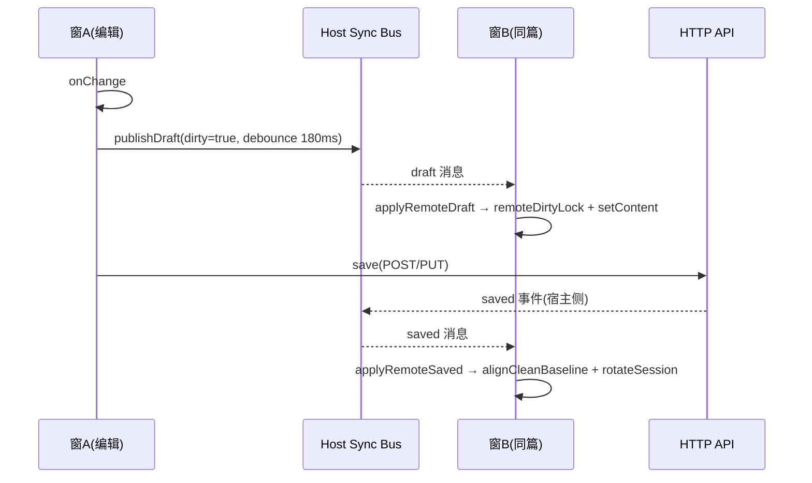

# 跨窗草稿同步与脏标记仲裁

> 延伸阅读：本篇为初始版（connectStore 绑定模式）。重构后的 subscribe 分发架构、Store 自发广播、leaveSnap 离页快照、编辑器 epoch 守卫见 [跨窗同步重构与离页快照](./跨窗同步重构与离页快照.md)。

## 1. 背景与目标

学习笔记支持主站以多窗口（主窗口 + Popout 窗口）方式打开同一篇笔记。两个窗口都能编辑、上传图片、保存、删除，因此需要一套跨窗口同步机制来保障：

1. **草稿实时同步**：A 窗编辑未保存时，B 窗打开同笔记能看到最新草稿（而非服务端旧正文）。
2. **脏标记（dirty）一致**：TipTap 序列化与服务端原始 HTML 存在尾部空段、空格差异时，两侧不能误点亮或误熄灭。
3. **上传会话共享**：A 窗上传图片产生的 pending，被 B 窗同步后保存时能认领图片，B 窗离开时不把 A 窗仍在使用的会话删掉。
4. **预览态保护**：预览态下对端草稿可渲染，但不会被 detail 接口的服务端正文覆盖；预览→编辑时，草稿与干净基线各自保留，脏标记不闪灭。
5. **关窗 / 切笔记兜底**：保持原有 keepalive 三层逻辑，并新增 boundNoteId、owned guard，避免保存到错误笔记或误删对端 pending。

## 2. 改动范围

| 类型 | 路径 | 说明 |
|------|------|------|
| 新文件 | `src/views/learning-notes/useLearningNotesHostSync.ts` | Host 连接层：connectStore / publishSelection / publishDraft / subscribe + debounce 外发 |
| 改动 | `src/store/learningNotes.ts` | Store 新增远端草稿/保存/删除接收器、上传会话 adopt、boundNoteId、pendingPeerDraft、savedBaselineHtml 等状态 |
| 改动 | `src/views/learning-notes/index.tsx` | 视图层：dirty 基线规范化、editorHtmlEquals 忽略尾空段、远端草稿 applier、saved applier、切笔记基线重置、onReady→applyEditorReadyDirty |

延伸阅读：
- [笔记图片上传会话.md](./笔记图片上传会话.md) — uploadSessionId 生命周期；本专题的 adopt/rotate 是其跨窗扩展
- [笔记自动保存与离页保存.md](./笔记自动保存与离页保存.md) — keepalive 机制；本专题 saveTargetId、owned guard 是其防跨窗误伤补丁

---

## 3. 核心思路

### 3.1 双通道架构



- **同步通道（Host modules.learningNotes）**：高频、弱一致性、不打 HTTP；只传 html/title/dirty/uploadSessionId。
- **保存通道（HTTP）**：低频、强一致；POST/PUT 成功后由宿主广播 saved，两侧共同 rotate 会话。

### 3.2 脏标记仲裁三段式

1. **基线比对（editorHtmlEquals）**：去掉尾部空段、统一空白，避免 TipTap 与服务器字符串恒等判据失真。
2. **远端 dirty:false 优先**：对端明确广播 clean，本方无条件清脏（即使 html 与 TipTap 基线仍有微小差异）。
3. **remoteDirtyLockRef 锁**：应用远端草稿后，本窗编辑器会二次 onCreate/onReady，没有锁会把刚点亮的脏标记又熄灭；锁一直等到本窗保存 / 对端 saved / 对端 dirty:false / 切其它笔记才释放。

### 3.3 上传会话 owned 原则

- **本窗 create = owned = true**：离开时可 discard（删 pending）。
- **对端 adopt = owned = false**：只摘引用，不调 discard 接口，避免 A 窗还在编辑时 B 窗离开就把 A 窗 pending 图删掉。
- **rotateUploadSession**：保存成功后统一调用，生成新的 owned=true 会话。

### 3.4 pendingPeerDraft 时序保护

对端草稿可能先于 detail 回包到达。Store 将草稿放入 pendingPeerDraft，detail 到达后：
- 若同篇且有草稿 → 预览显示草稿而非服务端正文，保留 `baselineHtml=serverHtml`
- 预览→编辑时先挂基线，再 microtask 套草稿 → dirty 立即点亮且基线正确

---

## 4. 关键代码对比与注释

### 4.1 新增 `useLearningNotesHostSync.ts`（纯新增）

**改动后** · `src/views/learning-notes/useLearningNotesHostSync.ts`（新增文件，完整文件）

```typescript
// 引入 React hooks：本 hook 通过 useEffect 订阅 Host 生命周期
import { useEffect } from 'react';
// 引入 LearningNotesStore 类型，用于约束 store 参数
import type LearningNotesStore from '@/store/learningNotes';

// 定义跨窗同步消息的统一结构：消息类型 + 窗口号 + 笔记 id + 可选草稿/预览体
type SyncMessage = {
	// 消息类型：如 state-snapshot / draft / saved / deleted 等
	type: string;
	// 发送方窗口 id，用于过滤自己发的广播
	windowId?: string;
	// 笔记 id：消息针对哪一篇
	noteId?: string;
	// 未保存草稿体（html/text/title/revision/脏标/上传会话）
	draft?: {
		html: string;
		text: string;
		title: string;
		revision: number;
		// 可选：对端声明自己的脏状态
		dirty?: boolean;
		// 可选：草稿对应上传会话 id
		uploadSessionId?: string | null;
	};
	// 可选：保存后的正文快照
	preview?: { html: string; title: string };
};

// Host 提供的 learningNotes 原生模块类型：窗口管理 + connectStore + sync 发布订阅
type LearningNotesHostModule = {
	// 获取本窗唯一 id
	getWindowId(): string;
	// 是否为 Popout 独立窗口
	isPopoutWindow(): boolean;
	// Host 路由打开某笔记时，把目标 id 一次性塞给子插件
	consumeInitialNoteId(): string | null;
	// 插件侧把回调暴露给 Host，Host 在收到对端消息时反向调用
	connectStore(binding: {
		// 查询本窗当前编辑 id
		getEditingId(): string | null;
		// 查询本窗当前预览 id
		getPreviewId(): string | null;
		// Host 要求刷新列表（如对端新建/删除后）
		refreshList(): Promise<void>;
		// 应用对端未保存草稿
		applyRemoteDraft(
			noteId: string,
			draft: {
				html: string;
				text: string;
				title: string;
				revision: number;
				uploadSessionId?: string | null;
				dirty?: boolean;
			},
		): void;
		// 应用对端已保存的正文
		applyRemoteSaved(
			noteId: string,
			payload: { html: string; title: string },
		): void;
		// 应用对端删除事件
		applyRemoteDeleted(noteId: string): void;
	}): () => void;
	// 同步子总线：发布订阅
	sync: {
		// 发布当前选中的笔记 + 模式（编辑/预览/空）
		publishSelection(payload: {
			noteId: string | null;
			mode: 'edit' | 'preview' | null;
		}): void;
		// 发布未保存草稿：含版本号供去重（虽然当前没用 revision，保留给未来）
		publishDraft(payload: {
			noteId: string;
			html: string;
			text: string;
			title: string;
			revision: number;
			uploadSessionId?: string | null;
			dirty?: boolean;
		}): void;
		// 请求对端把它的当前草稿回一份（打开新窗时主动拉）
		requestState(noteId: string): void;
		// 订阅所有同步消息
		subscribe(handler: (msg: SyncMessage) => void): () => void;
	};
};

// 宿主 api 对象上与本功能相关的字段类型
type HostApi = {
	// 宿主事件总线（如果实现走 event 通道）
	event?: {
		on: (event: string, handler: (data?: unknown) => void) => void;
		off: (event: string, handler: (data?: unknown) => void) => void;
	};
	// 宿主模块表，里面可选地挂载 learningNotes 模块
	modules?: { learningNotes?: LearningNotesHostModule };
};

// 导出 HostApi 类型给 index.tsx 合并使用
export type { HostApi };

// 草稿读取器函数类型：由视图层实现，同步层在广播时调用
export type LearningNotesDraftReader = () => {
	noteId: string;
	html: string;
	text: string;
	title: string;
} | null;

// 全局暴露 Store 的键：便于 Host 侧调试或跨边界访问
const GLOBAL_STORE_KEY = '__DNHYXC_LN_STORE__';
// 草稿广播 debounce 毫秒：避免 onChange 每击键都广播
const DRAFT_DEBOUNCE_MS = 180;
// 打开笔记后暂时抑制向外发草稿的毫秒数：避免 detail 未到就把旧正文推给对端覆盖未保存内容
const SUPPRESS_DRAFT_AFTER_OPEN_MS = 1000;

// 模块级变量：当前抑制截止的时间戳
let suppressDraftUntil = 0;

// 从 api 中安全取 learningNotes 模块
function getHostModule(api: HostApi): LearningNotesHostModule | undefined {
	return api.modules?.learningNotes;
}

// 打开笔记时调用：设置外发抑制截止点
function beginAwaitRemoteSnapshot() {
	suppressDraftUntil = Date.now() + SUPPRESS_DRAFT_AFTER_OPEN_MS;
}

// 对端快照到了或抑制过期时调用：解除抑制
function endAwaitRemoteSnapshot() {
	suppressDraftUntil = 0;
}

// 主 hook：建立 Host 连接、连接生命周期、切笔记广播、订阅快照回执
export function useLearningNotesHostSync(
	api: HostApi,
	store: typeof LearningNotesStore,
) {
	// effect1：建立 connectStore 绑定，处理 initial id，挂全局 store；卸载时释放
	useEffect(() => {
		// 未启用 Host 同步模块则啥也不做
		const mod = getHostModule(api);
		if (!mod) return;

		// 把 store 放到 window 全局键下，便于调试或外部访问
		(window as unknown as Record<string, unknown>)[GLOBAL_STORE_KEY] = store;

		// 构造 binding 对象：插件侧暴露给 Host 的回调
		const binding = {
			// Host 问：当前编辑 id
			getEditingId: () => store.editingId,
			// Host 问：当前预览 id
			getPreviewId: () => store.preview?.id ?? null,
			// Host 要求刷新列表
			refreshList: () => store.refreshListFromSync(),
			// Host 把对端草稿推过来
			applyRemoteDraft: (
				noteId: string,
				draft: {
					html: string;
					text: string;
					title: string;
					revision: number;
					uploadSessionId?: string | null;
					dirty?: boolean;
				},
			) => {
				// 转调 Store：只取 Store 需要的字段（text/revision 不入库）
				store.applyRemoteDraft(noteId, {
					html: draft.html,
					title: draft.title,
					uploadSessionId: draft.uploadSessionId,
					dirty: draft.dirty,
				});
			},
			// Host 把对端保存体推过来
			applyRemoteSaved: (
				noteId: string,
				payload: { html: string; title: string },
			) => {
				store.applyRemoteSaved(noteId, payload);
			},
			// Host 把对端删除推过来
			applyRemoteDeleted: (noteId: string) => {
				store.applyRemoteDeleted(noteId);
			},
		};

		// 收集卸载方法
		const disposers: Array<() => void> = [];
		// connectStore 返回一个 dispose，推进 disposers
		disposers.push(mod.connectStore(binding));

		// Host 路由要求直接打开某笔记（Popout 场景常见）
		const initialId = mod.consumeInitialNoteId();
		if (initialId) {
			void store.openEditById(initialId);
		}

		// 卸载：逐个 dispose + 删全局引用
		return () => {
			for (const d of disposers) d();
			delete (window as unknown as Record<string, unknown>)[GLOBAL_STORE_KEY];
		};
	}, [api, store]);

	// effect2：切到某笔记时广播 selection，并向对端 requestState 拉快照
	useEffect(() => {
		const mod = getHostModule(api);
		if (!mod) return;
		// 预览优先：UI 以 preview 为准，不能被残留 editingId 抢 noteId
		const noteId = store.preview?.id ?? store.editingId ?? null;
		// 广播 selection：让对端知道我现在在看哪篇
		mod.sync.publishSelection({
			noteId,
			mode: store.preview ? 'preview' : store.editingId ? 'edit' : null,
		});
		// 没选中任何笔记就结束抑制并返回
		if (!noteId) {
			endAwaitRemoteSnapshot();
			return undefined;
		}
		// 进入拉快照阶段：先抑制外发，再 requestState 一次 + 320ms 重试
		beginAwaitRemoteSnapshot();
		mod.sync.requestState(noteId);
		const retry = window.setTimeout(() => {
			mod.sync.requestState(noteId);
		}, 320);
		// 抑制超时兜底：最多 1 秒后解除抑制
		const timer = window.setTimeout(
			endAwaitRemoteSnapshot,
			SUPPRESS_DRAFT_AFTER_OPEN_MS,
		);
		// 清理：切走前清 retry/timer
		return () => {
			window.clearTimeout(retry);
			window.clearTimeout(timer);
		};
	}, [api, store.editingId, store.preview?.id, store.loadingDetail]);

	// effect3：订阅 state-snapshot，对端回快照后立即解除抑制（不用等 1s 兜底）
	useEffect(() => {
		const mod = getHostModule(api);
		if (!mod?.sync.subscribe) return;
		const localId = mod.getWindowId();
		return mod.sync.subscribe((msg) => {
			// 只处理 state-snapshot，且忽略自己发的
			if (msg.type !== 'state-snapshot' || msg.windowId === localId) return;
			// 确认是当前笔记才解抑制
			const noteId = store.preview?.id ?? store.editingId ?? null;
			if (!msg.noteId || msg.noteId !== noteId) return;
			endAwaitRemoteSnapshot();
		});
	}, [api, store]);
}

// 草稿版本号（单调递增，当前宿主未用 revision，保留给未来去重）
const draftRevisionRef = { current: 0 };
// debounce 定时器句柄
let draftDebounceTimer: ReturnType<typeof setTimeout> | null = null;

// 对外：编辑器 onChange 触发的草稿广播调度器
export function scheduleLearningNotesDraftPublish(
	api: HostApi,
	draft: NonNullable<ReturnType<LearningNotesDraftReader>>,
	uploadSessionId?: string | null,
	dirty?: boolean,
) {
	// 抑制期内直接丢弃
	if (Date.now() < suppressDraftUntil) return;
	const mod = getHostModule(api);
	if (!mod) return;
	// publish 闭包：做版本号累加、构造 payload、调用宿主 publishDraft
	const publish = () => {
		if (Date.now() < suppressDraftUntil) return;
		draftRevisionRef.current += 1;
		mod.sync.publishDraft({
			...draft,
			revision: draftRevisionRef.current,
			uploadSessionId: uploadSessionId ?? null,
			dirty: dirty ?? true,
		});
	};
	// 先取消上一次 debounce
	if (draftDebounceTimer) clearTimeout(draftDebounceTimer);
	// 变干净必须马上广播：否则 debounce 180ms 内对端一直保持脏标记 UX 突兀
	if (dirty === false) {
		draftDebounceTimer = null;
		publish();
		return;
	}
	// 脏了就按 DRAFT_DEBOUNCE_MS 广播，避免每按键都同步
	draftDebounceTimer = setTimeout(publish, DRAFT_DEBOUNCE_MS);
}
```

---

### 4.2 `LearningNotesStore` 新增同步字段与注册器

**改动前** · `src/store/learningNotes.ts`（基线，约 L49–L64）

```typescript
	// Host 透传的下载二进制能力；独立预览可通过 mock 注入
	private downloadBlob: HostDownloadBlob | null = null;
	// 读取编辑器快照的回调（注册器保存在这里，store 内部直接访问字段名）
	private getEditorSnapshot: (() => NoteEditorSnapshot | null) | null = null;

	/** 列表（分页累积） */
	list: Note[] = [];
```

**改动后** · `src/store/learningNotes.ts`（当前，约 L49–L97）

```typescript
	// Host 透传的下载二进制能力；独立预览可通过 mock 注入
	private downloadBlob: HostDownloadBlob | null = null;
	// 重命名：getEditorSnapshot → editorSnapshotReader，并把取快照动作封装成方法
	private editorSnapshotReader: (() => NoteEditorSnapshot | null) | null =
		null;
	// 远端草稿接收器：由视图层注册，收到 draft 时优先走 UI 层直接改编辑器
	private remoteDraftApplier:
		| ((
				noteId: string,
				draft: {
					html: string;
					title: string;
					uploadSessionId?: string | null;
					dirty?: boolean;
				},
		  ) => boolean)
		| null = null;
	// 远端已保存接收器：保存后推送的干净正文
	private remoteSavedApplier:
		| ((noteId: string, payload: { html: string; title: string }) => boolean)
		| null = null;
	// detail 返回前对端先推送的草稿：避免被随后到达的服务端旧正文盖掉
	private pendingPeerDraft: {
		noteId: string;
		html: string;
		title: string;
		uploadSessionId?: string | null;
		dirty?: boolean;
		// 服务端干净正文；预览→编辑时用作 dirty 基线
		baselineHtml?: string;
	} | null = null;
	// 当前篇服务端干净正文；预览合并对端草稿后仍保留，后续操作可用
	private savedBaselineHtml: string | null = null;

	/** 列表（分页累积） */
	list: Note[] = [];
```

**变更摘要**：字段从 1 个 snapshot 回调扩展到 5 个：snapshot 读器重命名 + 远端草稿/已保存接收器 + pendingPeerDraft + savedBaselineHtml。后续 `applyRemoteDraft/ applyRemoteSaved/ applyRemoteDeleted/openPreview/openEditById` 都靠这些状态协同时序。

---

### 4.3 `LearningNotesStore` 注册器与快照读取封装

**改动前** · `src/store/learningNotes.ts`（基线，约 L97–L104）

```typescript
	// 注册「读取编辑器快照」回调；autoSave/flush 时读
	registerEditorSnapshot(fn: (() => NoteEditorSnapshot | null) | null): void {
		this.getEditorSnapshot = fn;
	}

	/** 切笔记 / 新建 / 离页前：有改动则静默保存 */
	async autoSaveIfDirty(opts?: { silent?: boolean }): Promise<boolean> {
		if (this.saving || this.preview) return false;
		// 直接读字段，外部实现细节暴露到调用点
		const snap = this.getEditorSnapshot?.();
		if (!snap) return false;
```

**改动后** · `src/store/learningNotes.ts`（当前，约 L131–L216）

```typescript
	// 注册快照读取回调：字段重命名以强调它是 reader 函数
	registerEditorSnapshot(fn: (() => NoteEditorSnapshot | null) | null): void {
		this.editorSnapshotReader = fn;
	}

	// 公开方法：Host/关窗要快照时通过方法拿，不直接访问字段
	takeEditorSnapshot(): NoteEditorSnapshot | null {
		return this.editorSnapshotReader?.() ?? null;
	}

	// 注册远端草稿接收器：返回 true 表示接收器直接把内容写进编辑器了，store 不用再套 editorInitial
	registerRemoteDraftApplier(
		fn:
			| ((
					noteId: string,
					draft: {
						html: string;
						title: string;
						uploadSessionId?: string | null;
						dirty?: boolean;
					},
			  ) => boolean)
			| null,
	): void {
		this.remoteDraftApplier = fn;
	}

	// 注册远端已保存接收器：保存后写编辑器 + 重置基线 + rotate 会话
	registerRemoteSavedApplier(
		fn:
			| ((noteId: string, payload: { html: string; title: string }) => boolean)
			| null,
	): void {
		this.remoteSavedApplier = fn;
	}

	/** 切笔记 / 新建 / 离页前：有改动则静默保存 */
	async autoSaveIfDirty(opts?: { silent?: boolean }): Promise<boolean> {
		if (this.saving || this.preview) return false;
		// 统一走方法：不直接读字段，未来替换实现不影响调用点
		const snap = this.takeEditorSnapshot();
		if (!snap) return false;
```

**变更摘要**：`getEditorSnapshot` → `editorSnapshotReader + takeEditorSnapshot()`；新增两个 applier 注册器。后续 `flushNoteOnPageHide` 也统一走 `takeEditorSnapshot()`。

---

### 4.4 `flushNoteOnPageHide` 跨窗安全化

**改动前** · `src/store/learningNotes.ts`（基线，约 L144–L162）

```typescript
	/** 刷新/关页：keepalive 保存或结算 pending（不用 visibilitychange） */
	flushNoteOnPageHide(): void {
		if (this.preview) return;
		// 直接读字段快照
		const snap = this.getEditorSnapshot?.();
		const sid = this.uploadSessionId;
		// 有脏且有正文 → keepalive save
		if (snap?.dirty && hasNoteBodyContent(snap.html, snap.text)) {
			saveNoteKeepalive({
				// 仅用 editingId：预览态已清空 editingId，会误走新建而不是 update
				id: this.editingId,
				title: snap.title.trim() || this.t('common.untitledNote'),
				html: snap.html,
				uploadSessionId: sid,
			});
			this.uploadSessionId = null;
			return;
		}
		// 有会话且有快照（不脏）→ settle（认领正文内图片）
		if (sid && snap) {
			settleUploadSessionKeepalive(sid, snap.html);
			if (this.uploadSessionId === sid) this.uploadSessionId = null;
			return;
		}
		// 有会话但没快照 → 无条件 discard
		if (sid) {
			discardUploadSessionKeepalive(sid);
			if (this.uploadSessionId === sid) this.uploadSessionId = null;
		}
	}
```

**改动后** · `src/store/learningNotes.ts`（当前，约 L207–L250）

```typescript
	/** 刷新/关页：keepalive 保存或结算 pending（不用 visibilitychange） */
	flushNoteOnPageHide(): void {
		// 预览态不动：预览没有编辑器实体，也没有未保存变更
		if (this.preview) return;
		// 统一走方法拿快照
		const snap = this.takeEditorSnapshot();
		const sid = this.uploadSessionId;
		// 记住本会话是否「本窗创建」：adopt 会话不 discard
		const owned = this.uploadSessionOwned;
		// 有脏 + 有正文 → keepalive save
		if (snap?.dirty && hasNoteBodyContent(snap.html, snap.text)) {
			saveNoteKeepalive({
				// 改用 saveTargetId：editingId ?? boundNoteId，预览态也能打到 update
				id: this.saveTargetId,
				title: snap.title.trim() || this.t('common.untitledNote'),
				html: snap.html,
				uploadSessionId: sid,
			});
			this.uploadSessionId = null;
			// 下一个会话默认为 owned（即使下一篇是 adopt，后续 apply 会覆盖）
			this.uploadSessionOwned = true;
			return;
		}
		// 会话存在且拿到快照 → settle
		if (sid && snap) {
			settleUploadSessionKeepalive(sid, snap.html);
			if (this.uploadSessionId === sid) {
				this.uploadSessionId = null;
				this.uploadSessionOwned = true;
			}
			return;
		}
		// 会话存在但拿不到快照 → discard（但仅 owned 会话才真调接口）
		if (sid) {
			// 仅 discard 本窗创建的会话，避免误删对端仍在用的 pending 图
			if (owned) discardUploadSessionKeepalive(sid);
			if (this.uploadSessionId === sid) {
				this.uploadSessionId = null;
				this.uploadSessionOwned = true;
			}
		}
	}
```

**变更摘要**：三处跨窗安全补丁：1）快照读统一走方法；2）id 从 `editingId` → `saveTargetId`；3）discard 先判 `owned`，不删对端会话。

---

### 4.5 `saveTargetId` 与 `bindNoteId`（新增）

**改动后** · `src/store/learningNotes.ts`（当前，约 L250–L263）

```typescript
	/** 保存目标 id：优先编辑态，其次绑定态（预览清空 editingId 后的回退） */
	get saveTargetId(): string | null {
		// 编辑态 editingId 存在就用 editingId；否则（预览态或清空瞬间）用 boundNoteId
		return this.editingId ?? this.boundNoteId;
	}

	// 私有：设置绑定笔记 id；空串 / null 都归一化成 null
	private bindNoteId(id: string | null) {
		this.boundNoteId = id?.trim() || null;
	}
```

**变更摘要**：新增一对 id 读写器。预览态 Host 会把 editingId 清空，但用户从预览→「继续编辑」再关窗时，saveTargetId 仍能命中已有笔记，从而 PUT update 而不是 POST save 成副本。

---

### 4.6 `fetchPage` + `refreshListFromSync`（跨窗刷新不受列表折叠影响）

**改动前** · `src/store/learningNotes.ts`（基线，约 L211–L232）

```typescript
	async fetchPage(page: number, append: boolean): Promise<void> {
		if (!this.api) {
			this.toast(this.t('learningNotes.toast.httpDeniedSync'), 'error');
			return;
		}
		// ...（鉴权、分页状态判断略）
		try {
			const data = await this.api.list(page, this.pageSize);
			runInAction(() => {
				// 关闭列表后丢弃迟到回包，避免清空后又被写回
				if (!this.listOpen) return;
				this.total = data.total;
```

**改动后** · `src/store/learningNotes.ts`（当前，约 L292–L347）

```typescript
	async fetchPage(
		page: number,
		append: boolean,
		// 新增：可选 opts.ignoreListOpen 绕过「列表折叠丢弃」保护
		opts?: { ignoreListOpen?: boolean },
	): Promise<void> {
		if (!this.api) {
			this.toast(this.t('learningNotes.toast.httpDeniedSync'), 'error');
			return;
		}
		// ...（略，未改动部分保持一致）
		try {
			const data = await this.api.list(page, this.pageSize);
			runInAction(() => {
				// 关闭列表后丢弃迟到回包，避免清空后又被写回（跨窗同步除外）
				if (!opts?.ignoreListOpen && !this.listOpen) return;
				this.total = data.total;
	// ...（其余分页合并略）

	/** 跨窗同步：无论列表是否展开都刷新 */
	async refreshListFromSync(): Promise<void> {
		// Host 要求刷新列表时强制 ignoreListOpen
		await this.fetchPage(1, false, { ignoreListOpen: true });
	}
```

**变更摘要**：`fetchPage` 第 3 参新增 `ignoreListOpen`；`refreshListFromSync` 专门给 Host binding 用，保证对端删除 / 新建后，即使本窗列表折叠也能刷新到内存里，否则删除 / 新建后的 UI 会不一致。

---

### 4.7 上传会话 adopt / rotate（新增）

**改动后** · `src/store/learningNotes.ts`（当前，约 L347–L361）

```typescript
	/** 跨窗同步：共用上传方 uploadSessionId；标记为非本窗所有，离开时不 discard */
	adoptUploadSessionIdForSync(sessionId: string | null | undefined) {
		// 入参归一化：null / undefined / 空串都视为「无会话」
		const sid = sessionId?.trim();
		// 与当前会话相同或空 → 不动，避免 owned 被误写
		if (!sid || this.uploadSessionId === sid) return;
		// adopt：接收到的会话 ID
		this.uploadSessionId = sid;
		// 所有权：不是本窗创建的，归 adopt
		this.uploadSessionOwned = false;
	}

	// 私有：生成新会话 ID，且 owned=true。保存后、切笔记、新建时都应调用
	private rotateUploadSession() {
		this.uploadSessionId = crypto.randomUUID();
		this.uploadSessionOwned = true;
	}
```

**变更摘要**：跨窗场景下的两个关键动作。adopt 由 applyRemoteDraft 在收到草稿时触发；rotate 由 save 成功、leaveEditor、applyRemoteSaved 成功触发。两者一收一放，保证 owned 状态与「创建者」严格一致。

---

### 4.8 `applyRemoteDraft`（Store 侧核心：预览/编辑/时序 pending 三路分发）

**改动后** · `src/store/learningNotes.ts`（当前，约 L363–L408）

```typescript
	applyRemoteDraft(
		noteId: string,
		draft: {
			html: string;
			title: string;
			uploadSessionId?: string | null;
			dirty?: boolean;
		},
	) {
		// 分支1：当前处于预览态且是同篇
		if (this.preview?.id === noteId) {
			// 基线优先级：已存服务端基线 > pending 草稿里的基线（预览内多次收到草稿时稳定）
			const baseline =
				this.savedBaselineHtml ?? this.pendingPeerDraft?.baselineHtml;
			// 对端声明 clean：清 pending，更新干净基线
			if (draft.dirty === false) {
				this.pendingPeerDraft = null;
				if (draft.html.trim()) this.savedBaselineHtml = draft.html;
			} else {
				// 预览期间保留 pending，供预览→编辑恢复「服务端基线 + 未保存草稿」
				this.pendingPeerDraft = {
					noteId,
					html: draft.html,
					title: draft.title,
					uploadSessionId: draft.uploadSessionId,
					dirty: draft.dirty ?? true,
					baselineHtml: baseline,
				};
			}
			// 预览 UI 立即更新正文：不管 dirty 如何都显示最新草稿
			this.preview = { ...this.preview, html: draft.html, title: draft.title };
			return;
		}
		// 分支2：当前处于编辑态且是同篇
		if (this.editingId === noteId) {
			// 同篇了：pending 不再需要
			this.pendingPeerDraft = null;
			// 先 adopt 会话：后序保存才能把 pending 图认领
			this.adoptUploadSessionIdForSync(draft.uploadSessionId);
			// 视图层若注册了 applier（能直接 setContent 到编辑器）就交给它处理
			if (this.remoteDraftApplier?.(noteId, draft)) return;
			// 否则退化为 remount：写 editorInitial + 改 seed，让编辑器重挂
			this.editorInitial = draft.html;
			this.editorSeed += 1;
			return;
		}
		// 分支3：还在 openEditById / detail 途中（本窗既非预览同篇也非编辑同篇）
		this.pendingPeerDraft = {
			noteId,
			html: draft.html,
			title: draft.title,
			uploadSessionId: draft.uploadSessionId,
			dirty: draft.dirty,
			baselineHtml: this.savedBaselineHtml ?? undefined,
		};
	}
```

**变更摘要**：单一入口三分发是保证时序正确的关键。预览态保留 pending 不丢失；编辑态优先走 UI applier（不 remount）；途中态塞 pending 等 detail 后处理。

---

### 4.9 `applyRemoteSaved`（Store 侧：收到保存事件）

**改动后** · `src/store/learningNotes.ts`（当前，约 L410–L433）

```typescript
	applyRemoteSaved(noteId: string, payload: { html: string; title: string }) {
		// 清 pending：保存优先级最高
		if (this.pendingPeerDraft?.noteId === noteId) {
			this.pendingPeerDraft = null;
		}
		// 正文非空则更新干净基线
		if (payload.html.trim()) {
			this.savedBaselineHtml = payload.html;
		}
		// 预览同篇：更新预览对象
		if (this.preview?.id === noteId) {
			this.preview = {
				...this.preview,
				title: payload.title || this.preview.title,
				...(payload.html.trim() ? { html: payload.html } : {}),
			};
		}
		// 列表里的标题也同步更新（避免列表与详情标题不一致）
		if (payload.title) {
			this.list = this.list.map((n) =>
				n.id === noteId ? { ...n, title: payload.title } : n,
			);
		}
		// 编辑同篇：交给 UI 层更新编辑器 + 重置基线，然后 rotate 会话
		if (this.editingId === noteId) {
			this.remoteSavedApplier?.(noteId, payload);
			this.rotateUploadSession();
		}
	}
```

**变更摘要**：saved 事件是「权威干净」信号，清 pending、更新基线、同步列表标题、编辑态 rotate 会话。与 dirty:false 不同，saved 还会携带最新 html 作为基线。

---

### 4.10 `applyRemoteDeleted`（Store 侧：对端删除）

**改动后** · `src/store/learningNotes.ts`（当前，约 L435–L455）

```typescript
	applyRemoteDeleted(noteId: string) {
		// 全部改响应式：删除态会立刻反映到 UI
		runInAction(() => {
			// 预览同篇 → 清预览
			if (this.preview?.id === noteId) this.preview = null;
			// 编辑同篇 → 清 editingId + 重挂编辑器为空白
			if (this.editingId === noteId) {
				this.editingId = null;
				this.editorInitial = EMPTY_NOTE_DOC;
				this.editorSeed += 1;
			}
			// boundNoteId 同篇也要清（预览态清空 editingId 后 boundNoteId 可能还保留）
			if (this.boundNoteId === noteId) this.boundNoteId = null;
			// 本窗待确认删除的 id 也清
			if (this.pendingDeleteId === noteId) {
				this.pendingDeleteId = null;
				this.confirmOpen = false;
			}
			// 列表剔除
			this.list = this.list.filter((n) => n.id !== noteId);
		});
		// 清掉对应该笔记的上传会话（会话本身如 owned 会被 discard）
		void this.discardUploadSession();
	}
```

**变更摘要**：与手动删除流程对应，但比手动删除多了 boundNoteId 清理，否则预览态的 boundNoteId 可能「悬空」指向已删除笔记，后续 saveTargetId 会取到非法 id。

---

### 4.11 `openPreview` detail 回包合并 pendingPeerDraft

**改动前** · `src/store/learningNotes.ts`（基线，约 L279–L308）

```typescript
	async openPreview(id: string): Promise<void> {
		// ...（leaveEditor 略）
		this.preview = null;
		this.editingId = null;
		this.uploadSessionId = crypto.randomUUID();
		this.editorInitial = EMPTY_NOTE_DOC;
		this.editorSeed += 1;
		// ...（preview 壳初始化、loadingDetail=true 略）
		try {
			const note = await this.api.detail(id);
			runInAction(() => {
				// 慢网下用户可能已点开另一篇
				if (this.preview?.id === id) this.preview = note;
			});
		} catch {
			// ...（Host http 已 Toast）
```

**改动后** · `src/store/learningNotes.ts`（当前，约 L486–L540）

```typescript
	async openPreview(id: string): Promise<void> {
		// ...（leaveEditor 略）
		this.preview = null;
		this.editingId = null;
		// 改为：清理 boundNoteId / pending / 基线 + rotate 会话
		this.bindNoteId(null);
		this.pendingPeerDraft = null;
		this.savedBaselineHtml = null;
		this.rotateUploadSession();
		this.editorInitial = EMPTY_NOTE_DOC;
		this.editorSeed += 1;
		const listHit = this.list.find((n) => n.id === id);
		// 立刻进入预览壳：卸掉编辑器，避免与即将挂载的预览双实例并存
		runInAction(() => {
			// 预览前先绑 id：预览态关窗 keepalive save 也能命中 update
			this.bindNoteId(id);
			// 预览其他篇时清空 editingId，并卸掉旧正文，避免无 id 编辑器残留后误走新建
			if (this.editingId !== id) {
				this.editingId = null;
				this.editorInitial = EMPTY_NOTE_DOC;
				this.editorSeed += 1;
			}
			this.loadingDetail = true;
			this.savedBaselineHtml = null;
			// 切到其它篇才清 pending；同篇（预览再点预览）保留 pending 草稿
			if (this.pendingPeerDraft?.noteId !== id) {
				this.pendingPeerDraft = null;
			}
			// ...（preview 壳对象初始化略）
		});
		try {
			const note = await this.api.detail(id);
			runInAction(() => {
				// 慢网下已切换 → 丢弃迟到回包
				if (this.preview?.id !== id) return;
				// pending 草稿优先于服务端正文（同篇且 pending 存在时）
				const peer =
					this.pendingPeerDraft?.noteId === id ? this.pendingPeerDraft : null;
				const serverHtml = note.html || '';
				// 保存服务端基线（即使优先展示草稿也要存下来）
				this.savedBaselineHtml = serverHtml;
				this.bindNoteId(id);
				// 同篇有草稿：用草稿覆盖 html/title；否则直接显示服务端
				this.preview = peer
					? {
							...note,
							html: peer.html,
							title: peer.title.trim() || note.title,
						}
					: note;
				// pending 保留供后续预览→编辑：草稿脏且不是「对端 clean」
				if (peer && peer.dirty !== false) {
					this.pendingPeerDraft = {
						...peer,
						baselineHtml: serverHtml,
					};
				} else {
					this.pendingPeerDraft = null;
				}
			});
		} catch {
			// ...（Host http 已 Toast）
```

**变更摘要**：最大的时序补丁。预览前绑 id；预览壳初始化先清/保留 pending 草稿；detail 回包用 `peer ?? server` 决定 UI 显示，但无论如何保留 serverHtml 作为干净基线。

---

### 4.12 `openEdit` 预览→编辑：基线 + 草稿二次挂载

**改动前** · `src/store/learningNotes.ts`（基线，约 L320–L329）

```typescript
	async openEdit(...args): Promise<void> {
		// ...（leaveEditor 略）
		this.preview = null;
		this.editingId = note.id;
		// 直接：会话新生成 + editorInitial = note.html
		this.uploadSessionId = crypto.randomUUID();
		this.editorInitial = note.html || EMPTY_NOTE_DOC;
		// 预览态编辑器已卸载，重新挂载时用 editorInitial；seed 保证同 key 残留实例也被清掉
		this.editorSeed += 1;
```

**改动后** · `src/store/learningNotes.ts`（当前，约 L556–L602）

```typescript
	async openEdit(note: Note): Promise<void> {
		// ...（leaveEditor 略）
		this.preview = null;
		this.editingId = note.id;
		// 绑 id：保证离开时 saveTargetId 能命中
		this.bindNoteId(note.id);
		// 会话 rotate：全新本窗会话
		this.rotateUploadSession();
		// 取 pending 草稿（预览期间保留的那一份）
		const peer =
			this.pendingPeerDraft?.noteId === note.id ? this.pendingPeerDraft : null;
		// pending 草稿用完就清
		this.pendingPeerDraft = null;

		// editorInitial 候选优先级：note.html（服务端） > peer.html > EMPTY_NOTE_DOC
		const draftHtml =
			(typeof note.html === 'string' && note.html) ||
			peer?.html ||
			EMPTY_NOTE_DOC;
		// 干净基线候选优先级：peer.baselineHtml（预览态塞的服务端基线） > savedBaselineHtml > note.html
		const baselineHtml =
			peer?.baselineHtml ||
			this.savedBaselineHtml ||
			(typeof note.html === 'string' ? note.html : '');
		// 一次性用完：savedBaselineHtml 清掉
		this.savedBaselineHtml = null;

		const draftStr = typeof draftHtml === 'string' ? draftHtml : '';
		// 判断是否需要点亮未保存：存在基线且草稿≠基线且 peer 未声明 clean
		const hasUnsaved =
			Boolean(baselineHtml) &&
			draftStr !== baselineHtml &&
			peer?.dirty !== false;

		// 关键：有未保存草稿时先挂服务端基线，再套草稿——避免把草稿当成基线导致脏标记闪灭
		this.editorInitial = hasUnsaved ? baselineHtml : draftHtml;
		this.editorSeed += 1;

		// 有未保存：microtask 在编辑器挂载后再 applyRemoteDraft 把草稿套上去，此时视图层 dirty 仲裁会点亮
		if (hasUnsaved) {
			const draft = {
				html: draftStr,
				title: peer?.title || note.title || '',
				uploadSessionId: peer?.uploadSessionId,
				dirty: true as boolean | undefined,
			};
			queueMicrotask(() => {
				if (this.editingId === note.id) this.applyRemoteDraft(note.id, draft);
			});
		}
	}
```

**变更摘要**：最易踩坑的一段。直接 `editorInitial = peer.html` 会让编辑器 `onCreate` 时把草稿当作基线，后续 dirty 判断永远是干净（因为 html === 基线）。**正确做法**：先挂 baseline（服务端），再异步套 draft（对端草稿），这样 draft.html ≠ baseline，dirty 仲裁器会点亮脏标记。

---

### 4.13 `save` 保存时改 `saveTargetId` + `rotateUploadSession`

**改动前** · `src/store/learningNotes.ts`（基线，约 L361–L400）

```typescript
	if (this.editingId) {
		const updated = await this.api.update(this.editingId, payload);
		runInAction(() => {
			this.editingId = updated.id;
			this.uploadSessionId = crypto.randomUUID();
		});
		// ...（略）
	} else {
		const { id } = await this.api.save(payload);
		runInAction(() => {
			this.editingId = id;
			this.uploadSessionId = crypto.randomUUID();
		});
```

**改动后** · `src/store/learningNotes.ts`（当前，约 L642–L665）

```typescript
	const noteId = this.saveTargetId;
	if (noteId) {
		const updated = await this.api.update(noteId, payload);
		runInAction(() => {
			this.editingId = updated.id;
			// 保存成功后绑定 + 旋转会话（owned=true）
			this.bindNoteId(updated.id);
			this.rotateUploadSession();
		});
		// ...（略）
	} else {
		const { id } = await this.api.save(payload);
		runInAction(() => {
			this.editingId = id;
			// 新建也绑定 + 旋转
			this.bindNoteId(id);
			this.rotateUploadSession();
		});
```

**变更摘要**：update 的 id 从 `editingId` → `saveTargetId`；会话重建从 `crypto.randomUUID()` 直接赋值 → 统一 `rotateUploadSession()`；同时 `bindNoteId` 保证预览态的绑定 id 也会被刷新。

---

### 4.14 `uploadImage` 上传图片时改 noteId 来源

**改动前** · `src/store/learningNotes.ts`（基线，约 L532–L544）

```typescript
	try {
		if (!this.uploadSessionId) {
			this.uploadSessionId = crypto.randomUUID();
		}
		return await this.api.uploadImage(file, {
			noteId: noteId ?? this.editingId,
			uploadSessionId: this.uploadSessionId,
		});
```

**改动后** · `src/store/learningNotes.ts`（当前，约 L796–L806）

```typescript
	try {
		if (!this.uploadSessionId) {
			// 没会话时用 rotate 创建 owned 会话
			this.rotateUploadSession();
		}
		return await this.api.uploadImage(file, {
			// noteId 回退到 saveTargetId：预览态 editingId 为空但 boundNoteId 存在
			noteId: noteId ?? this.saveTargetId,
			uploadSessionId: this.uploadSessionId,
		});
```

**变更摘要**：会话创建统一走 rotate；noteId 回退 saveTargetId，保证预览「先看图后编辑」流程上传也能绑定已有笔记而非新建。

---

### 4.15 `discardUploadSession` 跨窗安全化

**改动前** · `src/store/learningNotes.ts`（基线，约 L561–L574）

```typescript
	/** 放弃当前上传会话的 pending（切笔记 / 新建时调用） */
	async discardUploadSession(): Promise<void> {
		const sid = this.uploadSessionId;
		this.uploadSessionId = null;
		// 无会话或无 api → 直接返回
		if (!sid || !this.api) return;
		try {
			await this.api.discardUploadSession(sid);
		} catch {
```

**改动后** · `src/store/learningNotes.ts`（当前，约 L825–L839）

```typescript
	/** 放弃当前上传会话的 pending（切笔记 / 新建时调用） */
	async discardUploadSession(): Promise<void> {
		const sid = this.uploadSessionId;
		// 记住 owned：摘引用前先读
		const owned = this.uploadSessionOwned;
		// 先摘引用（无论 owned 与否都摘）
		this.uploadSessionId = null;
		// 下一任默认 owned
		this.uploadSessionOwned = true;
		// 对端 adopt 的会话不可 DELETE，否则会误删上传方仍在用的 pending 图
		if (!sid || !owned || !this.api) return;
		try {
			await this.api.discardUploadSession(sid);
		} catch {
```

**变更摘要**：先读 owned 再摘引用。摘引用顺序必须在 owned 检查前，否则同一 sid 被多次 discard 会有竞态。最终只对本窗 owned 会话真调 DELETE。

---

### 4.16 视图层：`editorHtmlEquals` 规范化脏判断辅助

**改动后** · `src/views/learning-notes/index.tsx`（当前，约 L74–L83）

```typescript
/** TipTap 删回基线时常见尾部空段差异，不参与脏判断 */
function editorHtmlEquals(a: string, b: string): boolean {
	// 严格等号短路：完全相同直接返回
	if (a === b) return true;
	// 规范化：去掉尾部空段（p 标签内只有空格/nbsp/br）、空白归一、首尾去空
	const norm = (s: string) =>
		s
			.replace(/(<p>(?:\s|&nbsp;|<br\s*\/?\s*>)*<\/p>)+$/gi, '')
			.replace(/\s+/g, ' ')
			.trim();
	// 规范化后再比对
	return norm(a) === norm(b);
}
```

**变更摘要**：TipTap `getHTML()` 会自动补尾段、换行；服务器保存的是某次 TipTap 输出的快照；二者即使视觉完全一致，字符串也常常不恒等。`editorHtmlEquals` 做三段归一化，显著减少误判脏 / 误判干净的闪灭。

---

### 4.17 视图层：`alignCleanBaseline` + `markClean` 重写

**改动前** · `src/views/learning-notes/index.tsx`（基线，约 L98–L109）

```typescript
	const markClean = useCallback(() => {
		// 保存成功后，简单把当前 html 写回基线并清脏
		baselineHtmlRef.current = currentHtml();
		dirtyRef.current = false;
		setDirty(false);
	}, [currentHtml]);
```

**改动后** · `src/views/learning-notes/index.tsx`（当前，约 L133–L149）

```typescript
	// 对齐双基线：baselineHtmlRef（TipTap 序列化后优先用的）与 openBaselineRef（打开时）同时写
	const alignCleanBaseline = useCallback((html: string) => {
		// TipTap 基线：用于后续 syncDirty 比对
		baselineHtmlRef.current = html;
		// 打开基线：TipTap 基线为空时的回退；切笔记/remount 时与 store.editorInitial 对齐
		openBaselineRef.current = html;
	}, []);

	const markClean = useCallback(() => {
		// 取当前 html
		const html = currentHtml();
		// 双基线对齐
		alignCleanBaseline(html);
		// 视图内部脏标清
		dirtyRef.current = false;
		// 远端草稿锁清（本窗已经保存，是权威干净）
		remoteDirtyLockRef.current = false;
		// 其余四个 pending ref 全部清，避免 remount 时被旧 pending 干扰
		pendingRemoteDirtyRef.current = false;
		pendingRemoteCleanRef.current = false;
		pendingRemoteBaselineRef.current = '';
		// UI 清脏
		setDirty(false);
	}, [alignCleanBaseline, currentHtml]);
```

**变更摘要**：保存成功（本窗保存）是权威干净，必须同时清理 5 个跨窗相关 ref，否则下一次 editorSeed 变化（remount）时残留锁会再次点亮脏标。

---

### 4.18 视图层：`applyEditorReadyDirty`（editor onReady/onCreate 后仲裁脏）

**改动后** · `src/views/learning-notes/index.tsx`（当前，约 L151–L186）

```typescript
	const applyEditorReadyDirty = useCallback(
		(html: string) => {
			// 先看有没有 pendingRemoteClean：对端 saved / dirty:false 要求强制干净
			const forceClean = pendingRemoteCleanRef.current;
			pendingRemoteCleanRef.current = false;
			// 强制干净分支：清锁、清 pending、双基线对齐、UI 清脏
			if (forceClean) {
				remoteDirtyLockRef.current = false;
				pendingRemoteDirtyRef.current = false;
				pendingRemoteBaselineRef.current = '';
				alignCleanBaseline(html);
				dirtyRef.current = false;
				setDirty(false);
				return;
			}
			// 候选基线：打开基线（切笔记 effect 写）→ TipTap 基线
			const openBase = openBaselineRef.current;
			const tipTapBase = baselineHtmlRef.current || openBase;
			// 有没有 pendingRemoteDirty：applier 在编辑器未挂载时塞的「应该脏」
			const pending = pendingRemoteDirtyRef.current;
			pendingRemoteDirtyRef.current = false;
			// 三段仲裁：远端锁 / pending 标记 / html 与 TipTap 基线不等
			const shouldDirty =
				remoteDirtyLockRef.current ||
				pending ||
				(Boolean(tipTapBase) && !editorHtmlEquals(html, tipTapBase));
			// 任意命中 → 保持/点亮脏，并保留 TipTap 基线
			if (shouldDirty) {
				remoteDirtyLockRef.current = true;
				baselineHtmlRef.current =
					tipTapBase ||
					pendingRemoteBaselineRef.current ||
					baselineHtmlRef.current;
				pendingRemoteBaselineRef.current = '';
				dirtyRef.current = true;
				setDirty(true);
				return;
			}
			// 首次挂载且干净：用 TipTap 序列化结果作基线，后续用户删回去才能判干净
			alignCleanBaseline(html);
			dirtyRef.current = false;
			setDirty(false);
		},
		[alignCleanBaseline],
	);
```

**变更摘要**：这是长笔记 editorSeed remount 后脏状态不闪灭的核心。编辑器 onCreate/onReady 会触发两次（短笔记一次、长笔记两次），每次都用 `applyEditorReadyDirty` 仲裁，远端锁 + pending 双保险保证「脏了就一直脏，直到明确干净信号」。

---

### 4.19 视图层：切笔记 effect 重置基线

**改动后** · `src/views/learning-notes/index.tsx`（当前，约 L188–L200）

```typescript
	/** 切笔记时重置基线，避免沿用上一篇的 baseline / dirty */
	useEffect(() => {
		// 从 store.editorInitial 取「打开基线」（服务端干净正文）
		const initial =
			typeof store.editorInitial === 'string' ? store.editorInitial : '';
		// 两个 ref 都先写 initial
		openBaselineRef.current = initial;
		baselineHtmlRef.current = initial;
		// 全部脏相关 ref 清零；跟 markClean 一样全覆盖
		dirtyRef.current = false;
		remoteDirtyLockRef.current = false;
		pendingRemoteDirtyRef.current = false;
		pendingRemoteCleanRef.current = false;
		pendingRemoteBaselineRef.current = '';
		// UI 也同步清
		setDirty(false);
	}, [store.editingId]);
```

**变更摘要**：store.editingId 变化是「切笔记」最可靠的信号。以它为依赖重置所有 ref，防止切到 B 笔记后 A 笔记的脏标记、远程锁「漏」到 B 笔记。

---

### 4.20 视图层：`readDraft` 统一读草稿（供广播用）

**改动后** · `src/views/learning-notes/index.tsx`（当前，约 L202–L223）

```typescript
	// 统一读草稿：长笔记走 pagedSaveRef，短笔记走 editorRef
	const readDraft = useCallback(() => {
		// 当前笔记 id：无 id 直接返回 null（不应该广播）
		const noteId = store.editingId;
		if (!noteId) return null;
		// 长笔记优先：LargeNoteEditor 暴露的 save api
		const paged = pagedSaveRef.current;
		if (paged) {
			return {
				noteId,
				title: paged.getTitle(),
				text: paged.getText(),
				html: paged.getHTML(),
			};
		}
		// 短笔记：直接访问 TipTap editor
		const editor = editorRef.current;
		if (!editor || editor.isDestroyed) return null;
		return {
			noteId,
			title: getDocTitleText(editor.state.doc).trim(),
			text: editor.getText({ blockSeparator: '\n\n' }).trim(),
			html: editor.getHTML(),
		};
	}, [store.editingId]);
```

**变更摘要**：新工具函数。长/短笔记两种编辑器读取方式不同，广播前必须用统一入口，否则草稿要么缺 title、要么 html 拿不全。

---

### 4.21 视图层：`syncDirty` 重写（加入基线规范化 + 广播）

**改动前** · `src/views/learning-notes/index.tsx`（基线，约 L130–L145）

```typescript
	const syncDirty = useCallback(() => {
		const html = currentHtml();
		// 简单恒等：html !== baseline
		const nextDirty = html !== baselineHtmlRef.current;
		const wasDirty = dirtyRef.current;
		dirtyRef.current = nextDirty;
		setDirty(nextDirty);
		// 仅在「有改动 → 回到基线」（如上传又删）时结算 pending，避免每次干净态 onChange 打接口
		if (wasDirty && !nextDirty) {
			void store.settleUploadSessionIfNeeded(html);
		}
	}, [currentHtml]);
```

**改动后** · `src/views/learning-notes/index.tsx`（当前，约 L225–L257）

```typescript
	const syncDirty = useCallback(() => {
		// 正在应用远端草稿时跳过 setContent 产生的 onChange，防止死循环
		if (applyingRemoteRef.current) return;
		const html = currentHtml();
		// 优先 TipTap 基线；锁不参与脏判断，只防 remount 丢标记
		const baseline = baselineHtmlRef.current || openBaselineRef.current;
		// 用规范化函数判脏
		const nextDirty = !editorHtmlEquals(html, baseline);
		const wasDirty = dirtyRef.current;
		// 变干净：解锁 + 清 pending + 双基线对齐
		if (!nextDirty) {
			remoteDirtyLockRef.current = false;
			pendingRemoteDirtyRef.current = false;
			pendingRemoteCleanRef.current = false;
			alignCleanBaseline(html);
		}
		// 写脏标
		dirtyRef.current = nextDirty;
		setDirty(nextDirty);
		// dirty→clean：结算上传会话 pending（认领正文内图、回收孤儿）
		if (wasDirty && !nextDirty) {
			void store.settleUploadSessionIfNeeded(html);
		}
		// 读草稿供广播
		const draft = readDraft();
		// dirty 变化（脏 / 干净切换）都广播；dirty→clean 也要发，否则对端一直亮脏标
		if (draft && (nextDirty || wasDirty)) {
			scheduleLearningNotesDraftPublish(
				api,
				draft,
				store.uploadSessionId,
				nextDirty,
			);
		}
	}, [alignCleanBaseline, api, currentHtml, readDraft, store]);
```

**变更摘要**：四处补丁：1）applyingRemoteRef 防抖循环；2）editorHtmlEquals 判脏；3）dirty→clean 解锁；4）有变化就广播草稿（含 clean→dirty / dirty→clean 两种）。

---

### 4.22 视图层：`registerRemoteDraftApplier`（应用远端草稿到编辑器）

**改动后** · `src/views/learning-notes/index.tsx`（当前，约 L282–L350）

```typescript
	useEffect(() => {
		// 注册远端草稿接收器
		store.registerRemoteDraftApplier((noteId, draft) => {
			// 非当前编辑 id → Store 会处理 remount，这里直接放弃
			if (store.editingId !== noteId) return false;
			const paged = pagedSaveRef.current;
			const editor = editorRef.current;
			// TipTap 基线候选：baselineHtmlRef → openBaselineRef → editorInitial
			const tipTapBase =
				baselineHtmlRef.current ||
				openBaselineRef.current ||
				(typeof store.editorInitial === 'string' ? store.editorInitial : '');

			// 先 adopt：会话共享
			store.adoptUploadSessionIdForSync(draft.uploadSessionId);

			// dirty:false 权威清脏；否则以 TipTap 基线重新比对（忽略对端误报 dirty:true）
			const nextDirty =
				draft.dirty === false
					? false
					: !editorHtmlEquals(draft.html, tipTapBase);

			// 设置锁与 pending clean
			if (nextDirty) {
				remoteDirtyLockRef.current = true;
				pendingRemoteCleanRef.current = false;
			} else {
				remoteDirtyLockRef.current = false;
				pendingRemoteDirtyRef.current = false;
				pendingRemoteCleanRef.current = true;
				dirtyRef.current = false;
				setDirty(false);
			}

			// 编辑器未挂载（长笔记 paged 或 editor 还没创建） → 塞 pendingRemoteDirty 等 onReady 处理
			if (paged || !editor || editor.isDestroyed) {
				if (nextDirty) {
					pendingRemoteDirtyRef.current = true;
					pendingRemoteCleanRef.current = false;
					// 基线尚未应用，保留一份给 onReady 后用
					if (!pendingRemoteBaselineRef.current) {
						pendingRemoteBaselineRef.current = tipTapBase;
					}
				}
				return false;
			}
			// 编辑器已挂载但 html 与草稿完全相同 → 不用 setContent，直接调基线
			if (editor.getHTML() === draft.html) {
				if (nextDirty) {
					baselineHtmlRef.current = tipTapBase;
				} else {
					alignCleanBaseline(editor.getHTML());
					pendingRemoteCleanRef.current = false;
				}
				dirtyRef.current = nextDirty;
				setDirty(nextDirty);
				return true;
			}
			// 真正应用 setContent：先打 applyingRemoteRef 防止 onChange 递归
			applyingRemoteRef.current = true;
			try {
				editor.commands.setContent(draft.html, { emitUpdate: false });
				const normalized = editor.getHTML();
				if (nextDirty) {
					baselineHtmlRef.current = tipTapBase;
				} else {
					alignCleanBaseline(normalized);
					pendingRemoteCleanRef.current = false;
				}
				dirtyRef.current = nextDirty;
				setDirty(nextDirty);
			} finally {
				applyingRemoteRef.current = false;
			}
			return true;
		});
		return () => store.registerRemoteDraftApplier(null);
	}, [alignCleanBaseline, store]);
```

**变更摘要**：50 行左右的核心 applier。四路分支（未挂载 / 已挂载相同 / 已挂载不同 + dirty / 已挂载不同 + clean）全部命中。每路都保证 TipTap 基线 + 脏标 + 远程锁保持一致。

---

### 4.23 视图层：`registerRemoteSavedApplier`（应用已保存正文）

**改动后** · `src/views/learning-notes/index.tsx`（当前，约 L352–L382）

```typescript
	useEffect(() => {
		// 注册远端已保存接收器
		store.registerRemoteSavedApplier((noteId, payload) => {
			// 非同篇不处理
			if (store.editingId !== noteId) return false;
			const html = payload.html.trim();
			const paged = pagedSaveRef.current;
			const editor = editorRef.current;
			// 编辑器已挂载 + 非长笔记 + html 非空 → 先 setContent 再对齐基线
			if (html && !paged && editor && !editor.isDestroyed) {
				if (editor.getHTML() !== html) {
					applyingRemoteRef.current = true;
					try {
						editor.commands.setContent(html, { emitUpdate: false });
					} finally {
						applyingRemoteRef.current = false;
					}
				}
				alignCleanBaseline(editor.getHTML());
			} else if (html) {
				// 拿不到编辑器但 payload 有 html → 直接用 payload 对齐基线
				alignCleanBaseline(html);
			} else {
				// 兜底：用 currentHtml（html 为空时不应该走到这里）
				alignCleanBaseline(currentHtml());
			}
			// saved 是权威干净：所有脏相关 ref 全部清零
			dirtyRef.current = false;
			remoteDirtyLockRef.current = false;
			pendingRemoteDirtyRef.current = false;
			pendingRemoteCleanRef.current = false;
			setDirty(false);
			return true;
		});
		return () => store.registerRemoteSavedApplier(null);
	}, [alignCleanBaseline, currentHtml, store]);
```

**变更摘要**：saved 事件处理比 draft 简单——永远干净、永远对齐基线。三路 setContent 判定（已挂载可用 / 有 html 但编辑器不可用 / 兜底）。

---

### 4.24 视图层：保存按钮文案用 `saveTargetId`

**改动前** · `src/views/learning-notes/index.tsx`（基线，约 L232 / L262）

```typescript
	store.editingId
		? t('learningNotes.update')
		: t('learningNotes.save')
	// ...
	[dirty, listToggleBtn, onSave, store.editingId, store.saving, t],
```

**改动后** · `src/views/learning-notes/index.tsx`（当前，约 L469–L500）

```typescript
	// 保存按钮文案：saveTargetId 命中时显示「更新」，否则「保存」
	store.saveTargetId
		? t('learningNotes.update')
		: t('learningNotes.save')
	// ...（依赖数组也加 saveTargetId）
	[dirty, listToggleBtn, onSave, store.editingId, store.saveTargetId, store.saving, t],
```

**变更摘要**：预览态 editingId 为空但 boundNoteId 存在时，按钮文案也能正确显示「更新」而不是「保存」。

---

### 4.25 视图层：onCreate/onReady 从 `markClean` → `applyEditorReadyDirty`

**改动前** · `src/views/learning-notes/index.tsx`（基线，约 L405–L428）

```typescript
	onReady={(e, save) => {
		editorRef.current = e;
		pagedSaveRef.current = save;
		// 简单：getHTML 写基线 + 清脏
		baselineHtmlRef.current = save.getHTML();
		setDirty(false);
		setReadyKey(editorKey);
	}}
	onCreate={(e) => {
		editorRef.current = e;
		pagedSaveRef.current = null;
		baselineHtmlRef.current = e.getHTML();
		setDirty(false);
		setReadyKey(editorKey);
	}}
```

**改动后** · `src/views/learning-notes/index.tsx`（当前，约 L642–L664）

```typescript
	onReady={(e, save) => {
		editorRef.current = e;
		pagedSaveRef.current = save;
		// 交给仲裁器：考虑 pendingRemoteDirty / remoteDirtyLock / 规范化脏判
		applyEditorReadyDirty(save.getHTML());
		setReadyKey(editorKey);
	}}
	onCreate={(e) => {
		editorRef.current = e;
		pagedSaveRef.current = null;
		// 同上：长笔记会走两次 onCreate，必须仲裁不闪灭
		applyEditorReadyDirty(e.getHTML());
		setReadyKey(editorKey);
	}}
```

**变更摘要**：这是跨窗同步脏状态的最后一里。编辑器挂载后不能直接写基线清脏——必须经三段仲裁，否则远端草稿一到就会被 onCreate 立即清掉，脏标闪灭。

---

## 5. 兼容性与影响

| 维度 | 说明 |
|------|------|
| 向后兼容 | Host 未实现 `modules.learningNotes` 时，`useLearningNotesHostSync` 整个 effect 不生效，原有单窗流程完全不变 |
| 破坏性 | 无；Store 原有对外 API（bind/openPreview/openEditById/save）签名未变 |
| 开关 | 由 Host 是否注入 `modules.learningNotes` 决定是否启用跨窗同步；UI 层无手动开关 |
| 上传会话 | 仅跨窗时会出现 `owned=false` 的会话；单窗仍为 100% owned=true |
| 脏判定 | `editorHtmlEquals` 归一化尾部空段 + 空白，可能出现旧版判脏但新版判干净（实际无内容变化）。属于修复，不应视为行为回归 |

## 6. 风险与回归清单

- [ ] 两窗同时编辑同笔记：A 窗打字 → B 窗 180ms 内看到草稿
- [ ] A 窗贴大图（pending uploadSessionId=S） → B 窗同篇打开 → B 窗保存成功 → COS 图片被正确认领
- [ ] 上一步后：B 窗先离开 → A 窗仍在编辑 → 离开 A 窗时会话 S 的 pending 仍存在（不被 B 窗 discard 误删）
- [ ] A 窗保存成功 → B 窗立即看到脏标记熄灭、基线重置
- [ ] 预览态收到对端草稿 → 预览 UI 显示草稿而非服务端旧正文 → 预览→编辑后脏标记立刻亮且基线是服务端正文
- [ ] 预览态关窗（Host 路由离开）→ keepalive save 命中 PUT update（boundNoteId 生效）而非 POST save 成副本
- [ ] 列表折叠时对端新建笔记 → 本窗打开展开列表，新笔记出现在列表里（ignoreListOpen 生效）
- [ ] 对端删除本窗当前编辑笔记 → 本窗编辑器重置为空白、列表条目消失、boundNoteId 清空
- [ ] 单窗（Host 未实现 modules.learningNotes）：保存、切笔记、关窗、上传图片行为与改动前一致

---

## 7. 相关源码路径

| 说明 | 路径 |
|------|------|
| Host 同步 Hook（新增） | `src/views/learning-notes/useLearningNotesHostSync.ts` |
| LearningNotesStore（同步能力主修改） | `src/store/learningNotes.ts` |
| 视图主容器（dirty 仲裁 / applier 注册 / 基线重置） | `src/views/learning-notes/index.tsx` |
| 图片上传会话基础机制（本专题为其跨窗扩展） | `src/store/learningNotes.ts`（uploadSessionId 相关方法） |
| keepalive 自动保存 / 关页保存基础机制 | `src/views/learning-notes/index.tsx`（`flushNoteOnPageHide` 关联） |

---

（若与仓库最新源码不一致，以源码为准）
