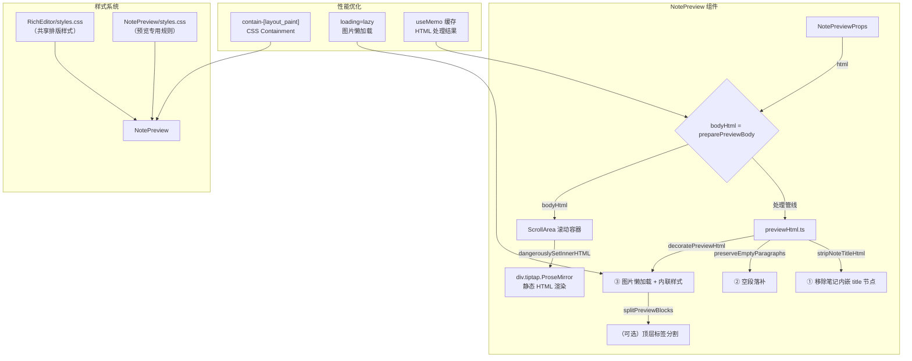
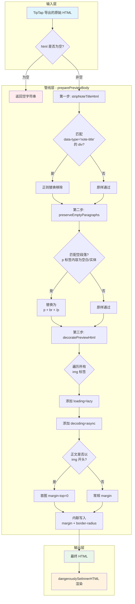
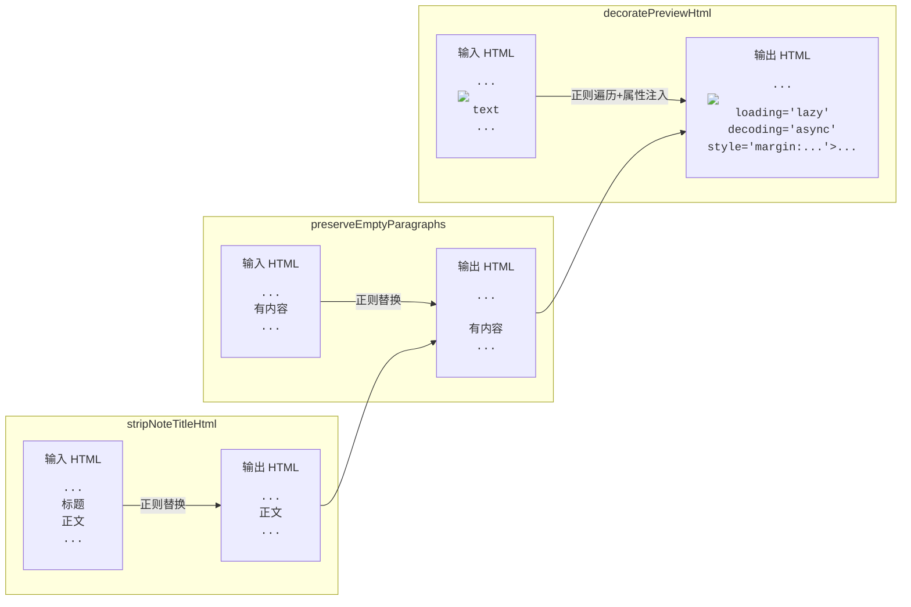
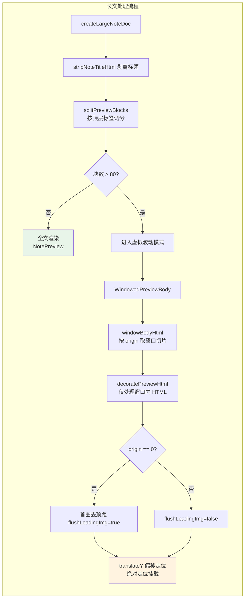

# 笔记预览（NotePreview）实现文档

> **延伸阅读**：[笔记预览图片点击交互增强](./note-preview/image-preview-integration.md) — 基于本文档基础，新增 ImagePreview 组件实现图片缩放/旋转/拖拽/下载/图库导航能力。

## 一、概述

`NotePreview` 是笔记模块的**只读预览组件**，用于在用户浏览笔记列表时展示笔记的静态内容。它与编辑态（`RichEditor`）共享同一套样式系统（`styles.css`），但不挂载 TipTap 编辑器实例，以纯 HTML 的方式渲染，确保轻量、快速。

### 核心特性

| 特性 | 说明 |
|------|------|
| **标题展示** | 顶部 header 区域展示笔记标题，空标题时显示「未命名笔记」 |
| **元信息** | 标题下方次要信息行（时间、标签等自定义 ReactNode） |
| **页眉操作** | 右上角 `headerExtra` 插槽，用于放置「返回编辑」「列表开关」等按钮 |
| **空态** | 无 html 且非 loading 时，展示带弹跳动画的空态图标和文案 |
| **加载态** | 外部传入 `loading` prop 时隐藏空态，等待数据加载完成 |
| **自定义正文** | 通过 `children` 插槽完全接管正文区域 |
| **样式共享** | 复用 `RichEditor/styles.css` 中的 `.rich-editor-body` / `.tiptap` 样式，保证编辑态与预览态视觉一致 |

---

## 二、架构图



### 组件层级关系

```
NotePreview
├── <header> note-preview-header
│   ├── <h1> 标题
│   ├── <div> meta 元信息
│   └── headerExtra 操作按钮组
├── <ScrollArea>  ← 共享 RichEditor 滚动条样式
│   └── <div.tiptap.ProseMirror>
│       └── dangerouslySetInnerHTML  ← 静态 HTML 渲染
├── 空态 / children 自定义正文
└── footer（可选）
```

---

## 三、完整源码

### 3.1 主组件：`NotePreview/index.tsx`

> 路径：`src/components/design/NotePreview/index.tsx`

```tsx
// ============================================================
// 导入依赖
// ============================================================
import { type ReactNode, useMemo } from 'react';     // React 核心
import { ScrollArea } from '@/components/ui/scroll-area';  // 统一滚动容器（自定义 styled scrollbar）
import { useI18n } from '@/hooks';                     // 国际化 hook，拿翻译函数 t()
import { cn } from '@/lib/utils';                        // className 合并工具（clsx + tailwind-merge）
import '../RichEditor/styles.css';                     // 【关键】复用编辑器全部排版样式
import { preparePreviewBody } from './previewHtml';    // HTML 预处理管线
import './styles.css';                                 // 预览专属样式（空段兜底、首块去顶距等）
import { Component } from 'lucide-react';              // 空态图标

// ============================================================
// Props 类型定义
// ============================================================
export type NotePreviewProps = {
    /** 顶栏标题（替代编辑器 toolbar 中的 title 节点展示） */
    title: string;
    /** TipTap 导出的 HTML 字符串；为空时展示空态 */
    html?: string;
    /** 顶栏标题旁/下方的次要信息（时间、标签、作者等 ReactNode） */
    meta?: ReactNode;
    /** 顶栏右侧操作区（返回编辑、列表开关等按钮组） */
    headerExtra?: ReactNode;
    /** 自定义正文；传入时忽略 html / bodyHtml 处理管线 */
    children?: ReactNode;
    /** 底部插槽 */
    footer?: ReactNode;
    /** 最外层容器 className 覆盖 */
    className?: string;
    /** 正文滚动区域 className 覆盖 */
    bodyClassName?: string;
    /** 空态文案覆盖（默认走 i18n common.emptyContent） */
    emptyText?: string;
    /** 数据是否在加载中；loading 时不展示空态 */
    loading?: boolean;
};

// 重新导出 previewHtml 工具函数，方便外部模块直接使用
export {
    decoratePreviewHtml,
    preparePreviewBody,
    preserveEmptyParagraphs,
    splitPreviewBlocks,
    stripNoteTitleHtml,
} from './previewHtml';

// ============================================================
// NotePreview 组件实现
// ============================================================
/**
 * 笔记只读预览：与编辑态同一套 ScrollArea + RichEditor 正文样式
 * （静态 HTML，不挂 TipTap 编辑器实例）。
 *
 * 渲染分支逻辑：
 *   children != null  → 完全自定义正文
 *   bodyHtml 非空     → 渲染静态 HTML（走处理管线）
 *   loading           → 不渲染空态（等待数据）
 *   以上都不满足       → 渲染空态
 */
export function NotePreview({
    title,
    html,
    meta,
    headerExtra,
    children,
    footer,
    className,
    bodyClassName,
    emptyText,
    loading,
}: NotePreviewProps) {
    // 国际化翻译函数
    const { t } = useI18n();

    // 空态文案：优先用 prop 覆盖，否则走 i18n
    const empty = emptyText ?? t('common.emptyContent');

    // HTML 预处理：useMemo 缓存，仅在 html 变化时重算
    // 管线执行顺序：stripNoteTitleHtml → preserveEmptyParagraphs → decoratePreviewHtml
    const bodyHtml = useMemo(
        () => (html ? preparePreviewBody(html) : ''),
        [html],
    );

    return (
        <div
            className={cn(
                // contain-[layout_paint]：CSS Containment 属性
                // 作用：将预览区域标记为独立的 layout/paint 边界
                // 好处：预览区域内的大规模 DOM 变化（如长文图片加载）
                //       不会触发左侧笔记列表的重新布局与绘制
                // 注意：此处故意不加 style 关键字——
                //       WebKit/Tauri 下 contain:style 会导致子树样式
                //       进入页面时不生效，鼠标移入才"闪一下"补上
                'note-preview flex h-full min-h-0 min-w-0 flex-col overflow-hidden rounded-r-md contain-[layout_paint]',
                className,
            )}
        >
            {/* ============ 顶部 Header ============ */}
            <header className="note-preview-header h-10 border-theme/10 flex shrink-0 items-center gap-3 border-b pl-3 pr-1.5 py-2.5">
                <div className="min-w-0 flex-1">
                    {/* 标题行：空标题走 i18n 兜底，truncate 防长标题溢出 */}
                    <h1 className="text-textcolor truncate text-base font-semibold leading-snug">
                        {title.trim() || t('common.untitledNote')}
                    </h1>
                    {/* 元信息行：时间 / 标签等次要信息 */}
                    {meta ? (
                        <div className="text-textcolor/45 mt-0.5 truncate text-xs">
                            {meta}
                        </div>
                    ) : null}
                </div>
                {/* 右侧操作区：返回编辑按钮等 */}
                {headerExtra ? (
                    <div className="flex shrink-0 items-center gap-0.5">
                        {headerExtra}
                    </div>
                ) : null}
            </header>

            {/* ============ 正文区域（三种渲染分支） ============ */}
            {children != null ? (
                // 分支 1：自定义正文 → 直接渲染 children
                children
            ) : bodyHtml ? (
                // 分支 2：有 HTML 内容 → 静态渲染管线结果
                <ScrollArea
                    className={cn(
                        // rich-editor-body：共享编辑器的 padding / font-size / flex 布局
                        // note-preview-static：预览专属静态样式
                        'rich-editor-body note-preview-static text-textcolor min-h-0 flex-1',
                        bodyClassName,
                    )}
                >
                    {/*
                        关键：预览态不初始化 TipTap 编辑器
                        直接用 dangerouslySetInnerHTML 渲染处理后的 HTML
                        className 中包含：
                        - tiptap       → 触发 RichEditor 样式作用域
                        - ProseMirror  → 复用编辑器的排版规则（ProseMirror 自带类名）
                    */}
                    <div
                        className="tiptap note-preview-tiptap ProseMirror"
                        dangerouslySetInnerHTML={{ __html: bodyHtml }}
                    />
                </ScrollArea>
            ) : loading ? null : (
                // 分支 3：非加载态且无内容 → 空态
                <div className="flex items-center justify-center flex-col gap-5 h-full box-border min-w-0 max-w-full w-full p-3 rounded-md">
                    {/* Component 图标：来自 lucide-react 的通用占位图标，animate-bounce 提供弹跳动画 */}
                    <Component className="w-16 h-16 text-textcolor/70 animate-bounce" />
                    <div className="text-sm text-textcolor/80">{empty}</div>
                </div>
            )}

            {/* ============ 底部区域（可选） ============ */}
            {footer ? <div className="shrink-0">{footer}</div> : null}
        </div>
    );
}

export default NotePreview;
```

---

### 3.2 HTML 处理管线：`NotePreview/previewHtml.ts`

> 路径：`src/components/design/NotePreview/previewHtml.ts`

```typescript
// ============================================================
// 第一步：移除笔记内嵌的 title 节点
// ============================================================
/**
 * 去掉文档内嵌的 <div data-type="note-title"> 节点。
 *
 * 背景：TipTap 的 TitleNode 会在正文中写入一个 data-type="note-title"
 * 的 div，编辑态将其作为节点渲染。预览态中标题已经在 Header 区域单独展示，
 * 所以需要把正文中的 title 节点剥除，避免重复。
 *
 * 实现选择：用正则而非 DOMParser。
 *   - 大文档（含 base64 内嵌图片）用 DOMParser 整树解析会卡死主线程
 *   - title 的 renderHTML 是单层 div 结构，无嵌套同名闭合问题，正则可靠
 *
 * @param html TipTap 导出的完整 HTML
 * @returns 剥离 title 节点后的 HTML
 */
export function stripNoteTitleHtml(html: string): string {
    if (!html) return '';
    return html.replace(
        // 匹配：<div ... data-type="note-title" ...>...</div>
        // [\s\S]*? 非贪婪匹配，支持跨内容（包括含换行符）
        /<div\b[^>]*\bdata-type=["']note-title["'][^>]*>[\s\S]*?<\/div>/i,
        '',
    );
}

// ============================================================
// 第二步：空段落补 <br>
// ============================================================
/**
 * 空段落 <p></p> 在静态 HTML 中高度会塌陷为 0，
 * 与 TipTap 编辑态（空段落有 min-height）的表现不一致。
 *
 * 解决方案：给空段落内部补 <br>，撑开行高。
 * 同时兼容 HTML 实体：`&nbsp;`、`\u00a0`（不间断空格）均视为空。
 *
 * @param html 经过第一步处理的 HTML
 * @returns 空段落已补 <br> 的 HTML
 */
export function preserveEmptyParagraphs(html: string): string {
    if (!html) return '';
    return html.replace(
        // 匹配：<p ...>(空白/实体/不间断空格)</p>
        // (\b[^>]*) 捕获标签属性（如 class、style）
        // (?:\s|&nbsp;|\u00a0)* 内容为空或仅含空白
        /<p(\b[^>]*)>(?:\s|&nbsp;|\u00a0)*<\/p>/gi,
        // 替换为：<p ...><br></p>
        '<p$1><br></p>',
    );
}

// ============================================================
// 第三步：图片装饰（懒加载 + 内联样式）
// ============================================================

// 图片样式常量（集中管理，便于统一调整）
const IMG_RADIUS = 'border-radius: 0.5rem';        // 圆角 8px，与编辑器 .rich-editor-body img 一致
const IMG_MARGIN = 'margin: 0.75em 0';             // 常规图：上下各 0.75em
const IMG_MARGIN_FLUSH_TOP = 'margin: 0 0 0.75em'; // 首图：上 margin 为 0（与顶 border 贴合）

/** 正文是否以  标签 style 属性中的 margin 与 border-radius。
 *
 * 为什么用内联 style 而不是 CSS stylesheet？
 *   - 微前端（MF）@scope 下 stylesheet 可能失效
 *   - 内联样式保证在任何容器环境下图片样式都正确
 *   - 这是典型的"防御性样式"策略
 *
 * @param attrs    标签的属性字符串（不含 < 和 >）
 * @param marginDecl 要写入的 margin 声明
 * @returns 处理后的属性字符串
 */
function withImgInlineStyle(attrs: string, marginDecl: string): string {
    const styleValue = `${marginDecl}; ${IMG_RADIUS}`;

    // 情况 1：已有双引号 style="..."
    if (/\bstyle\s*=\s*"/i.test(attrs)) {
        return attrs.replace(/\bstyle\s*=\s*"([^"]*)"/i, (_m, raw: string) => {
            // 移除已有的 margin / border-radius 声明，避免重复
            const rest = raw
                .replace(/\bmargin\s*:[^;]*;?/gi, '')
                .replace(/\bborder-radius\s*:[^;]*;?/gi, '')
                .trim()
                .replace(/^;+|;+$/g, '')
                .trim();
            // 拼接新值
            return `style="${rest ? `${styleValue}; ${rest}` : styleValue}"`;
        });
    }

    // 情况 2：已有单引号 style='...'
    if (/\bstyle\s*=\s*'/i.test(attrs)) {
        return attrs.replace(/\bstyle\s*=\s*'([^']*)'/i, (_m, raw: string) => {
            const rest = raw
                .replace(/\bmargin\s*:[^;]*;?/gi, '')
                .replace(/\bborder-radius\s*:[^;]*;?/gi, '')
                .trim()
                .replace(/^;+|;+$/g, '')
                .trim();
            return `style='${rest ? `${styleValue}; ${rest}` : styleValue}'`;
        });
    }

    // 情况 3：无 style 属性 → 直接追加
    return `${attrs} style="${styleValue}"`;
}

/** decoratePreviewHtml 的可选项 */
export type DecoratePreviewHtmlOptions = {
    /**
     * 是否允许「首图去顶距」。
     *
     * - true（默认）：当正文以  0 时须传 false，
     * 避免窗口首图被误判为文档首图而错误清除顶距。
     */
    flushLeadingImg?: boolean;
};

/**
 * 预览 HTML 装饰：为所有  添加懒加载 + 内联样式。
 *
 * 处理逻辑：
 *   1. 为每张图添加 loading="lazy"（原生图片懒加载）
 *   2. 为每张图添加 decoding="async"（异步解码，不阻塞渲染）
 *   3. 内联写入 margin 和 border-radius
 *   4. 如果正文以图开头，首张图使用 FLUSH_TOP 样式（上 margin 为 0）
 *
 * @param html 预处理后的 HTML
 * @param opts 可选配置（控制首图去顶距行为）
 * @returns 装饰完成的 HTML
 */
export function decoratePreviewHtml(
    html: string,
    opts?: DecoratePreviewHtmlOptions,
): string {
    if (!html) return '';

    // 判断是否需要处理「首图去顶距」
    // flushLeadingImg !== false → 默认开启
    const flushLeading = opts?.flushLeadingImg !== false && startsWithImg(html);

    // 遍历所有  标签，逐一装饰
    let isFirst = true;
    return html.replace(/]*)>/gi, (_full, attrs: string) => {
        let next = attrs;

        // 添加原生懒加载（如果还没有）
        if (!/\bloading\s*=/i.test(next)) next += ' loading="lazy"';

        // 添加异步解码（如果还没有）
        if (!/\bdecoding\s*=/i.test(next)) next += ' decoding="async"';

        // 决定当前图的 margin 策略
        const flushTop = flushLeading && isFirst;
        isFirst = false;

        // 写入内联样式
        next = withImgInlineStyle(
            next,
            flushTop ? IMG_MARGIN_FLUSH_TOP : IMG_MARGIN,
        );

        return ``;
    });
}

// ============================================================
// （辅助）顶层标签分割：长文窗口分片
// ============================================================

/**
 * 按顶层开闭标签将 HTML 切分为块数组。
 *
 * 用途：长文虚拟滚动（WindowedPreviewBody）。
 *      将长 HTML 按块切分后，可以基于块索引做窗口化渲染，
 *      避免一次性挂载超大 DOM。
 *
 * 原理：
 *   - 正则匹配 `<tagname ...>...</tagname>` 结构
 *   - 逐块推进，记录切割点之间的"间隙"文本
 *   - 笔记 HTML 多为扁平结构（p / h1~h6 / ul / table），正则足够可靠
 *
 * 局限性：
 *   - 嵌套同名标签（如 `<div><div>...</div></div>`）可能切不准
 *   - 调用方需要做回退处理（见 createLargeNoteDoc 中的兜底逻辑）
 *
 * @param html 待分割的 HTML
 * @returns 块字符串数组；空输入返回空数组；无匹配时返回 [html]
 */
export function splitPreviewBlocks(html: string): string[] {
    if (!html) return [];
    const blocks: string[] = [];

    // 匹配：<tagname ...>...</tagname> 或 <tagname ... />（自闭合）
    // [a-z][a-z0-9]*：标签名，小写字母开头
    // (?:\/>|>[\s\S]*?<\/\1>)：自闭合 或 开标签+内容+闭标签
    const re = /<([a-z][a-z0-9]*)\b[^>]*(?:\/>|>[\s\S]*?<\/\1>)/gi;

    let last = 0;  // 上一次匹配结束位置
    let m: RegExpExecArray | null;

    while ((m = re.exec(html))) {
        // 处理匹配点之间的间隙文本（通常是空白或纯文本）
        if (m.index > last) {
            const gap = html.slice(last, m.index).trim();
            if (gap) blocks.push(gap);
        }
        blocks.push(m[0]);
        last = m.index + m[0].length;
    }

    // 处理尾部残余
    if (last < html.length) {
        const tail = html.slice(last).trim();
        if (tail) blocks.push(tail);
    }

    // 兜底：如果什么都没切到，返回原 HTML 整体
    return blocks.length ? blocks : [html];
}

// ============================================================
// 管线入口：preparePreviewBody
// ============================================================
/**
 * 预览正文完整处理管线。
 *
 * 执行顺序（流水线模式）：
 *   1. stripNoteTitleHtml       → 剥离内嵌 title 节点
 *   2. preserveEmptyParagraphs   → 空段落补 <br>
 *   3. decoratePreviewHtml      → 图片懒加载 + 内联样式
 *
 * 最终结果可直接传给 dangerouslySetInnerHTML。
 *
 * @param html TipTap 导出的原始 HTML
 * @returns 处理完成、可直接渲染的 HTML
 */
export function preparePreviewBody(html: string): string {
    return decoratePreviewHtml(preserveEmptyParagraphs(stripNoteTitleHtml(html)));
}
```

---

## 四、实现原理详解

### 4.1 `preparePreviewBody` 处理管线

整个 HTML 处理管线采用**函数式流水线（Pipeline Pattern）**设计，三个纯函数依次处理：

```
原始 HTML ──► stripNoteTitleHtml ──► preserveEmptyParagraphs ──► decoratePreviewHtml ──► 最终 HTML
```

| 步骤 | 函数 | 输入 | 输出 | 核心操作 |
|------|------|------|------|----------|
| 1 | `stripNoteTitleHtml` | 完整 TipTap HTML | 剥离 title 节点的 HTML | 正则匹配 `<div data-type="note-title">` 并移除 |
| 2 | `preserveEmptyParagraphs` | 无 title 的 HTML | 空段落已撑开的 HTML | 正则匹配 `<p>...</p>` 空结构，替换为 `<p><br></p>` |
| 3 | `decoratePreviewHtml` | 空段落已处理的 HTML | 图片已装饰的 HTML | 遍历所有 ``，添加 `loading="lazy"`、`decoding="async"`、内联 margin + border-radius |

**设计优势**：
- 每步都是**纯函数**，无副作用，易测试、可独立复用
- 顺序固定，语义明确，符合"数据管道"的工程实践
- 外部模块（如 `WindowedPreviewBody`）可按需截取任意阶段复用

### 4.2 图片懒加载 + 内联样式

#### 懒加载策略

```html
<!-- 处理前 -->


<!-- 处理后 -->

```

- **`loading="lazy"`**：浏览器原生命令，图片进入视口才发起请求，避免首屏加载大量图片
- **`decoding="async"`**：异步解码，图片解码不阻塞主线程渲染

#### 内联样式策略

图片样式（`margin`、`border-radius`）选择**内联 style** 而非外部 CSS 的原因：

1. **微前端 @scope 隔离**：在 MF 架构中，子应用的 stylesheet 可能被 `@scope` 限制作用域，导致样式不生效
2. **WebKit/Tauri 渲染问题**：实际调试中发现，图片 hover 时 stylesheet 定义的圆角会"闪一下"才补上，内联样式则无此问题
3. **防御性兜底**：即使 stylesheet 完全失效，内联样式仍能保证图片的基本视觉正确

首图特殊处理：如果正文第一张标签是 ` WebKit/Tauri 下 `contain: style` 会导致子树样式进入页面时不生效，鼠标移入才"闪一下"补上（如图 margin）。

这是在实际 Tauri（WebKit 内核）环境下观察到的渲染异常，因此只启用 `layout` 和 `paint` 两种 containment。

### 4.4 `dangerouslySetInnerHTML` 静态 HTML 渲染

预览态选择 `dangerouslySetInnerHTML` 而非挂载 TipTap 编辑器实例的原因：

1. **性能**：TipTap 编辑器初始化涉及 ProseMirror 状态机、插件系统、DOM 观察者，对只读场景来说过重
2. **简化**：预览态不需要光标、选区、气泡菜单等编辑能力，静态 HTML 完全足够
3. **一致性**：通过复用 `RichEditor/styles.css` 中的 `.tiptap` / `.ProseMirror` 类名，确保预览态与编辑态视觉完全一致
4. **安全性**：HTML 数据来自服务端存储（用户输入经 TipTap 序列化），非第三方不受信任数据

### 4.5 `splitPreviewBlocks` 顶层标签分割

该函数是长文虚拟滚动（`WindowedPreviewBody`）的基础能力。

#### 工作原理

```
输入: "<p>第一段</p><h2>标题</h2><p>第二段</p><ul><li>项</li></ul>"

输出: [
  "<p>第一段</p>",
  "<h2>标题</h2>",
  "<p>第二段</p>",
  "<ul><li>项</li></ul>"
]
```

正则核心：
```regex
<([a-z][a-z0-9]*)\b[^>]*(?:\/>|>[\s\S]*?<\/\1>)
```

| 部分 | 含义 |
|------|------|
| `<([a-z][a-z0-9]*)` | 匹配标签名并捕获（如 `p`、`h2`、`ul`） |
| `\b[^>]*` | 标签属性 |
| `(?:\/>` | 自闭合标签（如 `<br />`） |
| `>[\s\S]*?<\/\1>` | 开闭标签 + 内容 + 闭合（`\1` 反向引用标签名） |

#### 局限性与兜底

- **嵌套同名标签**：如 `<div><div>...</div></div>` 可能匹配到错误的闭合标签（第一个 `</div>` 就结束）。但笔记 HTML 以扁平结构为主（p、h1~h6、ul、table），此问题概率极低
- **兜底策略**：`createLargeNoteDoc` 在 `splitPreviewBlocks` 返回空数组时退化为 `['<p></p>']`，确保渲染不会崩溃

---

## 五、Mermaid 流程图：HTML 处理管线



### 管线数据流详细视图



### 长文窗口分片流程（`splitPreviewBlocks` → `WindowedPreviewBody`）



---

## 六、关键依赖与扩展点

### 依赖关系

| 依赖 | 来源 | 用途 |
|------|------|------|
| `ScrollArea` | `@/components/ui/scroll-area` | 统一的滚动条样式容器，与编辑器共享 |
| `RichEditor/styles.css` | 同模块 | 排版样式（字体、字号、元素间距、代码高亮等） |
| `NotePreview/styles.css` | 本模块 | 预览特有规则（静态光标、任务列表禁点、空段兜底等） |
| `useI18n` | `@/hooks` | 国际化文本（空态、未命名笔记） |
| `cn` | `@/lib/utils` | Tailwind className 合并工具 |
| `splitPreviewBlocks` → `LargeNoteDoc` | `views/learning-notes/utils` | 长文虚拟滚动的基础分片能力 |

### 扩展点

- **自定义正文**：通过 `children` prop 完全接管正文渲染，可插入任意 React 节点
- **自定义样式**：`className` / `bodyClassName` / `emptyText` 支持外部覆盖
- **管线复用**：`previewHtml.ts` 中的所有函数均为纯函数，可独立用于长文编辑窗口、导出预览等场景
- **`flushLeadingImg` 选项**：为长文窗口场景提供精细化的首图样式控制