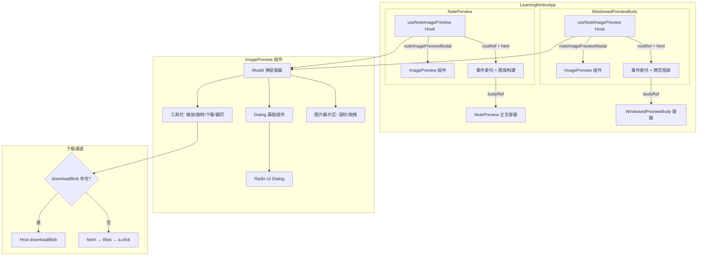
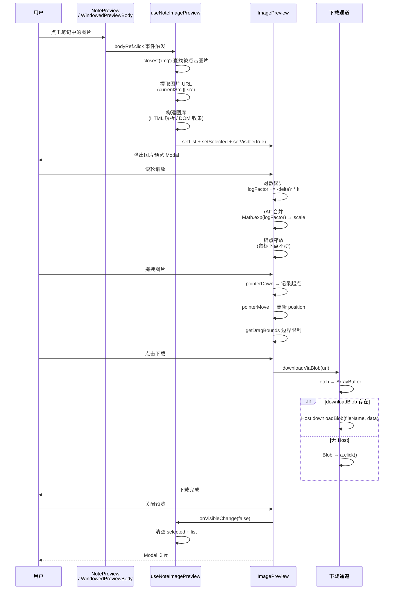

# 笔记预览图片点击交互增强

## 1. 背景与目标

### 背景
笔记预览模块（`NotePreview`）原本仅展示静态 HTML 内容，笔记中的图片无法点击交互。用户阅读笔记时，看到内嵌图片无法放大查看、旋转、下载，阅读体验受限。

### 目标
在不改变现有预览布局的前提下，为笔记预览（包括长文窗口化预览）引入完整的图片交互能力：

- 点击笔记中任意图片 → 弹出图片预览器
- 支持 **缩放**（滚轮/按钮，0.4×~5×）、**旋转**（每次 +45°）、**拖拽平移**
- 支持 **图库浏览**（上一张/下一张）
- 支持 **下载**（优先走 Host 通道，兜底浏览器 blob）
- 支持 **长文窗口化** 场景下的跨页图片收集

## 2. 改动范围

| 文件 | 变更类型 | 说明 |
|------|----------|------|
| `src/components/design/NotePreview/index.tsx` | 修改 | 集成 `useNoteImagePreview` Hook，注入 `bodyRef`、`downloadBlob` |
| `src/components/design/NotePreview/styles.css` | 修改 | 新增 `.note-preview-tiptap img { cursor: zoom-in }` |
| `src/components/design/index.ts` | 修改 | 新增 `HostDownloadBlob` 类型导出、`useNoteImagePreview` 导出 |
| `src/i18n/locales/en-US.ts` | 修改 | 新增 `imagePreview.*` 和 `common.download` 翻译 |
| `src/i18n/locales/zh-CN.ts` | 修改 | 新增 `imagePreview.*` 和 `common.download` 翻译 |
| `src/views/learning-notes/components/PreviewBody.tsx` | 修改 | 长文窗口化预览集成 `useNoteImagePreview` |
| `src/views/learning-notes/index.tsx` | 修改 | `LearningNotesApp` 将 `api.ui?.downloadBlob` 透传到 `NotePreview` 和 `WindowedPreviewBody` |
| `src/components/design/ImagePreview/index.tsx` | **新增** | 图片预览核心组件（缩放/旋转/拖拽/下载） |
| `src/components/design/Model/index.tsx` | **新增** | 弹层容器组件（基于 Radix Dialog） |
| `src/components/design/NotePreview/useNoteImagePreview.tsx` | **新增** | 事件委托 Hook + 图库构建 + 下载通道 |
| `src/components/ui/dialog.tsx` | **新增** | Radix UI Dialog 基础组件封装 |

## 3. 实现思路

### 3.1 架构分层

```
┌─────────────────────────────────────────────────────────────┐
│                      LearningNotesApp                        │
│                                                              │
│  ┌─────────────────────────────────────────────────────────┐ │
│  │                    NotePreview                          │ │
│  │                                                         │ │
│  │  ┌───────────────┐  ┌────────────────────────────────┐ │ │
│  │  │WindowedPreview │  │  useNoteImagePreview (Hook)     │ │ │
│  │  │   Body (长文)   │  │  ┌──────────────────────────┐  │ │ │
│  │  └───────┬───────┘  │  │ 事件委托 (bodyRef → img)   │  │ │ │
│  │          │          │  │ 图库构建 (HTML / DOM)       │  │ │ │
│  │          │          │  │ 下载通道 (Host / fetch)     │  │ │ │
│  │          │          │  └──────────────────────────┘  │ │ │
│  │          │          │  ┌──────────────────────────┐  │ │ │
│  │          └──────────│→ │  ImagePreview              │  │ │ │
│  │                     │  │  ┌────────────────────┐   │  │ │ │
│  │                     │  │  │     Model          │   │  │ │ │
│  │                     │  │  │  ┌──────────────┐  │   │  │ │ │
│  │                     │  │  │  │   Dialog    │  │   │  │ │ │
│  │                     │  │  │  │  (Radix UI)  │  │   │  │ │ │
│  │                     │  │  │  └──────────────┘  │   │  │ │ │
│  │                     │  │  └────────────────────┘   │  │ │ │
│  │                     │  │  缩放/旋转/拖拽/下载       │  │ │ │
│  │                     │  └──────────────────────────┘  │ │ │
│  │                     └────────────────────────────────┘ │ │
│  └─────────────────────────────────────────────────────────┘ │
└─────────────────────────────────────────────────────────────┘
```

### 3.2 核心机制

1. **事件委托**：在 `bodyRef` 容器上监听 `click` 事件，通过 `el.closest('img')` 查找被点击的图片，避免给每个 `` 单独绑定事件。
2. **图库构建**：优先从全文 HTML（`html` prop）解析所有 `` 标签构建完整图库，支持长文窗口化场景的跨页图片收集；DOM 兜底方案则收集当前渲染窗口内的图片。
3. **缩放算法**：采用对数累计（`logFactor += -deltaY * k`）+ rAF 合并，通过 `Math.exp(logFactor)` 映射为缩放倍率，保证大幅度滚轮时依然细腻。支持锚点缩放（鼠标下点不动）。
4. **拖拽边界**：`getDragBounds` 根据旋转角度计算有效外包矩形（`effW/effH`），据此限制平移范围，保证图片不会被拖出可视区域。
5. **下载通道**：优先走 `Host downloadBlob`（嵌入态 toast 提示），兜底走 `fetch → Blob → a.click()`（独立预览同源实现）。
6. **重绑机制**：`rebindWhen` 参数在 HTML 内容或窗口 `origin` 变化时触发 `useEffect` 重绑，避免 `innerHTML` 替换后事件监听器失效。

## 4. 关键代码对比与注释

### 4.1 NotePreview 主组件集成

**文件**: `src/components/design/NotePreview/index.tsx`

#### 改动前

> 来源: `src/components/design/NotePreview/index.tsx` (改动前, 约第1-45行)

```typescript
// 从 react 导入 ReactNode 类型和 useMemo Hook
import { type ReactNode, useMemo } from 'react';
// 导入 ScrollArea 滚动容器组件
import { ScrollArea } from '@/components/ui/scroll-area';
// 导入国际化 Hook
import { useI18n } from '@/hooks';
// 导入 className 工具函数
import { cn } from '@/lib/utils';
// 导入 RichEditor 样式（预览态复用编辑器样式）
import '../RichEditor/styles.css';
// 导入预览 HTML 预处理函数
import { preparePreviewBody } from './previewHtml';
// 导入 NotePreview 自身样式
import './styles.css';
// 从 lucide-react 导入 Component 图标（空态展示用）
import { Component } from 'lucide-react';

// 定义 NotePreview 组件的 Props 类型
export type NotePreviewProps = {
	// 顶栏标题（替代编辑器 toolbar）
	title: string;
	// TipTap HTML 或 JSON 内容
	html?: string;
	// 顶栏标题旁/下方的次要信息（时间、标签等）
	meta?: ReactNode;
	// 顶栏右侧操作（返回编辑、列表开关等）
	headerExtra?: ReactNode;
	// 自定义正文；传入时忽略 html
	children?: ReactNode;
	// 底部自定义内容
	footer?: ReactNode;
	// 额外 className
	className?: string;
	// 正文区域额外 className
	bodyClassName?: string;
	// 空态文案
	emptyText?: string;
	// 是否加载中
	loading?: boolean;
};

// 从 previewHtml 模块重新导出工具函数
export {
	decoratePreviewHtml,
	preparePreviewBody,
	preserveEmptyParagraphs,
	splitPreviewBlocks,
	stripNoteTitleHtml,
} from './previewHtml';

// ...（未改动：NotePreview 组件函数体，缺少 bodyRef、useNoteImagePreview 调用和 noteImagePreviewModal 渲染）
```

#### 改动后

> 来源: `src/components/design/NotePreview/index.tsx` (改动后, 第1-78行)

```typescript
// 从 lucide-react 导入 Component 图标（空态展示用），移到文件顶部统一管理
import { Component } from 'lucide-react';
// 从 react 导入 ReactNode 类型、useMemo 和 useRef Hook
import { type ReactNode, useMemo, useRef } from 'react';
// 导入 ScrollArea 滚动容器组件
import { ScrollArea } from '@/components/ui/scroll-area';
// 导入国际化 Hook
import { useI18n } from '@/hooks';
// 导入 className 工具函数
import { cn } from '@/lib/utils';
// 导入 RichEditor 样式（预览态复用编辑器样式）
import '../RichEditor/styles.css';
// 导入预览 HTML 预处理函数
import { preparePreviewBody } from './previewHtml';
// 导入 NotePreview 自身样式
import './styles.css';
// 从 useNoteImagePreview 模块导入 HostDownloadBlob 类型和 Hook
import {
	type HostDownloadBlob,
	useNoteImagePreview,
} from './useNoteImagePreview';

// 定义 NotePreview 组件的 Props 类型
export type NotePreviewProps = {
	// 顶栏标题（替代编辑器 toolbar）
	title: string;
	// TipTap HTML 或 JSON 内容
	html?: string;
	// 顶栏标题旁/下方的次要信息（时间、标签等）
	meta?: ReactNode;
	// 顶栏右侧操作（返回编辑、列表开关等）
	headerExtra?: ReactNode;
	// 自定义正文；传入时忽略 html
	children?: ReactNode;
	// 底部自定义内容
	footer?: ReactNode;
	// 额外 className
	className?: string;
	// 正文区域额外 className
	bodyClassName?: string;
	// 空态文案
	emptyText?: string;
	// 是否加载中
	loading?: boolean;
	// 点击图片预览时的下载实现
	// 嵌入 Host 用 api.ui.downloadBlob；独立预览用 mockHost 同源实现
	downloadBlob?: HostDownloadBlob;
};

// 从 previewHtml 模块重新导出工具函数
export {
	decoratePreviewHtml,
	preparePreviewBody,
	preserveEmptyParagraphs,
	splitPreviewBlocks,
	stripNoteTitleHtml,
} from './previewHtml';
// 从 useNoteImagePreview 模块重新导出 HostDownloadBlob 类型和 Hook
export type { HostDownloadBlob } from './useNoteImagePreview';
export { useNoteImagePreview } from './useNoteImagePreview';
```

> 来源: `src/components/design/NotePreview/index.tsx` (改动后, 第51-78行 — NotePreview 函数体核心集成)

```typescript
// NotePreview 函数组件定义，解构新增的 downloadBlob 参数
export function NotePreview({
	title,
	html,
	meta,
	headerExtra,
	children,
	footer,
	className,
	bodyClassName,
	emptyText,
	loading,
	downloadBlob,
}: NotePreviewProps) {
	// 获取国际化翻译函数
	const { t } = useI18n();
	// 计算空态文案（优先使用 prop，兜底用国际化通用文案）
	const empty = emptyText ?? t('common.emptyContent');
	// 使用 useMemo 缓存预处理后的正文 HTML，仅当 html 变化时重新计算
	const bodyHtml = useMemo(
		() => (html ? preparePreviewBody(html) : ''),
		[html],
	);
	// 创建 bodyRef，用于引用正文容器 DOM 节点，供事件委托 Hook 使用
	const bodyRef = useRef<HTMLDivElement>(null);
	// 调用 useNoteImagePreview Hook，绑定事件委托 + 构建图库
	const { noteImagePreviewModal } = useNoteImagePreview({
		// 将 bodyRef 作为事件委托的根容器
		rootRef: bodyRef,
		// 传入全文 HTML 用于构建完整图库（children 模式下不传 html）
		html: children == null ? html : undefined,
		// 透传下载实现
		downloadBlob,
		// 国际化翻译函数
		t,
		// 仅在纯 html 模式下启用（children 模式由外层自行处理）
		enabled: children == null,
		// html 变化时触发重绑，避免 innerHTML 替换后监听失效
		rebindWhen: bodyHtml,
	});
```

> 来源: `src/components/design/NotePreview/index.tsx` (改动后, 第116-132行 — bodyRef 挂载与 Modal 渲染)

```typescript
// ...（未改动：header 和 children 分支）
// 在 tiptap 容器 div 上挂载 bodyRef，使事件委托能定位到正文
<div
	ref={bodyRef}
	className="tiptap note-preview-tiptap ProseMirror"
	dangerouslySetInnerHTML={{ __html: bodyHtml }}
/>
// ...（未改动：空态展示）
// 在 footer 之后渲染图片预览 Modal（由 useNoteImagePreview Hook 返回）
{footer ? <div className="shrink-0">{footer}</div> : null}
{noteImagePreviewModal}
```

**变更摘要**：
- 新增 `downloadBlob` prop 和 `bodyRef` ref，通过 `useNoteImagePreview` Hook 注入图片点击事件委托。
- 在 JSX 末尾渲染 `noteImagePreviewModal`，将 Modal 挂载到组件树中。

---

### 4.2 PreviewBody 长文窗口集成

**文件**: `src/views/learning-notes/components/PreviewBody.tsx`

#### 改动前

> 来源: `src/views/learning-notes/components/PreviewBody.tsx` (改动前, 第1-33行)

```typescript
// 导入 React 基础类型与 Hooks
import {
	type UIEvent,
	useCallback,
	useEffect,
	useMemo,
	useRef,
	useState,
} from 'react';
// 导入预览 HTML 工具函数
import {
	decoratePreviewHtml,
	preserveEmptyParagraphs,
} from '@/components/design/NotePreview/previewHtml';
// 导入滚动区域组件
import { ScrollArea } from '@/components/ui/scroll-area';
// 导入 className 工具
import { cn } from '@/lib/utils';
// 导入长文处理工具
import {
	createLargeNoteDoc,
	EST_BLOCK_H,
	type LargeNoteDoc,
	ORIGIN_HYSTERESIS,
	originForScroll,
	WINDOW_SIZE,
	windowBodyHtml,
} from '../utils';

// Props 类型定义，仅包含 html 和 className
type Props = {
	html: string;
	className?: string;
};
```

> 来源: `src/views/learning-notes/components/PreviewBody.tsx` (改动前, 第34-130行)

```typescript
// 长文窗口化预览组件
export function WindowedPreviewBody({ html, className }: Props) {
	// ...（未改动：createLargeNoteDoc、docRef、originRef、shiftingRef、scrollRafRef 声明）
	// ...（未改动：state 定义、windowHtml useMemo、applyOrigin、onScroll、useEffect 清理）
	// 注意：这里没有 bodyRef，没有 useNoteImagePreview 调用
	return (
		// 包裹在 ScrollArea 中
		<ScrollArea
			className={cn(
				'rich-editor-body note-preview-static text-textcolor min-h-0 flex-1',
				className,
			)}
			onScroll={windowed ? onScroll : undefined}
		>
			{windowed ? (
				// 窗口化模式：绝对定位 + translateY 偏移
				<div className="relative w-full" style={{ height: bodyH }}>
					<div
						className="tiptap note-preview-tiptap ProseMirror absolute top-0 right-0 left-0"
						style={{ transform: `translateY(${offsetY}px)` }}
						dangerouslySetInnerHTML={{ __html: windowHtml }}
					/>
				</div>
			) : (
				// 非窗口化模式：直接渲染
				<div
					className="tiptap note-preview-tiptap ProseMirror relative w-full"
					dangerouslySetInnerHTML={{ __html: windowHtml }}
				/>
			)}
		</ScrollArea>
	);
}
```

#### 改动后

> 来源: `src/views/learning-notes/components/PreviewBody.tsx` (改动后, 第1-70行)

```typescript
// 导入 React 基础类型与 Hooks
import {
	type UIEvent,
	useCallback,
	useEffect,
	useMemo,
	useRef,
	useState,
} from 'react';
// 导入预览 HTML 工具函数
import {
	decoratePreviewHtml,
	preserveEmptyParagraphs,
} from '@/components/design/NotePreview/previewHtml';
// 导入 useNoteImagePreview Hook 和 HostDownloadBlob 类型
import {
	type HostDownloadBlob,
	useNoteImagePreview,
} from '@/components/design/NotePreview/useNoteImagePreview';
// 导入滚动区域组件
import { ScrollArea } from '@/components/ui/scroll-area';
// 导入国际化 Hook（新增，用于传递给 useNoteImagePreview）
import { useI18n } from '@/hooks';
// 导入 className 工具
import { cn } from '@/lib/utils';
// 导入长文处理工具
import {
	createLargeNoteDoc,
	EST_BLOCK_H,
	type LargeNoteDoc,
	ORIGIN_HYSTERESIS,
	originForScroll,
	WINDOW_SIZE,
	windowBodyHtml,
} from '../utils';

// Props 类型定义，新增 downloadBlob 参数
type Props = {
	html: string;
	className?: string;
	// 下载实现，由 LearningNotesApp 透传
	downloadBlob?: HostDownloadBlob;
};

// 长文窗口化预览组件
export function WindowedPreviewBody({ html, className, downloadBlob }: Props) {
	// 获取国际化翻译函数
	const { t } = useI18n();
	// ...（未改动：createLargeNoteDoc、docRef、originRef、shiftingRef、scrollRafRef 声明）
	// 新增 bodyRef，用于事件委托
	const bodyRef = useRef<HTMLDivElement>(null);
	// ...（未改动：state 定义、windowHtml useMemo）
	// 调用 useNoteImagePreview Hook，绑定事件委托
	const { noteImagePreviewModal } = useNoteImagePreview({
		// 事件委托根容器
		rootRef: bodyRef,
		// 传入全文 HTML 以构建完整图库（跨页收集）
		html,
		// 透传下载实现
		downloadBlob,
		// 国际化翻译函数
		t,
		// origin 和 windowHtml 变化时触发重绑
		rebindWhen: `${origin}:${windowHtml.length}`,
	});
```

> 来源: `src/views/learning-notes/components/PreviewBody.tsx` (改动后, 第132-164行 — JSX 重构)

```typescript
// ...（未改动：applyOrigin、onScroll、useEffect 清理）
// 用 Fragment 包裹 ScrollArea + Modal
return (
	<>
		<ScrollArea
			className={cn(
				'rich-editor-body note-preview-static text-textcolor min-h-0 flex-1',
				className,
			)}
			onScroll={windowed ? onScroll : undefined}
		>
			{windowed ? (
				// 窗口化模式：在最外层 div 挂载 bodyRef
				<div
					ref={bodyRef}
					className="relative w-full"
					style={{ height: bodyH }}
				>
					<div
						className="tiptap note-preview-tiptap ProseMirror absolute top-0 right-0 left-0"
						style={{ transform: `translateY(${offsetY}px)` }}
						dangerouslySetInnerHTML={{ __html: windowHtml }}
					/>
				</div>
			) : (
				// 非窗口化模式：直接在 tiptap div 挂载 bodyRef
				<div
					ref={bodyRef}
					className="tiptap note-preview-tiptap ProseMirror relative w-full"
					dangerouslySetInnerHTML={{ __html: windowHtml }}
				/>
			)}
		</ScrollArea>
		// 在 ScrollArea 外部渲染 Modal
		{noteImagePreviewModal}
	</>
);
```

**变更摘要**：
- `WindowedPreviewBody` 新增 `downloadBlob` prop 和 `bodyRef` ref，通过 `useNoteImagePreview` 实现长文窗口化下的图片事件委托。
- `rebindWhen` 使用 `origin:windowHtml.length` 格式，确保翻页时事件监听正确重绑，图库始终包含全文图片。

---

### 4.3 新增 ImagePreview 组件

**文件**: `src/components/design/ImagePreview/index.tsx`（新增文件）

#### 工具函数部分

> 来源: `src/components/design/ImagePreview/index.tsx` (第65-115行 — 工具函数)

```typescript
// 根据容器与图片（已含 scale、rotate 后的外包矩形）计算平移允许范围
// padding 为贴边留白，防止图片边缘刚好贴死
function getDragBounds(
	// 容器宽度
	containerW: number,
	// 容器高度
	containerH: number,
	// 图片原始布局宽度
	imgLayoutW: number,
	// 图片原始布局高度
	imgLayoutH: number,
	// 当前缩放倍率
	scale: number,
	// 当前旋转角度（度）
	rotateDeg: number,
	// 贴边留白像素
	padding: number,
): { minX: number; maxX: number; minY: number; maxY: number } {
	// 容器尺寸无效时返回零边界
	if (containerW <= 0 || containerH <= 0) {
		return { minX: 0, maxX: 0, minY: 0, maxY: 0 };
	}
	// 角度转弧度
	const r = (rotateDeg * Math.PI) / 180;
	// 计算当前图片显示尺寸
	const w = imgLayoutW * scale;
	const h = imgLayoutH * scale;
	// 计算旋转后的有效外包矩形宽高（投影到屏幕坐标系）
	const effW = Math.abs(w * Math.cos(r)) + Math.abs(h * Math.sin(r));
	const effH = Math.abs(w * Math.sin(r)) + Math.abs(h * Math.cos(r));
	// 容器半宽半高
	const halfCW = containerW / 2;
	const halfCH = containerH / 2;
	// 有效图片半宽半高
	const halfIW = effW / 2;
	const halfIH = effH / 2;
	// 计算 X 方向最大可平移距离
	const rangeX = Math.max(0, halfIW - halfCW + padding);
	// 计算 Y 方向最大可平移距离
	const rangeY = Math.max(0, halfIH - halfCH + padding);
	// 返回边界（中心坐标系，负向左上，正向右下）
	return { minX: -rangeX, maxX: rangeX, minY: -rangeY, maxY: rangeY };
}

// 将屏幕坐标系下的位移转到与 translate/rotate/scale 中 translate 一致的轴向
// 因为 transform 顺序是 translate → rotate → scale，平移发生在旋转之前
// 所以需要将屏幕位移做反向旋转
function screenDeltaToTranslateDelta(
	// 屏幕坐标系 X 位移
	dxScreen: number,
	// 屏幕坐标系 Y 位移
	dyScreen: number,
	// 当前旋转角度（度）
	rotateDeg: number,
): { dx: number; dy: number } {
	// 取反旋转角度（因为要从屏幕坐标反推回 translate 坐标）
	const rad = (-rotateDeg * Math.PI) / 180;
	// 计算旋转矩阵
	const cos = Math.cos(rad);
	const sin = Math.sin(rad);
	// 返回旋转后的位移分量
	return {
		dx: dxScreen * cos - dyScreen * sin,
		dy: dxScreen * sin + dyScreen * cos,
	};
}

// 将角度归一到 [0, 360)，用于判断是否与 0° 等价
function normalizeRotationDeg(deg: number): number {
	const x = deg % 360;
	return x < 0 ? x + 360 : x;
}

// 判断当前旋转角度是否为恒等变换（0°、360°、720° 等）
function isRotationIdentity(deg: number, eps = 1e-6): boolean {
	const n = normalizeRotationDeg(deg);
	return n < eps || Math.abs(n - 360) < eps;
}
```

#### 状态管理部分

> 来源: `src/components/design/ImagePreview/index.tsx` (第117-175行 — forwardRef 组件定义与状态)

```typescript
// 使用 forwardRef 包裹 ImagePreview，暴露 setImage 方法供外部调用
const ImagePreview = forwardRef<ImagePreviewHandle, ImagePreviewProps>(
	({ /* props */ }, ref) => {
		// 计算有效标题：优先 prop title，其次 i18n，兜底中文
		const effectiveTitle = title ?? t?.('imagePreview.title') ?? '图片预览';
		// 当前显示的图片
		const [currentImage, setCurrentImage] = useState<SelectedImage>(
			selectedImage || { url: '' },
		);
		// 是否已达到最大缩放
		const [isMaxed, setIsMaxed] = useState(false);
		// 是否已达到最小缩放
		const [isMined, setIsMined] = useState(false);
		// 文件大小（KB）
		const [fileSize, setFileSize] = useState<number | null>(null);
		// 图片变换状态（缩放、旋转、尺寸、边界标记）
		const [transformInfo, setTransformInfo] = useState({
			scale: 1,
			rotate: 0,
			imgWidth: 0,
			imgHeight: 0,
			boundary: true,
		});
		// 平移位置（中心坐标系）
		const [position, setPosition] = useState({ x: 0, y: 0 });
		// 是否正在拖拽
		const [isDragging, setIsDragging] = useState(false);
		// 是否正在滚轮缩放
		const [isWheeling, setIsWheeling] = useState(false);
		// 用 ref 跟踪 wheeling 状态（避免闭包陈旧值）
		const isWheelingRef = useRef(false);
		// 用 ref 跟踪拖拽状态（避免闭包陈旧值）
		const draggingRef = useRef(false);
		// 上一次指针位置
		const lastPointerRef = useRef({ x: 0, y: 0 });
		// 滚轮防抖定时器
		const wheelingTimeoutRef = useRef<number | null>(null);
		// 滚轮 rAF 引用
		const wheelRafRef = useRef(0);
		// 滚轮累计器（对数缩放 + 锚点坐标）
		const wheelAccRef = useRef({
			logFactor: 0,
			clientX: 0,
			clientY: 0,
		});
		// 图片 DOM 引用
		const imgRef = useRef<HTMLImageElement>(null);
		// 容器 DOM 引用
		const containerRef = useRef<HTMLDivElement>(null);
		// 图片布局尺寸（用于边界计算）
		const layoutSizeRef = useRef({ w: 0, h: 0 });
```

#### 事件处理部分（滚轮缩放）

> 来源: `src/components/design/ImagePreview/index.tsx` (第334-409行 — onWheel 核心算法)

```typescript
// 滚轮事件处理：对数累计 + rAF 合并 + 锚点缩放
const onWheel = useCallback(
	(e: React.WheelEvent<HTMLImageElement>) => {
		// 阻止页面滚动，避免触发浏览器默认缩放
		e.preventDefault();
		e.stopPropagation();
		// 清除之前的防抖定时器
		if (wheelingTimeoutRef.current) {
			window.clearTimeout(wheelingTimeoutRef.current);
			wheelingTimeoutRef.current = null;
		}
		// 标记正在滚轮缩放（控制 cursor 和 transition）
		if (!isWheelingRef.current) setIsWheeling(true);
		// 140ms 无滚轮事件则恢复状态
		wheelingTimeoutRef.current = window.setTimeout(() => {
			setIsWheeling(false);
			wheelingTimeoutRef.current = null;
		}, 140);
		// 统一 deltaY：deltaMode 为行/页时折算到像素级
		const mode = e.deltaMode;
		const lineHeight = 16;
		const pageHeight = 800;
		const dy =
			mode === 1
				? e.deltaY * lineHeight
				: mode === 2
					? e.deltaY * pageHeight
					: e.deltaY;
		// 缩放灵敏度：Ctrl/Cmd 键按下时更精细
		const k = e.ctrlKey ? 0.0022 : 0.0016;
		// 对数累计：logFactor 与缩放倍率成 log 关系
		wheelAccRef.current.logFactor += -dy * k;
		// 记录鼠标位置用于锚点缩放
		wheelAccRef.current.clientX = e.clientX;
		wheelAccRef.current.clientY = e.clientY;
		// 如果已有 rAF 在执行，跳过本次（合并到下一帧）
		if (wheelRafRef.current) return;
		// 请求下一帧统一处理缩放更新
		wheelRafRef.current = requestAnimationFrame(() => {
			wheelRafRef.current = 0;
			// 取出累计值并清零
			const { logFactor, clientX, clientY } = wheelAccRef.current;
			wheelAccRef.current.logFactor = 0;
			// 无累计变化则跳过
			if (logFactor === 0) return;
			// 获取容器和图片的布局信息
			const container = containerRef.current;
			const img = imgRef.current;
			if (!container || !img) return;
			const cr = container.getBoundingClientRect();
			// 鼠标在容器中的相对坐标（以中心为原点）
			const px = clientX - (cr.left + cr.width / 2);
			const py = clientY - (cr.top + cr.height / 2);
			// 更新 transform 状态
			setTransformInfo((prev) => {
				const prevScale = prev.scale;
				// 用 exp(logFactor) 得到实际缩放倍率
				const factor = Math.exp(logFactor);
				const nextScale = Math.min(5, Math.max(0.4, prevScale * factor));
				// 缩放变化过小时跳过
				if (Math.abs(nextScale - prevScale) < 1e-6) return prev;
				// 锚点缩放：未旋转时，让鼠标点下的内容保持不动
				const rotate = actualTransform.rotate;
				if (isRotationIdentity(rotate)) {
					setPosition((posPrev) => {
						const s = nextScale / prevScale;
						// 位置修正：鼠标点在缩放后保持相对不动
						const nextPos = {
							x: posPrev.x + px * (1 - s),
							y: posPrev.y + py * (1 - s),
						};
						return clampPositionToBounds(nextPos, nextScale, rotate);
					});
				}
				return { ...prev, scale: nextScale };
			});
		});
	},
	[actualTransform.rotate, clampPositionToBounds],
);
```

#### 渲染部分

> 来源: `src/components/design/ImagePreview/index.tsx` (第574-703行 — 完整 JSX 结构)

```typescript
// 渲染 ImagePreview 组件
return (
	// 最外层使用 Model 组件（基于 Radix Dialog 的弹层容器）
	<Model
		// 标题：使用计算后的有效标题
		title={effectiveTitle}
		// 控制可见性
		open={visible}
		// 关闭图标由内部自定义（使用自定义 header 中的 X 按钮）
		showCloseIcon={false}
		// 可见性变化回调
		onVisibleChange={onVisibleChangeHandler}
		// 自定义 header：工具栏（缩放/旋转/下载/重置/翻页）
		header={
			<div className="flex justify-between items-center pb-4.5 border-b border-theme-white/5 select-none">
				// 左侧标题文本
				<span className="text-xl font-medium text-textcolor">
					{effectiveTitle}
				</span>
				// 右侧工具栏按钮组
				<div className="relative flex items-center gap-1 -mr-2.5">
					// 放大按钮（未达最大时显示）
					{showZoomIn && !isMaxed && (
						<span
							className="flex items-center justify-center w-9 h-9 rounded-md bg-transparent text-foreground cursor-pointer transition-all duration-200 hover:bg-theme/10"
							onClick={() => onScaleMax(0.2)}
							title={t?.('imagePreview.zoomIn') ?? '放大'}
						>
							<ZoomIn size={20} className="text-textcolor" />
						</span>
					)}
					// 缩小按钮（未达最小时显示）
					{showZoomOut && !isMined && (
						<span
							className="flex items-center justify-center w-9 h-9 rounded-md bg-transparent text-foreground cursor-pointer transition-all duration-200 hover:bg-theme/10"
							onClick={() => onScaleMin(0.2)}
							title={t?.('imagePreview.zoomOut') ?? '缩小'}
						>
							<ZoomOut size={20} className="text-textcolor" />
						</span>
					)}
					// 旋转按钮（每次 +45°）
					{showRotate && (
						<span
							className="flex items-center justify-center w-9 h-9 rounded-md bg-transparent text-foreground cursor-pointer transition-all duration-200 hover:bg-theme/10"
							onClick={onRotate}
							title={t?.('imagePreview.rotate') ?? '旋转'}
						>
							<RotateCw size={18} className="text-textcolor" />
						</span>
					)}
					// 下载按钮
					{showDownload && (
						<span
							className="flex items-center justify-center w-9 h-9 rounded-md bg-transparent text-foreground cursor-pointer transition-all duration-200 hover:bg-theme/10"
							onClick={onDownload}
							title={t?.('common.download') ?? '下载'}
						>
							<Download size={18} className="text-textcolor" />
						</span>
					)}
					// 重置按钮
					{showReset && (
						<span
							className="flex items-center justify-center w-9 h-9 rounded-md bg-transparent text-foreground cursor-pointer transition-all duration-200 hover:bg-theme/10"
							onClick={onRefresh}
							title={t?.('imagePreview.reset') ?? '重置'}
						>
							<RefreshCw size={18} className="text-textcolor" />
						</span>
					)}
					// 上一张/下一张按钮（图片数 > 1 时显示）
					{showPrevAndNext && prevImages.length > 1 && (
						<>
							<span
								className="flex items-center justify-center w-9 h-9 rounded-md bg-transparent text-foreground cursor-pointer transition-all duration-200 hover:bg-theme/10"
								onClick={onPrev}
								title={t?.('imagePreview.prev') ?? '上一张'}
							>
								<ChevronLeft size={18} className="text-textcolor" />
							</span>
							<span
								className="flex items-center justify-center w-9 h-9 rounded-md bg-transparent text-foreground cursor-pointer transition-all duration-200 hover:bg-theme/10"
								onClick={onNext}
								title={t?.('imagePreview.next') ?? '下一张'}
							>
								<ChevronRight size={18} className="text-textcolor" />
							</span>
						</>
					)}
					// 文件大小显示
					{fileSize !== null && fileSize !== 0 && (
						<span className="text-textcolor font-medium text-sm">
							{fileSize.toFixed(2)} KB
						</span>
					)}
					// 原始尺寸显示
					{imageSize && (
						<span className="text-textcolor font-medium text-sm">
							{imageSize}
						</span>
					)}
					// 关闭按钮（X 图标）
					<span
						className="position flex items-center justify-center w-9 h-9 rounded-md bg-transparent text-foreground cursor-pointer transition-all duration-200 hover:bg-theme/10"
						onClick={() => onVisibleChange?.(false)}
						title={t?.('imagePreview.close') ?? '关闭'}
					>
						<X size={22} className="text-textcolor" />
					</span>
				</div>
			</div>
		}
		// Modal 尺寸
		width="82vw"
		height="85vh"
		// 提交回调
		onSubmit={onClose}
		// 是否显示 footer
		showFooter={!!showFooter}
		// 是否显示关闭按钮
		showClose={showClose}
	>
		// 图片展示区域容器
		<div
			className="relative w-full h-full flex items-center justify-center overflow-hidden p-5"
			ref={containerRef}
		>
			// 图片元素：绑定滚轮/拖拽/加载事件
			
		</div>
	</Model>
);
```

**变更摘要**：
- 新增 `ImagePreview` 组件，基于 `Model` 弹层容器，实现了缩放（0.4×~5×）、旋转（+45°）、拖拽平移、图库翻页、下载等完整交互。
- 缩放算法采用对数累计 + rAF 合并 + 锚点缩放，保证流畅且精准的缩放体验。

---

### 4.4 新增 Model 弹层组件

**文件**: `src/components/design/Model/index.tsx`（新增文件）

> 来源: `src/components/design/Model/index.tsx` (第1-117行)

```typescript
// 导入 shadcn Button 组件
import { Button } from '@ui/button';
// 从 dialog UI 组件导入 Radix Dialog 基础组件
import {
	Dialog,
	DialogClose,
	DialogContent,
	DialogDescription,
	DialogFooter,
	DialogHeader,
	DialogTitle,
	DialogTrigger,
} from '@ui/dialog';
// 导入 className 工具
import { cn } from '@/lib/utils';

// 定义 Model 弹层遮罩样式：适度压暗 + 极轻背景模糊
const MODEL_OVERLAY_CLASS = cn(
	'bg-theme-background/35',
	'supports-[backdrop-filter:blur(0)]:backdrop-blur-[2px]',
);

// Props 接口定义
interface IProps {
	// 控制是否显示
	open: boolean;
	// 显示状态变化回调
	onOpenChange: (open: boolean) => void;
	// 标题（无障碍用）
	title?: string;
	// 子内容
	children: React.ReactNode;
	// 弹层宽度
	width?: string;
	// 弹层高度
	height?: string;
	// 自定义 header
	header?: React.ReactNode;
	// 自定义 footer
	footer?: React.ReactNode;
	// 描述（无障碍用）
	description?: string;
	// 触发器
	trigger?: React.ReactNode;
	// 提交回调
	onSubmit?: () => void;
	// 关闭回调
	close?: () => void;
	// 是否显示 footer
	showFooter?: boolean;
	// 是否显示关闭按钮
	showClose?: boolean;
	// 是否显示右上角关闭图标
	showCloseIcon?: boolean;
	// DialogContent 内联样式
	contentStyle?: React.CSSProperties;
	// DialogContent 额外 className
	contentClassName?: string;
}

// Model 组件实现
const Model: React.FC<IProps> = ({
	title,
	trigger,
	header,
	footer,
	width = '325px',
	height = 'auto',
	children,
	description,
	open,
	onOpenChange,
	onSubmit,
	close: _close,
	showFooter,
	showClose = true,
	showCloseIcon = true,
	contentStyle,
	contentClassName,
}) => {
	// 确定按钮的点击处理
	const onOk = () => {
		onSubmit?.();
	};

	return (
		// 根组件：Radix Dialog
		<Dialog open={open} onOpenChange={onOpenChange}>
			// 可选的触发器
			{trigger ? <DialogTrigger asChild>{trigger}</DialogTrigger> : null}
			// DialogContent：弹层主体
			<DialogContent
				// 是否显示默认关闭按钮
				showCloseButton={showCloseIcon}
				// 自定义遮罩样式
				overlayClassName={MODEL_OVERLAY_CLASS}
				// 额外 className
				className={contentClassName}
				// 内联样式：设置宽高
				style={{ maxWidth: width, height, ...contentStyle }}
			>
				// 有自定义 header 时
				{header ? (
					<DialogHeader>
						// 隐藏的标题（用于可访问性 screen reader）
						<DialogTitle className="sr-only">{title}</DialogTitle>
						// 隐藏的描述（用于可访问性）
						<DialogDescription className="sr-only">
							{description}
						</DialogDescription>
						// 渲染自定义 header 内容
						{header}
					</DialogHeader>
				) : (
					// 无自定义 header 时：使用默认标题/描述
					<DialogHeader>
						{title && <DialogTitle>{title}</DialogTitle>}
						{description ? (
							<DialogDescription>{description}</DialogDescription>
						) : (
							<DialogDescription className="sr-only"></DialogDescription>
						)}
					</DialogHeader>
				)}
				// 渲染子内容
				{children}
				// Footer 逻辑：
				// showFooter !== false 且 footer 不为 null 时：渲染默认确定/取消按钮
				{showFooter !== false && footer !== null ? (
					<footer>
						<Button
							type="submit"
							className="cursor-pointer w-20"
							onClick={onOk}
						>
							确定
						</Button>
						{showClose && (
							<DialogClose asChild>
								<Button variant="outline" className="cursor-pointer w-20">
									取消
								</Button>
							</DialogClose>
						)}
					</footer>
				) : footer === null ? null : (
					// footer 未定义且 showFooter 为 false 时：渲染空 footer
					<DialogFooter />
				)}
			</DialogContent>
		</Dialog>
	);
};

// 默认导出
export default Model;
```

**变更摘要**：
- 新增 `Model` 弹层组件，封装 Radix `Dialog` 基础组件，提供遮罩模糊、自定义 header/footer、可访问性支持等能力。
- `ImagePreview` 通过此组件获得弹层容器，自身只需关注图片交互逻辑。

---

### 4.5 新增 useNoteImagePreview Hook

**文件**: `src/components/design/NotePreview/useNoteImagePreview.tsx`（新增文件）

#### 工具函数与类型定义

> 来源: `src/components/design/NotePreview/useNoteImagePreview.tsx` (第1-83行)

```typescript
// 笔记预览图片点击交互 Hook 文件头注释
/**
 * 笔记预览：点击 img → ImagePreview；下载走 Host downloadBlob（独立预览为 mock）。
 */

// 导入 React 类型与 Hooks
import {
	type ReactNode,
	type RefObject,
	useCallback,
	useEffect,
	useMemo,
	useRef,
	useState,
} from 'react';
// 导入 ImagePreview 组件和 SelectedImage 类型
import ImagePreview, {
	type SelectedImage,
} from '@/components/design/ImagePreview';

// 定义 Host downloadBlob 类型：用于嵌入态下载
export type HostDownloadBlob = (options: {
	fileName: string;
	data: ArrayBuffer | Uint8Array;
	mimeType?: string;
}) => Promise<{ ok: boolean; hostToasted: boolean; message?: string }>;

// 翻译函数类型
type TFn = (key: string, params?: Record<string, unknown>) => string;

// 从 URL 提取文件名的工具函数
function fileNameFromUrl(url: string): string {
	try {
		// 解析 URL 路径
		const path = new URL(url, window.location.href).pathname;
		// 取路径最后一段并 URL 解码
		const base = decodeURIComponent(path.split('/').pop() || '');
		// 验证是否为带扩展名的文件名
		if (base && /\.[a-z0-9]+$/i.test(base)) return base;
	} catch {
		// URL 解析失败，忽略
	}
	// 兜底返回默认文件名
	return 'image.png';
}

// 从笔记 HTML 中提取所有图片 URL，支持长文窗口化跨页收集
export function extractPreviewImageUrls(html: string): string[] {
	// 空 HTML 返回空数组
	if (!html.trim()) return [];
	try {
		// 使用 DOMParser 解析 HTML
		const doc = new DOMParser().parseFromString(html, 'text/html');
		// 去重集合
		const seen = new Set<string>();
		// 输出数组
		const out: string[] = [];
		// 遍历所有 img 标签
		for (const img of doc.querySelectorAll('img')) {
			const src = img.getAttribute('src')?.trim();
			// 跳过无效或重复的 URL
			if (!src || seen.has(src)) continue;
			seen.add(src);
			out.push(src);
		}
		return out;
	} catch {
		// 解析失败返回空数组
		return [];
	}
}

// 通过 fetch → blob → downloadBlob 的下载实现
async function downloadViaBlob(
	// 图片 URL
	url: string,
	// Host downloadBlob 可选实现
	downloadBlob?: HostDownloadBlob,
): Promise<void> {
	// fetch 图片数据
	const res = await fetch(url);
	if (!res.ok) throw new Error(`HTTP ${res.status}`);
	// 读取 ArrayBuffer
	const data = await res.arrayBuffer();
	// 从响应头获取 MIME 类型
	const mime =
		res.headers.get('content-type')?.split(';')[0]?.trim() || 'image/png';
	// 从 URL 提取文件名
	const fileName = fileNameFromUrl(url);
	// 优先走 Host downloadBlob 通道
	if (downloadBlob) {
		const result = await downloadBlob({ fileName, data, mimeType: mime });
		if (!result.ok) throw new Error(result.message || 'download failed');
		return;
	}
	// 无 Host：浏览器落盘（独立预览兜底）
	const blob = new Blob([data], { type: mime });
	const obj = URL.createObjectURL(blob);
	const a = document.createElement('a');
	a.href = obj;
	a.download = fileName;
	document.body.appendChild(a);
	a.click();
	a.remove();
	URL.revokeObjectURL(obj);
}
```

#### Hook 主体实现

> 来源: `src/components/design/NotePreview/useNoteImagePreview.tsx` (第85-199行)

```typescript
// Hook 返回值类型
export type UseNoteImagePreviewResult = {
	// 图片预览 Modal JSX 节点
	noteImagePreviewModal: ReactNode;
};

// useNoteImagePreview Hook 主实现
export function useNoteImagePreview(options: {
	// 事件委托的根容器 ref
	rootRef: RefObject<HTMLElement | null>;
	// 全文 HTML，用于图库列表构建；缺省则收集当前 DOM 内图片
	html?: string;
	// 下载实现
	downloadBlob?: HostDownloadBlob;
	// 国际化翻译函数
	t?: TFn;
	// 是否启用
	enabled?: boolean;
	// 变化时触发重绑的依赖项
	rebindWhen?: unknown;
}): UseNoteImagePreviewResult {
	// 解构 options
	const {
		rootRef,
		html,
		downloadBlob,
		t,
		enabled = true,
		rebindWhen,
	} = options;
	// 控制 Modal 可见性
	const [visible, setVisible] = useState(false);
	// 当前选中的图片
	const [selected, setSelected] = useState<SelectedImage>({ url: '' });
	// 图库列表
	const [list, setList] = useState<SelectedImage[]>([]);
	// downloadBlob ref（避免闭包陈旧值）
	const downloadBlobRef = useRef(downloadBlob);
	downloadBlobRef.current = downloadBlob;

	// 从全文 HTML 预构建图库 URL 列表
	const galleryFromHtml = useMemo(
		() => (html ? extractPreviewImageUrls(html) : null),
		[html],
	);

	// 核心：事件委托 + 图库构建
	useEffect(() => {
		const root = rootRef.current;
		// 根容器不存在或未启用时跳过
		if (!root || !enabled) return;

		// 点击事件处理函数
		const onClick = (e: MouseEvent) => {
			const el = e.target;
			// 仅处理 Element 类型目标
			if (!(el instanceof Element)) return;
			// 向上查找最近的 img 元素
			const img = el.closest('img');
			// 未找到 img 或 img 不在 root 内则跳过
			if (!img || !root.contains(img)) return;
			// 获取图片 URL（优先 currentSrc，兜底 src 属性）
			const url =
				(img as HTMLImageElement).currentSrc || img.getAttribute('src');
			// URL 无效时跳过
			if (!url?.trim()) return;
			// 阻止默认行为和冒泡
			e.preventDefault();
			e.stopPropagation();

			// 构建图库：优先使用从 HTML 解析的完整列表
			const urls =
				galleryFromHtml && galleryFromHtml.length > 0
					? galleryFromHtml
					// DOM 兜底：收集当前 root 内所有 img
					: Array.from(root.querySelectorAll('img'))
							.map((node) => {
								const n = node as HTMLImageElement;
								return (n.currentSrc || n.getAttribute('src') || '').trim();
							})
							.filter(Boolean);

			// 去重
			const uniq: string[] = [];
			const seen = new Set<string>();
			for (const u of urls) {
				if (seen.has(u)) continue;
				seen.add(u);
				uniq.push(u);
			}
			// 映射为 SelectedImage 数组
			const images = uniq.map((u, i) => ({ id: String(i), url: u }));
			// 在图库中找到被点击的图片
			const hit =
				images.find((i) => i.url === url) ??
				({ id: '0', url } as SelectedImage);
			// 更新状态：图库列表 + 选中项 + 显示 Modal
			setList(images);
			setSelected(hit);
			setVisible(true);
		};

		// 绑定点击事件
		root.addEventListener('click', onClick);
		// 清理函数：移除事件监听
		return () => root.removeEventListener('click', onClick);
	}, [rootRef, enabled, rebindWhen, galleryFromHtml]);

	// Modal 可见性变化回调
	const onVisibleChange = useCallback((next: boolean) => {
		setVisible(next);
		// 关闭时清空状态
		if (!next) {
			setSelected({ url: '' });
			setList([]);
		}
	}, []);

	// 下载处理回调
	const onDownload = useCallback(async (image: SelectedImage) => {
		if (!image.url) return;
		try {
			// 通过 fetch → blob 下载
			await downloadViaBlob(image.url, downloadBlobRef.current);
		} catch (err) {
			console.warn('[note-preview] image download failed', err);
		}
	}, []);

	// 构建 noteImagePreviewModal JSX 节点
	const noteImagePreviewModal = (
		<ImagePreview
			visible={visible}
			selectedImage={selected}
			imageList={list}
			showDownload
			showPrevAndNext={list.length > 1}
			download={onDownload}
			onVisibleChange={onVisibleChange}
			title={t?.('imagePreview.title')}
			t={t}
		/>
	);

	// 返回 Modal JSX 节点
	return { noteImagePreviewModal };
}
```

**变更摘要**：
- 新增 `useNoteImagePreview` Hook，实现事件委托（rootRef click → closest('img') → 图库构建 → 打开预览）和下载通道（Host downloadBlob / fetch blob 兜底）。
- 支持 `rebindWhen` 参数，在 HTML 变化时自动重绑事件监听，确保长文窗口翻页后仍可点击预览。

---

### 4.6 新增 Dialog UI 组件

**文件**: `src/components/ui/dialog.tsx`（新增文件）

> 来源: `src/components/ui/dialog.tsx` (第1-143行)

```typescript
// 导入 XIcon 图标（替代 lucide-react 的 X，用于关闭按钮）
import { XIcon } from 'lucide-react';
// 从 radix-ui 导入 Dialog 基础组件
import { Dialog as DialogPrimitive } from 'radix-ui';
// 导入 React
import * as React from 'react';
// 导入 className 工具
import { cn } from '@/lib/utils';

// Dialog 根组件：Radix Root 的封装
function Dialog({
	...props
}: React.ComponentProps<typeof DialogPrimitive.Root>) {
	return <DialogPrimitive.Root data-slot="dialog" {...props} />;
}

// DialogTrigger 组件
function DialogTrigger({
	...props
}: React.ComponentProps<typeof DialogPrimitive.Trigger>) {
	return <DialogPrimitive.Trigger data-slot="dialog-trigger" {...props} />;
}

// DialogPortal 组件
function DialogPortal({
	...props
}: React.ComponentProps<typeof DialogPrimitive.Portal>) {
	return <DialogPrimitive.Portal data-slot="dialog-portal" {...props} />;
}

// DialogClose 组件
function DialogClose({
	...props
}: React.ComponentProps<typeof DialogPrimitive.Close>) {
	return <DialogPrimitive.Close data-slot="dialog-close" {...props} />;
}

// DialogOverlay 组件：添加淡入淡出动画
function DialogOverlay({
	className,
	...props
}: React.ComponentProps<typeof DialogPrimitive.Overlay>) {
	return (
		<DialogPrimitive.Overlay
			data-slot="dialog-overlay"
			// 固定定位全屏遮罩 + 动画
			className={cn(
				'data-[state=open]:animate-in data-[state=closed]:animate-out data-[state=closed]:fade-out-0 data-[state=open]:fade-in-0 fixed inset-0 z-1 bg-theme/5',
				className,
			)}
			{...props}
		/>
	);
}

// DialogContent 组件：弹层内容容器
function DialogContent({
	className,
	children,
	showCloseButton = true,
	overlayClassName,
	...props
}: React.ComponentProps<typeof DialogPrimitive.Content> & {
	showCloseButton?: boolean;
	overlayClassName?: string;
}) {
	return (
		// Portal 将内容渲染到 body 下
		<DialogPortal data-slot="dialog-portal">
			// 自定义遮罩层
			<DialogOverlay className={overlayClassName} />
			// Radix Content：居中定位 + 动画 + 阴影
			<DialogPrimitive.Content
				data-slot="dialog-content"
				className={cn(
					// 样式：居中、圆角、边框、阴影、动画
					'p-4.5 bg-theme-background/95 data-[state=open]:animate-in data-[state=closed]:animate-out data-[state=closed]:fade-out-0 data-[state=open]:fade-in-0 data-[state=closed]:zoom-out-95 data-[state=open]:zoom-in-95 fixed top-[50%] left-[50%] z-50 grid w-full max-w-[calc(100%-2rem)] translate-x-[-50%] translate-y-[-50%] gap-4 rounded-lg border border-theme-border shadow-lg duration-200 outline-none sm:max-w-lg',
					className,
				)}
				{...props}
			>
				{children}
				// 可选的右上角关闭按钮
				{showCloseButton && (
					<DialogPrimitive.Close
						data-slot="dialog-close"
						className="absolute top-4 right-4 rounded-xs opacity-70 transition-opacity hover:opacity-100 focus:outline-hidden focus-visible:ring-2 focus-visible:ring-ring focus-visible:ring-offset-2 focus-visible:ring-offset-theme-background disabled:pointer-events-none [&_svg]:pointer-events-none [&_svg]:shrink-0 [&_svg:not([class*='size-'])]:size-4"
					>
						<XIcon />
						<span className="sr-only">Close</span>
					</DialogPrimitive.Close>
				)}
			</DialogPrimitive.Content>
		</DialogPortal>
	);
}

// DialogHeader 组件
function DialogHeader({ className, ...props }: React.ComponentProps<'div'>) {
	return (
		<div
			data-slot="dialog-header"
			className={cn('flex flex-col gap-2 text-center sm:text-left', className)}
			{...props}
		/>
	);
}

// DialogFooter 组件
function DialogFooter({ className, ...props }: React.ComponentProps<'div'>) {
	return (
		<div
			data-slot="dialog-footer"
			className={cn(
				'flex flex-col-reverse gap-2 sm:flex-row sm:justify-end',
				className,
			)}
			{...props}
		/>
	);
}

// DialogTitle 组件
function DialogTitle({
	className,
	...props
}: React.ComponentProps<typeof DialogPrimitive.Title>) {
	return (
		<DialogPrimitive.Title
			data-slot="dialog-title"
			className={cn('text-lg leading-none font-semibold', className)}
			{...props}
		/>
	);
}

// DialogDescription 组件
function DialogDescription({
	className,
	...props
}: React.ComponentProps<typeof DialogPrimitive.Description>) {
	return (
		<DialogPrimitive.Description
			data-slot="dialog-description"
			className={cn('text-textcolor text-sm', className)}
			{...props}
		/>
	);
}

// 导出所有 Dialog 组件
export {
	Dialog,
	DialogClose,
	DialogContent,
	DialogDescription,
	DialogFooter,
	DialogHeader,
	DialogOverlay,
	DialogPortal,
	DialogTitle,
	DialogTrigger,
};
```

**变更摘要**：
- 基于 Radix UI Dialog 封装了一套完整的 Dialog 基础组件，支持淡入淡出动画、居中定位、可访问性等特性。
- `Model` 组件基于此构建，`ImagePreview` 通过 `Model → Dialog` 获得弹层能力。

---

### 4.7 i18n 国际化补充

**文件**: `src/i18n/locales/en-US.ts` 和 `src/i18n/locales/zh-CN.ts`

#### 改动前

> 来源: `src/i18n/locales/en-US.ts` (改动前, 第1-14行)

```typescript
// 英文翻译文件
const enUS: Record<string, string> = {
	'common.confirm': 'Confirm',
	'common.cancel': 'Cancel',
	'common.untitledNote': 'Untitled note',
	'common.emptyContent': 'No content',
	'common.requestFailed': 'Request failed',
	'common.loading': 'Loading…',
	'common.loadingMore': 'Loading more…',
	'common.noMore': 'No more',
	'common.allLoaded': 'All loaded',
	'common.loadedCount': 'Loaded {loaded} / {total}',
	'common.toggleLanguage': 'Toggle language',
	'common.connectingHost': 'Connecting to host…',
	// 注意：此处无 common.download 和 imagePreview.* 键
```

#### 改动后

> 来源: `src/i18n/locales/en-US.ts` (改动后, 第1-25行)

```typescript
// 英文翻译文件
const enUS: Record<string, string> = {
	'common.confirm': 'Confirm',
	'common.cancel': 'Cancel',
	'common.untitledNote': 'Untitled note',
	'common.emptyContent': 'No content',
	'common.requestFailed': 'Request failed',
	'common.loading': 'Loading…',
	'common.loadingMore': 'Loading more…',
	'common.noMore': 'No more',
	'common.allLoaded': 'All loaded',
	'common.loadedCount': 'Loaded {loaded} / {total}',
	'common.toggleLanguage': 'Toggle language',
	'common.connectingHost': 'Connecting to host…',
	// 新增：下载通用文案
	'common.download': 'Download',
	// 新增：图片预览相关文案
	'imagePreview.title': 'Image preview',
	'imagePreview.zoomIn': 'Zoom in',
	'imagePreview.zoomOut': 'Zoom out',
	'imagePreview.rotate': 'Rotate',
	'imagePreview.reset': 'Reset',
	'imagePreview.prev': 'Previous',
	'imagePreview.next': 'Next',
	'imagePreview.close': 'Close',
```

> 来源: `src/i18n/locales/zh-CN.ts` (改动后, 第1-25行)

```typescript
// 中文翻译文件
const zhCN: Record<string, string> = {
	'common.confirm': '确认',
	'common.cancel': '取消',
	'common.untitledNote': '无标题笔记',
	'common.emptyContent': '暂无内容',
	'common.requestFailed': '请求失败',
	'common.loading': '加载中…',
	'common.loadingMore': '加载更多…',
	'common.noMore': '没有更多了',
	'common.allLoaded': '已加载全部',
	'common.loadedCount': '已加载 {loaded} 条/共 {total} 条',
	'common.toggleLanguage': '切换语言',
	'common.connectingHost': '连接 Host…',
	// 新增：下载通用文案
	'common.download': '下载',
	// 新增：图片预览相关文案
	'imagePreview.title': '图片预览',
	'imagePreview.zoomIn': '放大',
	'imagePreview.zoomOut': '缩小',
	'imagePreview.rotate': '旋转',
	'imagePreview.reset': '重置',
	'imagePreview.prev': '上一张',
	'imagePreview.next': '下一张',
	'imagePreview.close': '关闭',
```

**变更摘要**：
- 新增 `common.download` 通用下载文案，供图片预览的下载按钮复用。
- 新增 `imagePreview.*` 系列键（标题、放大、缩小、旋转、重置、上一张、下一张、关闭），完整覆盖图片预览工具栏的国际化需求。

---

### 4.8 导出入口更新

**文件**: `src/components/design/index.ts`

#### 改动前

> 来源: `src/components/design/index.ts` (改动前, 第1-8行)

```typescript
// 导出 DragDropFileUpload 组件
export { default as DragDropFileUpload } from './DragDropFileUpload';
// 导出 Loading 模块所有导出
export * from './Loading';
// 仅导出 NotePreviewProps 类型
export type { NotePreviewProps } from './NotePreview';
// 仅导出 NotePreview 组件和 stripNoteTitleHtml 工具
export { NotePreview, stripNoteTitleHtml } from './NotePreview';
```

#### 改动后

> 来源: `src/components/design/index.ts` (改动后, 第1-10行)

```typescript
// 导出 DragDropFileUpload 组件
export { default as DragDropFileUpload } from './DragDropFileUpload';
// 导出 Loading 模块所有导出
export * from './Loading';
// 同时导出 HostDownloadBlob 类型和 NotePreviewProps 类型
export type { HostDownloadBlob, NotePreviewProps } from './NotePreview';
// 同时导出 NotePreview 组件、stripNoteTitleHtml 工具和 useNoteImagePreview Hook
export {
	NotePreview,
	stripNoteTitleHtml,
	useNoteImagePreview,
} from './NotePreview';
```

**变更摘要**：
- 新增 `HostDownloadBlob` 类型导出，供外部模块通过统一入口获取类型。
- 新增 `useNoteImagePreview` Hook 导出，允许其他模块（如独立预览页）直接复用图片预览能力。

---

### 4.9 样式补充

**文件**: `src/components/design/NotePreview/styles.css`

#### 改动前

> 来源: `src/components/design/NotePreview/styles.css` (改动前, 第17-20行)

```css
/* .note-preview-tiptap 仅设置 cursor: default 和 user-select */
.note-preview-tiptap {
	cursor: default;
	-webkit-user-select: text;
	user-select: text;
}

/* 注意：此处无 img 相关 cursor 规则 */
```

#### 改动后

> 来源: `src/components/design/NotePreview/styles.css` (改动后, 第17-19行)

```css
/* .note-preview-tiptap 仅设置 cursor: default 和 user-select */
.note-preview-tiptap {
	cursor: default;
	-webkit-user-select: text;
	user-select: text;
}

/* 新增：预览态图片显示 zoom-in 光标，提示用户可点击放大 */
.note-preview-tiptap img {
	cursor: zoom-in;
}
```

**变更摘要**：
- 新增 `.note-preview-tiptap img { cursor: zoom-in }` 样式，在预览态为图片设置放大光标，视觉上提示用户图片可点击交互。

---

### 4.10 LearningNotesApp 串联

**文件**: `src/views/learning-notes/index.tsx`

#### 改动前（关键片段）

> 来源: `src/views/learning-notes/index.tsx` (改动前, 第398-425行)

```typescript
// 长文预览：NotePreview 包裹 WindowedPreviewBody
<NotePreview
	title={store.preview.title}
	headerExtra={previewHeaderExtra}
	loading={store.loadingDetail}
	// 注意：无 downloadBlob 传参
>
	<WindowedPreviewBody
		key={store.preview.id}
		html={store.preview.html}
		// 注意：无 downloadBlob 传参
	/>
</NotePreview>
// 短文预览：直接传 html
<NotePreview
	title={store.preview.title}
	html={store.preview.html}
	headerExtra={previewHeaderExtra}
	loading={store.loadingDetail}
	// 注意：无 downloadBlob 传参
/>
```

#### 改动后（关键片段）

> 来源: `src/views/learning-notes/index.tsx` (改动后, 第398-425行)

```typescript
// 长文预览：NotePreview 包裹 WindowedPreviewBody
<NotePreview
	title={store.preview.title}
	headerExtra={previewHeaderExtra}
	loading={store.loadingDetail}
	// 透传 downloadBlob 到 NotePreview 组件
	downloadBlob={api.ui?.downloadBlob}
>
	<WindowedPreviewBody
		key={store.preview.id}
		html={store.preview.html}
		// 透传 downloadBlob 到 WindowedPreviewBody 组件
		downloadBlob={api.ui?.downloadBlob}
	/>
</NotePreview>
// 短文预览：直接传 html
<NotePreview
	title={store.preview.title}
	html={store.preview.html}
	headerExtra={previewHeaderExtra}
	loading={store.loadingDetail}
	// 透传 downloadBlob 到 NotePreview 组件
	downloadBlob={api.ui?.downloadBlob}
/>
```

**变更摘要**：
- `LearningNotesApp` 将 `api.ui?.downloadBlob` 同时透传给 `NotePreview`（短文）和 `WindowedPreviewBody`（长文），使两种预览模式均具备图片下载能力。

---

## 5. 兼容性与影响

### 5.1 兼容性

| 维度 | 说明 |
|------|------|
| **向后兼容** | `NotePreview` 组件的 `downloadBlob` prop 为可选（`HostDownloadBlob`），不传时行为与改动前完全一致 |
| **样式兼容** | 新增 `cursor: zoom-in` 仅影响 `.note-preview-tiptap img`，不影响编辑态光标样式 |
| **长文兼容** | `rebindWhen` 参数确保窗口化翻页后事件正确重绑，图库始终包含全文所有图片 |
| **独立预览** | 无 Host 环境时（`downloadBlob` 为 undefined），下载走 `fetch → Blob → a.click()` 兜底通道 |

### 5.2 影响范围

- **正向影响**：所有笔记预览场景（短文、长文窗口化）均获得图片点击交互能力。
- **无破坏性**：不改变现有 API，不影响编辑器、列表、保存等已有功能。
- **性能**：事件委托（单个 click 监听）相比逐图绑定更轻量；图库构建采用 `DOMParser` 一次性解析全文 HTML，开销可忽略。

---

## 6. Mermaid 流程图

### 6.1 架构图



### 6.2 核心流程图



---

## 7. 相关源码路径

| 文件路径 | 角色 |
|----------|------|
| `src/components/design/NotePreview/index.tsx` | NotePreview 主组件，集成 useNoteImagePreview |
| `src/components/design/NotePreview/useNoteImagePreview.tsx` | 事件委托 Hook + 图库构建 + 下载通道 |
| `src/components/design/NotePreview/styles.css` | 预览样式，含 img cursor: zoom-in |
| `src/components/design/NotePreview/previewHtml.ts` | HTML 预处理工具（decoratePreviewHtml 等） |
| `src/components/design/ImagePreview/index.tsx` | 图片预览核心组件（缩放/旋转/拖拽/下载） |
| `src/components/design/Model/index.tsx` | 弹层容器（基于 Radix Dialog） |
| `src/components/ui/dialog.tsx` | Radix UI Dialog 基础组件封装 |
| `src/components/design/index.ts` | 设计模块统一导出入口 |
| `src/i18n/locales/en-US.ts` | 英文国际化（含 imagePreview.*） |
| `src/i18n/locales/zh-CN.ts` | 中文国际化（含 imagePreview.*） |
| `src/views/learning-notes/components/PreviewBody.tsx` | 长文窗口化预览，集成 useNoteImagePreview |
| `src/views/learning-notes/index.tsx` | LearningNotesApp，透传 downloadBlob |

---

若与仓库最新源码不一致，以源码为准。