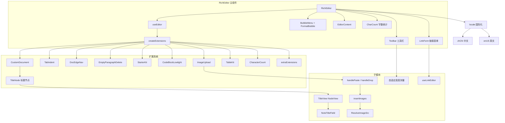
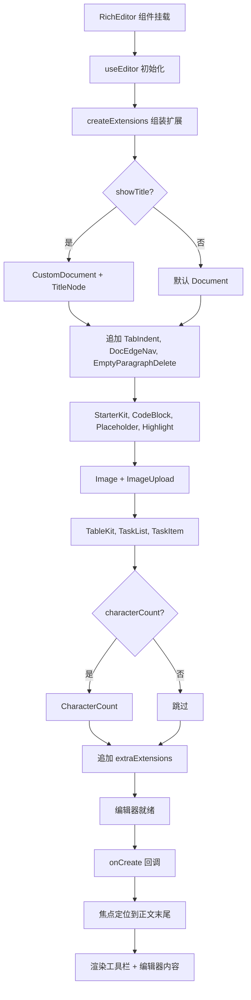
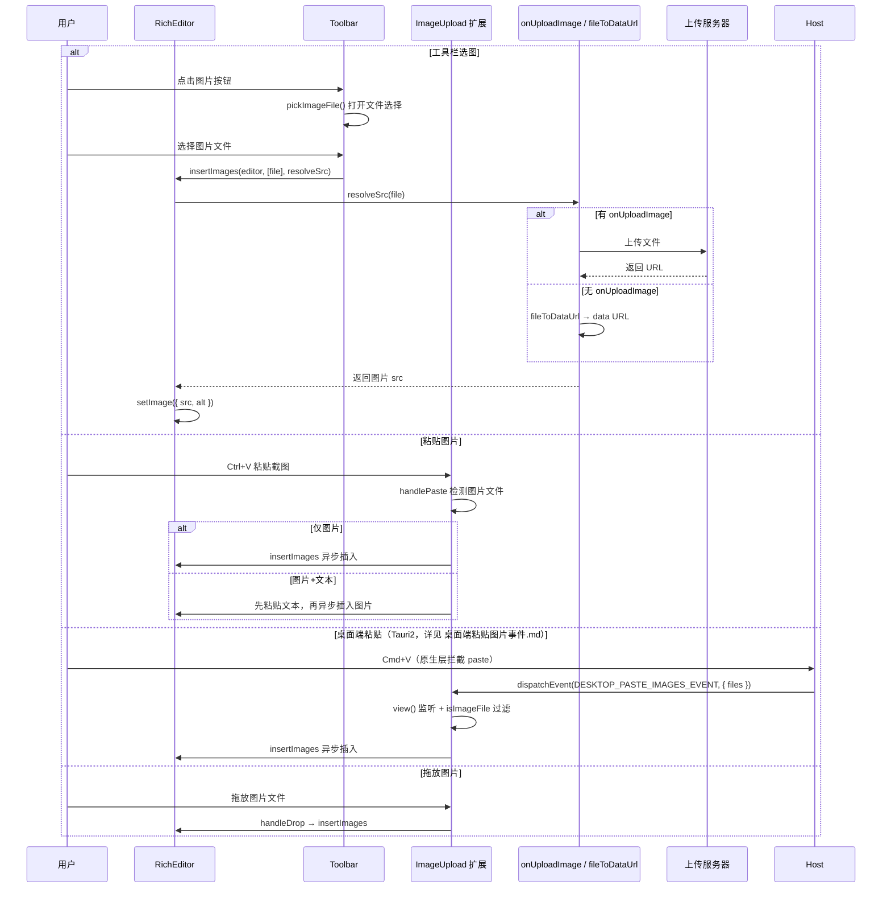
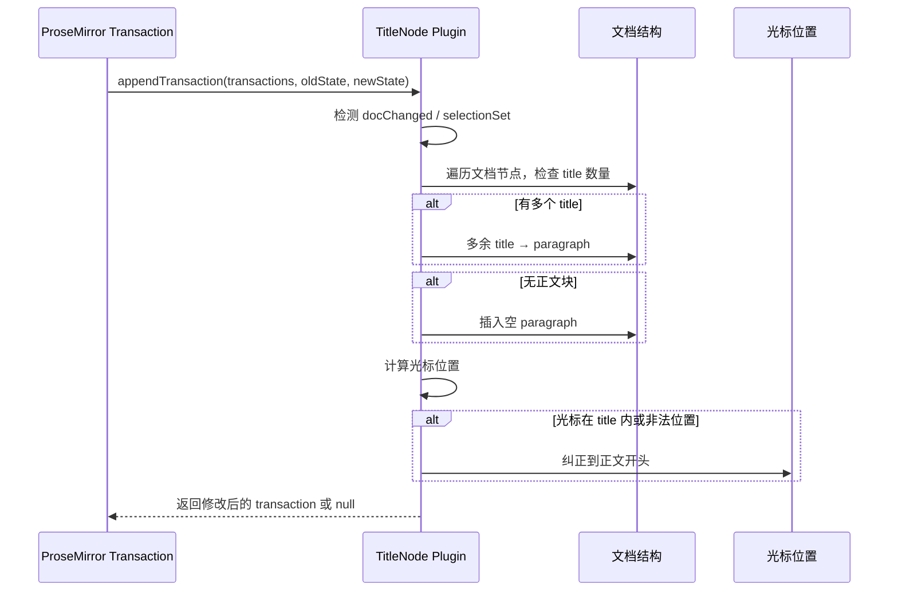
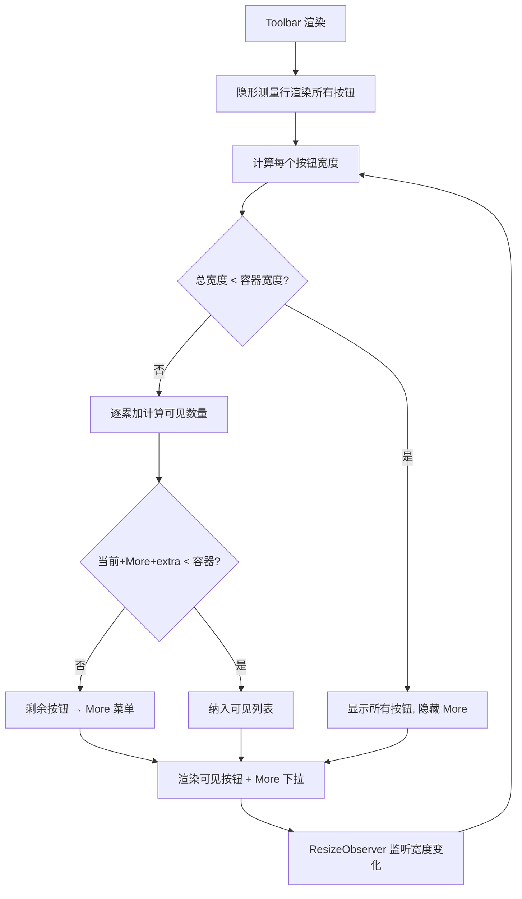

# 富文本编辑器 (RichEditor) 实现文档

> 延伸阅读：桌面端 Tauri2 把拦截的 Cmd+V 图片交回编辑器上传的机制见 [桌面端粘贴图片事件](./rich-editor/桌面端粘贴图片事件.md)。

## 1. 概述

RichEditor 是基于 [Tiptap](https://tiptap.dev/)（ProseMirror 封装）的二次封装富文本编辑器组件，专为笔记类应用设计。

### 核心特性

- **默认中文 UI**，内置 i18n 支持（zh-CN / en-US），可通过 `locale` prop 覆盖
- **内置功能**：
  - 格式化（粗体/斜体/下划线/删除线/高亮/行内代码）
  - 标题（H1-H5）
  - 列表（无序/有序/任务列表）
  - 表格（插入/行列操作/可选列宽拖拽）
  - 代码块（lowlight 语法高亮，主流语言）
  - 本地图片（选择/粘贴/拖放，可选服务端上传；桌面端走 `DESKTOP_PASTE_IMAGES_EVENT` 自定义事件，详见 [桌面端粘贴图片事件](./rich-editor/桌面端粘贴图片事件.md)）
  - 链接（自定义输入面板，智能选区扩展）
  - 字数/字符统计（含 CJK 分词）
  - 空段落删除修复
  - RTL 文本方向支持
  - 自定义标题节点（TitleNode，atom + 原生 input）
- **扩展机制**：
  - `extraExtensions`：在默认扩展后追加
  - `extensions`：完全替换默认扩展
  - `toolbarExtra`：工具栏尾部插槽
  - `onUploadImage`：自定义图片上传
  - `onCreate`：编辑器创建回调

## 2. 架构设计

### 2.1 整体架构图



### 2.2 核心流程图



### 2.3 图片上传时序图



### 2.4 TitleNode 结构修复时序图



### 2.5 工具栏自适应宽度流程图



## 3. 核心实现

### 3.1 主组件 RichEditor

> 源码路径：`src/components/design/RichEditor/index.tsx`

```tsx
// 导入 TipTap 核心工具函数，用于判断是否为文本选区
import { isTextSelection } from '@tiptap/core';
// 导入 Editor 类型
import type { Editor } from '@tiptap/react';
// 导入 TipTap React 核心组件
import {
	EditorContent,      // 编辑器内容渲染组件
	EditorContext,      // 编辑器上下文（用于子组件获取 editor 实例）
	useEditor,          // 创建编辑器实例的 Hook
	useEditorState,     // 响应式读取编辑器状态的 Hook
} from '@tiptap/react';
// 导入气泡菜单组件（选区弹出菜单）
import { BubbleMenu } from '@tiptap/react/menus';
// 导入 React 核心 Hooks
import { useCallback, useEffect, useMemo, useRef } from 'react';
// 导入 UI 组件：滚动区域
import { ScrollArea } from '@/components/ui/scroll-area';
// 导入工具函数：类名合并
import { cn } from '@/lib/utils';
// 导入扩展工厂函数
import { createExtensions } from './extensions';
// 导入图片处理工具
import { fileToDataUrl, type ResolveImageSrc } from './image';
// 导入链接表单组件和 Hook
import { LinkForm, useLinkEditor } from './link';
// 导入国际化类型和默认中文文案
import { type RichEditorLocale, zhCN } from './locale';
// 导入样式
import './styles.css';
// 导入标题节点工具函数
import { getDocTitleText, normalizeNoteContent } from './title';
// 导入工具栏和气泡菜单组件
import { FormatBubble, Toolbar } from './toolbar';
// 导入 Props 类型
import type { RichEditorProps } from './types';

/**
 * 合并国际化文案：将用户传入的 partial 覆盖在默认 zhCN 之上
 * @param partial 用户传入的部分或完整文案覆盖
 * @param base 基础文案，默认 zhCN
 * @returns 合并后的完整文案对象
 */
function mergeLocale(
	partial?: Partial<RichEditorLocale>,
	base: RichEditorLocale = zhCN,
): RichEditorLocale {
	return { ...base, ...partial };
}

/**
 * 字数/字符统计展示组件
 * 使用 useEditorState 响应式读取编辑器中的字数和字符数
 */
function CharCount({
	editor,     // 编辑器实例
	locale,     // 国际化文案
	maxLength,  // 字数上限（可选）
}: {
	editor: Editor;
	locale: RichEditorLocale;
	maxLength?: number;
}) {
	// 响应式读取字符数和词数
	const count = useEditorState({
		editor,
		selector: ({ editor: e }) => {
			// 从 CharacterCount 扩展的 storage 中获取统计方法
			const storage = e.storage.characterCount as
				| { characters: () => number; words: () => number }
				| undefined;
			return {
				chars: storage?.characters() ?? 0,  // 字符数
				words: storage?.words() ?? 0,       // 词数
			};
		},
	});

	// 判断是否超出字数上限
	const over = maxLength != null && count.chars >= maxLength;

	return (
		<div className={cn('rich-editor-footer', over && 'is-limit')}>
			<span>
				{count.words} {locale.words}   // 显示词数
			</span>
			<span>
				{count.chars}                   // 显示字符数
				{maxLength != null ? ` / ${maxLength}` : ''} {locale.chars}  // 显示上限
				{over ? ` · ${locale.limitReached}` : ''}  // 超限提示
			</span>
		</div>
	);
}

/**
 * TipTap 二次封装富文本编辑器。
 * - 默认中文 UI
 * - 内置 Formatting / 表格 / 本地图片(选图·粘贴·拖放) / 任务 / 字数 / RTL
 * - 通过 extraExtensions / toolbarExtra / onUploadImage 扩展
 */
export function RichEditor({
	content,           // 受控内容（HTML 或 JSON）
	defaultContent = '', // 非受控初始内容
	onChange,          // 内容变更回调
	editable = true,   // 是否可编辑
	autofocus = true,  // 是否自动聚焦
	placeholder,       // 占位符文本
	className,         // 外层容器类名
	editorClassName,   // 编辑器内容区类名
	maxLength,         // 字数上限
	textDirection = 'auto', // 文本方向
	showToolbar = true,    // 是否显示工具栏
	showBubbleMenu = true, // 是否显示气泡菜单
	showCharCount = true,  // 是否显示字数统计
	showTitle = true,      // 是否显示笔记标题节点
	imageResize = false,   // 图片是否可拖拽缩放
	tableResizable = false,// 表格列宽是否可拖拽
	locale: localePartial, // 国际化文案覆盖
	extensions,            // 完全替换默认扩展
	extraExtensions,       // 在默认扩展后追加
	toolbarExtra,          // 工具栏尾部插槽
	onUploadImage,         // 自定义图片上传函数
	onCreate,              // 编辑器创建回调
	onBodyScroll,          // 正文滚动事件
	renderBody,            // 自定义包裹 EditorContent 的渲染函数
}: RichEditorProps) {
	// 合并国际化文案，默认 zhCN
	const locale = useMemo(() => mergeLocale(localePartial), [localePartial]);

	// 图片上传函数引用：通过 ref 保证扩展始终能读到最新的上传实现
	const resolveImageSrcRef = useRef<ResolveImageSrc>(fileToDataUrl);
	resolveImageSrcRef.current = async (file) => {
		// 优先使用用户传入的上传函数
		if (onUploadImage) return onUploadImage(file);
		// 默认转为 data URL
		return fileToDataUrl(file);
	};

	// onChange 回调引用，避免 useEditor 的 onUpdate 闭包捕获旧值
	const onChangeRef = useRef(onChange);
	onChangeRef.current = onChange;

	// onCreate 回调引用
	const onCreateRef = useRef(onCreate);
	onCreateRef.current = onCreate;

	// 判断是否需要启用 CharacterCount 扩展
	// 无字数 UI 且无上限时不挂载，避免每次按键执行 Segmenter
	const enableCharacterCount = showCharCount || maxLength != null;

	// 创建编辑器实例
	const editor = useEditor({
		// 禁止立即渲染，等扩展配置完成后再渲染
		immediatelyRender: false,
		// 创建扩展列表
		extensions: createExtensions({
			placeholder: placeholder ?? locale.placeholder,  // 占位符
			maxLength,                                       // 字数上限
			characterCount: enableCharacterCount,           // 是否启用字数统计
			extensions,                                      // 完全替换扩展
			extraExtensions,                                 // 追加扩展
			resolveImageSrcRef,                             // 图片上传函数引用
			showTitle,                                       // 是否显示标题
			imageResize,                                     // 图片缩放
			tableResizable,                                  // 表格列宽缩放
		}),
		// 初始内容：显示标题时需包装为合法笔记文档结构
		content: showTitle
			? normalizeNoteContent(content ?? defaultContent)
			: (content ?? defaultContent ?? ''),
		editable,    // 是否可编辑
		autofocus,   // 自动聚焦
		textDirection, // 文本方向
		// 编辑器 DOM 属性
		editorProps: {
			attributes: {
				class: cn('tiptap focus:outline-none', editorClassName),
				lang: 'zh-CN',
			},
		},
		// 编辑器创建完成回调
		onCreate: ({ editor: e }) => {
			/**
			 * 将焦点定位到正文末尾
			 * - 有 title 节点时，焦点应跳过 title 落到正文
			 * - autofocus='end' 时也落到末尾
			 */
			const focusBodyEnd = () => {
				if (e.isDestroyed) return;
				if (
					autofocus === 'end' ||
					e.state.doc.firstChild?.type.name === 'title'
				) {
					e.commands.focus('end');
				}
			};
			focusBodyEnd();
			// Title NodeView 挂载可能打乱选区，下一帧再钉到末尾
			requestAnimationFrame(() => {
				focusBodyEnd();
				requestAnimationFrame(focusBodyEnd);
			});
			// 调用用户的 onCreate 回调
			onCreateRef.current?.(e);
		},
		// 内容更新回调
		onUpdate: ({ editor: e }) => {
			const cb = onChangeRef.current;
			if (!cb) return;
			// 热路径不做 getJSON（学习笔记等只用 html/text/title）
			cb({
				html: e.getHTML(),                           // HTML 格式
				text: e.getText({ blockSeparator: '\n\n' }), // 纯文本
				title: getDocTitleText(e.state.doc),         // 标题文本
			});
		},
	});

	// 链接编辑器 Hook
	const link = useLinkEditor(editor);
	// 链接草稿引用
	const linkDraftRef = useRef(link.draft);
	linkDraftRef.current = link.draft;

	/**
	 * 气泡菜单显示条件：
	 * 1. 没有链接草稿且编辑器可编辑
	 * 2. 编辑器有焦点
	 * 3. 有真实文本选区（非空、非图片/代码块内）
	 * 补回 TipTap 默认的空块判断，避免空段落误显
	 */
	const shouldShowBubble = useCallback(
		({
			editor: e,
			view,
			state,
			from,
			to,
		}: {
			editor: Editor;
			view: { hasFocus: () => boolean };
			state: {
				doc: { textBetween: (a: number, b: number) => string };
				selection: { empty: boolean };
			};
			from: number;
			to: number;
		}) => {
			// 有链接草稿或不可编辑时不显示
			if (linkDraftRef.current || !e.isEditable) return false;
			// 编辑器无焦点时不显示
			if (!view.hasFocus()) return false;
			const { doc, selection } = state;
			// 空选区、非文本选区、无实际文本内容时不显示
			if (
				!isTextSelection(selection) ||
				selection.empty ||
				from === to ||
				!doc.textBetween(from, to).length
			) {
				return false;
			}
			// 图片或代码块内不显示
			if (e.isActive('image') || e.isActive('codeBlock')) return false;
			return true;
		},
		[],
	);

	// 响应 editable 变化
	useEffect(() => {
		if (!editor) return;
		editor.setEditable(editable);
	}, [editor, editable]);

	// 受控同步：仅在外部 content 与当前不一致时写入，避免打断输入
	useEffect(() => {
		if (!editor || content === undefined) return;
		const next =
			typeof content === 'string' ? content : JSON.stringify(content);
		const current =
			typeof content === 'string'
				? editor.getHTML()
				: JSON.stringify(editor.getJSON());
		if (next === current) return;
		editor.commands.setContent(normalizeNoteContent(content), {
			emitUpdate: false,
		});
	}, [editor, content]);

	// 编辑器上下文
	const ctx = useMemo(() => ({ editor }), [editor]);

	// 工具栏扩展内容
	const extra = useMemo(() => {
		if (!editor) return null;
		return typeof toolbarExtra === 'function'
			? toolbarExtra(editor)
			: toolbarExtra;
	}, [editor, toolbarExtra]);

	// 编辑器未就绪时不渲染
	if (!editor) return null;

	return (
		<EditorContext.Provider value={ctx}>
			<div className={cn('rich-editor rounded-r-md', className)} lang="zh-CN">
				{/* 工具栏 */}
				{showToolbar && (
					<Toolbar
						editor={editor}
						locale={locale}
						onUploadImage={onUploadImage}
						onOpenLink={link.open}
						linkOpen={!!link.draft}
						extra={extra}
					/>
				)}

				{/* 链接表单面板 */}
				{link.draft && (
					<LinkForm
						locale={locale}
						href={link.draft.href}
						onHrefChange={link.setHref}
						onApply={link.apply}
						onRemove={link.remove}
						onClose={link.close}
						hint={link.draft.range ? undefined : locale.linkEmptyHint}
					/>
				)}

				{/* 气泡菜单（选中文本时弹出） */}
				{showBubbleMenu && (
					<BubbleMenu
						editor={editor}
						shouldShow={shouldShowBubble}
						options={{ placement: 'top', offset: 8, flip: true }}
					>
						<FormatBubble
							editor={editor}
							locale={locale}
							onOpenLink={link.open}
						/>
					</BubbleMenu>
				)}

				{/* 编辑器正文内容 */}
				<ScrollArea className="rich-editor-body" onScroll={onBodyScroll}>
					{renderBody ? (
						renderBody(<EditorContent editor={editor} spellCheck="false" />)
					) : (
						<EditorContent editor={editor} spellCheck="false" />
					)}
				</ScrollArea>

				{/* 字数统计 */}
				{showCharCount && (
					<CharCount editor={editor} locale={locale} maxLength={maxLength} />
				)}
			</div>
		</EditorContext.Provider>
	);
}

// 导出默认组件
export default RichEditor;
// 导出 Editor 类型供外部使用
export type { Editor } from '@tiptap/react';
// 导出代码语言类型和列表
export type { CodeLanguage } from './code';
export { CODE_LANGUAGES } from './code';
// 导出扩展工厂函数
export { createExtensions } from './extensions';
// 导出图片相关工具
export type { ResolveImageSrc } from './image';
export { fileToDataUrl, pickImageFile } from './image';
// 注：ImageUpload 扩展与 DESKTOP_PASTE_IMAGES_EVENT 常量从 ./image 子模块导出
// （Host 可经 `@design/RichEditor/image` 或子路径 import 该常量）
// 导出国际化类型和预设
export type { RichEditorLocale } from './locale';
export { enUS, richEditorLocaleOf, zhCN } from './locale';
// 导出标题节点相关工具
export {
	EMPTY_NOTE_DOC,
	getDocTitleText,
	NoteTitleField,
	normalizeNoteContent,
	TitleNode,
} from './title';
// 导出按钮组件
export { Btn } from './toolbar';
// 导出所有类型
export type {
	CreateExtensionsOptions,
	RichEditorChangePayload,
	RichEditorContent,
	RichEditorProps,
	TextDirection,
} from './types';
```

### 3.2 类型定义

> 源码路径：`src/components/design/RichEditor/types.ts`

```ts
// 导入 TipTap 类型
import type { Editor, Extensions, JSONContent } from '@tiptap/react';
// 导入 React 类型
import type { ReactNode, UIEventHandler } from 'react';
// 导入图片上传函数类型
import type { ResolveImageSrc } from './image';
// 导入国际化类型
import type { RichEditorLocale } from './locale';

/** 文本方向：从左到右 / 从右到左 / 自动 */
export type TextDirection = 'ltr' | 'rtl' | 'auto';

/** 编辑器内容类型：HTML 字符串或 TipTap JSON */
export type RichEditorContent = string | JSONContent;

/** 内容变更载荷 */
export type RichEditorChangePayload = {
	html: string;           // 当前文档的 HTML 字符串
	json?: JSONContent;     // 当前文档的 JSON 结构（可选，按需生成）
	text: string;           // 当前文档的纯文本
	title: string;          // 文档首位 title 节点的纯文本
};

/** 创建扩展时的配置选项 */
export type CreateExtensionsOptions = {
	placeholder?: string;                    // 占位符文本
	maxLength?: number;                     // 字数上限
	characterCount?: boolean;                // 是否启用字数统计
	resolveImageSrcRef?: { current: ResolveImageSrc };  // 图片上传函数引用
	extraExtensions?: Extensions;            // 追加扩展列表
	extensions?: Extensions;                 // 完全替换默认扩展
	showTitle?: boolean;                     // 是否显示标题节点
	imageResize?: boolean;                   // 图片是否可拖拽缩放
	tableResizable?: boolean;                // 表格列宽是否可拖拽
};

/** RichEditor 组件 Props */
export type RichEditorProps = {
	/** 受控内容（HTML 或 JSON） */
	content?: RichEditorContent;
	/** 非受控初始内容 */
	defaultContent?: RichEditorContent;
	/** 内容变更回调 */
	onChange?: (payload: RichEditorChangePayload) => void;
	/** 是否可编辑 */
	editable?: boolean;
	/** 自动聚焦策略 */
	autofocus?: boolean | 'start' | 'end' | 'all' | number;
	/** 占位符文本 */
	placeholder?: string;
	/** 外层容器类名 */
	className?: string;
	/** 编辑器内容区类名 */
	editorClassName?: string;
	/** 字数上限 */
	maxLength?: number;
	/** 默认文本方向 */
	textDirection?: TextDirection;
	/** 是否显示工具栏 */
	showToolbar?: boolean;
	/** 是否显示气泡菜单 */
	showBubbleMenu?: boolean;
	/** 是否显示字数统计 */
	showCharCount?: boolean;
	/** 是否显示笔记标题节点 */
	showTitle?: boolean;
	/** 图片拖拽缩放 */
	imageResize?: boolean;
	/** 表格列宽拖拽 */
	tableResizable?: boolean;
	/** 覆盖 / 合并文案（默认中文） */
	locale?: Partial<RichEditorLocale>;
	/** 完全替换默认扩展 */
	extensions?: Extensions;
	/** 在默认扩展后追加 */
	extraExtensions?: Extensions;
	/** 工具栏尾部插槽，便于业务扩展 */
	toolbarExtra?: ReactNode | ((editor: Editor) => ReactNode);
	/** 自定义图片上传函数 */
	onUploadImage?: ResolveImageSrc;
	/** 编辑器创建回调 */
	onCreate?: (editor: Editor) => void;
	/** 正文 ScrollArea 滚动事件 */
	onBodyScroll?: UIEventHandler<HTMLDivElement>;
	/** 自定义包裹 EditorContent 的渲染函数 */
	renderBody?: (editorContent: ReactNode) => ReactNode;
};
```

### 3.3 扩展系统

> 源码路径：`src/components/design/RichEditor/extensions/index.ts`

```ts
// 导入 TipTap 核心扩展
import { Extension } from '@tiptap/core';
// 导入代码块扩展（基于 lowlight 语法高亮）
import CodeBlockLowlight from '@tiptap/extension-code-block-lowlight';
// 导入文档扩展
import Document from '@tiptap/extension-document';
// 导入高亮扩展
import Highlight from '@tiptap/extension-highlight';
// 导入图片扩展
import Image from '@tiptap/extension-image';
// 导入任务列表扩展
import { TaskItem, TaskList } from '@tiptap/extension-list';
// 导入占位符扩展
import { Placeholder } from '@tiptap/extension-placeholder';
// 导入表格扩展
import { TableKit } from '@tiptap/extension-table';
// 导入文本对齐扩展
import TextAlign from '@tiptap/extension-text-align';
// 导入字数统计扩展
import { CharacterCount } from '@tiptap/extensions';
// 导入 TipTap Extensions 类型
import type { Extensions } from '@tiptap/react';
// 导入 StarterKit（常用扩展集合）
import StarterKit from '@tiptap/starter-kit';
// 导入 lowlight 语法高亮库
import { common, createLowlight } from 'lowlight';
// 导入图片上传扩展和工具
import { fileToDataUrl, ImageUpload } from '../image';
// 导入默认中文文案
import { zhCN } from '../locale';
// 导入标题节点和缩进函数
import { indentEditor, TitleNode } from '../title';
// 导入扩展配置类型
import type { CreateExtensionsOptions } from '../types';
// 导入空段落删除扩展
import { EmptyParagraphDelete } from './EmptyParagraphDelete';

// 创建 lowlight 实例，使用 common 语言包（涵盖主流编程语言）
const lowlight = createLowlight(common);

/**
 * Tab 键缩进扩展：
 * - 列表中：下沉列表项
 * - 正文中：插入制表符
 * - 代码块中：不拦截（交给默认行为）
 */
const TabIndent = Extension.create({
	name: 'tabIndent',
	priority: 1000,  // 高优先级，在键盘事件处理链中靠前
	addKeyboardShortcuts() {
		return {
			Tab: ({ editor }) => {
				// 代码块内不拦截
				if (editor.isActive('codeBlock')) return false;
				return indentEditor(editor);  // 列表下沉或插入缩进
			},
			'Shift-Tab': ({ editor }) => {
				// 代码块内不拦截
				if (editor.isActive('codeBlock')) return false;
				// 尝试提升列表项
				if (editor.commands.liftListItem('listItem')) return true;
				if (editor.commands.liftListItem('taskItem')) return true;
				return true;
			},
		};
	},
});

/**
 * 将编辑器视口滚动到顶部或底部
 * @param editor 编辑器实例
 * @param to 滚动方向
 */
function scrollEditorViewport(
	editor: { view: { dom: Element } },
	to: 'top' | 'bottom',
) {
	// 查找 ScrollArea 的 viewport 元素
	const vp = editor.view.dom.closest(
		'[data-slot="scroll-area-viewport"]',
	) as HTMLElement | null;
	if (!vp) return;
	vp.scrollTop = to === 'top' ? 0 : vp.scrollHeight;
}

/**
 * Cmd/Ctrl + 上/下：滚到顶/底并定位光标
 * 避开 title atom 把 ↑ 纠到文末的问题
 */
const DocEdgeNav = Extension.create({
	name: 'docEdgeNav',
	addKeyboardShortcuts() {
		return {
			'Mod-ArrowUp': ({ editor }) => {
				if (editor.isActive('codeBlock')) return false;
				// 计算文档起始位置（跳过 title 节点）
				const title = editor.state.doc.firstChild;
				const start = title?.type.name === 'title' ? title.nodeSize + 1 : 1;
				if (start <= editor.state.doc.content.size) {
					editor.chain().setTextSelection(start).focus().run();
				} else {
					editor.commands.focus('start');
				}
				scrollEditorViewport(editor, 'top');
				return true;
			},
			'Mod-ArrowDown': ({ editor }) => {
				if (editor.isActive('codeBlock')) return false;
				editor.commands.focus('end');
				scrollEditorViewport(editor, 'bottom');
				return true;
			},
		};
	},
});

/**
 * 自定义文档结构：首位固定 title，其后至少一段正文
 * 避免仅有 atom 时 GapCursor 无法输入的问题
 */
const CustomDocument = Document.extend({
	content: 'title block+',  // 内容模型：必须有一个 title，然后至少一个 block
});

/**
 * 组装默认扩展列表
 * 业务可通过 extensions / extraExtensions 覆盖或追加
 */
export function createExtensions(
	options: CreateExtensionsOptions = {},
): Extensions {
	// 如果用户传入了完全替换的扩展列表，直接返回
	if (options.extensions) return options.extensions;

	// 获取占位符
	const placeholder = options.placeholder ?? zhCN.placeholder;
	// 图片上传函数引用
	const resolveImageSrcRef = options.resolveImageSrcRef ?? {
		current: fileToDataUrl,
	};
	// 是否启用字数统计
	const withCharCount = options.characterCount !== false;
	// 是否显示标题
	const withTitle = options.showTitle !== false;

	// 组装基础扩展列表
	const baseExtensions: Extensions = [
		// 标题相关扩展（仅在 showTitle 时添加）
		...(withTitle ? [CustomDocument, TitleNode] : []),
		// Tab 缩进
		TabIndent,
		// 文档边界导航
		DocEdgeNav,
		// 空段落删除
		EmptyParagraphDelete,
		// StarterKit：常用扩展集合
		StarterKit.configure({
			// 有 title 时禁用默认 document，使用 CustomDocument
			document: withTitle ? false : undefined,
			// 尾部节点配置为 paragraph
			trailingNode: {
				node: 'paragraph',
			},
			// 标题级别配置
			heading: { levels: [1, 2, 3, 4, 5] },
			// 禁用默认 codeBlock，使用自定义 CodeBlockLowlight
			codeBlock: false,
			// TipTap 3：undoRedo（非 history）；长文降低深度，减轻内存与事务
			undoRedo: { depth: 50 },
			// 链接配置
			link: {
				openOnClick: false,    // 点击链接不打开
				autolink: true,        // 自动识别链接
				defaultProtocol: 'https', // 默认协议
				HTMLAttributes: {
					rel: 'noopener noreferrer',
					target: '_blank',
				},
			},
		}),
		// 代码块（含 lowlight 语法高亮）
		CodeBlockLowlight.configure({
			lowlight,                 // lowlight 实例
			defaultLanguage: 'javascript', // 默认语言
			enableTabIndentation: true,   // Tab 缩进
			tabSize: 2,              // 缩进大小
			HTMLAttributes: { class: 'hljs' }, // HTML 类名
		}),
		// 占位符
		Placeholder.configure({
			placeholder: ({ editor, node }) => {
				// title 节点不显示占位符
				if (withTitle && node.type.name === 'title') return '';
				// 标题节点显示级别提示
				if (node.type.name === 'heading') {
					return `${zhCN.placeholderHeading} ${node.attrs.level}`;
				}
				void editor;  // 避免未使用变量警告
				return placeholder;
			},
			emptyEditorClass: 'is-editor-empty', // 编辑器为空时的类名
			emptyNodeClass: 'is-empty',         // 节点为空时的类名
			showOnlyCurrent: true,              // 仅当前节点显示占位符
			showOnlyWhenEditable: true,         // 仅可编辑时显示
		}),
		// 高亮（多彩支持）
		Highlight.configure({ multicolor: true }),
		// 文本对齐
		TextAlign.configure({
			types: ['heading', 'paragraph'],  // 可对齐的节点类型
			alignments: ['left', 'center', 'right', 'justify'], // 支持的对齐方式
		}),
		// 图片
		Image.configure({
			inline: false,          // 块级图片
			allowBase64: true,      // 允许 base64 图片
			HTMLAttributes: {
				class: 'rich-editor-image',
				style: 'margin: 0.75em 0; border-radius: 0.5rem',
			},
			// 可选图片缩放
			...(options.imageResize
				? {
						resize: {
							enabled: true,
							alwaysPreserveAspectRatio: true,
						},
					}
				: {}),
		}),
		// 图片上传扩展（处理粘贴/拖放）
		ImageUpload.configure({ resolveSrcRef: resolveImageSrcRef }),
		// 表格
		TableKit.configure({
			table: { resizable: options.tableResizable === true },
		}),
		// 任务列表
		TaskList,
		// 任务项（嵌套支持）
		TaskItem.configure({ nested: true }),
		// 字数统计（可选）
		...(withCharCount
			? [
					CharacterCount.configure({
						limit: options.maxLength ?? null,
						// 文本计数器：使用 Intl.Segmenter 正确统计 CJK 字符
						textCounter: (text) =>
							[
								...new Intl.Segmenter('zh', {
									granularity: 'grapheme',
								}).segment(text),
							].length,
						// 词计数器：CJK 按字符计，英文按空格分词
						wordCounter: (text) => {
							const cjk =
								text.match(/[\u4e00-\u9fff\u3400-\u4dbf\uf900-\ufaff]/g)
									?.length ?? 0;
							const latin = text
								.replace(/[\u4e00-\u9fff\u3400-\u4dbf\uf900-\ufaff]/g, ' ')
								.split(/\s+/)
								.filter(Boolean).length;
							return cjk + latin;
						},
					}),
				]
			: []),
		// 用户追加的扩展
		...(options.extraExtensions ?? []),
	];

	return baseExtensions;
}
```

### 3.4 TitleNode 标题节点

> 源码路径：`src/components/design/RichEditor/title/TitleNode.ts`

```ts
// 导入 TipTap 核心模块
import type { Editor, JSONContent } from '@tiptap/core';
import { mergeAttributes, Node } from '@tiptap/core';
import { GapCursor } from '@tiptap/pm/gapcursor';  // 间隙光标
import { Plugin, PluginKey, Selection, TextSelection } from '@tiptap/pm/state';
import { ReactNodeViewRenderer } from '@tiptap/react';
// 导入标题 NodeView 组件
import TitleView from './Title';

/**
 * 空笔记文档模板：必有 title + 一段正文
 * 避免只有 atom 时光标落在 GapCursor 上无法输入
 */
export const EMPTY_NOTE_DOC: JSONContent = {
	type: 'doc',
	content: [{ type: 'title', attrs: { value: '' } }, { type: 'paragraph' }],
};

/**
 * 规范化笔记内容：空 HTML / 空串 → 合法笔记文档
 * @param content 原始内容
 * @returns 规范化后的内容
 */
export function normalizeNoteContent(
	content: string | JSONContent | undefined | null,
): string | JSONContent {
	if (content == null || content === '' || content === '<p></p>') {
		return EMPTY_NOTE_DOC;
	}
	return content;
}

/**
 * 笔记常驻标题节点
 * - atom 节点：不可编辑的原子节点
 * - 原生 input 作为 NodeView（通过 attrs.value 存储值）
 * - group 不用 block，保证文档仅首位一个 title
 */
export const TitleNode = Node.create({
	name: 'title',        // 节点名称

	group: 'title',       // 所在分组（独立于 block，确保仅首位一个）

	atom: true,           // 原子节点（内容不可被 PM 修改）

	draggable: false,     // 不可拖拽

	selectable: false,    // 不可被 PM 选区选中

	// 定义节点属性
	addAttributes() {
		return {
			value: {
				default: '',  // 默认空值
				// HTML 解析：从 data-value 属性或 textContent 读取
				parseHTML: (el) =>
					(el as HTMLElement).getAttribute('data-value') ??
					(el as HTMLElement).textContent ??
					'',
				// HTML 渲染：将 value 写入 data-value 属性
				renderHTML: (attrs) =>
					attrs.value ? { 'data-value': attrs.value as string } : {},
			},
		};
	},

	// HTML 解析规则
	parseHTML() {
		return [{ tag: 'div[data-type="note-title"]' }];
	},

	// HTML 渲染
	renderHTML({ HTMLAttributes, node }) {
		return [
			'div',
			mergeAttributes(HTMLAttributes, {
				'data-type': 'note-title',
				'data-value': node.attrs.value ?? '',
			}),
			node.attrs.value ?? '',
		];
	},

	// 添加 React NodeView
	addNodeView() {
		// stopEvent：标题内交互不交给 PM，避免和正文抢输入
		return ReactNodeViewRenderer(TitleView, {
			stopEvent: () => true,
		});
	},

	// 添加 ProseMirror 插件（用于结构修复和光标纠正）
	addProseMirrorPlugins() {
		return [
			new Plugin({
				key: new PluginKey('singleNoteTitle'),
				/**
				 * appendTransaction：在每次事务后追加修复事务
				 * 确保文档结构的合法性
				 */
				appendTransaction(transactions, _old, state) {
					// 仅在文档变化或选区变化时处理
					const docChanged = transactions.some((tr) => tr.docChanged);
					const selectionSet = transactions.some((tr) => tr.selectionSet);
					if (!docChanged && !selectionSet) return null;

					let tr = state.tr;
					let changed = false;

					// 结构修复只在 doc 变化时做（选区变化不必扫多余 title）
					if (docChanged) {
						// 收集多余的 title 节点位置
						const extras: { pos: number; nodeSize: number }[] = [];
						let seen = 0;
						state.doc.forEach((node, offset) => {
							if (node.type.name !== 'title') return;
							seen += 1;
							if (seen > 1)
								extras.push({ pos: offset, nodeSize: node.nodeSize });
						});
						// 从后向前删除多余 title（转为 paragraph）
						for (let i = extras.length - 1; i >= 0; i--) {
							const { pos, nodeSize } = extras[i];
							tr.replaceWith(
								pos,
								pos + nodeSize,
								state.schema.nodes.paragraph.create(),
							);
							changed = true;
						}

						// 检查是否有正文块（title 后至少一段）
						const doc = changed ? tr.doc : state.doc;
						const title = doc.firstChild;
						// 没有正文块时补一段（atom 旁 GapCursor 看起来像有光标但输不进字）
						if (title?.type.name === 'title' && doc.childCount < 2) {
							tr = tr.insert(
								title.nodeSize,
								state.schema.nodes.paragraph.create(),
							);
							changed = true;
						}
					}

					// 光标位置纠正
					const nextDoc = changed ? tr.doc : state.doc;
					const titleNode = nextDoc.firstChild;
					if (titleNode?.type.name === 'title') {
						const titleSize = titleNode.nodeSize;
						const sel = changed ? tr.selection : state.selection;
						const $from = sel.$from;
						// 判断光标是否在正文中
						const caretInBody =
							sel instanceof TextSelection &&
							sel.empty &&
							$from.parent.isTextblock &&
							$from.pos > titleSize;

						// 仅「空正文」或非法非文本选区才纠正
						const bodyEmpty =
							nextDoc.childCount < 2 ||
							(nextDoc.childCount === 2 &&
								nextDoc.child(1).isTextblock &&
								nextDoc.child(1).content.size === 0);

						let needsFix = false;
						if (bodyEmpty && sel.empty && !caretInBody) {
							needsFix = true;
						} else if (
							sel.empty &&
							!(sel instanceof GapCursor) &&
							!$from.parent.isTextblock
						) {
							needsFix = true;
						}

						// 纠正光标到正文开头
						if (needsFix && titleSize + 1 <= nextDoc.content.size) {
							tr = tr.setSelection(
								TextSelection.near(nextDoc.resolve(titleSize + 1), 1),
							);
							changed = true;
						}
					}

					return changed ? tr : null;
				},
			}),
		];
	},

	// 添加键盘快捷键
	addKeyboardShortcuts() {
		return {
			/**
			 * Cmd/Ctrl+A 全选：只覆盖正文，避开 title NodeView
			 * 让浏览器能画出原生选区高亮
			 */
			'Mod-a': ({ editor }) => {
				const { doc } = editor.state;
				const title = doc.firstChild;
				if (title?.type.name !== 'title') return false;

				const start = title.nodeSize + 1;
				if (start >= doc.content.size) return true;

				const from = TextSelection.near(doc.resolve(start), 1).from;
				const to = Selection.atEnd(doc).to;
				if (from < to) {
					editor.commands.setTextSelection({ from, to });
				} else {
					editor.commands.setTextSelection(from);
				}
				return true;
			},
		};
	},
});

export default TitleNode;

/**
 * 取文档首位 title 节点的文本内容，供笔记列表展示
 * @param doc 文档节点
 * @returns 标题文本
 */
export function getDocTitleText(doc: {
	firstChild?: {
		type: { name: string };
		attrs: Record<string, unknown>;
		textContent: string;
	} | null;
}): string {
	const first = doc.firstChild;
	if (first?.type.name !== 'title') return '';
	// 优先从 attrs.value 获取
	const fromAttr = first.attrs.value;
	if (typeof fromAttr === 'string') return fromAttr.trim();
	return first.textContent.trim();
}

/**
 * 正文 Tab 缩进：列表下沉，否则插入 \t
 * @param editor 编辑器实例
 * @returns 是否处理成功
 */
export function indentEditor(editor: Editor): boolean {
	if (editor.isActive('codeBlock')) return false;
	// 尝试下沉有序列表
	if (editor.commands.sinkListItem('listItem')) return true;
	// 尝试下沉任务列表
	if (editor.commands.sinkListItem('taskItem')) return true;
	// 否则插入制表符
	return editor.commands.insertContent('\t');
}

/**
 * 标题 input 按 Enter / Tab：跳到正文末尾
 * @param editor 编辑器实例
 */
export function focusAfterTitle(editor: Editor) {
	const title = editor.state.doc.firstChild;
	if (!title || title.type.name !== 'title') {
		editor.commands.focus('end');
		return;
	}
	const after = title.nodeSize;
	const next = editor.state.doc.nodeAt(after);
	if (!next) {
		// 没有后续节点，插入新段落并聚焦
		editor
			.chain()
			.insertContentAt(after, { type: 'paragraph' })
			.focus('end')
			.run();
		return;
	}
	editor.commands.focus('end');
}
```

### 3.5 图片处理

> 源码路径：`src/components/design/RichEditor/image/image.ts`

```ts
// 导入 Editor 类型
import type { Editor } from '@tiptap/react';

// DOCX 导出安全的图片 MIME 类型集合
const DOCX_SAFE = new Set([
	'image/jpeg',
	'image/jpg',
	'image/png',
	'image/gif',
]);

/**
 * 将浏览器能解码的图片统一转为 JPEG data URL
 * 避免 webp/avif 等格式在 DOCX 导出时失败
 * @param source 图片源（ImageBitmap 或 HTMLImageElement）
 * @param quality JPEG 压缩质量
 * @returns JPEG 格式的 data URL
 */
function bitmapToJpegDataUrl(
	source: ImageBitmap | HTMLImageElement,
	quality = 0.9,
): string {
	const canvas = document.createElement('canvas');
	canvas.width = Math.max(1, source.width);
	canvas.height = Math.max(1, source.height);
	const ctx = canvas.getContext('2d');
	if (!ctx) throw new Error('canvas unsupported');
	ctx.drawImage(source, 0, 0);
	return canvas.toDataURL('image/jpeg', quality);
}

/**
 * 将 File 对象转换为 JPEG data URL
 * 优先使用 createImageBitmap（性能更好），降级为 Image + ObjectURL
 * @param file 图片文件
 * @returns JPEG data URL
 */
async function fileToJpegDataUrl(file: File): Promise<string> {
	if (typeof createImageBitmap === 'function') {
		const bmp = await createImageBitmap(file);
		try {
			return bitmapToJpegDataUrl(bmp);
		} finally {
			bmp.close();  // 释放位图内存
		}
	}
	// 降级方案：使用 Image 对象 + ObjectURL
	const objectUrl = URL.createObjectURL(file);
	try {
		const img = await new Promise<HTMLImageElement>((resolve, reject) => {
			const el = new Image();
			el.onload = () => resolve(el);
			el.onerror = () => reject(new Error('image decode failed'));
			el.src = objectUrl;
		});
		return bitmapToJpegDataUrl(img);
	} finally {
		URL.revokeObjectURL(objectUrl);  // 释放 ObjectURL
	}
}

/**
 * 本地文件 → data URL
 * - jpeg/png/gif：直接用 FileReader 读取
 * - 其他格式（webp/heic 等）：先转为 JPEG
 * - 转换失败时退回原始 data URL
 * @param file 图片文件
 * @returns data URL
 */
export function fileToDataUrl(file: File): Promise<string> {
	const type = (file.type || '').toLowerCase();
	if (DOCX_SAFE.has(type)) {
		// 安全格式：直接读取
		return new Promise((resolve, reject) => {
			const reader = new FileReader();
			reader.onload = () => resolve(String(reader.result));
			reader.onerror = () => reject(reader.error ?? new Error('read failed'));
			reader.readAsDataURL(file);
		});
	}
	// 非安全格式：转为 JPEG
	return fileToJpegDataUrl(file).catch(() => {
		// 浏览器解不了（如部分 heic）时退回原始 data URL，交给服务端处理
		return new Promise((resolve, reject) => {
			const reader = new FileReader();
			reader.onload = () => resolve(String(reader.result));
			reader.onerror = () => reject(reader.error ?? new Error('read failed'));
			reader.readAsDataURL(file);
		});
	});
}

/**
 * 打开系统文件选择器选择本地图片
 * 不使用 window.prompt，提供更好的用户体验
 * @param accept 文件类型过滤
 * @returns 选中的文件或 null
 */
export function pickImageFile(accept = 'image/*'): Promise<File | null> {
	return new Promise((resolve) => {
		const input = document.createElement('input');
		input.type = 'file';
		input.accept = accept;
		input.multiple = false;
		let settled = false;
		const done = (file: File | null) => {
			if (settled) return;
			settled = true;
			resolve(file);
		};
		input.onchange = () => done(input.files?.[0] ?? null);
		// Chromium / Tauri WebView 支持 cancel 事件
		input.addEventListener('cancel', () => done(null));
		input.click();
	});
}

/**
 * 判断文件是否为图片
 * @param file 文件对象
 * @returns 是否为图片文件
 */
export function isImageFile(file: File): boolean {
	return file.type.startsWith('image/');
}

/**
 * 从剪贴板事件中提取图片文件列表
 * @param event 剪贴板事件
 * @returns 图片文件数组
 */
export function clipboardImageFiles(event: ClipboardEvent): File[] {
	const items = event.clipboardData?.items;
	if (!items) return [];
	const out: File[] = [];
	for (let i = 0; i < items.length; i++) {
		const item = items[i];
		if (!item?.type.startsWith('image/')) continue;
		const file = item.getAsFile();
		if (file) out.push(file);
	}
	return out;
}

/**
 * 判断剪贴板是否同时携带文本/HTML 内容
 * 用于决定图片+文本混合粘贴时的行为
 * @param event 剪贴板事件
 * @returns 是否包含文本内容
 */
export function clipboardHasTextContent(event: ClipboardEvent): boolean {
	const data = event.clipboardData;
	if (!data) return false;
	const html = data.getData('text/html');
	if (html?.trim()) return true;
	const text = data.getData('text/plain');
	if (text?.trim()) return true;
	return false;
}

/**
 * 从拖放数据传输对象中提取图片文件
 * @param dt DataTransfer 对象
 * @returns 图片文件数组
 */
export function dataTransferImageFiles(dt: DataTransfer | null): File[] {
	if (!dt?.files?.length) return [];
	return [...dt.files].filter(isImageFile);
}

/**
 * 解析图片源函数类型
 * 接受 File 对象，返回图片 URL（同步或异步）
 */
export type ResolveImageSrc = (
	file: File,
) => string | Promise<string | null | undefined>;

/**
 * 向编辑器插入多张图片
 * @param editor 编辑器实例
 * @param files 图片文件数组
 * @param resolveSrc 图片源解析函数
 */
export async function insertImages(
	editor: Editor,
	files: File[],
	resolveSrc: ResolveImageSrc,
): Promise<void> {
	for (const file of files) {
		if (!isImageFile(file)) continue;
		// 解析图片源
		const src = await resolveSrc(file);
		if (!src?.trim()) continue;
		// 插入图片到编辑器
		editor.chain().focus().setImage({ src: src.trim(), alt: file.name }).run();
	}
}
```

### 3.6 工具栏 Toolbar

> 源码路径：`src/components/design/RichEditor/toolbar/Toolbar.tsx`

```tsx
// 导入 Editor 类型和状态 Hook
import type { Editor } from '@tiptap/react';
import { useEditorState } from '@tiptap/react';
// 导入图标库
import {
	AlignCenter,      // 居中对齐
	AlignJustify,     // 两端对齐
	AlignLeft,        // 左对齐
	AlignRight,       // 右对齐
	Bold,             // 粗体
	CheckSquare,      // 任务列表
	Code,             // 代码块
	Heading,          // 标题（通用图标）
	Heading1,         // H1 图标
	Heading2,         // H2 图标
	Heading3,         // H3 图标
	Heading4,         // H4 图标
	Heading5,         // H5 图标
	Highlighter,      // 高亮
	ImageIcon,        // 图片
	Italic,           // 斜体
	Link2,            // 链接
	Link2Off,         // 移除链接
	List,             // 无序列表
	ListOrdered,      // 有序列表
	Minus,            // 分隔线
	MoreHorizontal,   // 更多
	Quote,            // 引用
	Redo2,            // 重做
	RemoveFormatting, // 清除格式
	Strikethrough,    // 删除线
	Table,            // 表格
	Underline,        // 下划线
	Undo2,            // 撤销
} from 'lucide-react';
// 导入 React 核心
import {
	Fragment,         // 用于列表分组
	type ReactNode,   // React 节点类型
	useLayoutEffect,  // 布局阶段副作用（用于测量宽度）
	useMemo,          // 缓存计算结果
	useRef,           // 引用
	useState,         // 状态
} from 'react';
// 导入下拉菜单组件
import {
	DropdownMenu,
	DropdownMenuContent,
	DropdownMenuGroup,
	DropdownMenuItem,
	DropdownMenuLabel,
	DropdownMenuTrigger,
} from '@/components/ui/dropdown-menu';
// 导入工具函数
import { cn } from '@/lib/utils';
// 导入代码语言列表
import { CODE_LANGUAGES } from '../code';
// 导入图片处理工具
import {
	fileToDataUrl,
	insertImages,
	pickImageFile,
	type ResolveImageSrc,
} from '../image';
// 导入国际化类型
import type { RichEditorLocale } from '../locale';

/** 工具栏 Props */
type Props = {
	editor: Editor;                          // 编辑器实例
	locale: RichEditorLocale;                // 国际化文案
	onUploadImage?: ResolveImageSrc;         // 图片上传函数
	onOpenLink: () => void;                  // 打开链接面板
	linkOpen?: boolean;                      // 链接面板是否打开
	extra?: ReactNode;                       // 工具栏扩展内容
	className?: string;                      // 额外类名
};

/** 工具栏项定义 */
type ToolItem = {
	id: string;           // 唯一标识
	node: ReactNode;      // 工具栏内联渲染节点
	menu?: ReactNode;     // 「更多」菜单内节点（缺省则仅内联展示）
};

const ICON = 15;  // 图标尺寸
const MORE_W = 30;  // More 按钮宽度（含间距）

/**
 * 通用按钮组件
 * - 支持 active 高亮状态
 * - 支持 disabled 禁用状态
 * - onMouseDown preventDefault 防止失焦
 */
export function Btn({
	title,      // 提示文本
	active,     // 是否激活
	disabled,   // 是否禁用
	onClick,    // 点击处理
	children,   // 子元素（通常是图标）
	className,  // 额外类名
}: {
	title: string;
	active?: boolean;
	disabled?: boolean;
	onClick: (e?: MouseEvent) => void;
	children: ReactNode;
	className?: string;
}) {
	return (
		<button
			type="button"
			title={title}
			aria-label={title}
			aria-pressed={active}
			disabled={disabled}
			className={cn(
				'rich-editor-btn lucide-stroke-draw-hover ml-0.5 [&_svg]:overflow-visible',
				active && 'is-active',
				className,
			)}
			onMouseDown={(e) => e.preventDefault()}
			onClick={(e) => onClick(e as unknown as MouseEvent)}
		>
			{children}
		</button>
	);
}

/**
 * 下拉菜单项（带图标 + 文字）
 * 用于「更多」下拉菜单内的操作项
 */
function MenuRow({
	title,      // 标题文本
	active,     // 是否激活
	disabled,   // 是否禁用
	onSelect,   // 选中处理
	children,   // 图标等子元素
}: {
	title: string;
	active?: boolean;
	disabled?: boolean;
	onSelect: () => void;
	children: ReactNode;
}) {
	return (
		<DropdownMenuItem
			disabled={disabled}
			title={title}
			className={cn(active && 'bg-theme/10')}
			onSelect={onSelect}
		>
			<div className="flex w-full items-center gap-2">
				{children}
				<span className="text-sm text-textcolor/90">{title}</span>
			</div>
		</DropdownMenuItem>
	);
}

/**
 * 工具栏主组件
 * - 响应式：编辑器状态变化时实时更新按钮状态
 * - 自适应宽度：根据容器宽度自动调整可见按钮数量
 * - 超出部分收纳到「更多」下拉菜单
 */
export function Toolbar({
	editor,
	locale: t,
	onUploadImage,
	onOpenLink,
	linkOpen,
	extra,
	className,
}: Props) {
	// 响应式读取编辑器状态（按钮激活状态）
	const state = useEditorState({
		editor,
		selector: ({ editor: e }) => ({
			bold: e.isActive('bold'),
			italic: e.isActive('italic'),
			underline: e.isActive('underline'),
			strike: e.isActive('strike'),
			code: e.isActive('code'),
			highlight: e.isActive('highlight'),
			h1: e.isActive('heading', { level: 1 }),
			h2: e.isActive('heading', { level: 2 }),
			h3: e.isActive('heading', { level: 3 }),
			h4: e.isActive('heading', { level: 4 }),
			h5: e.isActive('heading', { level: 5 }),
			bullet: e.isActive('bulletList'),
			ordered: e.isActive('orderedList'),
			task: e.isActive('taskList'),
			quote: e.isActive('blockquote'),
			codeBlock: e.isActive('codeBlock'),
			codeLanguage:
				(e.getAttributes('codeBlock').language as string | undefined) ??
				'javascript',
			link: e.isActive('link'),
			alignLeft: e.isActive({ textAlign: 'left' }),
			alignCenter: e.isActive({ textAlign: 'center' }),
			alignRight: e.isActive({ textAlign: 'right' }),
			alignJustify: e.isActive({ textAlign: 'justify' }),
			inTable: e.isActive('table'),
			canUndo: e.can().undo(),
			canRedo: e.can().redo(),
		}),
	});

	/**
	 * 插入本地图片：打开文件选择器 → 上传 → 插入
	 */
	const insertImage = async () => {
		const file = await pickImageFile();
		if (!file) return;
		const resolve = onUploadImage ?? fileToDataUrl;
		await insertImages(editor, [file], resolve);
	};

	// 标题级别配置
	const HEADING_LEVELS = [
		{ level: 1 as const, icon: Heading1, title: t.h1 },
		{ level: 2 as const, icon: Heading2, title: t.h2 },
		{ level: 3 as const, icon: Heading3, title: t.h3 },
		{ level: 4 as const, icon: Heading4, title: t.h4 },
		{ level: 5 as const, icon: Heading5, title: t.h5 },
	];

	// 当前激活的标题级别
	const activeHeading =
		HEADING_LEVELS.find(({ level }) => state[`h${level}` as const]) ?? null;
	const HeadingTriggerIcon = activeHeading?.icon ?? Heading;

	// 切换标题级别
	const handleHeading = (level: 1 | 2 | 3 | 4 | 5) => {
		editor.chain().focus().toggleHeading({ level }).run();
	};

	// 组装工具栏按钮列表
	const tools = useMemo((): ToolItem[] => {
		const items: ToolItem[] = [
			// 撤销
			{
				id: 'undo',
				node: (
					<Btn
						title={t.undo}
						disabled={!state.canUndo}
						className="ml-0"
						onClick={() => editor.chain().focus().undo().run()}
					>
						<Undo2 size={ICON} />
					</Btn>
				),
				menu: (
					<MenuRow
						title={t.undo}
						disabled={!state.canUndo}
						onSelect={() => editor.chain().focus().undo().run()}
					>
						<Undo2 size={ICON} />
					</MenuRow>
				),
			},
			// 重做
			{
				id: 'redo',
				node: (
					<Btn
						title={t.redo}
						disabled={!state.canRedo}
						onClick={() => editor.chain().focus().redo().run()}
					>
						<Redo2 size={ICON} />
					</Btn>
				),
				menu: (
					<MenuRow
						title={t.redo}
						disabled={!state.canRedo}
						onSelect={() => editor.chain().focus().redo().run()}
					>
						<Redo2 size={ICON} />
					</MenuRow>
				),
			},
			// 粗体
			{
				id: 'bold',
				node: (
					<Btn
						title={t.bold}
						active={state.bold}
						onClick={() => editor.chain().focus().toggleBold().run()}
					>
						<Bold size={ICON} />
					</Btn>
				),
				menu: (
					<MenuRow
						title={t.bold}
						active={state.bold}
						onSelect={() => editor.chain().focus().toggleBold().run()}
					>
						<Bold size={ICON} />
					</MenuRow>
				),
			},
			// 斜体
			{
				id: 'italic',
				node: (
					<Btn
						title={t.italic}
						active={state.italic}
						onClick={() => editor.chain().focus().toggleItalic().run()}
					>
						<Italic size={ICON} />
					</Btn>
				),
				menu: (
					<MenuRow
						title={t.italic}
						active={state.italic}
						onSelect={() => editor.chain().focus().toggleItalic().run()}
					>
						<Italic size={ICON} />
					</MenuRow>
				),
			},
			// 下划线
			{
				id: 'underline',
				node: (
					<Btn
						title={t.underline}
						active={state.underline}
						onClick={() => editor.chain().focus().toggleUnderline().run()}
					>
						<Underline size={ICON} />
					</Btn>
				),
				menu: (
					<MenuRow
						title={t.underline}
						active={state.underline}
						onSelect={() => editor.chain().focus().toggleUnderline().run()}
					>
						<Underline size={ICON} />
					</MenuRow>
				),
			},
			// 删除线
			{
				id: 'strike',
				node: (
					<Btn
						title={t.strike}
						active={state.strike}
						onClick={() => editor.chain().focus().toggleStrike().run()}
					>
						<Strikethrough size={ICON} />
					</Btn>
				),
				menu: (
					<MenuRow
						title={t.strike}
						active={state.strike}
						onSelect={() => editor.chain().focus().toggleStrike().run()}
					>
						<Strikethrough size={ICON} />
					</MenuRow>
				),
			},
			// 高亮
			{
				id: 'highlight',
				node: (
					<Btn
						title={t.highlight}
						active={state.highlight}
						onClick={() => editor.chain().focus().toggleHighlight().run()}
					>
						<Highlighter size={ICON} />
					</Btn>
				),
				menu: (
					<MenuRow
						title={t.highlight}
						active={state.highlight}
						onSelect={() => editor.chain().focus().toggleHighlight().run()}
					>
						<Highlighter size={ICON} />
					</MenuRow>
				),
			},
			// 清除格式
			{
				id: 'clearFormat',
				node: (
					<Btn
						title={t.clearFormat}
						onClick={() =>
							editor.chain().focus().unsetAllMarks().clearNodes().run()
						}
					>
						<RemoveFormatting size={ICON} />
					</Btn>
				),
				menu: (
					<MenuRow
						title={t.clearFormat}
						onSelect={() =>
							editor.chain().focus().unsetAllMarks().clearNodes().run()
						}
					>
						<RemoveFormatting size={ICON} />
					</MenuRow>
				),
			},
			// 标题级别（下拉菜单）
			{
				id: 'heading',
				node: (
					<DropdownMenu>
						<DropdownMenuTrigger asChild>
							<button
								type="button"
								title={activeHeading?.title ?? '标题级别'}
								aria-label={activeHeading?.title ?? '标题级别'}
								className={cn(
									'rich-editor-btn lucide-stroke-draw-hover ml-0.5 [&_svg]:overflow-visible',
									activeHeading && 'is-active',
								)}
								onMouseDown={(e) => e.preventDefault()}
							>
								<HeadingTriggerIcon size={ICON} />
							</button>
						</DropdownMenuTrigger>
						<DropdownMenuContent
							align="center"
							sideOffset={8}
							className="w-20"
							onCloseAutoFocus={(e) => e.preventDefault()}
						>
							<DropdownMenuGroup>
								<DropdownMenuLabel className="text-textcolor/90">
									标题级别
								</DropdownMenuLabel>
								{HEADING_LEVELS.map(({ level, icon: Icon, title }) => {
									const active = state[`h${level}` as const];
									return (
										<DropdownMenuItem
											key={level}
											title={title}
											className={cn(active && 'bg-theme/10')}
											onSelect={() => handleHeading(level)}
										>
											<div className="flex w-full items-center justify-between">
												<Icon size={ICON} className="text-textcolor" />
												<span className="text-sm text-textcolor/90">
													{title}
												</span>
											</div>
										</DropdownMenuItem>
									);
								})}
							</DropdownMenuGroup>
						</DropdownMenuContent>
					</DropdownMenu>
				),
				menu: (
					<>
						<DropdownMenuLabel className="text-textcolor/90">
							标题级别
						</DropdownMenuLabel>
						{HEADING_LEVELS.map(({ level, icon: Icon, title }) => {
							const active = state[`h${level}` as const];
							return (
								<MenuRow
									key={level}
									title={title}
									active={active}
									onSelect={() => handleHeading(level)}
								>
									<Icon size={ICON} />
								</MenuRow>
							);
						})}
					</>
				),
			},
			// 无序列表
			{
				id: 'bullet',
				node: (
					<Btn
						title={t.bulletList}
						active={state.bullet}
						onClick={() => editor.chain().focus().toggleBulletList().run()}
					>
						<List size={ICON} />
					</Btn>
				),
				menu: (
					<MenuRow
						title={t.bulletList}
						active={state.bullet}
						onSelect={() => editor.chain().focus().toggleBulletList().run()}
					>
						<List size={ICON} />
					</MenuRow>
				),
			},
			// 有序列表
			{
				id: 'ordered',
				node: (
					<Btn
						title={t.orderedList}
						active={state.ordered}
						onClick={() => editor.chain().focus().toggleOrderedList().run()}
					>
						<ListOrdered size={ICON} />
					</Btn>
				),
				menu: (
					<MenuRow
						title={t.orderedList}
						active={state.ordered}
						onSelect={() => editor.chain().focus().toggleOrderedList().run()}
					>
						<ListOrdered size={ICON} />
					</MenuRow>
				),
			},
			// 任务列表
			{
				id: 'task',
				node: (
					<Btn
						title={t.taskList}
						active={state.task}
						onClick={() => editor.chain().focus().toggleTaskList().run()}
					>
						<CheckSquare size={ICON} />
					</Btn>
				),
				menu: (
					<MenuRow
						title={t.taskList}
						active={state.task}
						onSelect={() => editor.chain().focus().toggleTaskList().run()}
					>
						<CheckSquare size={ICON} />
					</MenuRow>
				),
			},
			// 引用
			{
				id: 'quote',
				node: (
					<Btn
						title={t.blockquote}
						active={state.quote}
						onClick={() => editor.chain().focus().toggleBlockquote().run()}
					>
						<Quote size={ICON} />
					</Btn>
				),
				menu: (
					<MenuRow
						title={t.blockquote}
						active={state.quote}
						onSelect={() => editor.chain().focus().toggleBlockquote().run()}
					>
						<Quote size={ICON} />
					</MenuRow>
				),
			},
			// 代码块
			{
				id: 'codeBlock',
				node: (
					<Btn
						title={t.codeBlock}
						active={state.codeBlock}
						onClick={() =>
							editor
								.chain()
								.focus()
								.toggleCodeBlock({
									language: state.codeLanguage || 'javascript',
								})
								.run()
						}
					>
						<Code size={ICON} />
					</Btn>
				),
				menu: (
					<MenuRow
						title={t.codeBlock}
						active={state.codeBlock}
						onSelect={() =>
							editor
								.chain()
								.focus()
								.toggleCodeBlock({
									language: state.codeLanguage || 'javascript',
								})
								.run()
						}
					>
						<Code size={ICON} />
					</MenuRow>
				),
			},
		];

		// 代码块激活时追加语言选择器
		if (state.codeBlock) {
			items.push({
				id: 'codeLanguage',
				node: (
					<select
						className="rich-editor-lang"
						title={t.codeLanguage}
						aria-label={t.codeLanguage}
						value={state.codeLanguage}
						onMouseDown={(e) => e.stopPropagation()}
						onChange={(e) => {
							editor
								.chain()
								.focus()
								.updateAttributes('codeBlock', { language: e.target.value })
								.run();
						}}
					>
						{CODE_LANGUAGES.map((lang) => (
							<option key={lang.value} value={lang.value}>
								{lang.label}
							</option>
						))}
					</select>
				),
				menu: (
					<>
						<DropdownMenuLabel className="text-textcolor/90">
							{t.codeLanguage}
						</DropdownMenuLabel>
						{CODE_LANGUAGES.map((lang) => (
							<MenuRow
								key={lang.value}
								title={lang.label}
								active={state.codeLanguage === lang.value}
								onSelect={() =>
									editor
										.chain()
										.focus()
										.updateAttributes('codeBlock', { language: lang.value })
										.run()
								}
							>
								<Code size={ICON} />
							</MenuRow>
						))}
					</>
				),
			});
		}

		// 追加：分隔线、对齐、链接、图片、表格等
		items.push(
			// 分隔线
			{
				id: 'hr',
				node: (
					<Btn
						title={t.horizontalRule}
						onClick={() => editor.chain().focus().setHorizontalRule().run()}
					>
						<Minus size={ICON} />
					</Btn>
				),
				menu: (
					<MenuRow
						title={t.horizontalRule}
						onSelect={() => editor.chain().focus().setHorizontalRule().run()}
					>
						<Minus size={ICON} />
					</MenuRow>
				),
			},
			// 左对齐
			{
				id: 'alignLeft',
				node: (
					<Btn
						title={t.alignLeft}
						active={state.alignLeft}
						onClick={() => editor.chain().focus().setTextAlign('left').run()}
					>
						<AlignLeft size={ICON} />
					</Btn>
				),
				menu: (
					<MenuRow
						title={t.alignLeft}
						active={state.alignLeft}
						onSelect={() => editor.chain().focus().setTextAlign('left').run()}
					>
						<AlignLeft size={ICON} />
					</MenuRow>
				),
			},
			// 居中对齐
			{
				id: 'alignCenter',
				node: (
					<Btn
						title={t.alignCenter}
						active={state.alignCenter}
						onClick={() => editor.chain().focus().setTextAlign('center').run()}
					>
						<AlignCenter size={ICON} />
					</Btn>
				),
				menu: (
					<MenuRow
						title={t.alignCenter}
						active={state.alignCenter}
						onSelect={() => editor.chain().focus().setTextAlign('center').run()}
					>
						<AlignCenter size={ICON} />
					</MenuRow>
				),
			},
			// 右对齐
			{
				id: 'alignRight',
				node: (
					<Btn
						title={t.alignRight}
						active={state.alignRight}
						onClick={() => editor.chain().focus().setTextAlign('right').run()}
					>
						<AlignRight size={ICON} />
					</Btn>
				),
				menu: (
					<MenuRow
						title={t.alignRight}
						active={state.alignRight}
						onSelect={() => editor.chain().focus().setTextAlign('right').run()}
					>
						<AlignRight size={ICON} />
					</MenuRow>
				),
			},
			// 两端对齐
			{
				id: 'alignJustify',
				node: (
					<Btn
						title={t.alignJustify}
						active={state.alignJustify}
						onClick={() => editor.chain().focus().setTextAlign('justify').run()}
					>
						<AlignJustify size={ICON} />
					</Btn>
				),
				menu: (
					<MenuRow
						title={t.alignJustify}
						active={state.alignJustify}
						onSelect={() =>
							editor.chain().focus().setTextAlign('justify').run()
						}
					>
						<AlignJustify size={ICON} />
					</MenuRow>
				),
			},
			// 链接
			{
				id: 'link',
				node: (
					<Btn
						title={t.link}
						active={state.link || !!linkOpen}
						onClick={onOpenLink}
					>
						<Link2 size={ICON} />
					</Btn>
				),
				menu: (
					<MenuRow
						title={t.link}
						active={state.link || !!linkOpen}
						onSelect={onOpenLink}
					>
						<Link2 size={ICON} />
					</MenuRow>
				),
			},
			// 移除链接
			{
				id: 'unlink',
				node: (
					<Btn
						title={t.unlink}
						disabled={!state.link}
						onClick={() => editor.chain().focus().unsetLink().run()}
					>
						<Link2Off size={ICON} />
					</Btn>
				),
				menu: (
					<MenuRow
						title={t.unlink}
						disabled={!state.link}
						onSelect={() => editor.chain().focus().unsetLink().run()}
					>
						<Link2Off size={ICON} />
					</MenuRow>
				),
			},
			// 图片
			{
				id: 'image',
				node: (
					<Btn title={t.imagePick} onClick={() => void insertImage()}>
						<ImageIcon size={ICON} />
					</Btn>
				),
				menu: (
					<MenuRow title={t.imagePick} onSelect={() => void insertImage()}>
						<ImageIcon size={ICON} />
					</MenuRow>
				),
			},
			// 表格
			{
				id: 'table',
				node: (
					<Btn
						title={t.table}
						onClick={() =>
							editor
								.chain()
								.focus()
								.insertTable({ rows: 3, cols: 3, withHeaderRow: true })
								.run()
						}
					>
						<Table size={ICON} />
					</Btn>
				),
				menu: (
					<MenuRow
						title={t.table}
						onSelect={() =>
							editor
								.chain()
								.focus()
								.insertTable({ rows: 3, cols: 3, withHeaderRow: true })
								.run()
						}
					>
						<Table size={ICON} />
					</MenuRow>
				),
			},
		);

		// 表格内操作：追加行列操作按钮
		if (state.inTable) {
			items.push(
				{
					id: 'addCol',
					node: (
						<Btn
							title={t.addColumnAfter}
							onClick={() => editor.chain().focus().addColumnAfter().run()}
						>
							<span className="text-[10px] font-semibold">+列</span>
						</Btn>
					),
					menu: (
						<MenuRow
							title={t.addColumnAfter}
							onSelect={() => editor.chain().focus().addColumnAfter().run()}
						>
							<span className="text-[10px] font-semibold">+列</span>
						</MenuRow>
					),
				},
				{
					id: 'addRow',
					node: (
						<Btn
							title={t.addRowAfter}
							onClick={() => editor.chain().focus().addRowAfter().run()}
						>
							<span className="text-[10px] font-semibold">+行</span>
						</Btn>
					),
					menu: (
						<MenuRow
							title={t.addRowAfter}
							onSelect={() => editor.chain().focus().addRowAfter().run()}
						>
							<span className="text-[10px] font-semibold">+行</span>
						</MenuRow>
					),
				},
				{
					id: 'delTable',
					node: (
						<Btn
							title={t.deleteTable}
							onClick={() => editor.chain().focus().deleteTable().run()}
						>
							<span className="text-[10px] font-semibold">删表</span>
						</Btn>
					),
					menu: (
						<MenuRow
							title={t.deleteTable}
							onSelect={() => editor.chain().focus().deleteTable().run()}
						>
							<span className="text-[10px] font-semibold">删表</span>
						</MenuRow>
					),
				},
			);
		}

		return items;
	}, [editor, t, state, linkOpen, onOpenLink, onUploadImage]);

	// 引用：根元素、扩展区域、测量行
	const rootRef = useRef<HTMLDivElement>(null);
	const extraRef = useRef<HTMLDivElement>(null);
	const measureRef = useRef<HTMLDivElement>(null);
	const [visibleCount, setVisibleCount] = useState(tools.length);

	/**
	 * 自适应宽度计算：
	 * 1. 通过隐形测量行获取每个按钮宽度
	 * 2. 从左到右累加，判断是否放得下
	 * 3. 放不下时收纳到「更多」菜单
	 */
	useLayoutEffect(() => {
		const root = rootRef.current;
		const measure = measureRef.current;
		if (!root || !measure) return;

		const recalc = () => {
			const cs = getComputedStyle(root);
			const padX =
				(parseFloat(cs.paddingLeft) || 0) + (parseFloat(cs.paddingRight) || 0);
			const gap = parseFloat(cs.columnGap || cs.gap) || 0;
			const contentW = root.clientWidth - padX;
			const extraW = extraRef.current?.offsetWidth ?? 0;

			// 判断 [start=tools+more][+extra] 是否放得进 contentW
			const fits = (toolsW: number, withMore: boolean) => {
				const startW = toolsW + (withMore ? MORE_W : 0);
				let used = startW;
				if (extraW > 0) used += extraW + gap;
				return used <= contentW - 0.5;
			};

			const nodes = [...measure.children] as HTMLElement[];
			if (nodes.length === 0) {
				setVisibleCount(0);
				return;
			}

			const widths = nodes.map((el) => el.getBoundingClientRect().width);
			const total = widths.reduce((a, b) => a + b, 0);

			// 全放下：不显示 More
			if (fits(total, false)) {
				setVisibleCount(widths.length);
				return;
			}

			// 逐累加计算可见数量
			let used = 0;
			let count = 0;
			for (const w of widths) {
				if (!fits(used + w, true)) break;
				used += w;
				count += 1;
			}
			setVisibleCount(count);
		};

		recalc();
		// 监听容器尺寸变化
		const ro = new ResizeObserver(recalc);
		ro.observe(root);
		if (extraRef.current) ro.observe(extraRef.current);
		return () => ro.disconnect();
	}, [tools.length, t, linkOpen]);

	// 分割可见项和溢出项
	const visible = tools.slice(0, visibleCount);
	const overflow = tools.slice(visibleCount);
	const showMore = overflow.length > 0;

	return (
		<div
			ref={rootRef}
			className={cn(
				'rich-editor-toolbar px-1.5 flex h-10 items-center justify-between border-b border-theme/10',
				className,
			)}
			role="toolbar"
			aria-label="格式工具栏"
		>
			{/* 隐形测量行：与真实按钮同构，用于计算每项宽度 */}
			<div ref={measureRef} className="rich-editor-toolbar-measure" aria-hidden>
				{tools.map((item) => (
					<span key={item.id} className="inline-flex shrink-0">
						{item.node}
					</span>
				))}
			</div>

			{/* 左侧：可见按钮 + More */}
			<div className="rich-editor-toolbar-start">
				<div className="rich-editor-toolbar-main">
					{visible.map((item) => (
						<span key={item.id} className="inline-flex shrink-0">
							{item.node}
						</span>
					))}
				</div>

				{showMore ? (
					<span className="rich-editor-toolbar-more inline-flex shrink-0">
						<DropdownMenu>
							<DropdownMenuTrigger asChild>
								<button
									type="button"
									title="更多"
									aria-label="更多"
									className="rich-editor-btn lucide-stroke-draw-hover ml-0.5 [&_svg]:overflow-visible"
									onMouseDown={(e) => e.preventDefault()}
								>
									<MoreHorizontal size={ICON} />
								</button>
							</DropdownMenuTrigger>
							<DropdownMenuContent
								align="end"
								sideOffset={8}
								className="min-w-40"
								onCloseAutoFocus={(e) => e.preventDefault()}
							>
								<DropdownMenuGroup>
									{overflow.map((item) => (
										<Fragment key={item.id}>{item.menu}</Fragment>
									))}
								</DropdownMenuGroup>
							</DropdownMenuContent>
						</DropdownMenu>
					</span>
				) : null}
			</div>

			{/* 右侧扩展插槽 */}
			{extra != null && (
				<div ref={extraRef} className="rich-editor-toolbar-extra shrink-0">
					<div className="rich-editor-toolbar-group">{extra}</div>
				</div>
			)}
		</div>
	);
}
```

### 3.7 气泡菜单 FormatBubble

> 源码路径：`src/components/design/RichEditor/toolbar/FormatBubble.tsx`

```tsx
// 导入 Editor 类型
import type { Editor } from '@tiptap/react';
// 导入图标
import { Bold, Highlighter, Italic, Link2, Underline } from 'lucide-react';
// 导入 React 类型
import type { ReactNode } from 'react';
// 导入国际化类型
import type { RichEditorLocale } from '../locale';

/** 气泡菜单 Props */
type Props = {
	editor: Editor;
	locale: RichEditorLocale;
	onOpenLink: () => void;
};

/**
 * 通用按钮组件（气泡菜单内使用）
 * 与工具栏 Btn 组件类似，但尺寸更小
 */
function Btn({
	title,      // 提示文本
	onClick,    // 点击处理
	children,   // 子元素（图标）
}: {
	title: string;
	onClick: () => void;
	children: ReactNode;
}) {
	return (
		<button
			type="button"
			className="rich-editor-btn lucide-stroke-draw-hover [&_svg]:overflow-visible"
			title={title}
			aria-label={title}
			onMouseDown={(e) => e.preventDefault()}
			onClick={onClick}
		>
			{children}
		</button>
	);
}

/**
 * 选区气泡菜单：常用行内格式操作
 * - 粗体、斜体、下划线、高亮、链接
 * - 仅在有真实文本选区时显示
 */
export function FormatBubble({ editor, locale: t, onOpenLink }: Props) {
	return (
		<div className="rich-editor-bubble" role="toolbar" aria-label="快捷格式">
			{/* 粗体 */}
			<Btn
				title={t.bold}
				onClick={() => editor.chain().focus().toggleBold().run()}
			>
				<Bold size={14} />
			</Btn>
			{/* 斜体 */}
			<Btn
				title={t.italic}
				onClick={() => editor.chain().focus().toggleItalic().run()}
			>
				<Italic size={14} />
			</Btn>
			{/* 下划线 */}
			<Btn
				title={t.underline}
				onClick={() => editor.chain().focus().toggleUnderline().run()}
			>
				<Underline size={14} />
			</Btn>
			{/* 高亮 */}
			<Btn
				title={t.highlight}
				onClick={() => editor.chain().focus().toggleHighlight().run()}
			>
				<Highlighter size={14} />
			</Btn>
			{/* 链接 */}
			<Btn title={t.link} onClick={onOpenLink}>
				<Link2 size={14} />
			</Btn>
		</div>
	);
}
```

### 3.8 空段落删除扩展

> 源码路径：`src/components/design/RichEditor/extensions/EmptyParagraphDelete.ts`

```ts
// 导入 Extension 基类
import { Extension } from '@tiptap/core';
// 导入 PM 节点类型
import type { Node as PmNode } from '@tiptap/pm/model';
// 导入 PM 选区类型
import { Selection, TextSelection } from '@tiptap/pm/state';

/**
 * 判断是否为空段落节点
 * - 内容为空的 paragraph
 * - 仅包含 hardBreak（<br>）的 paragraph
 */
function isEmptyParagraphNode(node: PmNode): boolean {
	if (node.type.name !== 'paragraph') return false;
	if (node.content.size === 0) return true;
	// <p><br></p> 也算空行
	let onlyBreaks = true;
	node.forEach((child) => {
		if (child.type.name !== 'hardBreak') onlyBreaks = false;
	});
	return onlyBreaks;
}

/**
 * 检测当前选区是否在空段落内
 * 返回空段落的位置信息
 */
function emptyParagraphAt(selection: Selection) {
	if (!(selection instanceof TextSelection) || !selection.empty) return null;
	const { $from } = selection;
	const parent = $from.parent;
	if (!isEmptyParagraphNode(parent)) return null;
	return {
		$from,
		parent,
		from: $from.before(),
		to: $from.before() + parent.nodeSize,
	};
}

/**
 * 判断删掉当前段落后文档是否仍满足最少块数
 * - 有 title 时至少 title + 1 块
 * - 无 title 时至少 1 块
 */
function canRemoveBlock(doc: {
	childCount: number;
	firstChild?: { type: { name: string } } | null;
}): boolean {
	const min = doc.firstChild?.type.name === 'title' ? 2 : 1;
	return doc.childCount > min;
}

/**
 * 空段落删除扩展
 *
 * 解决问题：空段落卡在 title/文档开头与图片之间时，
 * 原生 Backspace 无法「并进」atom，表现为删不掉。
 *
 * 解决方案：在空段开头 Backspace / 空段末尾 Delete 时直接删掉该段。
 */
export const EmptyParagraphDelete = Extension.create({
	name: 'emptyParagraphDelete',

	addKeyboardShortcuts() {
		return {
			/**
			 * Backspace：在空段落开头时，直接删除整个空段落
			 */
			Backspace: ({ editor }) => {
				const hit = emptyParagraphAt(editor.state.selection);
				if (!hit || hit.$from.parentOffset !== 0) return false;
				if (!canRemoveBlock(editor.state.doc)) return false;

				const { from, to } = hit;
				return editor
					.chain()
					.command(({ tr, dispatch }) => {
						// 删除空段落
						tr.delete(from, to);
						// 将光标定位到合适位置
						const pos = Math.min(from, tr.doc.content.size);
						tr.setSelection(Selection.near(tr.doc.resolve(pos), 1));
						dispatch?.(tr);
						return true;
					})
					.run();
			},
			/**
			 * Delete：在空段落末尾时，直接删除整个空段落
			 */
			Delete: ({ editor }) => {
				const hit = emptyParagraphAt(editor.state.selection);
				if (!hit) return false;
				if (hit.$from.parentOffset !== hit.parent.content.size) return false;
				if (!canRemoveBlock(editor.state.doc)) return false;
				if (hit.to >= editor.state.doc.content.size) return false;

				const { from, to } = hit;
				return editor
					.chain()
					.command(({ tr, dispatch }) => {
						// 删除空段落
						tr.delete(from, to);
						// 将光标定位到合适位置
						const pos = Math.min(from, tr.doc.content.size);
						tr.setSelection(Selection.near(tr.doc.resolve(pos), 1));
						dispatch?.(tr);
						return true;
					})
					.run();
			},
		};
	},
});
```

## 4. 实现原理

### 4.1 Tiptap Extension 机制

RichEditor 基于 Tiptap 框架，其核心扩展机制如下：

1. **Extension 基类**：每个扩展通过 `Extension.create()` 创建，可定义：
   - `addOptions()`：扩展配置选项
   - `addCommands()`：编辑器命令
   - `addKeyboardShortcuts()`：键盘快捷键
   - `addProseMirrorPlugins()`：PM 插件
   - `addNodeView()`：React NodeView
   - `addAttributes()`：节点属性
   - `parseHTML()` / `renderHTML()`：HTML 序列化

2. **扩展优先级**：通过 `priority` 字段控制执行顺序，数值越大越先执行

3. **Extension.create()** vs `Node.create()` vs `Mark.create()`：分别对应功能扩展、节点扩展、标记扩展

### 4.2 ProseMirror 状态管理

ProseMirror 的核心是不可变的文档状态树：

- **Transaction**：每次编辑操作产生一个事务，描述从旧状态到新状态的变换
- **Plugin**：通过 `addProseMirrorPlugins()` 添加，可监听事务、修改状态
- **appendTransaction**：在事务提交后追加修改，用于结构修复（如 TitleNode 保证单一 title）
- **Selection**：选区对象，`TextSelection` 文本选区、`GapCursor` 间隙光标

### 4.3 自定义 Node（TitleNode）

TitleNode 是一个 atom 节点，设计要点：

1. **atom: true**：节点内容由属性（`attrs.value`）决定，ProseMirror 不直接管理其内部内容
2. **NodeView**：使用 `ReactNodeViewRenderer` 渲染原生 `<input>`，`stopEvent` 阻止事件冒泡到 PM
3. **appendTransaction**：确保文档中只有一个 title，删除多余的并补充正文段落
4. **自定义快捷键**：`Mod-A` 全选时跳过 title，只选中正文内容

### 4.4 自定义 Plugin（appendTransaction 结构修复）

TitleNode 的 Plugin 使用 `appendTransaction` 实现结构修复：

1. **多重 title 检测**：遍历文档，删除第 2 个及之后的 title，转为 paragraph
2. **空正文补全**：title 后没有正文块时，插入空 paragraph 以确保光标可定位
3. **光标纠正**：当光标落在 title 内部或非法位置时，纠正到正文开头

### 4.5 图片上传流程

```
用户操作 → ImageUpload 扩展 → handlePaste/handleDrop
  → clipboardImageFiles/dataTransferImageFiles 提取文件
  → insertImages 遍历文件
  → resolveSrc(file) 解析图片源
    → onUploadImage（用户自定义，上传到服务器）
    → fileToDataUrl（默认，本地 FileReader 转 data URL）
  → editor.chain().focus().setImage({ src }).run()
```

**图片格式处理**：
- jpeg/png/gif：直接 FileReader 读取
- webp/heic 等：Canvas + drawImage 转 JPEG（兼容 DOCX 导出）
- 转换失败：退回原始 data URL，由服务端处理

### 4.6 工具栏自适应宽度

工具栏使用**隐形测量行**技术实现自适应：

1. **测量阶段**：渲染一个 `position: absolute; visibility: hidden` 的测量行，包含所有按钮
2. **计算阶段**：通过 `getBoundingClientRect()` 获取每个按钮宽度
3. **决策阶段**：从左到右累加，判断 `[已用 + 当前 + More + extra]` 是否超过容器宽度
4. **响应阶段**：`ResizeObserver` 监听容器尺寸变化，实时重算

## 5. 使用示例

### 基础用法

```tsx
import { RichEditor } from '@/components/design/RichEditor';

function MyEditor() {
  return (
    <RichEditor
      content={html}
      onChange={({ html, text, title }) => console.log(html)}
    />
  );
}
```

### 带图片上传

```tsx
<RichEditor
  content={html}
  onChange={({ html }) => saveToServer(html)}
  onUploadImage={async (file) => {
    const formData = new FormData();
    formData.append('file', file);
    const res = await fetch('/api/upload', { method: 'POST', body: formData });
    const { url } = await res.json();
    return url;
  }}
/>
```

### 自定义工具栏扩展

```tsx
<RichEditor
  content={html}
  toolbarExtra={(editor) => (
    <Button onClick={() => editor.chain().focus().toggleBold().run()}>
      自定义按钮
    </Button>
  )}
  extraExtensions={[
    MyCustomExtension,
  ]}
  locale={{
    placeholder: '自定义占位符',
    bold: '加粗',
  }}
/>
```

### 非受控 + 无标题模式

```tsx
<RichEditor
  defaultContent="<p>初始内容</p>"
  showTitle={false}
  showToolbar={false}
  showCharCount={false}
  editable={false}
/>
```

### 国际化

```tsx
import { RichEditor, enUS } from '@/components/design/RichEditor';

// 英文界面
<RichEditor
  content={html}
  locale={enUS}
/>

// 混合覆盖
<RichEditor
  content={html}
  locale={{ bold: '粗体 (自定义)' }}
/>
```

### 受控同步

```tsx
const [content, setContent] = useState('<p>Hello</p>');

<RichEditor
  content={content}
  onChange={({ html }) => setContent(html)}
  maxLength={5000}
  imageResize={true}
  tableResizable={true}
/>
```