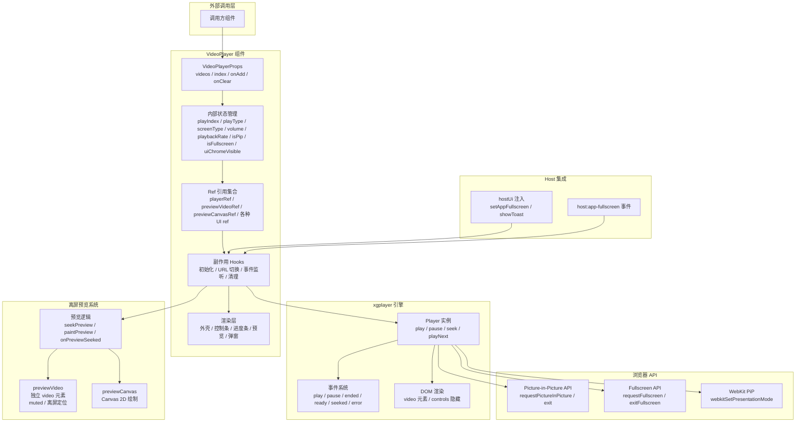
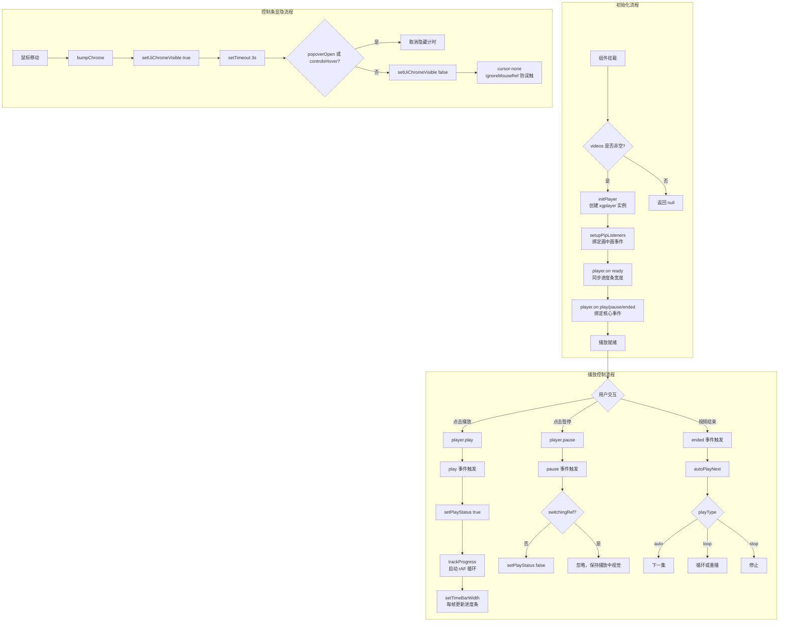
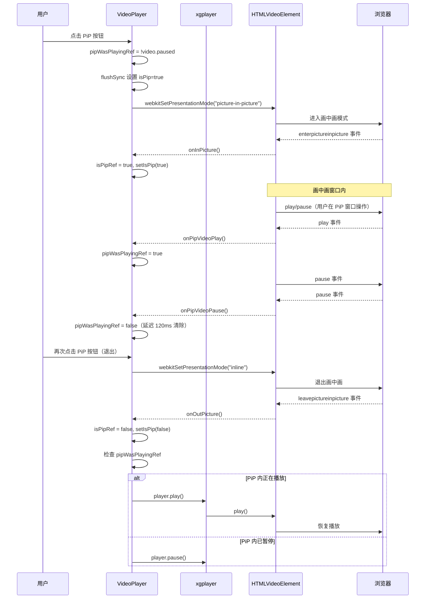
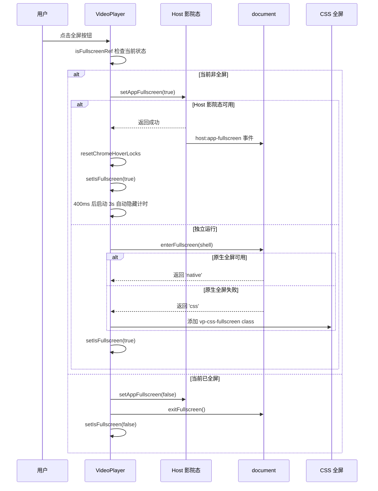
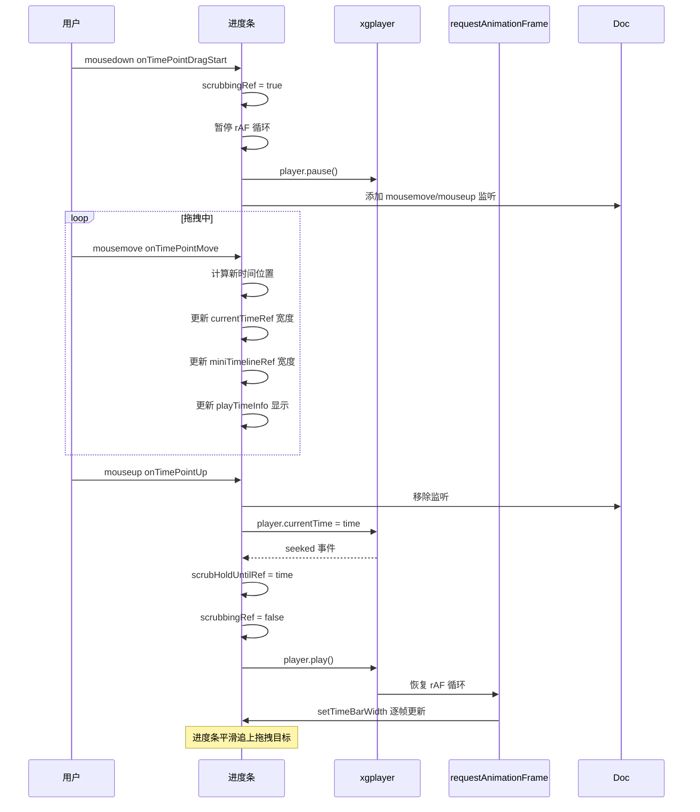
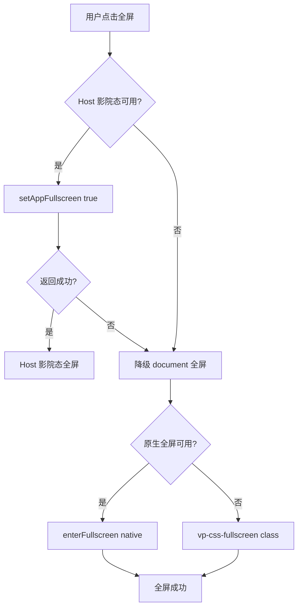

# 视频播放器 (VideoPlayer) 实现文档

## 1. 概述

基于 **xgplayer** 封装的通用视频播放器组件，提供完整的视频播放体验。

### 核心功能

| 功能 | 说明 |
|------|------|
| 自定义控制条 | 进度条、音量、倍速、全屏、画中画（PiP），完全隐藏 xgplayer 原生控件 |
| 进度条预览 | Canvas 离屏解码，鼠标悬浮实时预览对应时间帧 |
| 播放列表 | 支持多集切换、自动下一集、循环/停止三种播放模式 |
| 画中画 | 完整的 PiP 状态管理，支持 Safari webkit 和标准 API 双路径 |
| 全屏管理 | 支持原生全屏、CSS 全屏、Host 影院态三种路径 |
| 屏幕镜像 | 水平翻转视频画面 |
| 键盘快捷键 | 方向键快进/后退、音量调节、Esc 退出全屏 |
| 控制条自动隐藏 | 鼠标静止 3 秒后自动隐藏控制条与光标 |

### 文件结构

```
src/components/design/VideoPlayer/
├── player.tsx   # 主播放器组件（~1824 行）
├── tools.ts     # 工具函数与常量（~168 行）
├── types.ts     # 类型定义（~33 行）
└── index.tsx    # 导出入口（~19 行）
```

---

## 2. 架构设计

### 2.1 整体架构图



### 2.2 核心流程图



### 2.3 画中画时序图



### 2.4 全屏切换时序图



### 2.5 进度条拖拽时序图



---

## 3. 核心实现

### 3.1 类型定义 (`types.ts`)

```typescript
import type { VideoItem } from './tools';

/** Host UI 注入接口：嵌入主站时由宿主覆盖 */
export type VideoPlayerHostUi = {
	showToast?: (options: {
		message: string;
		type?: 'success' | 'error' | 'info';
	}) => void;
	setAppFullscreen?: (full: boolean) => Promise<void>;
};

/** VideoPlayer 组件 Props 定义 */
export type VideoPlayerProps = {
	/** 播放列表（外部传入；播放器不负责上传） */
	videos: VideoItem[];
	/** 受控当前集下标 */
	index?: number;
	/** 非受控初始下标 */
	defaultIndex?: number;
	/** 当前集下标变化回调 */
	onIndexChange?: (index: number) => void;
	/** 额外 CSS className */
	className?: string;
	/**
	 * 嵌入模式：只渲染画面壳，由外层提供 wrap > content 高度链。
	 * 插件页与上传区同容器组合时使用。
	 */
	embedded?: boolean;
	/** Host 注入的 UI 能力 */
	hostUi?: VideoPlayerHostUi;
	/**
	 * 继续添加：传入则显示「继续选择」按钮。
	 * 上传 UI 由外部自己管，这里只触发回调。
	 */
	onAdd?: () => void;
	/** 清空：传入则显示「重置」；外部应清空 videos 并 revoke blob URL */
	onClear?: () => void;
};
```

### 3.2 工具函数 (`tools.ts`)

```typescript
/**
 * 视频播放器常量与工具
 */

/** 播放列表上限 */
export const LIMIT = 100;

/** 播放模式选项：自动下一集 / 循环 / 停止 */
export const PLAY_OPTIONS = [
	{ labelKey: 'videoPlayer.playModeAuto', value: 'auto' as const },
	{ labelKey: 'videoPlayer.playModeLoop', value: 'loop' as const },
	{ labelKey: 'videoPlayer.playModeStop', value: 'stop' as const },
];

/** 屏幕模式选项：正常 / 镜像翻转 */
export const SCREEN_TYPE = [
	{ labelKey: 'videoPlayer.screenAuto', value: 'auto' as const },
	{ labelKey: 'videoPlayer.screenMirrorOn', value: 'mirror' as const },
];

/** 播放模式类型 */
export type PlayType = (typeof PLAY_OPTIONS)[number]['value'];
/** 屏幕模式类型 */
export type ScreenType = (typeof SCREEN_TYPE)[number]['value'];

/** 播放列表项（由外部传入，播放器不负责上传） */
export interface VideoItem {
	url: string;   // 视频可播放地址
	name: string;  // 视频文件名
	size?: number; // 文件大小（字节）
	type?: string; // MIME 类型
}

/** @deprecated 用 VideoItem */
export type VideoUrlList = VideoItem;

/**
 * 将 File 列表转为 VideoItem 并合并进已有列表
 * - 自动去重（同名同大小判定）
 * - 限量控制（默认 100 条）
 * - 自动创建 ObjectURL
 */
export function appendVideoFiles(
	files: readonly File[],
	existing: readonly VideoItem[] = [],
	limit = LIMIT,
): VideoItem[] {
	const next = [...existing];
	for (const file of files) {
		if (next.length >= limit) break;
		// 去重：同名同大小视为同一文件
		if (next.some((i) => i.name === file.name && i.size === file.size)) {
			continue;
		}
		next.push({
			url: URL.createObjectURL(file),  // 创建 blob: URL
			name: file.name,
			size: file.size,
			type: file.type,
		});
	}
	// 若没有新增则返回原引用，便于 React 跳过渲染
	return next.length === existing.length ? [...existing] : next;
}

/**
 * Host `pickLocalFiles` 结果入库
 * - 入参 src 已是可播放 URL，无需再 createObjectURL
 */
export function appendPickedVideos(
	items: readonly { name: string; src: string }[],
	existing: readonly VideoItem[] = [],
	limit = LIMIT,
): VideoItem[] {
	const next = [...existing];
	for (const item of items) {
		if (next.length >= limit) break;
		// 去重：同名同 URL
		if (next.some((i) => i.name === item.name && i.url === item.src)) {
			continue;
		}
		next.push({
			url: item.src,
			name: item.name,
		});
	}
	return next.length === existing.length ? [...existing] : next;
}

/** 释放 blob: URL，避免内存泄漏 */
export function revokeVideoUrls(items: readonly VideoItem[]): void {
	for (const item of items) {
		if (item.url.startsWith('blob:')) URL.revokeObjectURL(item.url);
	}
}

/**
 * 时间格式化：秒数 → "MM:SS" 或 "HH:MM:SS"
 * @param time 秒数
 * @param withHours 强制输出小时位
 */
export function formatTime(time: number, withHours = false): string {
	if (time === undefined || time === null || Number.isNaN(time)) {
		return '00:00';
	}
	const h = Math.floor(time / 3600);
	const m = Math.floor((time % 3600) / 60);
	const s = Math.floor(time % 60);
	const pad = (n: number) => String(n).padStart(2, '0');
	if (h > 0 || withHours) {
		return `${pad(h)}:${pad(m)}:${pad(s)}`;
	}
	return `${pad(m)}:${pad(s)}`;
}

/** 全屏元素类型：含 webkit 前缀兼容 */
type FsEl = HTMLElement & {
	webkitRequestFullscreen?: () => Promise<void> | void;
	webkitRequestFullScreen?: () => Promise<void> | void;
	mozRequestFullScreen?: () => Promise<void> | void;
	msRequestFullscreen?: () => Promise<void> | void;
};

/** document 类型：含 webkit 全屏 API */
type FsDoc = Document & {
	webkitFullscreenElement?: Element | null;
	webkitExitFullscreen?: () => Promise<void> | void;
	webkitCancelFullScreen?: () => Promise<void> | void;
	mozCancelFullScreen?: () => Promise<void> | void;
	msExitFullscreen?: () => Promise<void> | void;
};

/** 获取当前全屏元素（兼容 webkit） */
export function getFullscreenElement(): Element | null {
	const doc = document as FsDoc;
	return document.fullscreenElement || doc.webkitFullscreenElement || null;
}

/**
 * 进入元素全屏
 * - 依次尝试标准 API / webkit / moz / ms 前缀
 * - 全部失败时返回 'css'，由调用方添加 CSS 全屏 class
 */
export async function enterFullscreen(
	el: HTMLElement,
): Promise<'native' | 'css'> {
	const node = el as FsEl;
	// 按优先级选择可用的全屏请求方法
	const req =
		el.requestFullscreen?.bind(el) ||
		node.webkitRequestFullscreen?.bind(node) ||
		node.webkitRequestFullScreen?.bind(node) ||
		node.mozRequestFullScreen?.bind(node) ||
		node.msRequestFullscreen?.bind(node);
	if (!req) return 'css';  // 无可用方法，降级为 CSS 全屏
	try {
		await Promise.resolve(req());
		return 'native';
	} catch {
		return 'css';  // 请求失败也降级
	}
}

/**
 * 退出全屏
 * - 兼容 webkit / moz / ms 前缀
 * - 无全屏元素时静默返回
 */
export async function exitFullscreen(): Promise<void> {
	if (!getFullscreenElement()) return;
	const doc = document as FsDoc;
	const exit =
		document.exitFullscreen?.bind(document) ||
		doc.webkitExitFullscreen?.bind(doc) ||
		doc.webkitCancelFullScreen?.bind(doc) ||
		doc.mozCancelFullScreen?.bind(doc) ||
		doc.msExitFullscreen?.bind(doc);
	if (!exit) return;
	try {
		await Promise.resolve(exit());
	} catch {
		/* ignore */
	}
}

/**
 * 无 Host 影院态时的默认实现（独立预览 / mockHost 同源）
 * - 使用 document.documentElement 全屏
 * - 嵌入主站时由 Host `api.ui.setAppFullscreen` 覆盖
 */
export async function setDocumentAppFullscreen(full: boolean): Promise<void> {
	try {
		if (full) {
			if (!document.fullscreenElement) {
				await document.documentElement.requestFullscreen();
			}
		} else if (document.fullscreenElement) {
			await document.exitFullscreen();
		}
	} catch {
		/* ignore */
	}
}
```

### 3.3 导出入口 (`index.tsx`)

```typescript
// 默认导出 VideoPlayer 组件
export { default, default as VideoPlayer } from './player';

// 重新导出类型
export type { PlayType, ScreenType, VideoItem, VideoUrlList } from './tools';

// 重新导出工具函数
export {
	appendPickedVideos,      // Host 文件选择结果入库
	appendVideoFiles,        // File 列表转 VideoItem
	enterFullscreen,         // 进入元素全屏
	exitFullscreen,          // 退出全屏
	formatTime,              // 时间格式化
	getFullscreenElement,    // 获取当前全屏元素
	LIMIT,                   // 播放列表上限
	PLAY_OPTIONS,            // 播放模式选项
	revokeVideoUrls,         // 释放 blob URL
	SCREEN_TYPE,             // 屏幕模式选项
	setDocumentAppFullscreen, // 默认全屏实现
} from './tools';

// 重新导出组件 Props 类型
export type {
	VideoPlayerHostUi,      // Host UI 注入接口
	VideoPlayerProps,       // 组件 Props 类型
} from './types';
```

### 3.4 主播放器组件 (`player.tsx`)

由于文件较长（~1824 行），以下分模块展示完整代码与注释。

#### 3.4.1 导入与常量定义

```typescript
/**
 * 通用视频播放器（仅播放）：列表与上传由外部传入 / 组合。
 *
 * 功能：xgplayer、自定义控制条、进度条、上下集、设置、选集、音量、倍速、PiP、全屏、快捷键。
 */

import { HoverPopover, RatePanel, Segmented, Tip, Volume } from "@design/index";
import { ScrollArea } from "@ui/scroll-area";
import {
	FolderPlus,       // 继续选择图标
	ListRestart,      // 重置图标
	ListVideo,        // 播放列表图标
	Maximize,         // 全屏图标
	Minimize,         // 退出全屏图标
	Pause,            // 暂停图标
	PictureInPicture2, // 画中画图标
	Play,             // 播放图标
	Settings,         // 设置图标
	SkipBack,         // 上一集图标
	SkipForward,      // 下一集图标
} from "lucide-react";
import { useCallback, useEffect, useRef, useState } from "react";
import { flushSync } from "react-dom";
import Player from "xgplayer";
import { useI18n } from "@/hooks";
import { cn } from "@/lib/utils";
import {
	enterFullscreen,          // 进入全屏
	exitFullscreen,           // 退出全屏
	formatTime,               // 时间格式化
	getFullscreenElement,     // 获取全屏元素
	PLAY_OPTIONS,             // 播放模式选项
	type PlayType,            // 播放模式类型
	SCREEN_TYPE,              // 屏幕模式选项
	type ScreenType,         // 屏幕模式类型
	setDocumentAppFullscreen, // 默认全屏实现
	type VideoItem,           // 视频项类型
} from "./tools";
import type { VideoPlayerProps } from "./types";
import "xgplayer/dist/index.min.css";
import { Button } from "@/components/ui";

// 底栏操作图标统一尺寸
const CTRL_ICON = 18;
// 倍速列表：支持 0.5x ~ 3x
const PLAYBACK_RATES = [3, 2.5, 2, 1.5, 1, 0.75, 0.5];
// 控制条自动隐藏时间（毫秒）
const CHROME_HIDE_MS = 3000;
```

#### 3.4.2 组件定义与 Props 解构

```typescript
export default function VideoPlayer({
	videos,           // 播放列表
	index: indexProp, // 受控当前集下标
	defaultIndex = 0, // 非受控初始下标
	onIndexChange,    // 集下标变化回调
	className,        // 额外样式类
	embedded = false, // 嵌入模式
	hostUi,           // Host UI 注入
	onAdd,            // 继续添加回调
	onClear,          // 清空回调
}: VideoPlayerProps) {
	// ── 国际化 ──
	const { t, locale } = useI18n();

	// ── 全屏路径决策 ──
	/** Host 注入优先；独立运行无注入时用 document 全屏（与 mockHost 同源） */
	const setAppFullscreen = hostUi?.setAppFullscreen ?? setDocumentAppFullscreen;
	/** document 全屏路径（独立预览 / mockHost）；真 Host 影院态为 false */
	const usingDocumentFs =
		!hostUi?.setAppFullscreen ||
		hostUi.setAppFullscreen === setDocumentAppFullscreen;

	// ── 受控/非受控集下标 ──
	const controlled = indexProp !== undefined;
	const [innerIndex, setInnerIndex] = useState(defaultIndex);
	const playIndex = controlled ? indexProp : innerIndex;

	// 统一的集下标设置函数
	const setPlayIndex = useCallback(
		(next: number) => {
			if (!controlled) setInnerIndex(next);
			onIndexChange?.(next);
		},
		[controlled, onIndexChange],
	);
```

#### 3.4.3 状态管理

```typescript
	// ── 播放器状态 ──
	const [volume, setVolume] = useState(0.6);       // 音量 0~1
	const [playType, setPlayType] = useState<PlayType>("auto");   // 播放模式
	const [screenType, setScreenType] = useState<ScreenType>("auto"); // 屏幕模式
	const [playbackRate, setPlaybackRate] = useState(1);          // 倍速
	const [playStatus, setPlayStatus] = useState(false);          // 播放/暂停
	const [isFullscreen, setIsFullscreen] = useState(false);      // 全屏状态
	const [isPip, setIsPip] = useState(false);                   // 画中画状态
	/** 标题/控制条是否可见（移动显示，静止隐藏） */
	const [uiChromeVisible, setUiChromeVisible] = useState(true);
	/** 视频是否有有效时长（加载完成后置 true） */
	const [existDuration, setExistDuration] = useState(false);
	/** 进度条 hover 时间提示文本 */
	const [hoverTime, setHoverTime] = useState("");
	/** 预览层是否开启（鼠标在进度条上） */
	const [previewOn, setPreviewOn] = useState(false);
	/** 当前播放时间信息 */
	const [playTimeInfo, setPlayTimeInfo] = useState<{
		currentTime: number;
		duration: number;
	}>({ currentTime: 0, duration: 0 });
```

#### 3.4.4 Ref 引用集合

```typescript
	// ── 播放器实例 Ref ──
	const playerRef = useRef<Player | null>(null);        // xgplayer 实例
	const animationRef = useRef<number | null>(null);     // rAF 循环 ID
	const hideTimerRef = useRef<ReturnType<typeof setTimeout> | null>(null);     // 控制条隐藏定时器
	const volumeTimerRef = useRef<ReturnType<typeof setTimeout> | null>(null);   // 音量提示隐藏定时器
	const screenTypeTimerRef = useRef<ReturnType<typeof setTimeout> | null>(null); // 屏幕模式定时器
	const isFullscreenRef = useRef(false);                // 全屏状态 ref（供闭包读取）
	/** Chromium：cursor:none 会合成 mousemove，短时忽略以免立刻又弹出 */
	const ignoreMouseRef = useRef(false);
	/** 底栏任一 POP 打开时 >0，期间不自动隐藏操作条 */
	const popoverOpenRef = useRef(0);
	/** 指针在底栏上时不自动隐藏操作条与光标 */
	const controlsHoverRef = useRef(false);

	// ── UI 元素 Ref ──
	const controlsRef = useRef<HTMLDivElement>(null);       // 控制条容器
	const durationRef = useRef<HTMLDivElement>(null);       // 进度条点击热区
	const currentTimeRef = useRef<HTMLDivElement>(null);    // 已播放进度填充
	const miniTimelineRef = useRef<HTMLDivElement>(null);   // 全屏迷你时间线
	const timeTipRef = useRef<HTMLDivElement>(null);        // 时间提示气泡
	const timePointRef = useRef<HTMLDivElement>(null);      // 进度滑块
	const volumeTipRef = useRef<HTMLDivElement>(null);      // 音量提示浮层

	// ── 离屏预览系统 Ref ──
	/** 离屏解码；画到 canvas，避免 video 层叠破坏进度条 */
	const previewVideoRef = useRef<HTMLVideoElement>(null);  // 预览用 video 元素
	const previewCanvasRef = useRef<HTMLCanvasElement>(null); // 预览用 Canvas
	const previewBoxRef = useRef<HTMLDivElement>(null);       // 预览画布容器

	// ── 预览状态 Ref ──
	const previewSeekingRef = useRef(false);       // 预览 video 是否在 seek 中
	const previewPendingTimeRef = useRef<number | null>(null); // seek 中的待处理时间
	/** 是否仍在进度条上；离开后迟到的 seeked 不得写回旧帧 */
	const previewHoverRef = useRef(false);
	const oldVolumeRef = useRef(0.6);              // 静音前的音量（用于恢复）

	// ── 播放控制 Ref（解决闭包过期问题） ──
	/** 播放列表/方式：xgplayer ended 闭包易过期，一律读 ref */
	const playTypeRef = useRef(playType);
	const playIndexRef = useRef(playIndex);
	const videosRef = useRef(videos);
	const playbackRateRef = useRef(playbackRate);
	const lastTimeLabelRef = useRef("");          // 上次时间标签（避免重复 setState）
	/** 拖进度条中：禁止 rAF 覆盖滑块 */
	const scrubbingRef = useRef(false);
	const scrubTimeRef = useRef(0);
	/** 松手后停在拖拽像素，等 currentTime 追上再跟播（防关键帧/重算导致右抖） */
	const scrubHoldUntilRef = useRef<number | null>(null);
	/** clientX - (barLeft + fillWidth)，保证拖中与松手几何一致 */
	const scrubGrabOffsetRef = useRef(0);
	const onTimePointUpRef = useRef<() => void>(() => {});

	// ── 切集/PiP 过渡锁 ──
	/** 切集过渡中：忽略 ended 触发的 pause，避免闪出重播/暂停 UI */
	const switchingRef = useRef(false);
	/** 退出画中画续播中：忽略浏览器 pause，避免按钮闪暂停 */
	const pipResumeRef = useRef(false);
	/** 画中画会话内是否应视为播放中（进窗时初始化，窗内 play/pause 更新） */
	const pipWasPlayingRef = useRef(false);
	const isPipRef = useRef(false);
	/** 延迟清除「PiP 内播放」；退出时取消，避免把浏览器退出 pause 当成用户暂停 */
	const pipPauseClearTimerRef = useRef<ReturnType<typeof setTimeout> | null>(null);
```

#### 3.4.5 Ref 同步与派生数据

```typescript
	// ── 同步 Ref（确保 useEffect/事件监听器中读到最新值） ──
	playTypeRef.current = playType;
	playIndexRef.current = playIndex;
	videosRef.current = videos;
	playbackRateRef.current = playbackRate;

	// ── 派生数据 ──
	/** 安全的集下标（夹逼到合法范围） */
	const safeIndex =
		videos.length === 0
			? 0
			: Math.min(Math.max(0, playIndex), videos.length - 1);
	const currentUrl = videos[safeIndex]?.url ?? "";
	const currentUrlRef = useRef(currentUrl);
	currentUrlRef.current = currentUrl;

	/** 仅给 xgplayer 用，勿再挂 React 子节点（会与播放器抢 DOM） */
	const playerContainerRef = useRef<HTMLDivElement>(null);
	/** 画面 + 自定义控制条外壳，全屏目标 */
	const videoShellRef = useRef<HTMLDivElement>(null);

	/** 时间显示文本 */
	const timeInfo = `${formatTime(playTimeInfo.currentTime)} / ${formatTime(playTimeInfo.duration)}`;
	const currentVideoName = videos[safeIndex]?.name ?? "";
	const chromeOn = uiChromeVisible;

	isFullscreenRef.current = isFullscreen;
```

#### 3.4.6 工具函数：音量/屏幕模式/Chrome 控制

```typescript
	// ── 音量提示自动隐藏 ──
	const clearVolumeTimer = useCallback(() => {
		if (volumeTimerRef.current) {
			clearTimeout(volumeTimerRef.current);
			volumeTimerRef.current = null;
		}
		volumeTimerRef.current = setTimeout(() => {
			if (volumeTipRef.current) volumeTipRef.current.style.opacity = "0";
		}, 2000);
	}, []);

	// ── 进度条宽度更新（核心 rAF 循环回调） ──
	const setTimeBarWidth = useCallback(() => {
		// 拖拽中不更新
		if (scrubbingRef.current) return;
		const player = playerRef.current;
		if (!player?.duration || !Number.isFinite(player.duration)) return;
		// 未追上拖拽目标前不改宽度，避免松手瞬间按 currentTime 重算导致右抖
		const hold = scrubHoldUntilRef.current;
		if (hold != null && player.currentTime < hold - 0.02) return;
		if (hold != null) scrubHoldUntilRef.current = null;
		// 计算进度百分比
		const percentage = (player.currentTime / player.duration) * 100;
		const barW = durationRef.current?.getBoundingClientRect().width ?? 0;
		// 更新主进度条
		if (durationRef.current && currentTimeRef.current && barW > 0) {
			currentTimeRef.current.style.width = `${(barW * percentage) / 100}px`;
		}
		// 更新迷你时间线（全屏模式）
		if (controlsRef.current && miniTimelineRef.current) {
			miniTimelineRef.current.style.width = `${(controlsRef.current.offsetWidth * percentage) / 100}px`;
		}
		// 更新时间显示（仅在标签变化时触发 setState）
		const label = `${formatTime(player.currentTime)} / ${formatTime(player.duration)}`;
		if (lastTimeLabelRef.current === label) return;
		lastTimeLabelRef.current = label;
		setPlayTimeInfo({
			currentTime: player.currentTime,
			duration: player.duration,
		});
	}, []);

	// ── 启动 rAF 进度跟踪循环 ──
	const trackProgress = useCallback(() => {
		if (animationRef.current != null) {
			cancelAnimationFrame(animationRef.current);
		}
		const tick = () => {
			setTimeBarWidth();
			animationRef.current = requestAnimationFrame(tick);
		};
		animationRef.current = requestAnimationFrame(tick);
	}, [setTimeBarWidth]);

	// ── 屏幕镜像设置 ──
	const setScreenTypeFn = useCallback(() => {
		if (screenTypeTimerRef.current) {
			clearTimeout(screenTypeTimerRef.current);
			screenTypeTimerRef.current = null;
		}
		screenTypeTimerRef.current = setTimeout(() => {
			const player = playerRef.current;
			if (player?.root) {
				const video = player.root.querySelector("video");
				if (video) {
					// mirror 模式水平翻转
					video.style.transform =
						screenType === "mirror" ? "scaleX(-1)" : "scaleX(1)";
				}
			}
		});
	}, [screenType]);
```

#### 3.4.7 画中画（PiP）状态管理

```typescript
	// ── PiP 辅助函数 ──
	const clearPipPauseTimer = useCallback(() => {
		if (pipPauseClearTimerRef.current) {
			clearTimeout(pipPauseClearTimerRef.current);
			pipPauseClearTimerRef.current = null;
		}
	}, []);

	/** 进/出 PiP 会卸掉底栏，mouseleave 来不及触发，hover 锁会卡死自动隐藏 */
	const resetChromeHoverLocks = useCallback(() => {
		controlsHoverRef.current = false;
		popoverOpenRef.current = 0;
		ignoreMouseRef.current = false;
	}, []);

	// ── 进入画中画 ──
	const onInPicture = useCallback(() => {
		if (isPipRef.current) return;
		isPipRef.current = true;
		resetChromeHoverLocks();
		setIsPip(true);
	}, [resetChromeHoverLocks]);

	// ── 退出画中画：与窗内最终播放态同步 ──
	const onOutPicture = useCallback(() => {
		if (!isPipRef.current) return;
		clearPipPauseTimer();
		isPipRef.current = false;
		resetChromeHoverLocks();
		setIsPip(false);

		// 恢复自动隐藏：在壳上则启动计时，否则直接藏
		if (hideTimerRef.current) {
			clearTimeout(hideTimerRef.current);
			hideTimerRef.current = null;
		}
		if (videoShellRef.current?.matches(":hover")) {
			setUiChromeVisible(true);
			hideTimerRef.current = setTimeout(() => {
				if (popoverOpenRef.current > 0 || controlsHoverRef.current) return;
				setUiChromeVisible(false);
				ignoreMouseRef.current = true;
				window.setTimeout(() => {
					ignoreMouseRef.current = false;
				}, 250);
			}, CHROME_HIDE_MS);
		} else {
			setUiChromeVisible(false);
		}

		const player = playerRef.current;
		if (!player || player.ended) return;
		// PiP 内暂停则保持暂停状态
		if (!pipWasPlayingRef.current) {
			player.pause();
			setPlayStatus(false);
			return;
		}
		// PiP 内正在播放则恢复播放
		pipResumeRef.current = true;
		setPlayStatus(true);
		trackProgress();
		void player.play().finally(() => {
			pipResumeRef.current = false;
		});
	}, [clearPipPauseTimer, resetChromeHoverLocks, trackProgress]);

	/** 画中画内原生 play（含 PiP 窗口控件）；xgplayer 事件可能收不到 */
	const onPipVideoPlay = useCallback(() => {
		if (
			!isPipRef.current &&
			document.pictureInPictureElement !== playerRef.current?.media
		) {
			return;
		}
		clearPipPauseTimer();
		pipWasPlayingRef.current = true;
		setPlayStatus(true);
		trackProgress();
	}, [clearPipPauseTimer, trackProgress]);

	/** 画中画内原生 pause；退出引发的 pause 由 onOutPicture 取消定时器 */
	const onPipVideoPause = useCallback(() => {
		if (pipResumeRef.current) return;
		if (
			!isPipRef.current &&
			document.pictureInPictureElement !== playerRef.current?.media
		) {
			return;
		}
		clearPipPauseTimer();
		// 延迟 120ms 清除——退出 PiP 时浏览器会连发 pause，避免误判
		pipPauseClearTimerRef.current = setTimeout(() => {
			pipPauseClearTimerRef.current = null;
			if (
				isPipRef.current ||
				document.pictureInPictureElement === playerRef.current?.media
			) {
				pipWasPlayingRef.current = false;
				setPlayStatus(false);
				if (animationRef.current) cancelAnimationFrame(animationRef.current);
			}
		}, 120);
	}, [clearPipPauseTimer]);

	// ── WebKit PiP 模式变化处理（Safari 支持） ──
	const onWebkitPipModeChanged = useCallback(() => {
		const video = playerRef.current?.media as
			| (HTMLVideoElement & { webkitPresentationMode?: string })
			| null
			| undefined;
		if (!video) return;
		if (video.webkitPresentationMode === "picture-in-picture") {
			onInPicture();
		} else {
			onOutPicture();
		}
	}, [onInPicture, onOutPicture]);

	// ── PiP 事件监听绑定 ──
	const setupPipListeners = useCallback(() => {
		const video = playerRef.current?.media as
			| (HTMLVideoElement & {
					webkitSetPresentationMode?: (mode: string) => void;
			  })
			| null
			| undefined;
		if (!video) return;
		// 标准 PiP 事件
		video.addEventListener("enterpictureinpicture", onInPicture);
		video.addEventListener("leavepictureinpicture", onOutPicture);
		// PiP 窗口内原生 play/pause
		video.addEventListener("play", onPipVideoPlay);
		video.addEventListener("pause", onPipVideoPause);
		// WebKit PiP 事件
		if (typeof video.webkitSetPresentationMode === "function") {
			video.addEventListener(
				"webkitpresentationmodechanged",
				onWebkitPipModeChanged,
			);
		}
	}, [
		onInPicture,
		onOutPicture,
		onPipVideoPlay,
		onPipVideoPause,
		onWebkitPipModeChanged,
	]);

	// ── PiP 事件监听移除 ──
	const removePipListeners = useCallback(() => {
		const video = playerRef.current?.media as
			| (HTMLVideoElement & {
					webkitSetPresentationMode?: (mode: string) => void;
			  })
			| null
			| undefined;
		if (!video) return;
		video.removeEventListener("enterpictureinpicture", onInPicture);
		video.removeEventListener("leavepictureinpicture", onOutPicture);
		video.removeEventListener("play", onPipVideoPlay);
		video.removeEventListener("pause", onPipVideoPause);
		if (typeof video.webkitSetPresentationMode === "function") {
			video.removeEventListener(
				"webkitpresentationmodechanged",
				onWebkitPipModeChanged,
			);
		}
	}, [
		onInPicture,
		onOutPicture,
		onPipVideoPlay,
		onPipVideoPause,
		onWebkitPipModeChanged,
	]);
```

#### 3.4.8 播放控制：切集、自动下一集、初始化

```typescript
	// ── 切换播放源 ──
	const switchUrl = useCallback(
		(url: string, autoplay?: boolean, currentTime?: number) => {
			const player = playerRef.current;
			if (!player) return;
			trackProgress();      // 保持 rAF 循环运行
			setScreenTypeFn();    // 应用屏幕镜像设置
			if (currentTime) {
				player.currentTime = currentTime;
				setPlayTimeInfo({
					currentTime: player.currentTime,
					duration: player.duration,
				});
			}
			// 使用 xgplayer playNext 切集（避免销毁重建实例）
			player.playNext({
				url,
				lang: locale === "zh-CN" ? "zh-cn" : "en",
				autoplay,
				loop: false,
				volume,
				playbackRate: PLAYBACK_RATES,
			} as ConstructorParameters<typeof Player>[0]);
			// 应用当前倍速
			player.playbackRate = playbackRateRef.current;
		},
		[volume, locale, trackProgress, setScreenTypeFn],
	);

	/**
	 * 自动播放下一集
	 * 读 ref 获取最新 playType/index，避免 ended 监听器拿到过期值
	 * 返回是否已切到下一集
	 */
	const autoPlayNext = useCallback((): boolean => {
		const type = playTypeRef.current;
		const list = videosRef.current;
		if (type === "stop" || list.length === 0) return false;

		// 找到当前 URL 在列表中的位置
		const found = list.findIndex((i) => i.url === currentUrlRef.current);
		const index = found >= 0 ? found : playIndexRef.current;

		if (type === "auto") {
			// 自动模式：最后一集则停止
			if (index >= list.length - 1) return false;
			switchingRef.current = true;
			setPlayIndex(index + 1);
			return true;
		}
		if (type === "loop") {
			// 循环模式：最后一集回到第一集
			const nextIndex = index < list.length - 1 ? index + 1 : 0;
			// 仅一条时 url/index 不变，setPlayIndex 不会触发切集，需原地重播
			if (nextIndex === index) {
				const player = playerRef.current;
				if (!player) return false;
				player.currentTime = 0;
				void player.play();
				return true;
			}
			switchingRef.current = true;
			setPlayIndex(nextIndex);
			return true;
		}
		return false;
	}, [setPlayIndex]);

	// 用 ref 包装 autoPlayNext，确保 ended 事件中读取到最新逻辑
	const autoPlayNextRef = useRef(autoPlayNext);
	autoPlayNextRef.current = autoPlayNext;

	/**
	 * 初始化播放器
	 * - 销毁旧实例 → 创建新实例 → 绑定事件 → 启动播放
	 */
	const initPlayer = useCallback(
		(url: string, autoplay?: boolean, currentTime?: number) => {
			// 销毁旧实例
			if (playerRef.current) {
				removePipListeners();
				playerRef.current.destroy();
				playerRef.current = null;
			}
			const container = playerContainerRef.current;
			if (!container) return;

			// 创建 xgplayer 实例
			const player = new Player({
				el: container,          // 挂载 DOM 节点
				url,                    // 视频地址
				lang: locale === "zh-CN" ? "zh-cn" : "en",
				lastPlayTime: 0,        // 不记录上次播放时间
				lastPlayTimeHideDelay: 5,
				closeVideoClick: false, // 不关闭视频点击（自定义控制）
				videoInit: true,        // 立即初始化 video
				fluid: false,           // 禁用自适应布局（使用 CSS 控制）
				width: "100%",
				height: "100%",
				autoplay,
				loop: false,            // 不循环（自定义 ended 处理）
				volume,
				controls: false,         // 隐藏原生控件
				cssFullscreen: false,    // 禁用 CSS 全屏（自定义处理）
				playbackRate: PLAYBACK_RATES,
				// 自定义切集 / 中心播控 / 自管 PiP
				// 忽略 xgplayer 内置的 replay、start、pip 插件
				ignores: ["replay", "start", "pip"],
			} as ConstructorParameters<typeof Player>[0]);
			playerRef.current = player;

			// 初始化进度条与屏幕模式
			setTimeBarWidth();
			setScreenTypeFn();

			// 跳转到指定时间
			if (currentTime) {
				player.currentTime = currentTime;
				setPlayTimeInfo({
					currentTime: player.currentTime,
					duration: player.duration,
				});
			}

			// 绑定 PiP 监听
			const bindPip = () => {
				removePipListeners();
				setupPipListeners();
			};
			bindPip();

			// 播放器就绪后再次绑定 PiP（确保 DOM 已创建）
			player.once("ready", () => {
				bindPip();
				setTimeBarWidth();  // 同步可读进度条与总时长
			});

			// 数据加载完成时同步进度条
			player.on("loadeddata", setTimeBarWidth);
			player.on("durationchange", setTimeBarWidth);
			player.on("seeked", setTimeBarWidth);

			// ── 核心事件绑定 ──
			player.on("play", () => {
				switchingRef.current = false;
				player.playbackRate = playbackRateRef.current;
				trackProgress();
				setPlayStatus(true);
			});
			// replay 事件（xgplayer 重播）
			player.on("replay", () => {
				switchingRef.current = false;
				player.playbackRate = playbackRateRef.current;
				setPlayStatus(true);
				trackProgress();
			});
			player.on("pause", () => {
				// ended 会先 pause；切集 / 退出 PiP 续播时保持「播放中」视觉
				if (switchingRef.current || pipResumeRef.current || player.ended)
					return;
				setPlayStatus(false);
				if (animationRef.current) cancelAnimationFrame(animationRef.current);
				// 暂停后仍刷新一次，进度条与时间与当前帧一致
				setTimeBarWidth();
			});
			player.on("ended", () => {
				if (animationRef.current) cancelAnimationFrame(animationRef.current);
				// 自动下一集
				const switched = autoPlayNextRef.current();
				if (!switched) {
					switchingRef.current = false;
					setPlayStatus(false);
				}
			});
			player.on("destroy", () => {
				setIsPip(false);
				setPlayStatus(false);
				if (animationRef.current) cancelAnimationFrame(animationRef.current);
			});
			player.on("error", () => {
				switchingRef.current = false;
				setPlayStatus(false);
				if (animationRef.current) cancelAnimationFrame(animationRef.current);
			});
		},
		[
			volume,
			locale,
			trackProgress,
			setTimeBarWidth,
			setScreenTypeFn,
			setupPipListeners,
			removePipListeners,
		],
	);
```

#### 3.4.9 播放控制函数

```typescript
	// ── 播放/暂停 ──
	const onPlay = useCallback((e?: React.MouseEvent) => {
		e?.stopPropagation();
		void playerRef.current?.play();
	}, []);

	const onPause = useCallback((e?: React.MouseEvent) => {
		e?.stopPropagation();
		playerRef.current?.pause();
	}, []);

	// ── 点击视频画面切换播放 ──
	const onShellClick = useCallback(() => {
		if (isPipRef.current) return;  // PiP 模式下不响应
		const player = playerRef.current;
		if (!player) return;
		if (player.paused) void player.play();
		else player.pause();
	}, []);

	// ── 上一集/下一集 ──
	const onPrev = useCallback(() => {
		if (safeIndex === 0 && playType !== "loop") return;
		if (videos.length === 0) return;
		const curIndex = videos.findIndex((i) => i.url === currentUrl);
		let index: number;
		if (curIndex > 0) index = curIndex - 1;
		else if (playType === "loop") index = videos.length - 1;
		else index = 0;
		setPlayIndex(index);
	}, [safeIndex, playType, videos, currentUrl, setPlayIndex]);

	const onNext = useCallback(() => {
		if (safeIndex === videos.length - 1 && playType !== "loop") return;
		if (videos.length === 0) return;
		const curIndex = videos.findIndex((i) => i.url === currentUrl);
		let index: number;
		if (curIndex < videos.length - 1) index = curIndex + 1;
		else if (playType === "loop") index = 0;
		else index = videos.length - 1;
		setPlayIndex(index);
	}, [safeIndex, playType, videos, currentUrl, setPlayIndex]);
```

#### 3.4.10 全屏与 PiP 控制

```typescript
	// ── 全屏切换 ──
	const onFull = useCallback(
		async (e?: React.MouseEvent) => {
			e?.stopPropagation();
			const shell = videoShellRef.current;

			if (isFullscreenRef.current) {
				// 退出全屏
				shell?.classList.remove("vp-css-fullscreen");
				try {
					await setAppFullscreen(false);
				} catch {
					/* ignore */
				}
				await exitFullscreen();
				setIsFullscreen(false);
				setUiChromeVisible(true);
				return;
			}

			// 进入全屏
			try {
				await setAppFullscreen(true);
				if (usingDocumentFs && !getFullscreenElement() && shell) {
					const mode = await enterFullscreen(shell);
					if (mode === "css") shell.classList.add("vp-css-fullscreen");
				}
			} catch (err) {
				console.warn("[video-player] enter fullscreen failed", err);
			}

			// 重置 hover 锁
			resetChromeHoverLocks();
			ignoreMouseRef.current = true;
			setIsFullscreen(true);
			setUiChromeVisible(true);
			if (hideTimerRef.current) clearTimeout(hideTimerRef.current);
			// 400ms 后启动 3s 自动隐藏计时
			window.setTimeout(() => {
				ignoreMouseRef.current = false;
				resetChromeHoverLocks();
				setUiChromeVisible(true);
				if (hideTimerRef.current) clearTimeout(hideTimerRef.current);
				hideTimerRef.current = setTimeout(() => {
					if (popoverOpenRef.current > 0 || controlsHoverRef.current) return;
					setUiChromeVisible(false);
					ignoreMouseRef.current = true;
					window.setTimeout(() => {
						ignoreMouseRef.current = false;
					}, 250);
				}, CHROME_HIDE_MS);
			}, 400);
		},
		[resetChromeHoverLocks, setAppFullscreen, usingDocumentFs],
	);

	// ── 画中画切换 ──
	const onPictureToPicture = useCallback(
		async (e?: React.MouseEvent) => {
			e?.stopPropagation();
			const player = playerRef.current;
			if (!player) return;
			const video = player.media as HTMLVideoElement & {
				webkitPresentationMode?: string;
				webkitSetPresentationMode?: (mode: string) => void;
				webkitSupportsPresentationMode?: (mode: string) => boolean;
			};
			if (!video) return;

			// 检测当前是否在 PiP 中
			const inPip =
				document.pictureInPictureElement === video ||
				video.webkitPresentationMode === "picture-in-picture";

			try {
				if (inPip) {
					// 退出 PiP
					if (document.pictureInPictureElement) {
						await document.exitPictureInPicture();
					} else if (video.webkitSetPresentationMode) {
						video.webkitSetPresentationMode("inline");
					}
					return;
				}

				// 记录进入 PiP 前的播放状态
				pipWasPlayingRef.current = !video.paused;

				/**
				 * 必须在用户手势调用栈内直接 requestPiP。
				 * flushSync 先切站内占位并挡住播控。
				 */
				flushSync(() => {
					isPipRef.current = true;
					resetChromeHoverLocks();
					setIsPip(true);
				});

				// macOS 优先 webkit，浮窗更贴合视频比例
				if (
					video.webkitSupportsPresentationMode?.("picture-in-picture") &&
					video.webkitSetPresentationMode
				) {
					video.webkitSetPresentationMode("picture-in-picture");
					return;
				}
				// 标准 PiP API
				if (
					document.pictureInPictureEnabled &&
					!video.disablePictureInPicture
				) {
					await video.requestPictureInPicture();
					return;
				}
				// 不支持 PiP
				isPipRef.current = false;
				setIsPip(false);
			} catch (err) {
				isPipRef.current = false;
				setIsPip(false);
				console.warn("[video-player] pip failed", err);
			}
		},
		[resetChromeHoverLocks],
	);
```

#### 3.4.11 倍速与音量控制

```typescript
	// ── 倍速变更 ──
	const onChangePlaybackRate = useCallback((value: number) => {
		playbackRateRef.current = value;
		setPlaybackRate(value);
		const player = playerRef.current;
		if (player) player.playbackRate = value;
	}, []);

	// ── 音量切换（静音/恢复） ──
	const onVolumeChange = useCallback(() => {
		const player = playerRef.current;
		if (!player) return;
		if (player.volume !== 0) {
			oldVolumeRef.current = volume;  // 记住当前音量
			setVolume(0);
		} else {
			setVolume(oldVolumeRef.current);  // 恢复之前的音量
		}
	}, [volume]);

	const volumeSliderRef = useRef<HTMLDivElement>(null);

	/** 按指针 Y 直接映射音量，保证滑块中心贴住鼠标 */
	const setVolumeFromPointer = useCallback((clientY: number) => {
		const el = volumeSliderRef.current;
		if (!el) return;
		const { top, height } = el.getBoundingClientRect();
		if (height <= 0) return;
		const next = 1 - (clientY - top) / height;  // 顶部 = 1，底部 = 0
		setVolume(Math.min(1, Math.max(0, next)));
	}, []);

	// ── 音量滑块事件 ──
	const onVolumePointerDown = useCallback(
		(e: React.PointerEvent<HTMLDivElement>) => {
			e.preventDefault();
			e.stopPropagation();
			e.currentTarget.setPointerCapture(e.pointerId);
			setVolumeFromPointer(e.clientY);
		},
		[setVolumeFromPointer],
	);

	const onVolumePointerMove = useCallback(
		(e: React.PointerEvent<HTMLDivElement>) => {
			if (!e.currentTarget.hasPointerCapture(e.pointerId)) return;
			setVolumeFromPointer(e.clientY);
		},
		[setVolumeFromPointer],
	);
```

#### 3.4.12 控制条自动隐藏逻辑

```typescript
	// ── 控制条显示/隐藏核心函数 ──
	/** 显示控制条+光标；静止后隐藏 */
	const bumpChrome = useCallback(() => {
		if (ignoreMouseRef.current) return;
		setUiChromeVisible((v) => (v ? v : true));
		if (hideTimerRef.current) {
			clearTimeout(hideTimerRef.current);
			hideTimerRef.current = null;
		}
		// POP 打开或指针在底栏时不自动隐藏
		if (popoverOpenRef.current > 0 || controlsHoverRef.current) return;
		hideTimerRef.current = setTimeout(() => {
			if (popoverOpenRef.current > 0 || controlsHoverRef.current) return;
			setUiChromeVisible(false);
			ignoreMouseRef.current = true;
			window.setTimeout(() => {
				ignoreMouseRef.current = false;
			}, 250);
		}, CHROME_HIDE_MS);
	}, []);

	// ── Popover 打开/关闭时冻结自动隐藏 ──
	const onControlsPopoverOpenChange = useCallback(
		(open: boolean) => {
			popoverOpenRef.current += open ? 1 : -1;
			if (popoverOpenRef.current < 0) popoverOpenRef.current = 0;
			if (open) {
				ignoreMouseRef.current = false;
				setUiChromeVisible(true);
				if (hideTimerRef.current) {
					clearTimeout(hideTimerRef.current);
					hideTimerRef.current = null;
				}
			} else {
				bumpChrome();
			}
		},
		[bumpChrome],
	);

	// ── 底栏 hover 事件 ──
	const onControlsBarEnter = useCallback(() => {
		if (ignoreMouseRef.current) return;
		controlsHoverRef.current = true;
		setUiChromeVisible(true);
		if (hideTimerRef.current) {
			clearTimeout(hideTimerRef.current);
			hideTimerRef.current = null;
		}
	}, []);

	const onControlsBarLeave = useCallback(() => {
		controlsHoverRef.current = false;
		if (popoverOpenRef.current > 0) return;
		bumpChrome();
	}, [bumpChrome]);

	// ── 播放器壳 hover 事件 ──
	const onPlayerMouseMove = useCallback(() => {
		bumpChrome();
	}, [bumpChrome]);

	const onPlayerMouseEnter = useCallback(() => {
		bumpChrome();
	}, [bumpChrome]);

	const onPlayerMouseLeave = useCallback(() => {
		if (popoverOpenRef.current > 0 || controlsHoverRef.current) return;
		if (hideTimerRef.current) {
			clearTimeout(hideTimerRef.current);
			hideTimerRef.current = null;
		}
		ignoreMouseRef.current = false;
		setUiChromeVisible(false);
	}, []);
```

#### 3.4.13 进度条预览系统（Canvas 离屏解码）

```typescript
	// ── 根据鼠标位置计算时间 ──
	const getCurrentTime = useCallback((e: MouseEvent | React.MouseEvent) => {
		const initData = { time: 0, offsetX: 0, width: 0, duration: 0, ratio: 0 };
		const rect = durationRef.current?.getBoundingClientRect();
		if (rect) {
			const offsetX = e.clientX - rect.left;
			const width = rect.width;
			const duration = playerRef.current?.duration;
			if (width && duration) {
				const ratio = offsetX / width;
				const _time = ratio * duration;
				const time = _time > duration ? duration : _time < 0 ? 0 : _time;
				return { time, offsetX, width, duration, ratio };
			}
		}
		return initData;
	}, []);

	// ── Canvas 预览辅助函数 ──
	/** 清空预览画布 */
	const clearPreviewCanvas = useCallback(() => {
		const c = previewCanvasRef.current;
		const ctx = c?.getContext("2d");
		if (c && ctx) ctx.clearRect(0, 0, c.width || 160, c.height || 90);
		if (c) c.style.opacity = "0";
	}, []);

	/** 显示预览画布 */
	const revealPreviewCanvas = useCallback(() => {
		const c = previewCanvasRef.current;
		if (c) c.style.opacity = "1";
	}, []);

	/**
	 * 将预览 video 的当前帧绘制到 Canvas
	 * - 横屏视频：cover 模式占满卡片
	 * - 竖屏视频：contain 模式不拉伸
	 */
	const paintPreview = useCallback(() => {
		const v = previewVideoRef.current;
		const c = previewCanvasRef.current;
		const box = previewBoxRef.current;
		if (!v || !c || v.readyState < 2) return false;
		const vw = v.videoWidth;
		const vh = v.videoHeight;
		if (!vw || !vh) return false;
		// 卡片固定横向 160×90
		const cw = 160;
		const ch = 90;
		if (c.width !== cw || c.height !== ch) {
			c.width = cw;
			c.height = ch;
		}
		if (box) box.style.width = `${cw}px`;
		const ctx = c.getContext("2d");
		if (!ctx) return false;
		// 计算缩放：横向 cover，竖向 contain
		const scale =
			vw >= vh ? Math.max(cw / vw, ch / vh) : Math.min(cw / vw, ch / vh);
		const dw = vw * scale;
		const dh = vh * scale;
		// 黑色背景 → 居中绘制
		ctx.fillStyle = "#000";
		ctx.fillRect(0, 0, cw, ch);
		ctx.drawImage(v, 0, 0, vw, vh, (cw - dw) / 2, (ch - dh) / 2, dw, dh);
		return true;
	}, []);

	/**
	 * 在预览 video 上 seek 到指定时间
	 * - 正在 seek 时将新时间存入 pending，等 seeked 事件后处理
	 */
	const seekPreview = useCallback(
		(time: number) => {
			const v = previewVideoRef.current;
			if (!v || !Number.isFinite(time)) return;
			if (previewSeekingRef.current) {
				previewPendingTimeRef.current = time;
				return;
			}
			// 时间差小于 0.04s 直接绘制
			if (Math.abs(v.currentTime - time) < 0.04) {
				if (previewHoverRef.current && paintPreview()) revealPreviewCanvas();
				return;
			}
			previewSeekingRef.current = true;
			try {
				v.currentTime = time;
			} catch {
				previewSeekingRef.current = false;
			}
		},
		[paintPreview, revealPreviewCanvas],
	);

	/** 预览 video seek 完成回调 */
	const onPreviewSeeked = useCallback(() => {
		previewSeekingRef.current = false;
		// 已离开：丢掉迟到帧，勿写回 canvas
		if (!previewHoverRef.current) {
			previewPendingTimeRef.current = null;
			return;
		}
		if (paintPreview()) revealPreviewCanvas();
		const pending = previewPendingTimeRef.current;
		if (pending == null) return;
		previewPendingTimeRef.current = null;
		seekPreview(pending);
	}, [paintPreview, revealPreviewCanvas, seekPreview]);

	// ── 进度条 hover/leave/click 事件 ──
	const onProgressHover = useCallback(
		(e: React.MouseEvent) => {
			const player = playerRef.current;
			if (!player || !existDuration) return;
			const { time, offsetX, width } = getCurrentTime(e);
			setHoverTime(formatTime(time));
			const first = !previewHoverRef.current;
			previewHoverRef.current = true;
			setPreviewOn(true);
			// 重新进入：先藏住旧像素，等本帧 seeked 再亮
			if (first) clearPreviewCanvas();
			seekPreview(time);
			const tip = timeTipRef.current;
			if (!tip || !width) return;
			/* 箭头始终对准鼠标刻度 */
			tip.style.left = `${offsetX}px`;
			/* 预览单独避让溢出，不带动箭头 */
			const box = previewBoxRef.current;
			if (box) {
				const half = 80;
				const shift =
					Math.max(0, half - offsetX) + Math.min(0, width - half - offsetX);
				box.style.transform = `translateX(calc(-50% + ${shift}px))`;
			}
		},
		[clearPreviewCanvas, existDuration, getCurrentTime, seekPreview],
	);

	const onProgressLeave = useCallback(() => {
		previewHoverRef.current = false;
		setPreviewOn(false);
		setHoverTime("");
		previewPendingTimeRef.current = null;
		previewSeekingRef.current = false;
		clearPreviewCanvas();
	}, [clearPreviewCanvas]);

	const onDurationClick = useCallback(
		(e: React.MouseEvent) => {
			const player = playerRef.current;
			if (!player || !existDuration) return;
			const { time } = getCurrentTime(e);
			player.seek(time);
			setTimeBarWidth();
		},
		[existDuration, getCurrentTime, setTimeBarWidth],
	);

	// ── 进度条拖拽 ──
	const onTimePointMove = useCallback(
		(e: MouseEvent) => {
			const player = playerRef.current;
			const bar = durationRef.current;
			if (!player || !existDuration || !bar) return;
			const dur = player.duration;
			if (!Number.isFinite(dur) || dur <= 0) return;
			const rect = bar.getBoundingClientRect();
			const barW = rect.width;
			if (barW <= 0) return;

			let width = e.clientX - rect.left - scrubGrabOffsetRef.current;
			if (width <= 0) {
				width = 0;
			} else if (width >= barW) {
				if (playType === "stop") {
					width = barW;
				} else {
					width = 0;
					scrubTimeRef.current = 0;
					if (currentTimeRef.current)
						currentTimeRef.current.style.width = "0px";
					onTimePointUpRef.current();
					return;
				}
			}

			const time = (width / barW) * dur;
			scrubTimeRef.current = time;
			if (currentTimeRef.current)
				currentTimeRef.current.style.width = `${width}px`;
			if (controlsRef.current && miniTimelineRef.current) {
				miniTimelineRef.current.style.width = `${(controlsRef.current.offsetWidth * width) / barW}px`;
			}
			const label = `${formatTime(time)} / ${formatTime(dur)}`;
			if (lastTimeLabelRef.current !== label) {
				lastTimeLabelRef.current = label;
				setPlayTimeInfo({ currentTime: time, duration: dur });
			}
		},
		[existDuration, playType],
	);

	const onTimePointUp = useCallback(() => {
		document.removeEventListener("mousemove", onTimePointMove, true);
		document.removeEventListener("mouseup", onTimePointUp, true);
		const player = playerRef.current;
		if (!player) {
			scrubbingRef.current = false;
			scrubHoldUntilRef.current = null;
			return;
		}
		const time = scrubTimeRef.current;
		const finish = () => {
			if (!scrubbingRef.current) return;
			scrubHoldUntilRef.current = time;
			scrubbingRef.current = false;
			void player.play();
		};
		if (Math.abs(player.currentTime - time) < 0.05) {
			finish();
			return;
		}
		player.once("seeked", finish);
		player.currentTime = time;
		window.setTimeout(finish, 300);
	}, [onTimePointMove]);
	onTimePointUpRef.current = onTimePointUp;

	const onTimePointDragStart = useCallback(
		(e: React.MouseEvent) => {
			if (!existDuration) return;
			e.preventDefault();
			e.stopPropagation();
			const player = playerRef.current;
			const bar = durationRef.current;
			if (!player || !bar) return;
			const rect = bar.getBoundingClientRect();
			const fillW = currentTimeRef.current?.offsetWidth ?? 0;
			scrubGrabOffsetRef.current = e.clientX - (rect.left + fillW);
			scrubHoldUntilRef.current = null;
			scrubbingRef.current = true;
			scrubTimeRef.current = player.duration
				? (fillW / Math.max(rect.width, 1)) * player.duration
				: player.currentTime;
			if (animationRef.current != null) {
				cancelAnimationFrame(animationRef.current);
				animationRef.current = null;
			}
			player.pause();
			document.addEventListener("mousemove", onTimePointMove, true);
			document.addEventListener("mouseup", onTimePointUp, true);
		},
		[existDuration, onTimePointMove, onTimePointUp],
	);

	// ── 键盘事件 ──
	const onKeyDown = useCallback(
		(e: KeyboardEvent) => {
			switch (e.key) {
				case "Escape":
					if (isFullscreenRef.current) {
						e.preventDefault();
						void onFull();
					}
					break;
				case "ArrowLeft":
				case "ArrowRight": {
					const player = playerRef.current;
					if (player?.paused) player.play();
					break;
				}
				case "ArrowUp":
					setVolume((v) => Math.min(v + 0.05, 1));
					if (volumeTipRef.current) {
						volumeTipRef.current.style.opacity = "1";
						clearVolumeTimer();
					}
					break;
				case "ArrowDown":
					setVolume((v) => Math.max(v - 0.05, 0));
					if (volumeTipRef.current) {
						volumeTipRef.current.style.opacity = "1";
						clearVolumeTimer();
					}
					break;
				default:
					break;
			}
		},
		[clearVolumeTimer, onFull],
	);

	// ── 全屏状态同步 ──
	const onFullscreenChange = useCallback(() => {
		const shell = videoShellRef.current;
		const native = !!getFullscreenElement();
		const cssFs = !!shell?.classList.contains("vp-css-fullscreen");

		if (!native && !cssFs && isFullscreenRef.current) {
			if (usingDocumentFs) {
				setIsFullscreen(false);
				setUiChromeVisible(true);
			}
			return;
		}
		if (cssFs && !native) setIsFullscreen(true);
	}, [usingDocumentFs]);

	// ── 页面可见性变化 ──
	const onVisibilityChange = useCallback(() => {
		if (
			document.visibilityState === "visible" &&
			playerRef.current?.currentTime
		) {
			setTimeBarWidth();
		}
	}, [setTimeBarWidth]);

	// ── Host 影院态事件监听 ──
	useEffect(() => {
		const onHostFs = (e: Event) => {
			const next = !!(e as CustomEvent<{ full?: boolean }>).detail?.full;
			if (!next && isFullscreenRef.current) {
				videoShellRef.current?.classList.remove("vp-css-fullscreen");
				flushSync(() => {
					setIsFullscreen(false);
					setUiChromeVisible(true);
				});
			}
		};
		window.addEventListener("host:app-fullscreen", onHostFs);
		return () => window.removeEventListener("host:app-fullscreen", onHostFs);
	}, []);

	// ── 重置播放器 ──
	const onReset = useCallback(() => {
		setPlayStatus(false);
		lastTimeLabelRef.current = "";
		setPlayTimeInfo({ currentTime: 0, duration: 0 });
		setPreviewOn(false);
		setHoverTime("");
		if (currentTimeRef.current) currentTimeRef.current.style.width = "0px";
		if (miniTimelineRef.current) miniTimelineRef.current.style.width = "0px";
		if (animationRef.current) cancelAnimationFrame(animationRef.current);
		playerRef.current?.destroy();
		playerRef.current = null;
		onClear?.();
	}, [onClear]);

	// ── 副作用 Hooks ──

	// 音量变化时同步到播放器
	useEffect(() => {
		const player = playerRef.current;
		if (player) player.volume = volume;
	}, [volume]);

	// 屏幕模式变化时应用镜像
	useEffect(() => {
		setScreenTypeFn();
	}, [screenType, setScreenTypeFn]);

	// 时长变化时更新 existDuration
	useEffect(() => {
		setExistDuration(
			Number.isFinite(playTimeInfo.duration) && playTimeInfo.duration > 0,
		);
	}, [playTimeInfo.duration]);

	// 首次挂载时初始化播放器
	useEffect(() => {
		if (videos.length === 0) return;
		if (!currentUrl) return;
		if (playerContainerRef.current && !playerRef.current) {
			initPlayer(currentUrl, false, 0);
		}
	}, [videos.length, currentUrl, initPlayer]);

	// 外部换源时切播
	const prevUrlRef = useRef(currentUrl);
	useEffect(() => {
		if (!currentUrl || !playerRef.current) {
			prevUrlRef.current = currentUrl;
			return;
		}
		if (prevUrlRef.current !== currentUrl) {
			prevUrlRef.current = currentUrl;
			switchUrl(currentUrl, true);
			previewSeekingRef.current = false;
			previewPendingTimeRef.current = null;
		}
	}, [currentUrl, switchUrl]);

	// 全局事件监听
	useEffect(() => {
		document.addEventListener("visibilitychange", onVisibilityChange);
		document.addEventListener("fullscreenchange", onFullscreenChange);
		document.addEventListener("keydown", onKeyDown);
		return () => {
			document.removeEventListener("visibilitychange", onVisibilityChange);
			document.removeEventListener("fullscreenchange", onFullscreenChange);
			document.removeEventListener("keydown", onKeyDown);
		};
	}, [onVisibilityChange, onFullscreenChange, onKeyDown]);

	// 组件卸载清理
	useEffect(() => {
		return () => {
			playerRef.current?.destroy();
			playerRef.current = null;
			if (animationRef.current) cancelAnimationFrame(animationRef.current);
			if (hideTimerRef.current) clearTimeout(hideTimerRef.current);
			if (volumeTimerRef.current) clearTimeout(volumeTimerRef.current);
			if (screenTypeTimerRef.current) clearTimeout(screenTypeTimerRef.current);
			removePipListeners();
			videoShellRef.current?.classList.remove("vp-css-fullscreen");
			void setAppFullscreen(false);
			void exitFullscreen();
		};
	}, [removePipListeners, setAppFullscreen]);

	// ── 渲染准备 ──

	// 长视频刻度上限，避免每秒渲染成百上千节点卡死主线程
	const rulerCount =
		existDuration && Number.isFinite(playTimeInfo.duration)
			? Math.min(Math.floor(playTimeInfo.duration / 5), 120)
			: 0;

	if (videos.length === 0) {
		return null;
	}

	const theater = isFullscreen;
	const chromeHidden = !chromeOn;
	// 全屏黑底上主题色偏暗，chrome 强制白字
	const chromeFg = theater ? "text-white" : "text-textcolor";
	const chromeFgMuted = theater ? "text-white/50" : "text-textcolor/50";

	// ── 主渲染：视频壳 ──
	const shell = (
		<div
			ref={videoShellRef}
			className={cn(
				"relative flex h-full w-full justify-center overflow-hidden rounded-md text-center bg-theme-background",
				// 原生全屏样式
				"[:fullscreen]:fixed [:fullscreen]:inset-0 [:fullscreen]:z-9999 [:fullscreen]:h-screen [:fullscreen]:w-screen [:fullscreen]:rounded-none [:fullscreen]:bg-black",
				// webkit 全屏样式
				"[&:-webkit-full-screen]:fixed [&:-webkit-full-screen]:inset-0 [&:-webkit-full-screen]:z-9999 [&:-webkit-full-screen]:h-screen [&:-webkit-full-screen]:w-screen [&:-webkit-full-screen]:rounded-none [&:-webkit-full-screen]:bg-black",
				// CSS 全屏样式
				"[&.vp-css-fullscreen]:fixed [&.vp-css-fullscreen]:inset-0 [&.vp-css-fullscreen]:z-9999 [&.vp-css-fullscreen]:h-screen [&.vp-css-fullscreen]:w-screen [&.vp-css-fullscreen]:rounded-none [&.vp-css-fullscreen]:bg-black",
				// 隐藏 xgplayer 原生控件
				"[&_.xgplayer-controls]:hidden!",
				"[&_.xg-spot-info]:hidden!",
				// 非影院态背景跟随主题
				!theater && "[&_.xgplayer]:bg-theme-background!",
				theater && "[&_.xgplayer]:bg-black!",
				theater && "rounded-none",
				chromeHidden && "cursor-none",
				embedded && className,
			)}
			onMouseMove={onPlayerMouseMove}
			onMouseEnter={onPlayerMouseEnter}
			onMouseLeave={onPlayerMouseLeave}
			onClick={onShellClick}
		>
			{/* xgplayer 独占此节点，勿挂 React 子节点 */}
			<div
				ref={playerContainerRef}
				id="vp-player"
				className={cn(
					"box-border flex h-full! w-full items-center justify-center overflow-hidden rounded-b-md bg-theme-background",
					"[&_.xgplayer]:h-full! [&_.xgplayer]:w-full!",
					"[&_.xgplayer-video]:h-full! [&_.xgplayer-video]:w-full!",
					"[&_video]:box-border [&_video]:h-full [&_video]:w-full [&_video]:rounded-md [&_video]:object-contain",
					theater && "rounded-none bg-black",
				)}
			/>

			{/* 离屏 seek 解码：独立 video 元素，绝对定位隐藏 */}
			<video
				ref={previewVideoRef}
				src={currentUrl || undefined}
				muted
				playsInline
				preload="auto"
				tabIndex={-1}
				aria-hidden
				className="pointer-events-none absolute top-0 left-0 -z-10 h-px w-px opacity-0"
				onSeeked={onPreviewSeeked}
				onLoadedData={() => {
					previewSeekingRef.current = false;
				}}
			/>

			{/* PiP 占位提示层 */}
			{isPip ? (
				<div className="absolute inset-0 z-5 flex flex-col items-center justify-center gap-3 bg-theme-background text-textcolor">
					<PictureInPicture2 size={56} strokeWidth={1.25} />
					<p className="px-4 text-center text-sm">
						{t("videoPlayer.pipPlaying")}
					</p>
					<Button
						variant="outline"
						size="sm"
						className="relative z-1 mt-1 cursor-pointer rounded-md border border-teal-500/40 bg-teal-500/10 px-4 py-1.5 text-sm text-teal-600 transition-colors hover:bg-teal-500/20"
						onClick={(e) => {
							e.stopPropagation();
							void onPictureToPicture(e);
						}}
					>
						{t("videoPlayer.exitPip")}
					</Button>
				</div>
			) : null}

			{/* 视频标题 */}
			{currentVideoName && !isPip ? (
				<div
					className={cn(
						"duration-400 ease-in-out transition-opacity pointer-events-none absolute top-0 left-0 z-2 box-border w-full overflow-hidden p-[9px_10px_0] text-left text-base text-ellipsis whitespace-nowrap",
						chromeFg,
						chromeHidden && "pointer-events-none opacity-0!",
					)}
				>
					{currentVideoName}
				</div>
			) : null}

			{/* 中央大播放按钮 */}
			{!playStatus && !isPip ? (
				<div
					className="absolute right-25 bottom-30 z-2 cursor-pointer text-teal-500 transition-opacity duration-300 ease-in-out"
					onClick={(e) => {
						e.stopPropagation();
						onPlay();
					}}
				>
					<Play size={80} fill="currentColor" />
				</div>
			) : null}

			{/* 自定义控制条 */}
			{!isPip ? (
				<div
					ref={controlsRef}
					className={cn(
						"backdrop-blur-xs duration-400 ease-in-out transition-all absolute bottom-0 left-0 z-3 box-border flex w-full flex-col overflow-visible rounded-b-[5px] bg-transparent pt-2.5 pr-2.5 pb-0 pl-2.5 has-[[data-vp=progress]:hover]:*:data-[vp=bar-bg]:top-[-20px]",
						chromeOn ? "opacity-100" : "opacity-0",
						chromeHidden && "pointer-events-none opacity-0!",
						theater && "rounded-none",
					)}
					onClick={(e) => e.stopPropagation()}
					onMouseEnter={onControlsBarEnter}
					onMouseLeave={onControlsBarLeave}
				>
					{/* 控制条背景层 */}
					<div
						data-vp="bar-bg"
						className="pointer-events-none absolute inset-x-0 top-0 bottom-0 z-0 rounded-[inherit] bg-theme/5 transition-[top] duration-300 ease-in-out"
						aria-hidden
					/>

					{/* 进度条区域 */}
					<div
						data-vp="progress"
						className="group/progress relative z-1 box-border h-2 min-h-2 w-full shrink-0 rounded-md"
					>
						{/* 交互热区（恒为展开高度） */}
						<div
							ref={durationRef}
							className="absolute right-0 bottom-0 left-0 z-1 h-7 cursor-pointer"
							onMouseEnter={onProgressHover}
							onMouseMove={onProgressHover}
							onMouseLeave={onProgressLeave}
							onClick={onDurationClick}
						>
							{/* 背景轨道 */}
							<div
								className="pointer-events-none z-10 absolute inset-x-0 bottom-0 h-1.5 rounded-sm bg-teal-500/20 border border-teal-500/15 transition-[height,border-radius] duration-300 ease-in-out group-hover/progress:h-7 group-hover/progress:rounded-none"
								aria-hidden
							/>
							{/* 预览层 + 时间提示 */}
							{existDuration ? (
								<div
									ref={timeTipRef}
									className={cn(
										"pointer-events-none absolute bottom-9 z-20 -translate-x-1/2",
										previewOn ? "visible" : "invisible",
									)}
								>
									{/* Canvas 预览图 */}
									<div
										ref={previewBoxRef}
										className="absolute bottom-full left-1/2 mb-1 overflow-hidden rounded-md border border-teal-500/10 bg-teal-500/10 shadow-md"
									>
										<canvas
											ref={previewCanvasRef}
											width={160}
											height={90}
											className="block h-[90px] w-[160px] bg-theme-background opacity-0"
										/>
									</div>
									{/* 时间提示气泡 */}
									<div className='relative rounded-[3px] bg-teal-500 px-1.5 py-0.5 text-xs whitespace-nowrap text-white select-none after:absolute after:top-full after:left-1/2 after:h-0 after:w-0 after:-translate-x-1/2 after:border-x-7 after:border-t-7 after:border-x-transparent after:border-t-teal-500 after:content-[""]'>
										{hoverTime || "00:00"}
									</div>
								</div>
							) : null}
							{/* 已播放进度 */}
							<div
								ref={currentTimeRef}
								className="pointer-events-none absolute bottom-0 left-0 h-1.5 w-0 rounded-[3px] bg-teal-500 transition-[height,border-radius] duration-300 ease-in-out group-hover/progress:h-7 group-hover/progress:rounded-none"
							>
								{/* 拖拽滑块 */}
								{existDuration ? (
									<div
										ref={timePointRef}
										className="absolute top-1/2 right-[-5px] z-999 box-border h-[calc(100%+6px)] w-2.5 -translate-y-1/2 cursor-grab rounded-[2px] border border-theme/10 bg-teal-500 opacity-0 shadow-[0_0_2px_rgba(0,0,0,0.3)] transition-opacity duration-200 ease-in-out pointer-events-auto group-hover/progress:opacity-100"
										onMouseDown={onTimePointDragStart}
									/>
								) : null}
							</div>
							{/* 时间刻度尺 */}
							{rulerCount > 0 && existDuration ? (
								<div className="pointer-events-none absolute bottom-0 left-0 flex h-2.5 w-full items-end justify-between border-b border-teal-500 opacity-0 transition-opacity duration-300 ease-in-out group-hover/progress:opacity-100">
									{Array.from({ length: rulerCount }).map((_, i) => (
										<div
											key={i}
											className={cn(
												"h-[5px] w-px rounded-[5px] bg-teal-500",
												(i + 1) % 5 === 0 && "h-2",
											)}
										/>
									))}
								</div>
							) : null}
						</div>

					{/* 控制按钮行 */}
					<div
						className={cn(
							"relative z-1 my-[15px] flex items-end justify-between",
							"[text-shadow:0_1px_1px_color-mix(in_oklch,var(--theme-background)_35%,transparent)]",
							"[&_svg]:filter-[drop-shadow(0_1px_1px_color-mix(in_oklch,var(--theme-background)_35%,transparent))]",
						)}
					>
						{/* 左侧：播放控制 */}
						<div className={cn("flex items-center", chromeFg)}>
							{/* 上一集 */}
							<div
								className={cn(
									"flex cursor-pointer items-center hover:text-teal-500",
									chromeFg,
									safeIndex === 0 &&
										playType !== "loop" &&
										cn("pointer-events-none cursor-not-allowed", chromeFgMuted),
								)}
								onClick={onPrev}
							>
								<SkipBack size={CTRL_ICON} />
							</div>
							{/* 播放/暂停 */}
							<div
								className={cn(
									"mx-3 flex cursor-pointer items-center hover:text-teal-500",
									chromeFg,
								)}
							>
								{!playStatus ? (
									<Play size={CTRL_ICON} onClick={onPlay} />
								) : (
									<Pause size={CTRL_ICON} onClick={onPause} />
								)}
							</div>
							{/* 下一集 */}
							<div
								className={cn(
									"mr-5 flex cursor-pointer items-center hover:text-teal-500",
									chromeFg,
									safeIndex === videos.length - 1 &&
										playType !== "loop" &&
										cn("pointer-events-none cursor-not-allowed", chromeFgMuted),
								)}
								onClick={onNext}
							>
								<SkipForward size={CTRL_ICON} />
							</div>
							{/* 时间显示 */}
							<div className="m-0 flex items-center text-sm leading-none">
								{existDuration ? timeInfo : timeInfo.split("/")[0]}
							</div>
						</div>

						{/* 右侧：功能按钮 */}
						<div className="flex items-center gap-[15px]">
							{/* 继续添加 */}
							{onAdd ? (
								<Tip label={t("videoPlayer.continueSelect")}>
									<div
										className={cn(
											"flex cursor-pointer items-center justify-center hover:text-teal-500",
											chromeFg,
										)}
										onClick={onAdd}
									>
										<FolderPlus size={CTRL_ICON} />
									</div>
								</Tip>
							) : null}
							{/* 重置 */}
							{onClear ? (
								<Tip label={t("videoPlayer.reset")}>
									<div
										className={cn(
											"flex cursor-pointer items-center justify-center hover:text-teal-500",
											chromeFg,
										)}
										onClick={onReset}
									>
										<ListRestart size={CTRL_ICON} />
									</div>
								</Tip>
							) : null}

							{/* 播放列表 */}
							{videos.length > 1 ? (
								<HoverPopover
									align="center"
									width={320}
									contentPadding={0}
									contentClassName="overflow-hidden p-0!"
									onOpenChange={onControlsPopoverOpenChange}
									onContentPointer={bumpChrome}
									trigger={
										<div
											className={cn(
												"flex cursor-pointer items-center justify-center hover:text-teal-500",
												chromeFg,
											)}
											onClick={(e) => {
												e.stopPropagation();
											}}
										>
											<ListVideo size={CTRL_ICON} />
										</div>
									}
								>
									{({ close }) => (
										<div className="flex max-w-full min-w-0 flex-col overflow-hidden">
											<div className="h-10 shrink-0 border-b border-theme/15 px-4 py-2.5 text-sm leading-[1.2] font-semibold">
												{t("videoPlayer.episodes")}
											</div>
											<ScrollArea
												type="always"
												className="h-75 max-h-75 w-full max-w-full min-w-0"
												style={{ height: 300 }}
												viewportClassName="[&>div]:block! [&>div]:h-auto! [&>div]:min-h-0! [&>div]:min-w-0! [&>div]:max-w-full! [&>div]:w-full!"
												onWheel={(e) => e.stopPropagation()}
											>
												<div className="box-border max-w-full min-w-0 overflow-x-hidden p-2">
													{videos.map((item, index) => (
														<div
															key={item.url}
															className={cn(
																"cursor-pointer truncate rounded-md p-2 text-sm text-textcolor/80 hover:bg-theme/15",
																safeIndex === index && "text-teal-500",
															)}
															onClick={() => {
																onCheckUrl(item, index);
																close();
															}}
														>
															{item.name}
														</div>
													))}
												</div>
											</ScrollArea>
										</div>
									)}
								</HoverPopover>
							) : null}

							{/* 倍速面板 */}
							<HoverPopover
								align="center"
								width={320}
								contentPadding={0}
								contentClassName="overflow-visible backdrop-blur-[2px]"
								onOpenChange={onControlsPopoverOpenChange}
								onContentPointer={bumpChrome}
								trigger={
									<div
										className={cn(
											"flex min-w-7.5 cursor-pointer items-center justify-center text-center text-[15px] leading-4.5 hover:text-teal-500",
											chromeFg,
										)}
										onClick={(e) => {
											e.stopPropagation();
										}}
									>
										{playbackRate.toFixed(1)}x
									</div>
								}
							>
								<RatePanel
									rate={playbackRate}
									onRateChange={onChangePlaybackRate}
									label={t("videoPlayer.speed")}
								/>
							</HoverPopover>

							{/* 音量控制 */}
							<HoverPopover
								align="center"
								width={40}
								contentPadding={10}
								onOpenChange={onControlsPopoverOpenChange}
								onContentPointer={bumpChrome}
								trigger={
									<div
										className={cn(
											"flex cursor-pointer items-center justify-center hover:text-teal-500",
											chromeFg,
										)}
										onClick={(e) => {
											e.stopPropagation();
											onVolumeChange();
										}}
									>
										<Volume volume={volume} />
									</div>
								}
							>
								<div className="flex w-full flex-col items-center gap-2">
									<div
										className="text-center text-sm text-textcolor"
										onClick={onVolumeChange}
										title={t("videoPlayer.muted")}
									>
										{(volume * 100).toFixed(0)}
									</div>
									{/* 垂直音量滑块 */}
									<div
										ref={volumeSliderRef}
										className="relative h-24 w-5 shrink-0 cursor-pointer touch-none outline-none"
										role="slider"
										tabIndex={0}
										aria-orientation="vertical"
										aria-valuemin={0}
										aria-valuemax={100}
										aria-valuenow={Math.round(volume * 100)}
										aria-valuenow={`${(volume * 100).toFixed(0)}%`}
										onPointerDown={onVolumePointerDown}
										onPointerMove={onVolumePointerMove}
										onKeyDown={(e) => {
											if (e.key === "ArrowUp" || e.key === "ArrowRight") {
												e.preventDefault();
												setVolume((v) => Math.min(1, v + 0.05));
											} else if (
												e.key === "ArrowDown" ||
												e.key === "ArrowLeft"
											) {
												e.preventDefault();
												setVolume((v) => Math.max(0, v - 0.05));
											}
										}}
									>
										<div className="pointer-events-none absolute top-0 bottom-0 left-1/2 w-1 -translate-x-1/2 rounded-sm bg-teal-300/30">
											<div
												className="absolute right-0 bottom-0 left-0 rounded-sm bg-teal-500"
												style={{ height: `${volume * 100}%` }}
											/>
											<div
												className="pointer-events-none absolute left-1/2 h-3 w-3 -translate-x-1/2 translate-y-1/2 rounded-full bg-teal-500 shadow-sm"
												style={{ bottom: `${volume * 100}%` }}
											/>
										</div>
									</div>
								</div>
							</HoverPopover>

							{/* 设置面板（播放模式/屏幕镜像） */}
							<HoverPopover
								align="center"
								width={280}
								onOpenChange={onControlsPopoverOpenChange}
								onContentPointer={bumpChrome}
								trigger={
									<div
										className={cn(
											"flex cursor-pointer items-center justify-center hover:text-teal-500",
											chromeFg,
										)}
										onClick={(e) => {
											e.stopPropagation();
										}}
									>
										<Settings size={CTRL_ICON} />
									</div>
								}
							>
								<div className="rounded-md">
									{/* 播放模式 */}
									<div className="mb-4 flex w-full flex-col items-start">
										<div className="mb-1.5 text-sm text-textcolor/80">
											{t("videoPlayer.playMode")}
										</div>
										<Segmented
											value={playType}
											options={PLAY_OPTIONS.map((o) => ({
												value: o.value,
												label: t(o.labelKey),
											}))}
											onChange={(v) => setPlayType(v)}
										/>
									</div>
									{/* 屏幕镜像 */}
									<div className="mb-1.5 flex w-full flex-col items-start">
										<div className="mb-1.5 text-sm text-textcolor/80">
											{t("videoPlayer.screenMirror")}
										</div>
										<Segmented
											value={screenType}
											options={SCREEN_TYPE.map((o) => ({
												value: o.value,
												label: t(o.labelKey),
											}))}
											onChange={(v) => setScreenType(v)}
										/>
									</div>
								</div>
							</HoverPopover>

							{/* 画中画 */}
							<Tip label={t("videoPlayer.pip")}>
								<div
									className={cn(
										"flex cursor-pointer items-center justify-center hover:text-teal-500",
										chromeFg,
									)}
									onClick={onPictureToPicture}
								>
									<PictureInPicture2 size={CTRL_ICON} />
								</div>
							</Tip>
							{/* 全屏 */}
							<Tip
								label={
									isFullscreen
										? t("videoPlayer.exitFullscreen")
										: t("videoPlayer.fullscreen")
								}
							>
								<div
									className={cn(
										"-mt-0.5 flex cursor-pointer items-center justify-center hover:text-teal-500",
										chromeFg,
									)}
									onClick={onFull}
								>
									{isFullscreen ? (
										<Minimize size={CTRL_ICON} />
									) : (
										<Maximize size={CTRL_ICON} />
									)}
								</div>
							</Tip>
						</div>
					</div>
				</div>
			) : null}

			{/* 迷你时间线（全屏时显示在底部） */}
			{!isPip ? (
				<div
					ref={miniTimelineRef}
					className={cn(
						"absolute bottom-0 left-0 z-2 h-0.5 rounded-[5px] bg-teal-500 transition-opacity duration-300 ease-in-out",
						chromeHidden ? "opacity-100" : "opacity-0!",
					)}
				/>
			) : null}

			{/* 音量提示浮层 */}
			{!isPip ? (
				<div
					ref={volumeTipRef}
					className="absolute bottom-35 left-26 z-2 flex items-center gap-2 rounded-md bg-teal-500 px-2.5 py-1.5 text-xl font-bold text-white opacity-0 transition-opacity duration-300"
				>
					<Volume volume={volume} />
					<span>
						{volume > 0
							? `${(volume * 100).toFixed(0)}%`
							: t("videoPlayer.muted")}
					</span>
				</div>
			) : null}
		</div>
	);

	// ── 最终渲染 ──
	return embedded ? (
		shell
	) : (
		<div
			className={cn(
				"relative box-border h-full w-full select-none rounded-md [-webkit-user-select:none]",
				className,
			)}
		>
			<div className="relative box-border h-full rounded-md p-0 text-center">
				{shell}
			</div>
		</div>
	);
}
```

---

## 4. 实现原理

### 4.1 xgplayer 初始化与生命周期管理

播放器采用 **单例模式** 管理 xgplayer 实例：

1. **初始化**：通过 `initPlayer()` 创建 xgplayer 实例，配置 `controls: false` 隐藏原生控件，`ignores: ["replay", "start", "pip"]` 忽略内置插件
2. **切集**：使用 `player.playNext()` 而非销毁重建，保持实例连续性
3. **销毁**：组件卸载时调用 `player.destroy()` 清理资源

```
挂载 → initPlayer → ready 事件 → 绑定核心事件
  ↓
播放 → play 事件 → trackProgress 启动 rAF 循环
  ↓
暂停 → pause 事件 → 取消 rAF，刷新一次进度
  ↓
结束 → ended 事件 → autoPlayNext 判断自动下一集
  ↓
卸载 → destroy 清理所有资源
```

### 4.2 自定义控制条（隐藏原生控件）

通过 CSS 选择器强制隐藏 xgplayer 原生控件：

```css
[&_.xgplayer-controls]:hidden!
[&_.xg-spot-info]:hidden!
```

自行实现的控制条包括：
- **进度条**：包含背景轨道、已播放进度、拖拽滑块、时间刻度尺、Canvas 预览
- **播放控制**：上一集/播放暂停/下一集
- **功能按钮**：播放列表、倍速、音量、设置、PiP、全屏

### 4.3 进度条 Canvas 预览（离屏解码）

核心思路：创建独立的 `<video>` 元素进行离屏 seek，将目标帧绘制到 `<canvas>` 上。

```
鼠标进入进度条
  ↓
onProgressHover → 计算目标时间
  ↓
seekPreview → 设置 previewVideo.currentTime
  ↓
onPreviewSeeked → paintPreview → drawImage 到 Canvas
  ↓
显示 Canvas 预览 + 时间提示气泡
```

**关键设计**：
- **独立 video 元素**：与主播放器解耦，不影响播放
- **绝对定位隐藏**：`h-px w-px opacity-0 -z-10`，不占空间不响应事件
- **队列化 seek**：`previewSeekingRef` + `previewPendingTimeRef` 避免频繁 seek 冲突
- **离场保护**：`previewHoverRef` 在鼠标离开后丢弃迟到帧

### 4.4 播放进度跟踪与自动下一集

**rAF 循环追踪**：播放中启动 `requestAnimationFrame` 循环，每帧调用 `setTimeBarWidth()` 更新进度条宽度。暂停时取消循环节省资源。

**自动下一集策略**（三种模式）：

| 模式 | 行为 |
|------|------|
| `auto` | 播放完当前集自动播放下一集，最后一集停止 |
| `loop` | 播放完最后一集回到第一集，单集则原地重播 |
| `stop` | 播放完当前集停止 |

**Ref 同步**：将 `playType`、`playIndex`、`videos`、`playbackRate` 同步到 Ref 中，确保 `ended` 事件回调始终读取到最新值。

### 4.5 画中画（PiP）完整状态管理

PiP 涉及浏览器原生事件、窗口状态、播放状态的复杂交互，设计了以下机制：

**状态追踪**：
- `isPipRef` / `setIsPip`：PiP 进入/退出
- `pipWasPlayingRef`：进入 PiP 前的播放状态
- `pipResumeRef`：退出 PiP 续播中的锁
- `pipPauseClearTimerRef`：延迟清除 PiP 暂停（避免浏览器连发 pause 事件误判）

**双路径支持**：
1. **WebKit PiP**（Safari/macOS）：`webkitSetPresentationMode` 提供更贴合视频比例的浮窗
2. **标准 PiP API**：`requestPictureInPicture` / `exitPictureInPicture`

**进入 PiP 流程**：
```
用户点击 → 记录 pipWasPlayingRef
  → flushSync 设置 isPip=true
  → 优先 webkit 路径（macOS）
  → 降级标准 API
```

**退出 PiP 流程**：
```
浏览器触发 leavepictureinpicture
  → onOutPicture 检查 pipWasPlayingRef
  → 正在播放 → player.play() 恢复
  → 已暂停 → player.pause() 保持
```

### 4.6 全屏多路径支持



**三种全屏路径**：
1. **Host 影院态**：通过 `hostUi.setAppFullscreen` 与宿主窗口集成
2. **原生全屏**：`document.documentElement.requestFullscreen()` 等 API
3. **CSS 全屏**：降级方案，通过 `.vp-css-fullscreen` class 实现 `position: fixed; inset: 0; z-index: 9999`

### 4.7 键盘快捷键

| 按键 | 功能 |
|------|------|
| `Esc` | 退出全屏 |
| `←` / `→` | 快进/快退（触发播放） |
| `↑` | 音量 +5% |
| `↓` | 音量 -5% |

### 4.8 控制条自动隐藏（Chrome hide）

```
鼠标移动 → bumpChrome
  → 显示控制条 + 光标
  → 启动 3s 倒计时
    → 3s 内无新移动 → 隐藏控制条 + cursor:none
    → 250ms 后清除 ignoreMouseRef（防止 cursor:none 合成的 mousemove 误触）
```

**防误触机制**：
- `ignoreMouseRef`：cursor:none 下浏览器会合成 mousemove 事件，250ms 内忽略
- `popoverOpenRef`：弹出面板打开时阻止自动隐藏
- `controlsHoverRef`：指针在底栏上时阻止自动隐藏

---

## 5. 使用示例

### 5.1 基础用法

```tsx
import { useState } from "react";
import { VideoPlayer, type VideoItem, appendVideoFiles } from "@/components/design/VideoPlayer";

function MyVideoPage() {
  const [videos, setVideos] = useState<VideoItem[]>([]);

  const handleAdd = () => {
    const input = document.createElement("input");
    input.type = "file";
    input.multiple = true;
    input.accept = "video/*";
    input.onchange = (e) => {
      const files = (e.target as HTMLInputElement).files;
      if (files) {
        setVideos((prev) => appendVideoFiles(files, prev));
      }
    };
    input.click();
  };

  const handleClear = () => {
    // 释放 blob URL
    import("@/components/design/VideoPlayer").then(({ revokeVideoUrls }) => {
      revokeVideoUrls(videos);
    });
    setVideos([]);
  };

  return (
    <div className="h-[600px] w-full">
      <VideoPlayer
        videos={videos}
        onAdd={handleAdd}
        onClear={handleClear}
      />
    </div>
  );
}
```

### 5.2 受控模式

```tsx
const [videos, setVideos] = useState<VideoItem[]>([
  { url: "video1.mp4", name: "第一集" },
  { url: "video2.mp4", name: "第二集" },
]);
const [currentIndex, setCurrentIndex] = useState(0);

<VideoPlayer
  videos={videos}
  index={currentIndex}
  onIndexChange={setCurrentIndex}
/>
```

### 5.3 嵌入模式

```tsx
<VideoPlayer
  videos={videos}
  embedded
  className="my-custom-class"
/>
```

### 5.4 Host 集成

```tsx
const hostUi = {
  setAppFullscreen: async (full: boolean) => {
    // 与宿主 Tauri/Electron 通信
    await window.__TAURI__.window.setFullscreen(full);
  },
  showToast: (options) => {
    // 宿主通知
    console.log(options.message);
  },
};

<VideoPlayer
  videos={videos}
  hostUi={hostUi}
/>
```

### 5.5 独立使用工具函数

```tsx
import {
  appendVideoFiles,
  revokeVideoUrls,
  formatTime,
  PLAY_OPTIONS,
  SCREEN_TYPE,
  LIMIT,
} from "@/components/design/VideoPlayer";

// 格式化时间
formatTime(125.5); // "02:05"
formatTime(3700);  // "01:01:40"

// 添加文件
const newList = appendVideoFiles(files, existingList);

// 释放资源
revokeVideoUrls(videoList);
```